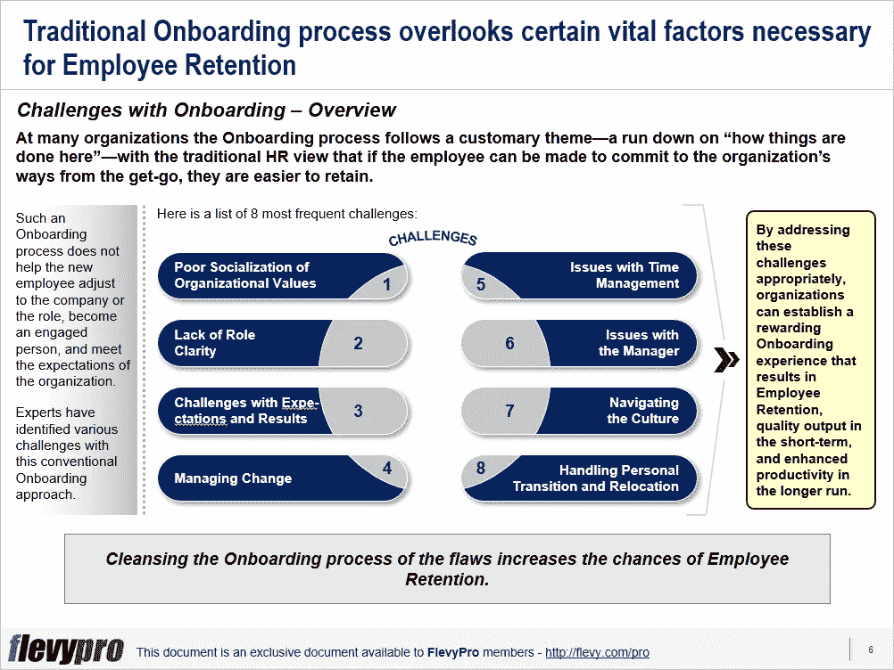

# 员工入职:如何有一个好的开始

> 原文：<https://medium.datadriveninvestor.com/employee-onboarding-how-to-get-off-to-the-right-start-4217f8c801e0?source=collection_archive---------13----------------------->

在这个知识经济时代，组织面临的最紧迫的挑战是吸引和留住人才。这对于组织来说可能是一个成败的挑战，需要在[战略规划](https://flevy.com/strategic-planning)期间仔细考虑。

要克服这一挑战，从正确的方面着手是绝对必要的。组织，尤其是人力资源部门，需要有一种以有效的员工入职流程为荣的[组织文化](https://flevy.com/browse/stream/culture)。为了实现这一目标，当今的人力资源部门需要明确现代入职培训的挑战，并且[需要制定一个战略](https://flevy.com/browse/stream/strategy-development)来建立一个为员工带来有益体验的入职培训流程。

在许多组织中,[员工入职](https://flevy.com/browse/flevypro/employee-onboarding-5341)流程遵循一个习惯主题——对“这里的工作方式”进行总结——传统的人力资源观点认为，如果员工能够从一开始就致力于[组织文化](https://flevy.com/browse/stream/culture),他们就更容易被留住。

这样的入职流程无助于新员工适应公司或角色，成为[敬业的员工](https://flevy.com/browse/flevypro/5-dimensions-of-employee-engagement-5272)，并满足组织的期望。专家们发现了这种传统入职方法的各种挑战。以下是 8 个最常见的挑战:

1.  **组织价值观社会化不良**
2.  **角色不明确**
3.  **挑战与期望和结果**
4.  **管理变更**
5.  **时间管理问题**
6.  **与经理的问题**
7.  **文化导航**
8.  **办理个人过渡和调动**

通过适当地应对这些挑战，组织可以建立一种有益的员工入职体验，从而在短期内留住员工、提高质量，并在长期内提高生产力。

让我们更深入地研究一下这些挑战。

**1。组织价值观社会化不良**

人们认为组织价值观是新员工要传授和接受的东西。这确实是基本的知识，但不是神圣不可侵犯的。研究表明，接受与个人身份相违背的组织价值观可能会适得其反，因为它可能会使员工在心理上疲惫不堪，限制全面参与，阻碍创造力，并产生工作不满。这可以通过允许员工从一开始就表达他们对工作的独特观点，并欢迎他们将自己最擅长的纳入工作中来解决。

**2。角色不明确**

对自己的角色缺乏清晰的认识是组织中普遍存在的问题。在新组织呆了一段时间后，员工意识到对角色的期望与他/她认为自己接受的相冲突。鼓励新员工找出期望/认知中的差距，并与他们的经理讨论，使员工对自己的角色和职责有一个清晰的视角和理解，提高员工满意度，并提高他们的效率和生产力。

**3。挑战与期望和结果**

新员工往往意识不到自己的工作量。为了满足经理或同事的预期，他们承担了过多的工作，导致超负荷工作，降低了他们的绩效。新员工与经理和同事就他们的期望进行非正式讨论可以缓解压力，使他们能够承担可管理的工作并交付高质量的结果。

有兴趣了解更多关于员工入职、指导原则、挑战和方法的各个方面吗？你可以点击 [Flevy 文档市场](https://flevy.com/browse)上的下载**员工入职**的可编辑幻灯片[。](https://flevy.com/browse/flevypro/employee-onboarding-5341)

## 你在这个框架中找到价值了吗？

你可以从 [FlevyPro 库](https://flevy.com/pro/library)下载关于这个和数百个类似业务框架的深入介绍。FlevyPro 得到了数千名管理顾问和企业高管的信任和使用。有些人不得不说:

> “我的 FlevyPro 订阅为我提供了当今市场上最受欢迎的框架和平台。它们不仅增加了我现有的咨询和辅导产品和服务，还让我跟上了最新的趋势，为我的实践激发了新产品和服务，并以其他解决方案的一小部分时间和金钱教育了我。我强烈推荐 FlevyPro 给任何认真对待成功的顾问。”

–战略商业建筑师事务所创始人比尔·布兰森

> “作为一家利基战略咨询公司，Flevy 和 FlevyPro 框架和文件是一个持续的参考，有助于我们为客户构建我们的调查结果和建议，并提高他们的清晰度、力度和视觉效果。对我们来说，这是增加我们影响力和价值的宝贵资源。”

–Cynertia Consulting 的咨询区域经理 David Coloma

> “作为一个小企业主，FlevyPro 提供的资源材料已被证明是非常宝贵的。根据我们的项目事件和客户要求按需搜索材料的能力对我来说很棒，并证明对我的客户非常有益。重要的是，能够针对特定目的轻松编辑和定制材料有助于我们进行演示、知识共享和工具包开发，这是整个计划宣传材料的一部分。虽然 FlevyPro 包含任何咨询、项目或交付公司都必须拥有的资源材料，但它是小公司或独立顾问工具箱中必不可少的一部分。”

–变革战略(英国)董事总经理迈克尔·达夫

> “作为一名独立的成长顾问，FlevyPro 对我来说是一个很好的资源，可以访问大量的演示知识库来支持我与客户的合作。就投资回报而言，我从下载的第一个演示文稿中获得的价值是我订阅费用的好几倍！这些资料的质量让我能够打出超出自己体重的水平，这就像是用很小一部分开销就能获得四大咨询公司的资源一样。”

–Roderick Cameron，SGFE 有限公司的创始合伙人

> “我每个月都会浏览几次 FlevyPro，寻找与我面临的工作挑战相关的演示文稿(我是一名顾问)。当主题需要时，我会进一步探索，并从 Flevy 市场购买。在所有场合，我都阅读它们，分析它们。我采纳与我的工作最相关和最适用的想法；当然，所有这些都转化为我和我的客户的利益。"

量子 SFE 公司首席执行官奥马尔·埃尔南·蒙特斯·帕拉

在 [**领导力、辅导和个人成长**](https://app.ddichat.com/category/leadership-coaching-and-personal-growth) **:** 中安排一次对话

 [## 专家-领导力、教练和个人成长- DDIChat

### DDIChat 允许个人和企业直接与主题专家交流。它使咨询变得快速…

app.ddichat.com](https://app.ddichat.com/category/leadership-coaching-and-personal-growth) 

在此申请成为 DDIChat 专家[。
与 DDI 合作:](https://app.ddichat.com/expertsignup)[https://datadriveninvestor.com/collaborate](https://datadriveninvestor.com/collaborate)在此订阅 DDIntel [。](https://ddintel.datadriveninvestor.com/)