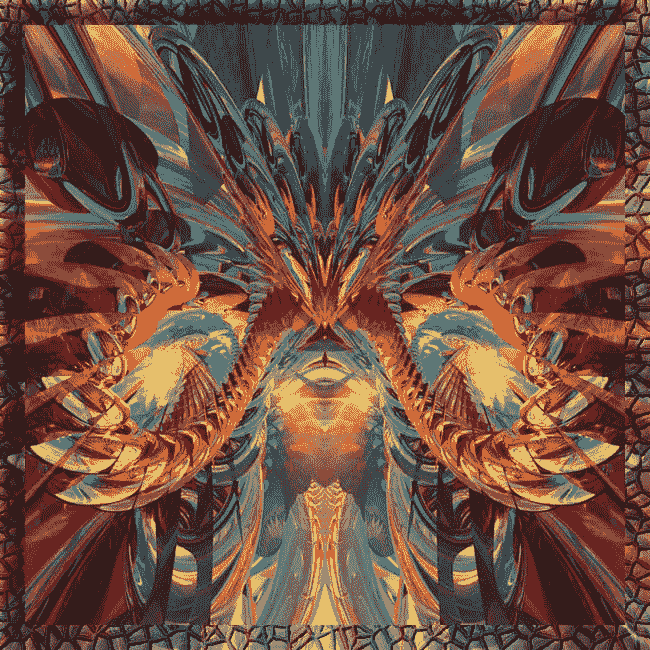
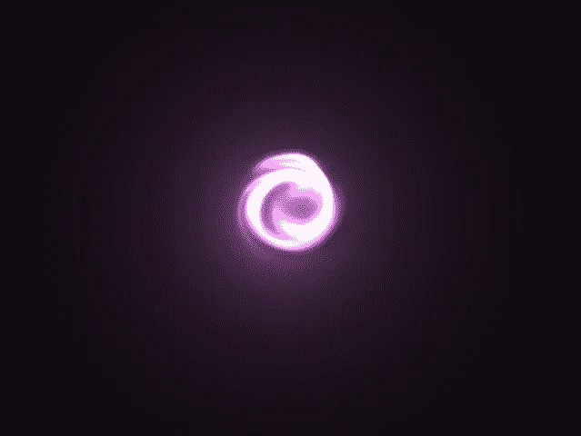

# 遭遇一个 DMT 生物——这意味着什么？是真的吗？

> 原文：<https://medium.datadriveninvestor.com/encounter-with-an-dmt-being-what-could-it-mean-was-it-real-93d417093301?source=collection_archive---------5----------------------->

> 为了设置场景，我应该澄清我记录这次遭遇背后的意图。对各种物质有过深刻迷幻体验的人，理解在体验本身之外发生的心理处理和思考的数量。
> 
> 记录这些经历以及伴随这些事件而来的想法、观点和顿悟，可以通过自我解决来帮助个人融合。最终，我希望与他人分享这一经历也能有助于澄清他们的经历，尽可能地怪异和精彩！

Vague resemblance of the being encountered during the DMT trip

**与 DMT 人接触……**

为了设置场景，我想首先指出，虽然我已经介绍了小剂量的 DMT 之前，这是我唯一适当的突破。事情发生在一次聚会后的清晨，在那次聚会中，我摄入了一系列的物质。我用来拿 DMT 的器具是一个烟枪，里面装着大麻和烟草。我不确定确切的剂量。这是一个相当冲动的决定，但我服用摇头丸后保持了积极的心态，实际上没有任何期望。

 [## 哲学、象形文字和技术|数据驱动的投资者

### 在发现罗塞塔石碑之前，象形文字已经被视为信息，即使它们的语义…

www.datadriveninvestor.com](https://www.datadriveninvestor.com/2018/10/16/philosophy-hieroglyphics-and-technology/) 

DMT 锥花了一些提请吸入整个击中，因为我不是一个经常吸烟者。 ***在最后一次吐气后一个惊人的身体高高地走了过来，紧接着颜色迅速变化成卡通般的现实。起初，看到一系列新的颜色令人惊讶，这些颜色是我已经知道的颜色的变体。我的视觉并不真的像许多人在他们的经历中报告的分形维数，而更像是一个主要由抽象形状组成的二维景观，从物理平面突入和突出。在这一点上，当我睁开眼睛或闭上眼睛时，我观察到的图像没有什么不同，尽管出于某种原因，闭上眼睛感觉更舒服。***

我开始注意到低沉的嗡嗡声或振动频率越来越大，因为它开始消耗我的意识。我的注意力很快从视觉刺激上转移，我更加意识到我的心灵，意识到它跑得有多快。一个接一个的想法立刻出现，与之前的想法相矛盾。如果我的自我或意识在吞噬自己，以自我内爆的方式进食自己的思想。我似乎无法控制我的思想要去哪里，直到 ***突然震动消耗了我的意识，我被甩出了我的身体，变成一点白光悬浮在无限的黑暗虚空中(见下图)*** *。感觉好像我将永远被困在这次旅行中。幸运的是，在这种永恒的空虚之后不久，我意识到时间只是一种精神建构。就好像每一个瞬间都是短暂的，或者随着每一个想法导致的体验而膨胀。*

在这种顿悟之后，我从我的脑海中解放了出来，旅行的古怪也从占据我视野的深蓝色/灰色中消散了。似乎在某个时刻，一个 DMT 人出现了，在我上方盘旋。我记不起从前一个场景到下一个场景的过渡。当我进入一个详细的分形领域时，颜色似乎完全重新排列了。她存在的力量震撼了我，我贴着椅子坐着，对我所看到的一切充满了敬畏。我立刻有了直觉，这是一个女性实体。她散发着金色、黄色和橙色的光芒，有着外星人的外表，就像是一个威严而神秘的生物。她的头像蚂蚁或猫一样，有一双锐利的钻石般的蓝眼睛，直刺我的灵魂。她在每个肩膀上拥有看起来像机械蝴蝶的翅膀，在我的身体上扇动纯金能量。

我的偏执狂持续在这一刻，因为我从这个存有那里假设了负面的意图。这种想法很快就消失了，因为我经历过的最幸福和狂喜的感觉笼罩了我。 我记得重复着这句话“谢谢，谢谢！我非常感激你给我展示的一切！”好像我在她面前越是谦卑，我的狂喜就越强烈。对这一经历表示感激会增强它的强度。

有人提出要有一个人类伴侣来分享这种经历。我用心灵感应向外星人提出了这个问题，如果我的伴侣能加入的话。这个存在立刻把她的灵魂带入了这个圈子，真正完成了这个体验。就好像我们的关系得到了这个实体的认可，因为我们正在进行某种精神婚姻。然后我回到自己的身体，对刚刚发生的事情感到震惊，情绪混乱，不知道该哭还是该笑。 我两者都做了一小会儿，试图处理和理解这种体验。在很多方面我仍然是…

***在这次经历的反思中，我有一些关键的收获…***

1.  时间是大脑构想的一个概念。
2.  *大脑是实现意识体验的工具。*
3.  无限可以被体验，但只是暂时的，因为我们的思想和宇宙是不断变化的。
4.  我体验到的那种狂喜，是一种更一致的存在状态的潜力，任何一个渴望超越物质世界的存在都可以达到这种状态。
5.  我们应该对简单的存在保持完全的感激，因为我们活着是一个奇迹，有东西而不是没有。
6.  这可能是我们存在于一个多维的精神世界的证据。
7.  DMT 可能是进入其他维度的门户，在那里外星实体愿意并且能够与我们联系。

我知道没有办法证明这个实体或其他实体在客观现实中独立于我们而存在，然而这种体验的生动性和强度远远超过了我的普通意识。可以争论的是，无论体验是否真实，体验都是一样的。

***所以我问你，真的重要吗？***

如果有人经历过类似的事情或者可能接触到任何种类的外星实体，我会喜欢这里。

和平与爱 xo

**免责声明:**

本文不提倡或推荐使用非法药物。内容中提到的许多物质在许多国家都是非法的。本文不构成医疗建议。一如既往，服用任何药物前请咨询医生。