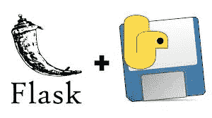
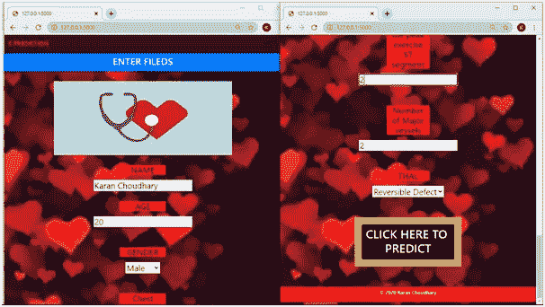

# 使用烧瓶进行心脏病预测的端到端部署(详细说明)

> 原文：<https://medium.datadriveninvestor.com/end-to-end-deployment-of-heart-disease-prediction-using-flask-detailed-explanation-1b07ac961c3b?source=collection_archive---------0----------------------->



导入库。

将 numpy 作为 np 导入

进口熊猫作为 pd

将 matplotlib.pyplot 作为 plt 导入

读取数据集

df = pd.read_csv("heart.csv ")

df . head()#打印前 5 行的所有列

包含自变量和因变量的数据集。

年龄

年龄(年)

自变量

性

(1 =男性；0 =女性)

自变量

丙酸纤维素

胸痛型

自变量

trestbps

静息血压(入院时以毫米汞柱为单位)

自变量

胆固醇

血清胆固醇，毫克/分升

自变量

前沿系统

(空腹血糖> 120 mg/dl) (1 =真；0 =假)

自变量

restecg

静息心电图结果

自变量

塔拉赫

达到最大心率

自变量

埃克桑

运动诱发的心绞痛(1 =是；0 =否)

自变量

旧峰

相对于静息运动诱发的 ST 段压低

自变量

倾斜

运动 ST 段峰值的斜率

自变量

加拿大

荧光染色的主要血管数量(0，3)

自变量

thal

3 =正常；6 =修复缺陷；7 =可逆转缺陷

自变量

目标

有无疾病(1 =有，0 =无)

因变量

对于数据分析，我们必须探索。

由此我们得出分析，我们已经很好地定义了分布因变量(目标)。

df .目标.值计数()

1 165

0 138

为了进一步分析，我们将检查数据是如何根据因变量分布的。

#我们得出结论，我们的数据按年龄分布良好

pd.crosstab(df.age，df.target)。plot(kind="bar ")

plt.title(“各年龄段的心脏病频率”)

plt.xlabel('年龄')

plt.ylabel(“频率”)

plt.show()

现在我们不得不根据性别(女/男)来分析人们的年龄是否有心脏问题。

```
pd.crosstab(df.sex,df.target).plot(kind="bar",figsize=(15,6))plt.title('Heart Disease Frequency for Sex')plt.xlabel('Sex (0 = Female, 1 = Male)')plt.xticks(rotation=0)plt.legend(["Haven't Disease", "Have Disease"])plt.ylabel('Frequency')plt.show()
```

从上面的分析中，我们对数据集有了一个粗略的概念，然后我们将不得不在自变量和因变量之间建立关系，以进行进一步的分析。

```
corr = df.corr()plt.figure(figsize=(18,10))sns.heatmap(corr, annot=True)plt.show()
```

我们可以断定 **cp，thalach** 与目标(因变量)的关系最大。

删除目标(因变量)并将目标分配给新变量。

```
from sklearn.preprocessing import StandardScalerfrom sklearn.model_selection import train_test_splitfrom sklearn.model_selection import cross_val_scorefrom sklearn.metrics import accuracy_score, confusion_matrixX = df.drop(['target'], axis=1).valuesy = df['target'].values
```

标准缩放技术，其中值以平均值为中心，具有单位标准偏差。这意味着属性的平均值变为零，结果分布具有与[-1，+1]的单位标准偏差，这使得我们的独立变量对于目标预测数据同样重要。

```
scale = StandardScaler()X = scale.fit_transform(X)
```

将数据集分为训练和测试，70%训练，30%测试。

```
X_train, X_test, Y_train, Y_test = train_test_split(X,y,test_size = 0.3,random_state=42)
```

随机森林分类器-这是一种树/集成方法，其中独立变量是从随机选择的训练集子集分离出来的决策树集。它聚集来自不同决策树的投票来决定测试对象的最终类。

```
from sklearn.ensemble import RandomForestClassifierclf = Model(model=RandomForestClassifier(), X=X_train, y=Y_train)
```

我们在随机森林中使用交叉验证以获得更好的结果

```
clf.crossValScore(cv=10)#OUTPUTModel accuracy : 0.975Model precision : 0.800Model recall : 0.758Model roc_auc : 0.903
```

同样，我们将检查预测的测试数据集，以避免过度拟合数据，因此我们将应用它作出决定，因为我们正在做医疗保健项目，我们希望真正值，假负值。

```
clf_test = Model(model=RandomForestClassifier(), X=X_test, y=Y_test)clf_test.crossValScore(cv=10)#OUTPUTModel accuracy : 0.955Model precision : 0.830Model recall : 0.712Model roc_auc : 0.889
```

从测试数据的输出中，我们可以看到结果没有影响我们的数据集。同样，我们将得出结论，我们的分类器对结果是最佳的。我们可以应用其他分类器来预测心脏是健康还是不健康。但是我们要根据精度和结果来找结果。

保存模型，因为我们不会每次都创建它，所以我们必须使用包 pkl 并保存它，以便在部署中进一步使用。

从 sklearn.externals 导入作业库

**joblib.dump(clf，' Heart_model.pkl')**

机器学习分类完成，模型以 pickle 文件的形式保存。

现在，心脏病模型的部署部分开始了。我们将使用 html、css、java script 进行部署，并形成 app.py 文件，其中主页和结果 Html 文件将作为预测一个人是否患有心脏病的输出。

下面是 app.py 文件的代码，我们使用 flask 作为框架来部署项目并做出决定。

```
from flask import Flask, render_template ,url_for ,requestimport pandas as pdfrom sklearn.externals import joblibimport numpy as npapp = Flask ( __name__ )@app.route('/')def home():return render_template('home.html')def getParameters():parameters = []#parameters .append( request.form ('name'))parameters .append( request.form ['age'])parameters. append( request.form ['sex'])parameters. append( request.form ['cp'])parameters. append( request.form ['trestbps'])parameters. append( request.form ['chol'])parameters. append( request.form ['fbs'])parameters. append( request.form ['restecg'])parameters. append( request.form ['thalach'])parameters. append( request.form ['exang'])parameters. append( request.form ['oldpeak'])parameters. append( request.form ['slope'])parameters. append( request.form ['ca'])parameters. append( request.form ['thal'])return parameters@app.route('/predict',methods=['POST'])def predict():model = open( "data/Heart_model.pkl" , "rb" )clfr = joblib.load(model)if request.method  == 'POST':parameters = getParameters()inputFeature = np.asarray( parameters ).reshape(1,-1)my_prediction = clfr.predict( inputFeature )return render_template ('result.html',prediction = int(my_prediction[0]))if __name__ == '__main__':app.run( debug = True)
```

然后，我们有预测功能，当我们将输入 13 个约束作为框中的输入时，该功能将被实现，然后大小为 13 的数组转到数据帧，输出将被预测，并了解一个人是否患有心脏病的结果。

[](https://www.datadriveninvestor.com/2020/07/23/learn-data-science-in-a-flash/) [## 一瞬间学会数据科学！？数据驱动的投资者

### 在我之前的职业生涯中，我是一名训练有素的古典钢琴家。还记得那些声称你可以…

www.datadriveninvestor.com](https://www.datadriveninvestor.com/2020/07/23/learn-data-science-in-a-flash/) 

下面是 home.html 文件的代码，其中我们有部署部分的主屏幕，作为独立事件输入字段。

```
<!DOCTYPE html><html><head><link rel="stylesheet" href="https://cdnjs.cloudflare.com/ajax/libs/font-awesome/4.7.0/css/font-awesome.min.css" integrity="sha512-SfTiTlX6kk+qitfevl/7LibUOeJWlt9rbyDn92a1DqWOw9vWG2MFoays0sgObmWazO5BQPiFucnnEAjpAB+/Sw==" crossorigin="anonymous" /><link rel="stylesheet" href="https://stackpath.bootstrapcdn.com/bootstrap/4.5.0/css/bootstrap.min.css" integrity="sha384-9aIt2nRpC12Uk9gS9baDl411NQApFmC26EwAOH8WgZl5MYYxFfc+NcPb1dKGj7Sk" crossorigin="anonymous"></head><section id="nav-bar"><nav class="navbar navbar-expand-lg navbar-light bg-dark"><a class="navbar-brand font-weight-bold" href="" style="color: red;"><MARQUEE bgcolor="">HEART DISEASE PREDICTION</MARQUEE></a><button class="navbar-toggler" type="button" data-–toggle="collapse" data-target="#navbarNav" aria-controls="navbarNav" aria-expanded="True" aria-label="Toggle navigation"><span class="navbar-toggler-icon"></span></button><div class="collapse navbar-collapse" id="navbarNav"><ul class="navbar-nav ml-auto"><li class="nav-item active"><a class="nav-link" type="button" color="red" href="" style="color: red" >Home <span class="sr-only">(current)</span></a></li><li class="nav-item"><a class="nav-link" href="index.html"></a></li><li class="nav-item"><a class="nav-link" href="" style="color: red" ><p>Statistics</p></a></li><li class="nav-item"><a class="nav-link" href="" style="color: red">Contact</a></li></ul></div></nav></section><div class="btn btn-primary btn-block btn-large" fontsize="15" color="Asymtomatic"><center><h2>ENTER FILEDS</h2></center></div><style>body {background-image: url('static/css/123.gif');background-repeat: repeat;background-attachment: fixed;background-size: cover}/* CSS code for button */.button_css {color: #494949 !important;text-transform: uppercase;text-decoration: none;background: #ffffff;padding: 20px;border: 4px solid #494949 !important;display: inline-block;transition: all 0.4s ease 0s;}.button_css:hover {color: #ffffff !important;background: #f6b93b;border-color: #f6b93b !important;transition: all 0.4s ease 0s;}</style><body><h3><br><center></center><div class="login"><br><!-- Get input for predict the cancer --><center><form action="{{ url_for('predict')}}"method="post"><p class="col-2 "style="background-color: red">NAME</p><input type="text" id="name" name="name" placeholder="Full name" required="required" /><br><hr><p class="col-2 "style="background-color: red">AGE</p><input type="text" id="age" name="age" placeholder="Age in numeric"><hr><br><p class="col-2 "style="background-color: red">GENDER</p><select id="sex" name="sex">*<option value="1">Male</option><option value="0">Female</option></select><hr><br><p class="col-2 "style="background-color: red">Chest Pain Type</p><select id="cp" name="cp"><option value="1">Typical Angina</option><option value="2">Atypical Angina</option><option value="3">Non-anginal Pain</option><option value="4">Asymtomatic</option></select><hr><br><p class="col-2 "style="background-color: red">Resting Blood Pressure</p><input type="text" id="trestbps" name="trestbps" placeholder="A number in range [94, 200]"><hr><br><p class="col-2 "style="background-color: red">Serum Cholestrol</p><input type="text" id="chol" name="chol" placeholder="A number in range [126, 564]"><hr><br><p class="col-2 "style="background-color: red">Fasting Blood Sugar</p><select id="fbs" name="fbs"><option value="1">Greater than 120 mg/dl</option><option value="0">Less than 120 mg/dl</option></select><hr><br><p class="col-2 "style="background-color: red">Resting ECG Results</p><select id="restecg" name="restecg"><option value="0">Normal</option><option value="1">Having ST-T wave abnormality</option></select><hr><br><p class="col-2 "style="background-color: red">Max Heart Rate Achieved</p><input type="text" id="thalach" name="thalach" placeholder="A number in range [71, 202]"><hr><p class="col-2 "style="background-color: red">Exercise-induced Angina</p><select id="exang" name="exang"><option value="1">Yes</option><option value="0">No</option></select><hr>    <br><p class="col-2 "style="background-color: red">ST depression induced by exercise relative to rest</p><input type="text" id="oldpeak" name="oldpeak" placeholder="ST depression, typically in [0, 6.2]"><hr>  <br><p class="col-2 "style="background-color: red">Slope of the peak exercise ST segment</p><input type="text" id="slope" name="slope" placeholder="Typically in [1, 3]"><hr><br><p class="col-2 "style="background-color: red">Number of Major vessels</p><input type="text" id="ca" name="ca" placeholder="Typically in [0, 3]"><hr><br><p class="col-2 "style="background-color: red">THAL</p><select id="thal" name="thal"><option value="3">Normal</option><option value="6">Fixed Defect</option><option value="7">Reversible Defect</option></select><hr><br><div class="button_cont" align="center" ><a class="button_css"><button  type="submit" class="btn btn-primary btn-block btn-large" style="background-color: black "><strong><h1 style="color:white;">            CLICK HERE TO  <br> PREDICT             </h4></strong></button></a></div></form><br><br><div class="btn btn-primary btn-block btn-large" style="background-color: red " ><b><center><p style="text-shadow: transparent;" style="background-color: red">&copy; 2020 Karan Choudhary<p></center></div></div></html>
```

在这里，我们使用了 home.html 文件，在这里我们遇到了 14 个变量，我们已经输入它们进行预测。它主要由导航条和页脚组成，导航条带有从右向左移动的心脏病预测，页脚带有版权图标。然后是充满了

当我们从 home.html 文件输入数据时，这将起作用，用户将根据他/她的个人资料和报告输入数据。

```
<!DOCTYPE html><html><head><title></title><link rel="stylesheet" type="text/css" href="{{ url_for('static', filename='css/my_style.css') }}"></head><section id="nav-bar"><nav class="navbar navbar-expand-lg navbar-light bg-dark"><a class="navbar-brand font-weight-bold" href=""><MARQUEE bgcolor="">HEART DISEASE PREDICTION</MARQUEE></a><button class="navbar-toggler" type="button" data-toggle="collapse" data-target="#navbarNav" aria-controls="navbarNav" aria-expanded="True" aria-label="Toggle navigation"><span class="navbar-toggler-icon"></span></button><div class="collapse navbar-collapse" id="navbarNav"><ul class="navbar-nav ml-auto"><li class="nav-item active"><a class="nav-link" type="button" color="red" href="/home.html" style="color: red">Home <span class="sr-only">(current)</span></a></li><li class="nav-item"><a class="nav-link" href=""></a></li><li class="nav-item"><a class="nav-link" href=" " style="color: red">Statistics</a></li><li class="nav-item"><a class="nav-link" href="" style="color: red">Contact</a></li></ul></div></nav></section><br><br><style>body {background-image: url('static/css/41.jpg');background-repeat: repeat;background-attachment: fixed;background-size: cover;}/* CSS code for button */.button_css {color: #494949 !important;text-transform: uppercase;text-decoration: none;background: #ffffff;padding: 20px;border: 4px solid #494949 !important;display: inline-block;transition: all 0.4s ease 0s;}.button_css:hover {color: #ffffff !important;background: #f6b93b;border-color: #f6b93b !important;transition: all 0.4s ease 0s;}</style><body><header ><div class="container" style="color: black"><div id="brandname" ><h2>   <center>      Heart Disease  </center></h3></div></div></header><p style="color:blue;font-size:30;text-align: center;"><b>Prediction </b></p><div class="results"><center       ><div class="container"><h2 style="color:red;" >YES! You might have a  heart Disease.<br><h1>Do consult to Doctor.</h1></h2><h2 style="color:green;">NO! You might not have a heart Disease.<br><h1>Healthy Heart</h2><ol class="col-4 " style="background-color: red "></div><br><div class="col-6"></div></center><br></body></html>
```

基本上，这个文件通过 flask 作为 web 应用程序的主页。我们反对输入值的基础上，一个人的个人资料，以及一个人将如何对自己的健康负责，以及如何管理其健康的未来长期持续。



最后，我们根据一个人的字段/变量值得出一个结果，即心脏健康或不健康。

这是心脏病预测部署的完整视频。

## 获得专家视图— [订阅 DDI 英特尔](https://datadriveninvestor.com/ddi-intel)