# 线性回归模型中数据科学管道的端到端实现

> 原文：<https://medium.datadriveninvestor.com/end-to-end-implementation-data-science-pipeline-in-linear-regression-model-a2616fb5e251?source=collection_archive---------1----------------------->

H ello 世界！我的数据科学社区博客。在这里，我们将讨论线性回归的端到端实现。如果您对创建一个基本的端到端线性回归模型感兴趣，那么这篇文章非常适合您。

从这一点开始，我们将实现一个逐步编码的例子，其思想是用 python 中最**的原始**编码风格和 sklearn 库实现回归。

本文的步骤如下图所示:

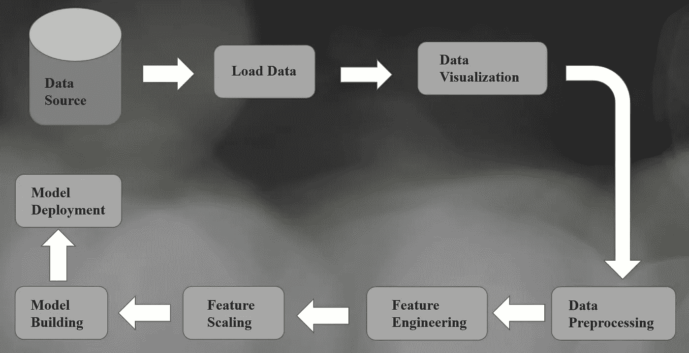

End To End Pipeline of Linear Regression [‘Image Created By Dheeraj Kumar K’]

在 python 中，相对较新的称为流水线的方法是通过将所有步骤结合在一起实现机器学习模型的经典方法。这里我们将讨论**自行车共享需求回归**数据集的端到端实现。

1.  加载数据集:这一步是数据连接层，我们必须从 SQL、Excel、JSON、mongo 等数据库中获取数据。

导入基本必需的库，

```
# Import Libraries
import numpy as np
import pandas as pd
import matplotlib.pyplot as plt
import seaborn as sns
import warnings
warnings.filterwarnings("ignore")# Load Datasetdf = pd.read_csv("E:\Downlload\Bike Sharing Dataset\hour.csv")
df
```

上述代码将返回输出:

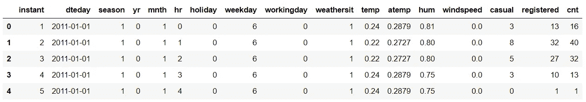

Loaded Data Using Pandas as DataFrame

**2。数据可视化:**探索性数据分析被认为是机器学习建模中最重要的步骤，因为大多数问题都可以在良好的 EDA 的帮助下解决，我们可以从中获得巨大的洞察力。

```
def show_hist(x):
    plt.rcParams["figure.figsize"] = 15,18
    x.hist()
show_hist(df)## The Above Code will return this output
```

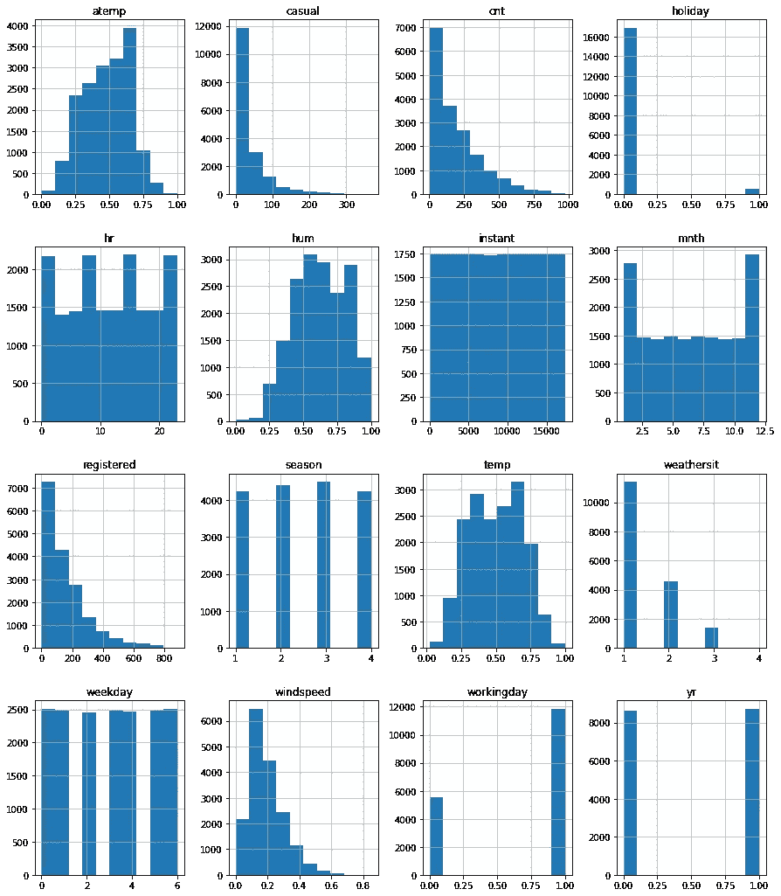

Histogram [‘[‘Image Created By Dheeraj Kumar K’]’]

在这个直方图中，我们可以看到大多数变量不是正态分布的，大多数数据科学家的重要主张或假设将是正态分布的。也许有时数据的性质可能是非正常的，这时我们可以不转换数据而继续进行。

```
def Show_PairPlot(x):
    sns.pairplot(x)Show_PairPlot(df)
## The Above Code will return this output
```

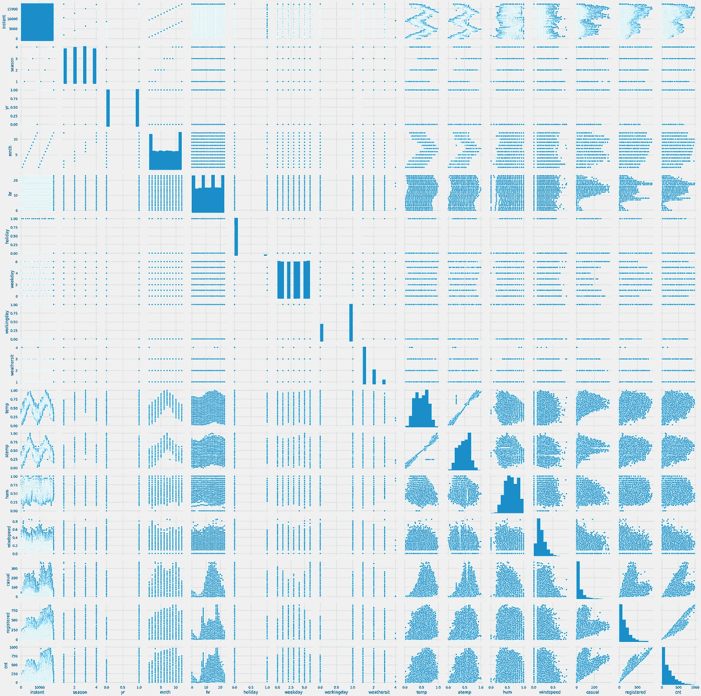

Pair plot [‘[‘Image Created By Dheeraj Kumar K’]’]

结对图将让你了解变量之间的关系和分布。Pair Plot 是识别趋势以进行后续分析的一种很好的技术，可以很容易地实现下面的代码。

[](https://www.datadriveninvestor.com/2020/02/19/five-data-science-and-machine-learning-trends-that-will-define-job-prospects-in-2020/) [## 将定义 2020 年就业前景的五大数据科学和机器学习趋势|数据驱动…

### 数据科学和 ML 是 2019 年最受关注的趋势之一，毫无疑问，它们将继续发展…

www.datadriveninvestor.com](https://www.datadriveninvestor.com/2020/02/19/five-data-science-and-machine-learning-trends-that-will-define-job-prospects-in-2020/) 

3.**数据预处理**:数据清理是通过删除或修改不正确、不完整、不相关或格式不正确的数据，为分析准备数据的过程。数据科学中最重要的一步是数据清洗，在端到端数据科学项目中，60%的工作都与数据清洗有关。

让我们做一些清洁工作，

```
# Missing Valuesdf.isna().sum()
```

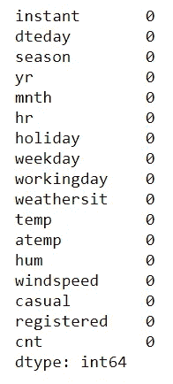

The output of checking Missing Values [‘Image Created By Dheeraj Kumar K’]

还有一些，

```
df['Year'] = df['dteday'].str.split('-').str[0]
df['Year'] = df['Year'].astype(int)df['Month'] = df['dteday'].str.split('-').str[1]
df['Month'] = df['Month'].astype(int)df['Date'] = df['dteday'].str.split('-').str[2]
df['Date'] = df['Date'].astype(int)df = df.drop(['dteday'],axis=1)
df = df.drop(['yr'],axis=1)
df = df.drop(['mnth'],axis=1)## The Above Code will return this output
```

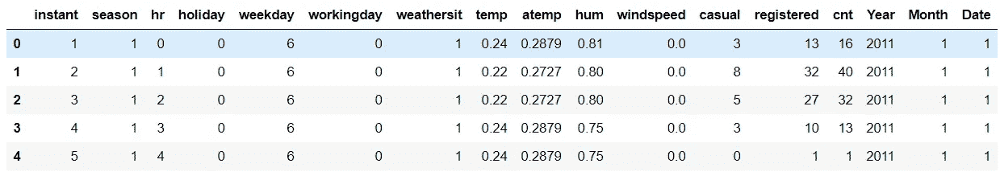

[‘Image Created By Dheeraj Kumar K’]

## 极端值

从任何统计数据集中的归一化分布观测值中移除的统计观测值构成了异常值的要点。出现异常值的最常见原因包括测量或数据输入中的错误、损坏的数据以及超出正态分布的典型真实观察值。由于数据科学中数据集的本质，异常值的数学定义无法具体定义。

## 离群点检测

```
def outlier(x):
    high=0
    q1 = x.quantile(.25)
    q3 = x.quantile(.75)
    iqr = q3-q1
    low = q1-1.5*iqr
    high += q3+1.5*iqr
    outlier = (x.loc[(x < low) | (x > high)])
    return(outlier)outlier(df['cnt']).count()## The Above Code will return this output
```

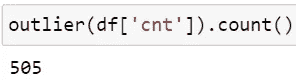

The output of Outliers in Response Variable [‘Image Created By Dheeraj Kumar K’]

## 剔除异常值

```
q1 =df['cnt'].quantile(.25)
q3 = df['cnt'].quantile(.75)
iqr = q3-q1df_new = df[~((df['cnt'] < (q1 - 1.5 *iqr))  |  (df['cnt'] > (q3+ 1.5 * iqr)))]
```

## 基本统计正态性检验

```
from scipy.stats import anderson
print('Anderson Darling Test :: ',anderson(df['cnt']))
print('==============================================================================')from scipy.stats import shapiro
print('Shapiro Wilk Test :: ',shapiro(df['cnt']))print('===============================================================================')from scipy.stats import kstest
print('Kolmogorov–Smirnov Test :: ',kstest(df['cnt'],'norm'))print('================================================================================')
```

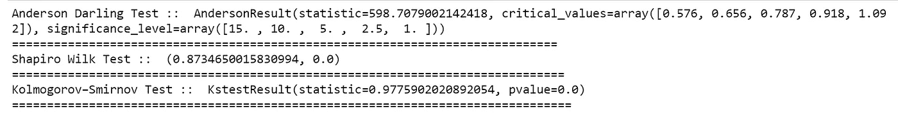

Statistical Analysis Result [‘Image Created By Dheeraj Kumar K’]

**4。特性工程:**什么是特性，为什么我们需要特性工程？所有机器学习算法都使用一些输入数据来创建输出。该输入数据包括特征，这些特征通常是结构化列的形式。算法需要具有某些特定特征的功能才能正常工作。这里，出现了对**特征工程**的需求。我认为特性工程的努力主要有两个目标:

*   准备适当的输入数据集，与机器学习算法要求兼容。
*   提高机器学习模型的性能。

让我们实现它，

```
from scipy import stats
import pylab
from sklearn.preprocessing import PowerTransformerpt = PowerTransformer(method='yeo-johnson', standardize=True,) 
df = pt.fit_transform(df)df = pd.DataFrame(df)df=df.rename(columns{0:'Intent',1:'Season',2:'hr',3:"holiday",4:"Weekday",5:"Workingday",6:"Weathersit",7:"hum",8:"Windspeed",9:"registered",10:"cnt",11:"year",12:"Month",13:"Date",14:"atemp",15:"Temp",16:"Cacual"})df
## The Above Code will return this output
```

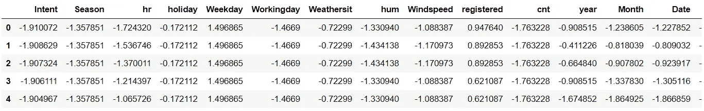

[‘Image Created By Dheeraj Kumar K’]

```
def show_hist(x):
    plt.rcParams["figure.figsize"] = 15,18
    x.hist()
show_hist(df)## The Above Code will return this output
```

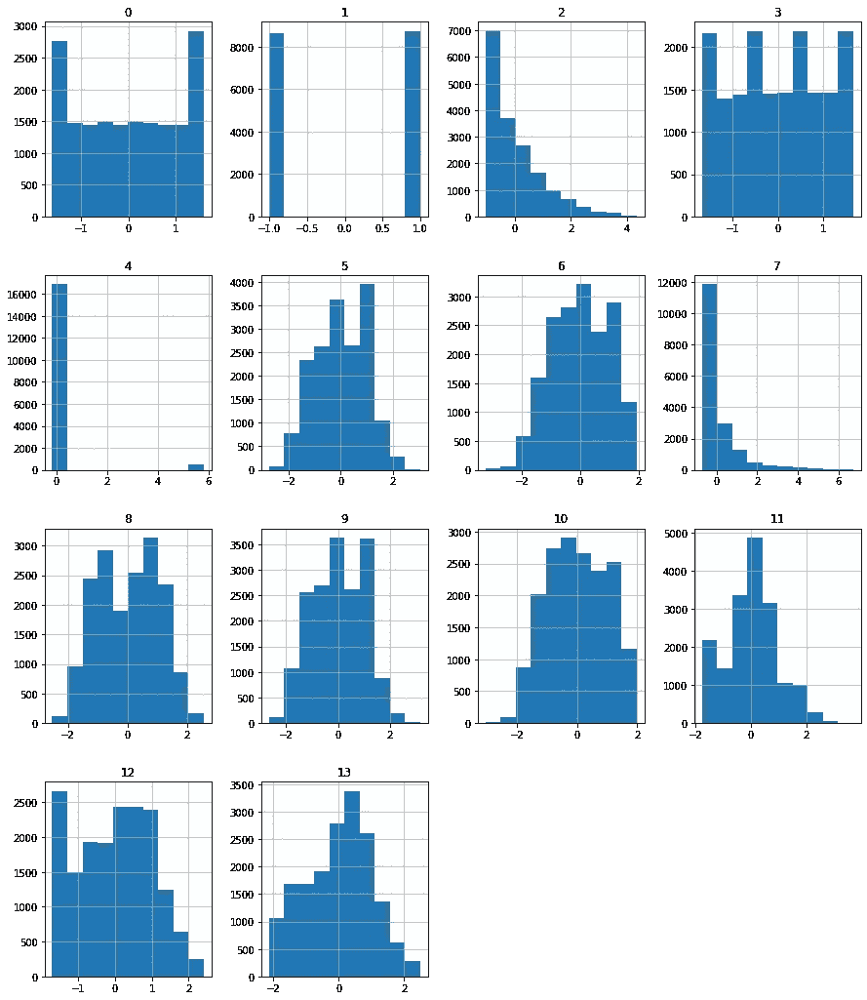

Histogram After Transformation [‘[‘Image Created By Dheeraj Kumar K’]’]

在上面的直方图中，与我们用原始数据绘制的直方图相比，您可以看到主要的正态分布差异。因此，正如我所说的，有时转换会起作用，有时可能不起作用，这取决于数据的性质。因为使用变换方法，这里不需要特征缩放，如果我们想这样做，没有问题，我们可以继续。

4.**模型构建:**当你在做一个模型，并且想要训练它的时候，你显然已经有了一个数据集。但是在训练之后，我们必须在一些测试数据集上测试该模型。为此，您将得到一个不同于之前使用的训练集的数据集。但是在开发阶段不可能总是有这么多的数据。

在这种情况下，显而易见的解决方案是将数据集分成两组，一组用于训练，另一组用于测试；在你开始训练你的模型之前，你要这样做。

```
x = df.drop(['cnt'],axis=1)
y = df['cnt']from sklearn.model_selection import train_test_split
x_train,x_test,y_train,y_test=train_test_split(x,y,test_size=0.30,random_state=40)
```

建立统计模型，

```
import statsmodels.api as sm
model2 =sm.OLS(y_train,x_train).fit()model2.summary()
```

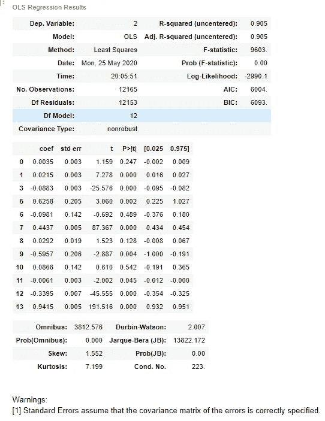

StatsModel Output [‘Image Created By Dheeraj Kumar K’]

## 线性回归模型

```
from sklearn.linear_model import LinearRegression
lr = LinearRegression(copy_X=True, fit_intercept=True, n_jobs=0, normalize=False)LR =lr.fit(x_train,y_train)LR_Pred = lr.predict(x_test)from sklearn import metrics
print('ROOT EAN ERROR SQUARE:',np.sqrt(metrics.mean_squared_error(y_test,LR_Pred)))from sklearn.metrics import r2_score
print('R SQUARE:',r2_score(y_test,LR_Pred))import pickle
pickle.dump(lr,open('LinearRegression.pkl','wb'))
```

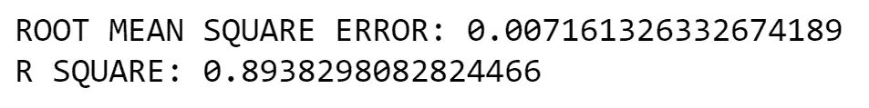

Linear Regression Score [‘Image Created By Dheeraj Kumar K’]

# 烧瓶展开

# 烧瓶是什么？

Flask 是一个流行的 Python web 框架，这意味着它是一个用于开发 web 应用程序的第三方 Python 库。

# 为什么是烧瓶？

*   好用。
*   内置的开发服务器和调试器。
*   集成单元测试支持。
*   RESTful 请求调度。
*   大量记录。

# 项目结构

该项目有四个部分:

1.  model.py 包含机器学习模型的代码，使用机器学习模型预测自行车共享需求。
2.  app.py —它包含 Flask APIs，这些 API 通过 GUI 或 API 调用接收预测细节，根据我们的模型计算预测值，并将其返回。
3.  request.py —它使用请求模块调用 app.py 中定义的 API，并显示返回值。
4.  HTML/CSS —它包含 HTML 模板和 CSS 样式，允许用户输入自行车共享的详细信息，并显示预测的需求。

首先让我们用 HTML 和 CSS 编码

```
<html >
<!--From [https://codepen.io/frytyler/pen/EGdtg--](https://codepen.io/frytyler/pen/EGdtg--)>
<head>
  <meta charset="utf-8">
  <meta name="viewport" content="width=device-width, initial-scale=1">
  <link rel="stylesheet" href="[https://maxcdn.bootstrapcdn.com/bootstrap/4.3.1/css/bootstrap.min.css](https://maxcdn.bootstrapcdn.com/bootstrap/4.3.1/css/bootstrap.min.css)">
  <script src="[https://ajax.googleapis.com/ajax/libs/jquery/4.4.1/jquery.min.js](https://ajax.googleapis.com/ajax/libs/jquery/4.4.1/jquery.min.js)"></script>
  <script src="[https://cdnjs.cloudflare.com/ajax/libs/popper.js/1.14.7/umd/popper.min.js](https://cdnjs.cloudflare.com/ajax/libs/popper.js/1.14.7/umd/popper.min.js)"></script>
  <script src="[https://maxcdn.bootstrapcdn.com/bootstrap/4.3.1/js/bootstrap.min.js](https://maxcdn.bootstrapcdn.com/bootstrap/4.3.1/js/bootstrap.min.js)"></script>
  <link rel="stylesheet" href="[https://cdnjs.cloudflare.com/ajax/libs/font-awesome/4.7.0/css/font-awesome.min.css](https://cdnjs.cloudflare.com/ajax/libs/font-awesome/4.7.0/css/font-awesome.min.css)">
<title>Home</title>
 <!-- <link rel="stylesheet" type="text/css" href="../static/css/styles.css"> -->
 <link rel="stylesheet" type="text/css" href="{{ url_for('static', filename='css/styles.css') }}">

</head>
<style>
body { 
 width: 100%;
 height:10%;
 font-family: 'Open Sans', sans-serif;
 background: #6b66b8;
 color: #fff;
 font-size: 28px;
 text-align:center;
 letter-spacing:1.2px;

}
</style>
<style>
#ip4 {
    border-radius: 15px 50px 30px;
    border: 2px solid #609;
    padding: 20px; 
    width: 300px;
    height: 15px; 
}
</style>
<body>
<div><!--navbar portion-->
  <nav class="navbar navbar-expand-sm bg-dark fixed-top">
  <a class="navbar-brand" href="#"><b>Bike Sharing Demand Prediction</b></a>
  <a class="navbar-brand" href="#"><b><font size="2">BY DHEERAJ KUMAR</font></b></a>
  <ul class="navbar-nav" >
    <li class="nav-item">
    </li>
    <li class="nav-item">
    </li>
  </ul>
</nav>
<br>
</div>
<body>
<br>
 <div class="login">
 <h1>Bike Sharing Demand Prediction</h1><!-- Main Input For Receiving Query to our ML -->
    <form action="{{ url_for('predict')}}"method="post">
    <input type="text" name="year" placeholder="year" required="required" id="ip4"/>
        <input type="text" name="month" placeholder="month" required="required" id="ip4" />
  <input type="text" name="holiday" placeholder="holiday" required="required" id="ip4"/>
                <input type="text" name="weekday" placeholder="weekday" required="required" id="ip4"/>
                <input type="text" name="working day" placeholder="working day" required="required" id="ip4"/>
                <input type="text" name="weathersit" placeholder="weathersit" required="required" id="ip4"/>
                <input type="text" name="temp" placeholder="temp" required="required" id="ip4"/>
                <input type="text" name="atemp" placeholder="atemp" required="required" id="ip4"/>
                <input type="text" name="hum" placeholder="hum" required="required" id="ip4"/>
                <input type="text" name="windspread" placeholder="windspread" required="required" id="ip4"/>
                <input type="text" name="registred" placeholder="registred" required="required" id="ip4"/> 
                <input type="text" name="hr" placeholder="hr" required="required" id="ip4"/>
<br>   
<br><input type="submit" class="btn-primary"value="predict">
    </form><br>
   <br>
   {{ prediction_text }}</div></body>
</html>
```

让我们用 FLASK 编码

```
import numpy as np
from flask import Flask, request, jsonify, render_template
import pickleapp = Flask(__name__)
lr= pickle.load(open('LinearRegression.pkl', 'rb'))[@app](http://twitter.com/app).route('/')
def home():
    return render_template('index.html')[@app](http://twitter.com/app).route('/predict',methods=['POST'])
def predict():
    '''
    For rendering results on HTML GUI
    '''
    int_features = [int(x) for x in request.form.values()]
    final_features = [np.array(int_features)]
    prediction = lr.predict(final_features)output = round(prediction[0], 2)return render_template('index.html', prediction_text='Bike Sharing Demand Count should be  {}'.format(output))[@app](http://twitter.com/app).route('/predict_api',methods=['POST'])
def predict_api():
    '''
    For direct API calls trought request
    '''
    data = request.get_json(force=True)
    prediction = lr.predict([np.array(list(data.values()))])output = prediction[0]
    return jsonify(output)if __name__ == "__main__":
    app.run(debug=True)
```

# 输出

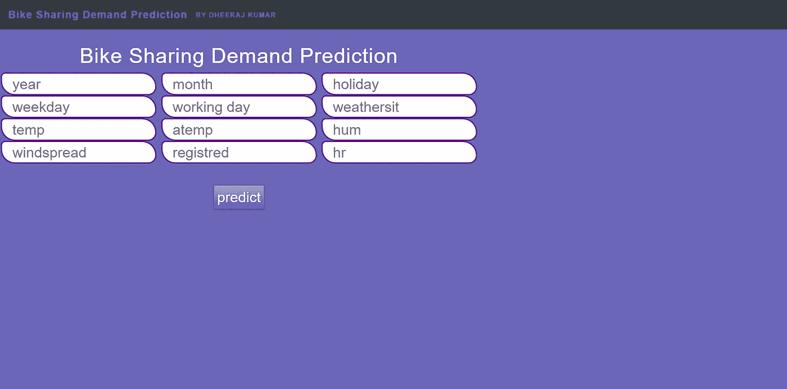

# 结论

在这篇博客中，我们从零开始实现了线性回归的实现。这个博客到此为止。完整的代码可以在这个 GitHub [repo](https://github.com/DheerajKumar97/Bike-Sharing-Demand-Dataset) 中找到。此外，我们还没有涵盖文章中提到的统计部分。但是，我想，这有助于探索其他测试和方法。

*如果你喜欢这篇文章，请给我掌声，并帮助其他人找到它。*

此外，让我知道我是否错过了线性回归的端到端实现的任何东西。

与我联系:- [LinkedIn](https://www.linkedin.com/in/dheerajkumar1997/)

与我联系:- [Github](https://github.com/DheerajKumar97)