# 二手车价格预测的端到端项目

> 原文：<https://medium.datadriveninvestor.com/end-to-end-project-on-used-car-price-prediction-3dc412d24aa0?source=collection_archive---------1----------------------->


[Source](https://www.google.com/search?q=neeraj+kumar+pic+with+renault+duster&tbm=isch&ved=2ahUKEwjgmZS09OjtAhUIIisKHczuDiIQ2-cCegQIABAA&oq=neeraj+kumar+pic+with+renault+duster&gs_lcp=CgNpbWcQAzoECCMQJ1DtkwFYoLIBYKyzAWgAcAB4AIAB_gGIAc8WkgEGMC4xNy4ymAEAoAEBqgELZ3dzLXdpei1pbWfAAQE&sclient=img&ei=9bzlX6DLDojErAHM3buQAg&bih=625&biw=1366#imgrc=e12zkXTXgPw95M)

## **概述**

该数据集包含 cardekho.com 上市二手车信息。它有 9 列，每列包含关于具体特征的信息，如**汽车名称**给出汽车公司的信息。新车是哪一年**购买的。汽车的销售价格这将是进一步预测价格的目标标签。 **km_driven** 汽车行驶的公里数。**燃料**这表示汽车的燃料类型(CNG、汽油、柴油等)。**卖家 _ 类型**告知卖家是个人还是经销商。**变速器**给出汽车是自动还是手动的信息。**车主**该车之前车主的编号。 **Present_price** 该车目前的展厅价格是多少。**

## 步骤 1:设置虚拟环境

这应该是构建端到端项目的第一步。我们需要新的虚拟环境，因为每个项目需要不同的集合和不同版本的库，所以通过为一个特定的项目创建一个单独的环境，我们可以为该环境提供所有必要的库。

```
conda create -n carfare python=3.6
#some essential package for the environment will be installed  #automatically then you will get option
[y/n] ---> y   #click y 
```

之后，我们将通过使用来激活环境

```
>> activate carfare
>> jupyter notebook #run jupyter notebook on newly created env
```

我们可能会遇到缺少 jupyter 笔记本的问题，因为我们必须多做一步

```
>> pip install jupyter notebook # installing jupyter notebook on env
>> jupyter notebook
```

我们的环境已经创建，现在我们将在这个环境上完成我们的项目。

## **第二步:-获取数据集并导入所有必要的库**

我从 [**这里取了数据集**](https://www.kaggle.com/nehalbirla/vehicle-dataset-from-cardekho?select=car+data.csv) &数据集是 csv 格式的。现在，我将导入这个项目所需的所有基本库。

```
import pandas as pd
import numpy as np
import matplotlib.pyplot as plt
import seaborn as sns
from sklearn.preprocessing import StandardScaler
from sklearn.model_selection import train_test_split
```

## **步骤 3 :-数据预处理**

```
df=pd.read_csv("car data.csv")
df.head()   #Printing first five rows 
```

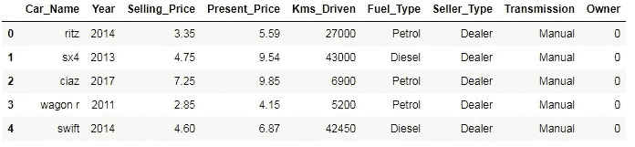

Figure 1

```
len(df["Car_Name"].unique())[out]>> 98
```

在这里，我们有 98 个不同公司的汽车，公司的名称不会影响汽车的价格，价格取决于它使用了多少年，燃料类型等。因此，我将从原始数据帧中删除列 **car_name** 。

```
df.shape  #number of rows and columns present in a dataset[out] >> (301, 9)--------------------------------------------------------------------
df.columns  #printing index of all the columns[out]>>Index(['Car_Name', 'Year', 'Selling_Price', 'Present_Price', 'Kms_Driven','Fuel_Type', 'Seller_Type', 'Transmission', 'Owner'],
      dtype='object')-------------------------------------------------------------------
#dropping the car_name column
df.drop("Car_Name",axis=1,inplace=True)--------------------------------------------------------------------
df.isnull().values.any()  #is there any null value present [out]>> False    # there is no null value present in dataset
```

现在，我们将检查每一列的数据类型，如果数据类型是数字，那么我们就没有这样的问题，但如果数据类型是分类的，那么我们需要将所有这些分类特征转换成数字值。

```
df.dtypes
```

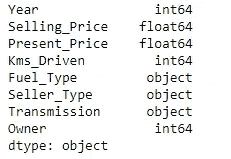

Figure 2

如果我们观察上面的输出，我们可以说现在有一些具有对象数据类型的特征，在我的下一步中，我将创建一个 **cat_df** 并将所有分类特征存储到 **cat_df** 中。

```
list1=[]  #storing all the features having categorical datatype
for i in df.columns :
    if df[df[i]=="object"]:
         list1.append(i)[out]>> ['Fuel_Type', 'Seller_Type', 'Transmission']
```

现在，我们将创建包含所有具有分类变量的特征的分类数据框架，并将从原始数据框架中删除所有分类特征。

```
cat_df=df[list1]
cat_df.head() #top five rows of cat_df
```

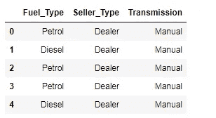

Figure 3

```
df.head()
```

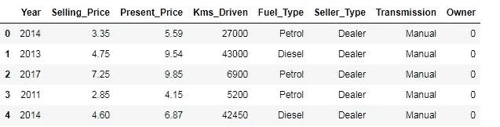

Figure 4

年份代表购买汽车的年份，那么我们如何估计汽车的使用年限呢？

`number of year car has been used = current year — previous year`

因此，我们是在 2020 年，汽车是在 2014 年，那么它已经使用的年数将是:- `number of year car has been used=2020–2014=6`要打印汽车已经使用的年数，我们需要添加一个表示当前年份的列。

```
df["Current_Year"]=2020
```

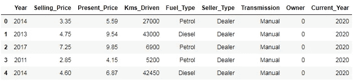

Figure 5

我们已经成功添加了 `**current_ year**` ，现在我们将添加**年数**列，并删除**年**和**当前年**列。

```
df["No_of_years"]=df["Current_Year"]-df["Year"]
df=df.drop(["Current_Year","Year"],axis=1)
df.head()
```

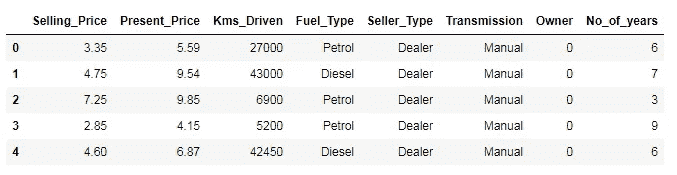

Figure 5

获取数据的统计描述

```
df.describe()
```

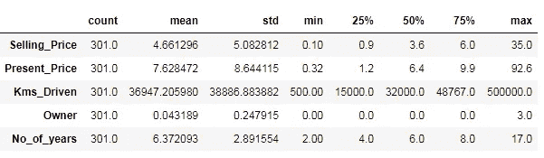

Figure 6

一辆汽车平均行驶 36947 公里，最大行驶距离是 500000 公里。数据集中最高前展厅售价的汽车为 92.6 万卢比。汽车使用并出售的最长年限是 17 年，拥有一辆汽车的最长年限是 3 年。二手车的最高售价是 350 万卢比。这就是我们如何用数据集的统计描述得出结论。

## 步骤 4 :-数据可视化

这是数据科学生命周期中最重要的一步，在这里我们理解数据的行为，并试图从中获得某些有意义的见解。让我们通过做…来理解它

```
sns.set_style("darkgrid")
sns.FacetGrid(df,hue="No_of_years",height=6).map(plt.scatter,"Present_Price","Selling_Price").add_legend()
plt.show()
```

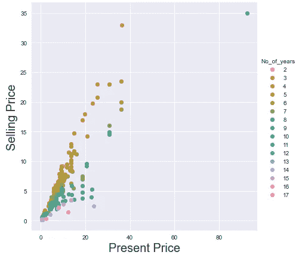

Figure 7

你使用汽车的年数越多，你得到的就越少。

```
sns.set_style("darkgrid")
sns.FacetGrid(df,hue="Present_Price",height=6).map(plt.scatter,"Kms_Driven","Selling_Price")
plt.xlabel("Present Price",fontsize=20)
plt.ylabel("Selling Price",fontsize=20)
plt.show()
```


Figure 8

当我们在最大距离处看到图表时，即:- 500000 公里，汽车的成本接近于零，或者我们可以说没有人愿意为这些汽车支付任何金额。

**绘制成对图**

我们不能可视化多维散点图，因此通过使用对图，我们可以精确地可视化多维数据的每一个维度。

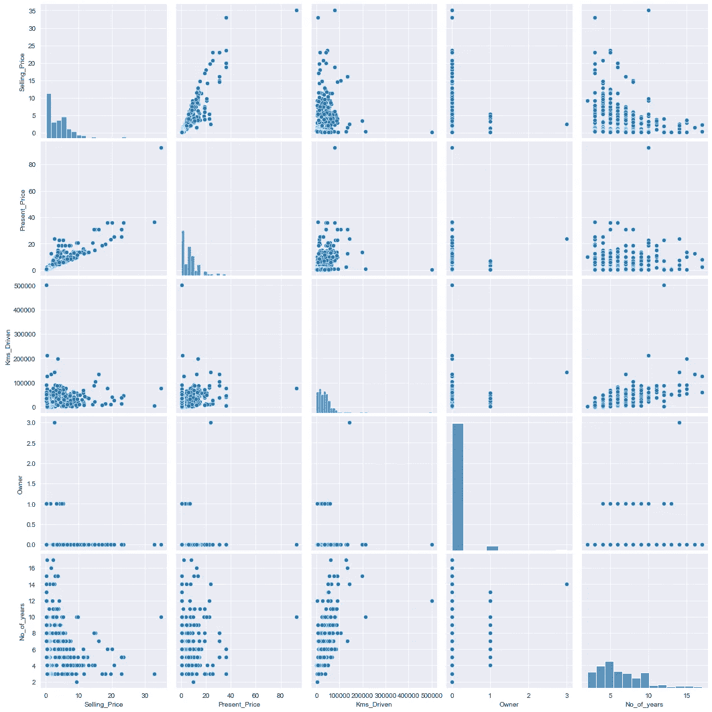

Figure 9

正如我们所见，数据集中的重叠非常少，因此我们不能使用 knn、线性回归、svm，并且由于数据集的动态特性，我们甚至不能使用决策树，因此我们将使用随机森林和 xgboost。

单变量分析:-当分析主要涉及单个变量时，它用于在数据集中寻找模式。

```
sns.set_style("darkgrid")
sns.FacetGrid(df,height=6).map(sns.histplot,"Selling_Price")
plt.xlabel()
plt.show()
```

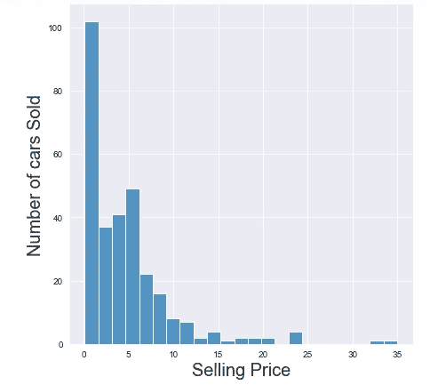

Figure 10

大多数汽车都是在 100 万到 100 万的价格范围内售出的，而在 250 万到 350 万的价格范围内，顾客的数量可以忽略不计

```
sns.set_style("darkgrid")
sns.FacetGrid(df,height=6).map(sns.histplot,"Kms_Driven")
plt.xlabel("Distance Travel",Fontsize=20)
plt.ylabel("Demand",Fontsize=20)
plt.show()
```

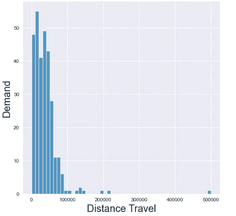

Figure 11

对那些行驶距离较短汽车的需求更大，特别是如果汽车行驶距离在 0-5000 公里范围内，人们更容易被它们吸引。

## C.D.F 图

它定义了小于等于相应 x 轴值的变量的百分比。让我们以上面的例子为例，有多少百分比的车辆的售价低于 150 万卢比，然后我们可以通过使用 C.D.F 找到这种答案。

```
df_Selling_Price=df.loc[:,"Selling_Price"]
count,bin_edges=np.histogram(df_Selling_Price,bins=10,density=True)  #density=True gives normalized form od bin_edges and count
print(count)
print(bin_edges)
PDF=count/sum(count)
CDF=np.cumsum(PDF)  #cdf is sum of all pdf values
plt.figure(figsize=(8,6))
plt.plot(bin_edges[1:],PDF,label="PDF")
plt.plot(bin_edges[1:],CDF,label="CDF")
plt.yticks(np.linspace(0,1,20))
plt.legend(loc="lower left")
plt.show()
```

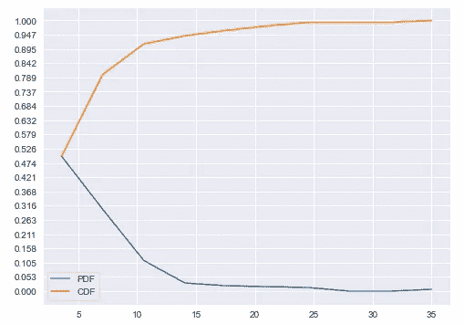

Figure 12

我们可以看到，cardekho 上 94.7%的汽车价格≤150 万卢比。所以有一点很清楚，如果我们想购买价格在 20-25 英镑之间的二手车，我们不会选择去 cardekho.com，因为在那里我们没有太多的选择。

多变量分析:-当我们分析两个或多个变量时。

```
sns.set_style("darkgrid")
sns.jointplot("Present_Price","Selling_Price",data=df,kind="kde")
plt.show()
```

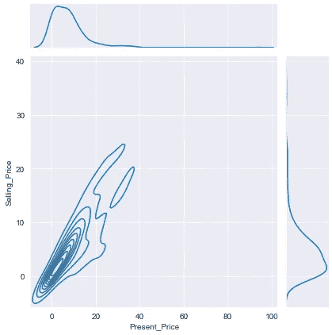

Figure 13

如果我们看到上面的图表，我们可以理解，对于那些原价在 0-200 万之间的车辆，当他们在使用一段时间后出售他们的汽车时，他们可以获得大约 50%的资金。

[](https://www.datadriveninvestor.com/2020/11/19/how-machine-learning-and-artificial-intelligence-changing-the-face-of-ecommerce/) [## 机器学习和人工智能如何改变电子商务的面貌？|数据驱动…

### 电子商务开发公司，现在，整合先进的客户体验到一个新的水平…

www.datadriveninvestor.com](https://www.datadriveninvestor.com/2020/11/19/how-machine-learning-and-artificial-intelligence-changing-the-face-of-ecommerce/) 

## 步骤 5:-特征工程

由于我们已经制作了具有所有分类特征的 **cat_df** ，因此我们将从原始数据帧中删除所有包含分类变量的特征，最后，在 **cat_d** f 中使用特征工程后，我们将**将 cat_df** 与**原始数据帧**连接起来，这样我们就能够将所有变量转换成数字形式。

```
df=df.drop(list1,axis=1)
```

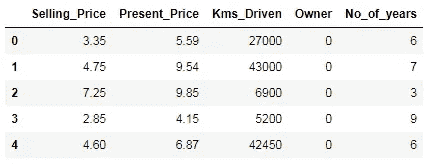

Figure 14

现在我们将在 c **at_df** 上进行特征工程，将分类变量转换成数值变量。但在此之前，我们将检查每个特征包含多少个唯一分类变量。

```
dict1={}
for index,col in enumerate(cat_df.columns):
    dict1[col]=cat_df[col].unique().tolist()
dict1   #key is feature and values will be cat variables
```

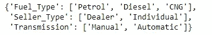

Figure 15

由于**燃料类型、销售者类型、传输**都是名义特征，且具有少量分类变量，我们将使用一个热编码。

```
cat_df=pd.get_dummies(cat_df,drop_first=True)
cat_df.head()
```

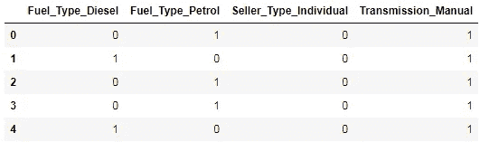

Figure 16

现在，我们将把编码的 **cat_df** 与原始的 **df** 连接起来，还将删除分类变量列。

```
df=df.drop(["Fuel_Type","Seller_Type","Transmission"],axis=1)
df=pd.concat([df,cat_df],axis=1)
df.head()
```


Figure 17

现在我们已经把所有的特征转换成数值变量。在这里，我们将检查要素之间的相关性，但对于此数据集，我们不会进行要素选择，因为当数据集中有大量要素时会使用要素选择，但在此数据集中，我们仅检查数据集中的要素如何相互关联。

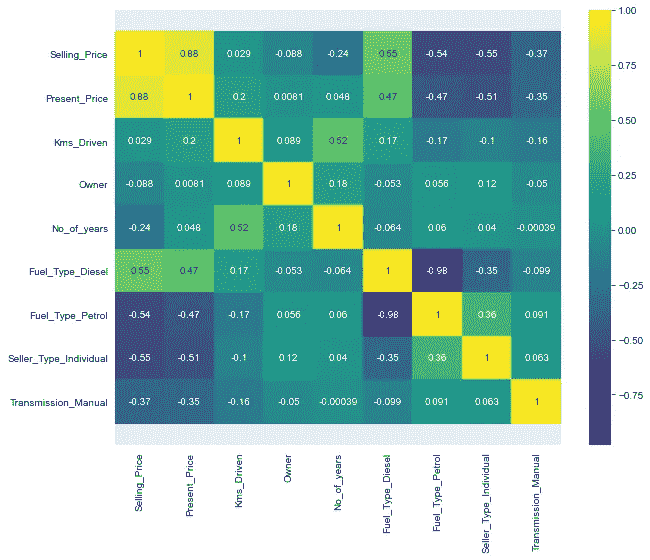

Figure 18

**步骤 6:预建模步骤**

将数据集分为因变量和自变量。

```
X=df.iloc[:,1:]
Y=df.iloc[:,0]
print(X.shape)
print(Y.shape)[out] >> (301, 11)
         (301,)
```

将数据集分为训练集和测试集

```
X_train,X_test,Y_train,Y_test=train_test_split(X,Y,test_size=0.2,random_state=1)
print(X_train.shape)
print(Y_train.shape)
print(X_test.shape)
print(Y_test.shape)[out]>> (240, 11)
        (240,)
        (61, 11)
        (61,)
```

**为我们的数据集选择最佳模型:**

从 pair plot 中检查哪个模型最适合我们的数据集很明显，我们必须采用对非线性以及分类和数字数据组合进行预测的模型，即决策树、随机森林和 xgboost，然后我们将检查哪个模型将具有高准确性，基于此我们选择模型。我们可以使用交叉验证分数来选择最适合的模型。

```
from sklearn.tree import DecisionTreeRegressor
from sklearn.neighbors import KNeighborsRegressor
from sklearn.ensemble import RandomForestRegressor
from xgboost import XGBRegressor
from sklearn import model_selection
models=[]
models.append(('CART', DecisionTreeRegressor()))
models.append(("KNN",KNeighborsRegressor()))
models.append(("RF", RandomForestRegressor()))
models.append(("XGBOOST", XGBRegressor()))
names=[]
result=[]
for name,model in models:
    k_fold=model_selection.KFold(n_splits=10,shuffle=True,random_state=7)
    score=model_selection.cross_val_score(model,X_train,Y_train,cv=k_fold,scoring="r2")
    result.append(score)
    names.append(name)
    print(name,score.mean(),score.std())
```

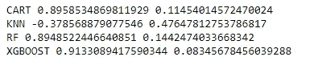

Figure 19

让我们通过箱线图来了解每个算法的得分变化

```
fig = plt.figure(figsize=(10,6))
plt.boxplot(result,labels=names)
plt.title('Algorithm Comparison',fontsize=25)
plt.show()
```

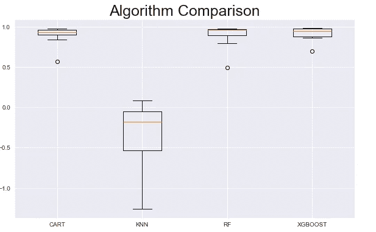

Figure 20

正如我们在上面的准确度得分结果中看到的，我们可以说 XGboost 以非常低的标准偏差提供了更好的准确度，因此我们应该选择 XGboost。

**特征重要性** :-检查所有给定特征中哪些特征对输出特征是重要的。

```
plt.figure(figsize=(8,6))
model=XGBRegressor()
model.fit(X,Y)
importance=np.sort(model.feature_importances_)
plt.barh(X.columns,importance)
plt.show()
```

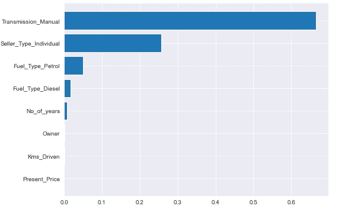

Figure 21

变速器 _ 手动、卖方 _ 类型 _ 个人、燃料 _ 类型 _ 汽油、燃料 _ 类型 _ 柴油、年数对产量预测影响最大。

**超参数调谐:**

通过使用超参数，我们搜索给定模型的最佳参数，以便从给定模型中获得最佳结果。

```
param_grid={"n_estimators":[100,120,130,140,150],
            "max_depth":range(1,12),
            "booster":["gbtree","gblinear","dart"]
           }
from sklearn.model_selection import RandomizedSearchCV
xgb=XGBRegressor()
random_cv=RandomizedSearchCV(estimator=xgb,param_distributions=param_grid,n_iter=100,cv=10)
random_cv.fit(X_train,Y_train)
```

让我们检查一下用于预测的最佳参数。

```
random_cv.best_params_[out] >> {'n_estimators': 130, 'max_depth': 3, 'booster': 'dart'}
```

检查数据集的训练测试准确性

```
from sklearn.metrics import r2_score 
xgb=XGBRegressor(n_estimators= 130, max_depth=3,booster= 'dart')
xgb.fit(X_train,Y_train)
Y_train_predicted=xgb.predict(X_train)
Y_test_predicted=xgb.predict(X_test)
print("Train set accuracy: ",r2_score(Y_train,Y_train_predicted))
print("Test set accuracy : ",r2_score(Y_test,Y_test_predicted))
```

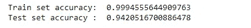

Figure 22

理解预测值；

```
Result=pd.DataFrame({"Actual":Y_test,"Predicted":Y_test_predicted})
Result.head(10)
```


Figure 23

绘制 Kde 图，查看实际值和预测值之间的差异。

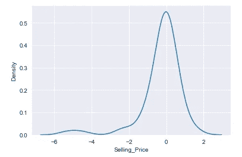

Figure 24

**以序列化格式保存模型:**
以序列化格式保存模型，当我们需要进行预测时，我们只需加载 pickle 文件，并使用该序列化文件进行预测，我们不需要再次创建新模型来预测新的测试数据。

```
import picklewith open("car_price_prediction.pkl","wb) as file: #save pickle file
pickle.dump(xgb_ran,file)
with open "cat_price_prediction.pkl","rb") as file #load pickle file
pickle.load(file)
```

**结论:-**

如果你对这个博客有任何建议，请在下面评论。继续学习，继续探索…..

## 访问专家视图— [订阅 DDI 英特尔](https://datadriveninvestor.com/ddi-intel)