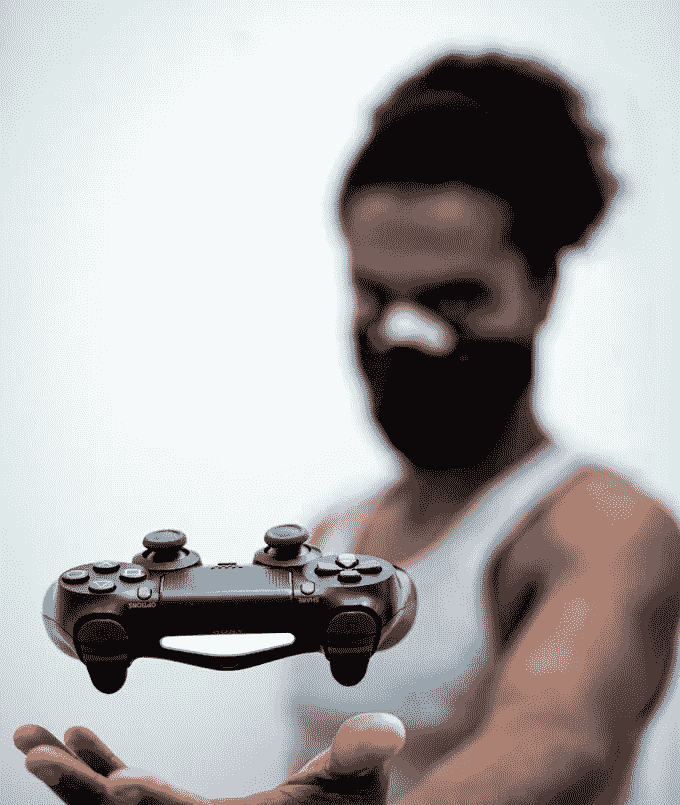
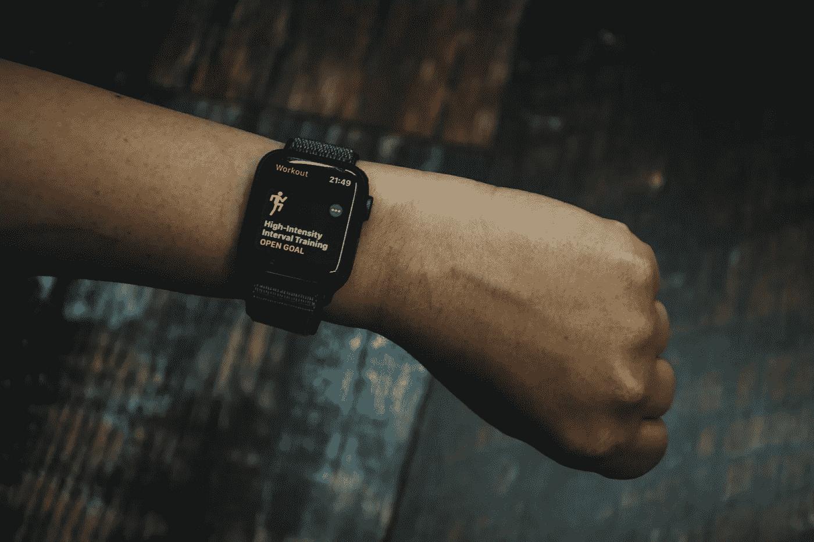
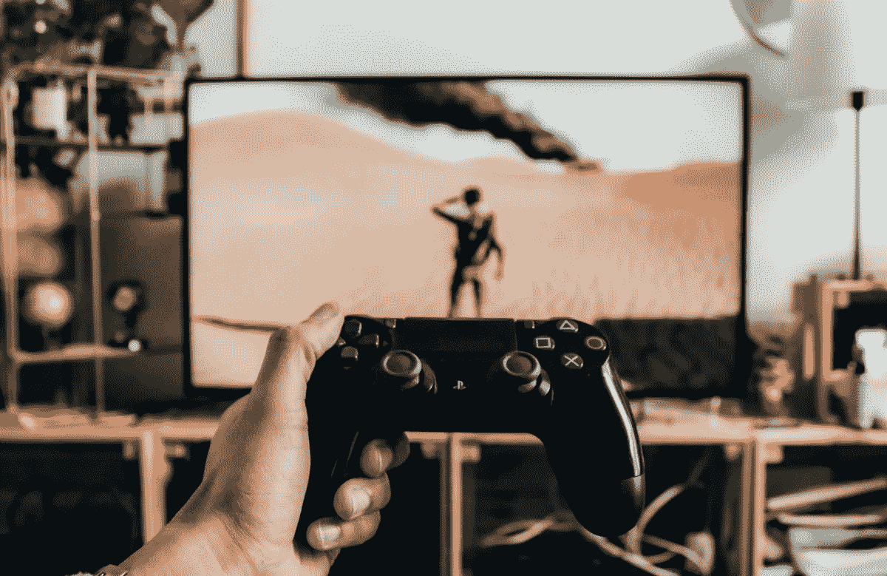

# 吸引我或激怒我:游戏化将统治世界

> 原文：<https://medium.datadriveninvestor.com/engage-me-or-enrage-me-gamification-will-run-the-world-802811d14003?source=collection_archive---------19----------------------->

> 卡尔·罗德的故事

## **在过去的十年里，我们都接受了网飞教育。现在我们将开始游戏化。**

不要只想着游戏。想想我们整个生活世界的游戏化。网飞已经认为游戏对其业务的威胁大于传统电视。他们对堡垒之夜的关注也比 HBO 多。游戏的吸引力在哪里？为什么它在增长？

一点也不，因为大型科技公司开始意识到游戏是他们所能触及的增长最快的市场之一。期待他们全力支持这个行业。堡垒之夜在全球拥有超过 2.5 亿玩家。只有中国、印度、美国和印度尼西亚有更多的居民。在游戏行业，中国的大型科技公司腾讯是头号巨头。在中国，它控制了超过一半的市场(330 亿美元),并且在将游戏引入手机方面处于领先地位。有趣的是，腾讯并不是通过订阅、应用程序下载或视频游戏销售赚取巨额资金的。它通过鼓励玩家购买应用内的虚拟服装、武器、爆炸物等来盈利。这可能会让那些尚未屈服于星球游戏的人感到惊讶，但虚拟世界中的印象管理和赋权将是我们未来的坚实部分——酷虚拟服装在这方面有很大帮助。你越年轻，越像亚洲人，你就会越早接受它的吸引力，越早体会到它的意义。请注意，像香奈儿和古驰这样的品牌已经开始为虚拟形象设计高级时装系列。越来越多出生在网络上的 Z 世代人认为，虽然不算太便宜，但很值得。此外，堡垒之夜背后的公司 EPIC 的大部分收入来自虚拟服装。请不要将这些虚拟服装销售与足球体育场比赛的大众商品相比较。比那酷多了。与像 Supreme t 恤衫或 Kanye West 的 Yeezy 运动鞋这样的狂热时尚品牌的限量版相比。一个受欢迎的堡垒之夜团队，叫做 100 个小偷，现在已经开始了自己的高级街头服饰品牌，从虚拟回到“真实”的世界。流行歌手和偶像德雷克是一名投资者。而且，你已经被社会影响者 Lil Miquela 的魅力迷住了吗？她看起来令人愉快的多种族，有很多人类的雀斑，而且相当坦率。她从不厌倦卷入丑闻或表现出天后的行为。因为她是虚拟的。从香奈儿到坎耶·韦斯特和德雷克，再到莉尔·米凯拉:他们给了你游戏化如何开始统治世界的早期见解。

在营销传播方面，游戏行业在智能和酷惊喜方面处于领先地位。4000 万球员申请参加 2019 年第一届堡垒之夜世界杯。(由于 Covid19，2020 版本被取消。)这位 16 岁的获奖者带着 300 万美元的奖金回家，并在 YouTube 上被数百万人观看。这是针对游戏和游戏的线下-线上营销，它吸引了大部分目标群体。泰勒“忍者”布莱维斯(28 岁)是堡垒之夜最著名的球员之一。最近，他与流行歌手德雷克进行了一场比赛，既吸引了目标群体，又进一步美化了游戏世界。

所有迹象表明，游戏的吸引力只会增加。Covid 锁定帮助该行业进一步繁荣。疫情导致了全球范围内的虚拟化。它教会了新的群体拥抱游戏。通过这样做，他们中的许多人发现，生活在游戏中比生活在游戏之外更令人兴奋，在我们过去称之为:现实世界中。游戏开始了。现实生活中的无聊:愤怒。

对该行业来说，这并不都是光明和积极的。备战世界杯冠军意味着每天八小时的比赛训练。没有花在学校工作上的时间，这让全球许多家长感到担忧。此外，英国王子亨利警告人们不要沉迷于游戏，尤其是堡垒之夜。世界卫生组织最近引入了一种新的精神疾病:游戏障碍(游戏成瘾)。它适用于大约 3%到 4 %的玩家。中国的习主席还有其他不喜欢游戏的原因。游戏玩家有一种在国际上玩游戏的倾向，会潜入国界和防火墙之下，自由交流。总统在他的国家安排了对(虚拟的)胸部、屠宰和血液的大规模打击，这意味着:对游戏本身的打击。在中国，女性化身所能展示的皮肤数量是有规定的。一段时间以来，它抑制了中国这一行业的增长。

除了巨大的盈利能力和庞大的粉丝大军之外，游戏行业对其糟糕的媒体和形象没有令人信服的答案:2.5 亿游戏玩家真的是错的吗？一些游戏以其教育影响力而自豪。《刺客信条:起源》提供了一个教育版本，学生可以在玩游戏的同时探索托勒密埃及。姑且称之为历史语境下的杀戮吧。其他系列奖励不流血完成任务的玩家(“杀手”、“不名誉”)。在《迈阿密热线》中，你屠杀了数百名暴徒，直到音乐停止，让你在一条布满遇难者尸体的道路上，在不祥的寂静中原路返回。这一切都有一点社会责任，同时它是小众的橱窗装饰。不管橱窗装饰的可信度有多可疑，游戏已经存在并被征服。这就是它的 DNA。

## **下一阶段:基于云的游戏场馆**

现在，谷歌的体育场开始吸引比以往更多的人来玩星球游戏。Stadia 的范围和野心是巨大的。它将成为游戏界的网飞，实时提供高分辨率的顶级游戏。如今，游戏玩家有时必须等待数小时才能将新游戏下载到他们的电脑或游戏机上。在体育场，点击链接将花费你五秒钟的时间。没有下载，没有安装，没有升级。得益于谷歌庞大的数据中心，其结果是高速和控制台质量。堡垒之夜已经在玩家心中建立了这样一个原则，他们可以在任何设备上玩同一款游戏，无论何时何地，与同一组朋友对战。Stadia 将使它成为酷的新常态。游戏会从云端来到你面前，让主机:复古。当然，这对即将推出 PlayStation 5 的索尼来说是个威胁。为了保护自己的市场份额，该公司最近从堡垒之夜的母公司 EPIC 手中收购了 2.5 亿美元的股份。索尼押注游戏、音乐和电影将围绕社交媒体融合——在音乐和电影方面，它可以与未来的游戏巨头谷歌竞争。请注意，现在堡垒之夜已经有了一个虚拟的岛屿，像 Marshmello 和 Travis Scott 这样的艺术家可以在这里进行实时表演。Stadia 也投入巨资让游戏开发商入伙。它的目标是成为一个平台，在那里他们都将创造他们的游戏。谷歌拥有 YouTube，用户已经观看了 500 亿小时的游戏内容(2018 年的数据)。Stadia 可以让你点击 YouTube 视频流，立即参与到你正在观看的比赛中。不过，与开发商的利润分成谈判将会很激烈。对开发者来说有一件非常好的事情:当他/她制作了一次游戏，在 Stadia，它将被带到任何其他屏幕上，而不会给开发者带来麻烦。但这是有代价的。

 [## 在家工作如何提高我的工作效率|数据驱动型投资者

### 在家工作确实激发了我最大的潜能，让我更有效率。因为在家工作给了我…

www.datadriveninvestor.com](https://www.datadriveninvestor.com/2020/07/29/how-working-from-home-increased-my-productivity/) 

## 游戏化的原则:快乐加一点地狱。同时

我们经常把玩游戏和青少年躲在他们的卧室里联系起来，他们的卧室被披萨饼架和空的能量饮料罐包围着，浪费他们的时间和生命。他们自己却不敢苟同，认为他们的游戏活动是最好的。当你在玩游戏时，或者更广泛地说:当你随时随地遵循游戏化的原则时，你就一直在你的技能水平的边缘上行动。你总是处于跌倒的边缘，但当你跌倒时，它从来都不是彻底的失败，而是邀请你立刻爬起来。这些都是游戏化的原则。他们邀请你进入一个充满推动的世界，永远提升你自己。他们挑战你在你能力的最边缘工作，并从那里不断提高。这就是心理学家所说的“心流”。以及随之而来的热情和骄傲，他们称之为‘fiero’(意大利语骄傲的意思)。“游戏是好的”信仰体系的追随者在无聊的现实中给我们所有人带来了一个坚实的论据。为什么玩，工作，生活在一个低动力，低反馈，低挑战的环境，叫现实世界？虽然你知道有另一个世界，高度授权和充满活力，由游戏化的原则领导:完全参与，使一切更令人兴奋，鼓舞和满意？

围绕着游戏化原则的“流动”和“菲耶罗”太重要了，不能把它们留给阁楼上狂饮能量饮料的青少年。最好也把它们融入我们的成年生活。最好把它们推广到整个社会。这正是现在和未来正在发生的事情。

## **带健身**

游戏化的原则来得早，也容易健身。每当你在健身房举起更重的重量，骑更长的自行车或跑更长的跑道，并与以前相比，你都在应用游戏化的原则，即使是在相当初级的水平上。Nike Fuel、Apple Watch 和所有 Fitbit 应用程序都让游戏化原则成为我们新常态的一部分。如今，我们越来越多的表现统计数据可以被数字化并上传到云端，从那里监督我们的每一步行动。这极大地扩大了将我们的结果与之前的结果进行比较的可能性，也扩大了将它们与其他人的结果进行比较的可能性:我们的朋友、健身俱乐部成员或与我们同龄的普通人。随着时间的推移，跟踪你和你重要的其他人的行动，并让他们受到游戏化原则的影响，这意味着每当你想接受挑战时，一个微妙而强大的推动可以改善你自己。这就是游戏的原则如何占领和丰富健身行业。随着健身领域的扩大，我们看到监控和游戏化活动的范围越来越广。MyFitnessApp 可以捕捉你所有的跑步、骑行、散步和徒步旅行。UARecord 的目标是成为你所有 24/7 活动的仪表板，从锻炼到睡眠。Endomondo 通过个人训练计划帮助您保持动力，以达到您的跑步目标，该计划可根据您的健身水平进行调整。MyFittnessApp 承诺控制你的营养、卡路里和运动。他们都在游戏化原则的支配下组织你的活动。监控越细致，游戏化的原则就越成为你身体和生活方式的一部分。

## **接受教育**

在过去的两个世纪里，教育没有太大的变化。传统的形式——老师在一个班的学生中传播知识——仍然占主导地位。但是现在学生们有新的技巧和技术来逃避规则。在假装关注的同时，他们偷偷整理自己的 Instagram 账户，成群结队地享受 Tiktok 或玩堡垒之夜。老师们现在遇到的一代学生知道游戏的“流程”和“fiero ”,他们甚至比以前的几代人更不能忍受课堂上的无聊和合唱。当然，我们可以在课堂上加强监控水平——而[人工智能在这方面会很有帮助。](https://www.datadriveninvestor.com/2019/09/12/ai-in-education/)但是，将游戏化的原则融入课堂和教育中，难道不是更符合 21 世纪的解决方案吗？在法国里昂,“游戏校园”正是这样做的，进入 21 世纪，伴随着注意力的延伸——电子竞技成为连接的中介。他们声称，一起玩游戏可以提高在线团队合作、有效沟通和压力下决策的欲望和技能。

## **参加招聘**

Accenturate 开发了一个虚拟现实游戏练习，评估哪些毕业生最适合公司的技术工作。例如，申请人从一个手持火炬的埃及坟墓开始。在那里，他们必须破译密码并完成相应的任务。“公司不是在找能在最快时间内找到正确答案的人。相反，它通过游戏考察申请者如何处理他们面临的情况”。(金融时报。根据 Accenturate 的说法，人们在新环境中如何脚踏实地、保持冷静并专注于自己的目标，比传统的求职面试更能预测他们在实际工作中的成功程度。随着人们对人与人之间神经差异的未来意识的增强，该公司有信心利用游戏化的原则招募最佳候选人。

## **接受不稳定的工作**

亚马逊的首席执行官杰夫·贝索斯可能没有意识到这样一个社会事实，即很多仓库工人并不认为这是一个好的工作场所。但他是唯一一个。他的工人抗议他们的尊严被践踏，他们的行动自由被剥夺。尽管他们的时薪相对较高，但与主要街道零售店的员工相比，他们感到缺乏人性。在西方世界，没有一个工作场所对员工进行如此持续、如此细致的监督、控制和评估。从他们的行走速度到他们接新订单的速度，再到他们上厕所的时间:这都是由机器测量和算法判断的，将人转变为机器本身。亚马逊在这方面并不孤单。当优步汽车司机没有立即对他们的信息做出反应时，他们会受到“惩罚”，在一定时间内没有收到驾驶请求。亚马逊和优步——还有食品送货上门服务:这是游戏化原则从愉悦和有趣变成全景地狱的地方。当你在每一项特定的任务上相对缓慢时，你就进入了橙色区域。当你坚持这样做的时候，你会得到红色的警告。也许你暂时很慢，因为你正在从健康问题中恢复。算法不知道也不关心；他们不做这样的‘个性化’。从根本上说，当工蜂抱怨所有的同理心和个性化的人类注意力都从系统中流失时，他们是对的。

当然，老板随时随地都会监督员工的表现。这是有道理的。但现在，它正以前所未有的严格程度发生着。和没有心脏没有灵魂的机器。它挤压了工人的尊严感和能动性，就像上帝从来没有打算过的那样。因此，尽管他们的流量和 fiero，在这里游戏化的原则也产生了新的地狱。也许你认为你远离了仓库和送货人员的不幸。可能你的老板亲自了解并欣赏你。对你有好处。但染料已经投了正常化 24/7/365 监控每个人。科技让这成为可能。游戏化让它变得异常激烈。

## **采取当日交易**

我们以下一代日内交易结束这篇文章。在这里，娱乐与地狱的游戏化组合展现了另一面。Robinhood.com 是一款受欢迎的交易应用，面向年轻人和懂技术的人。在最初的几个月里，他们增长迅速，现在为超过 1300 万的零售商提供服务。在最近一次融资后，其价值飙升至 110 亿美元。在日均交易收入方面，它已经超过了竞争对手 Schwab 和 ETrade。在回报方面，罗宾汉以其民主方式而自豪:为所有人投资。他们令人信服地声称，无论你有多有经验(或没有经验)，投资金融市场都会变得更加实惠、直观和有趣。光滑的霓虹色界面确实很有趣。没有什么地方比罗宾汉更能把严肃的日间交易和游戏乐趣交织在一起了。有经验的人，当然还有没有经验的人，他们被开玩笑地邀请，可以处理掉所有让日内交易有趣的工具:持续的监控和即时的反馈让每个人都能尽可能生动地看到他们在哪里赢了或输了什么，增强了兴奋感。你可以把它与瞬间满足的冲动相比较。尽管神经科学家至关重要。他们把这比作给没有经验的人提供海洛因。伯克希尔·哈撒韦公司的副总裁查理·芒格同意这一观点。亚历克斯·卡恩斯(Alex Kearns)的第一次自杀引发了改革这一新一波在线经纪公司的呼声，他曾扮演并被错误地怀疑损失了一大笔钱。无论这场激烈讨论的结果如何，它肯定显示了游戏的原理是如何无处不在的。不管是好是坏。

# 这是一个未来主义者俱乐部的故事

## 由[时间的科学](https://scienceofthetime.com/)

> 作者:[卡尔·罗德](https://www.linkedin.com/in/carlrohde/)

Carl Rohde 教授博士是关于“未来预测&创新”的国际主题演讲人，具有学术深度和实践现实性。在过去的十年中，他与 50 所大学和 10，000 多名学生合作。目标:让所有人都参与到更多的趋势和创新中。罗德在阿姆斯特丹、巴塞罗那和上海都有研究职位。卡尔·罗德还领导着 www.scienceofthetime.com**，一个全球市场和趋势研究人员的虚拟网络。**

*作为一个教育知识机构(大学、理工学院或其他),你有兴趣参与国际酷城搜索并想了解更多吗？[请点击这里](https://scienceofthetime.com/coolhunts/)。*

*在推特和媒体[上关注](https://medium.com/@carlrohde)[卡尔·罗德。](https://twitter.com/CarlRohde)*

## *协同*

**

*[时间科学](https://scienceofthetime.com/)*

*作为一个教育知识机构(大学、理工学院或其他),您是否有兴趣参与国际酷城搜索[请点击此处](https://scienceofthetime.com/coolhunts/)。*

## *访问专家视图— [订阅 DDI 英特尔](https://datadriveninvestor.com/ddi-intel)*