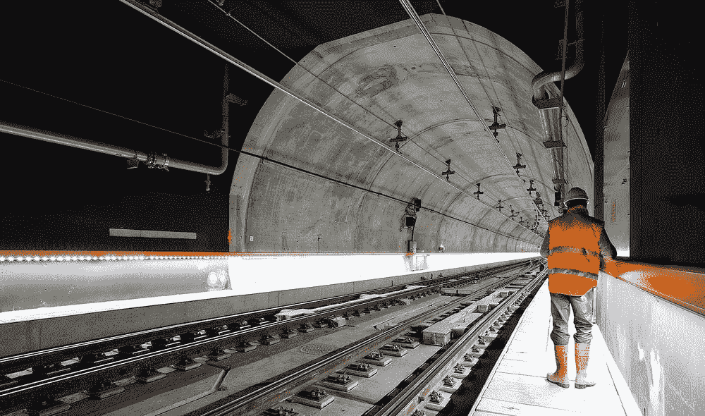
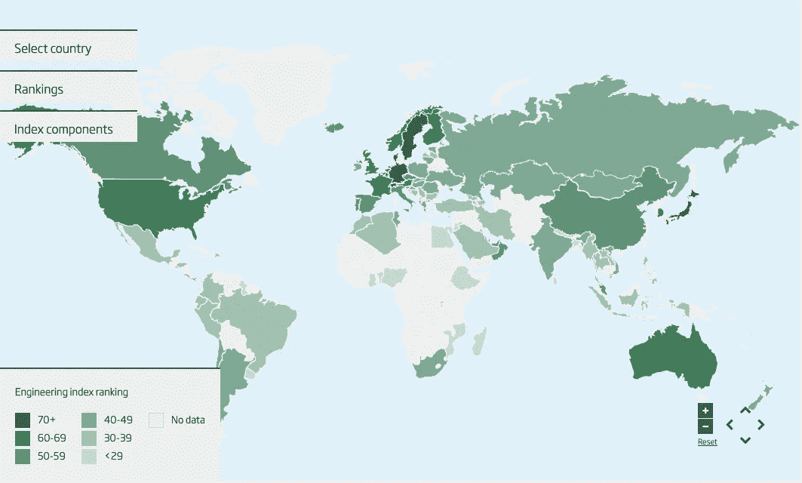

# 工程促进更好的经济

> 原文：<https://medium.datadriveninvestor.com/engineering-for-a-better-economy-66e8d0020e0a?source=collection_archive---------25----------------------->

人类作为一个物种，在历史上一次又一次地抵抗并克服了压力测试。在这样做的时候，我们不仅克服了这些困难，而且还设法在这些困难中创新前进。如果有一件事把我们和其他物种区分开来，那就是为了一个共同的目标进行团队合作的能力。从猎杀长毛象作为晚餐到点燃大规模革命，灵活的合作给了人类不断前进的优势。

Photo by [Ricardo Gomez Angel](https://unsplash.com/@ripato?utm_source=unsplash&utm_medium=referral&utm_content=creditCopyText) on [Unsplash](https://unsplash.com/s/photos/engineering?utm_source=unsplash&utm_medium=referral&utm_content=creditCopyText)

# 每一次危机都伴随着机遇

媒体通常对经济持相当悲观的看法。当我们看过去的坏消息，有惊人的创新壮举正在进行的最聪明的头脑在地球上。电子商务、金融科技、云计算、3D 打印和制造业等长期趋势在两个季度内经历了多年的增长。

尽管今年在短时间内经历了突然的社会变化，但我相信采纳这些长期趋势将提高经济的生产率和效率。这种由工程师推动的技术将提升经济，使其超越媒体关注的范围。因此，现在是投资工程和创新的最佳时机。

从危机一开始，工程师就对经济至关重要，以满足制药、防护设备、医疗设备和云基础设施方面日益增长的需求。工程师和其他 STEM 专业是为应对危机而生的，事实上，他们的大部分课程都围绕着 aro

想象工程如何促进经济增长的最简单方法是通过总需求。

# AD= C+I+G+(X-M)

总需求。总需求和经济增长是正相关的。

## c =消费

工程师制造和维护产品和服务，这些产品和服务会在很长一段时间内增加消费。几乎每一篇与疫情相关的文章中都提到的一个常见词是“数字化转型”。工程师和创新者不知疲倦地工作，几乎在一夜之间将整个传统组织转变为数字化工作场所。

连接客户和供应商几乎都是因为工程师建立的平台。这些平台越高效、越可靠，经济中的消费就越大。除了对消费的直接影响，工程项目通过其整个价值链创造了更多的就业机会，从而进一步促进了消费和经济增长。

 [## 后疫情经济中的基本 GTM 变革策略|数据驱动的投资者

### 新冠肺炎以一种新的不可想象的方式开展业务。这个疫情甚至强迫…

www.datadriveninvestor.com](https://www.datadriveninvestor.com/2020/08/11/an-essential-gtm-change-strategies-in-the-post-pandemic-economy/) 

## I=投资

创新性和颠覆性的突破吸引了本地和外国投资，这进一步加速了一个国家的产业增长。投资研发可以提高生产率，刺激行业内的进一步创新。例如，Novovax 和阿斯利康等公司在疫苗接种方面取得的进展导致数百万资金流入该经济体。此外，随着通过教育在一个经济体中建立起强大的工程技术基础，更多的外国投资将流入该经济体开展业务。

## G=政府支出

增加刺激和补贴，支持地方议会和重大项目，以促进就业。根据 [CEBR](https://www.raeng.org.uk/publications/reports/engineering-and-economic-growth-a-global-view) 的说法，一个县在工程指标上的得分每增加 1%，人均 GDP 就会增加 0.85%，这证明了经济增长和工程之间的强相关性。‘工程指数’是衡量一个国家工程实力的指标。排名靠前的国家。瑞典、德国、日本和澳大利亚是该指数排名前十的国家之一。从长远来看，增加政府在工程方面的支出将提升一个国家的工程实力，从而促进其经济发展。CEBR 报告得出结论，在工程方面投资最多的国家获得了巨大的经济利益。

[Engineering index: Interactive](https://www.raeng.org.uk/policy-old/partnerships/international-policy-and-development/gcrf-international-development/engineering-a-better-world-caets-2016/economic-research)

## (+)X =出口

出口到其他国家的新产品和服务。比较优势表明，某些经济体能够以比其贸易伙伴更低的机会成本生产商品和服务。某些国家，如加拿大、澳大利亚和美国，通过对教育和人力资本的持续投资以及技术工人的移民获得了比较优势。例子包括贵金属、药品、钢铁、电子元件和服务。根据[哈佛大学的一项研究](https://thenewdaily.com.au/finance/finance-news/2020/04/12/coronavirus-domestic-manufacturing/)，澳大利亚在出口复杂程度方面排名第 93 位，这显示了澳大利亚对服务业和采矿业的过度依赖。或许，这场危机将提供一个机会，重新点燃新的制造业浪潮，从而提振经济和就业率。

## (-)M =进口

这场危机不可避免地导致了去全球化，迫使各国自给自足。此前，发达国家为了寻求更高的企业利润和效率收益，将大部分供应从低成本制造国外包出去。随着地缘政治紧张局势、传染效应和不确定性的上升；公司被鼓励从当地供应商那里采购高质量和可靠的产品。这降低了对总需求有积极贡献的进口总量。

Photo by [Ivan Bandura](https://unsplash.com/@unstable_affliction?utm_source=unsplash&utm_medium=referral&utm_content=creditCopyText) on [Unsplash](https://unsplash.com/s/photos/construction?utm_source=unsplash&utm_medium=referral&utm_content=creditCopyText)

# 利用长期趋势

这些年来逐渐实施的趋势加速了，并在几周内实施。这些长期趋势将在未来十年继续存在并占据主导地位。

电子商务等行业在几个月内经历了未来 5 年的预期增长。毫无疑问，在满足这种指数级需求时会出现问题，而这正是工程师们需要解决并引入更多创新解决方案的时候。

*零售→电子商务(例如:亚马逊、Shopify)*

*办公室→在家工作(例如:微软团队、Slack、Zoom)*

*银行→金融科技(如 Square、Paypal)*

*石油→可再生能源和低碳(如太阳能、特斯拉)*

旧经济的组成部分，包括有形基础设施，如交通网络、桥梁、水和废物管理，都是由技术熟练的工程团队领导的。同样，未来经济的组成部分，包括可持续城市、电动汽车、可再生能源和数据基础设施，也将由这样的团队领导。

几十年前，工程主要集中在土木、机械和电气工程上。随着需求和经济复杂性以指数速度增长，工程角色需要迎合这种增长。气候变化、贫困、灾害管理、太空旅行和基因编辑等新领域需要创新型工程师和问题解决者。

## 最后的话

除了危机之外，对工程和制造业的投资对提振经济将更加重要。对于非多样化经济体来说，超越效率、转向弹性和自给自足是一个现实检验。如果通过适当的指导和支持得到正确执行，这些经济体可以超越自给自足，并以某些部门的全球市场主导地位为目标。

健康危机会持续几个月，但此类事件的经济影响可能会持续数年，甚至数十年。对于一个国家来说，关键在于在艰难时期积极投资创新，以成为一个更强大的经济体。

最终，人类的进步从根本上依赖于通过工程解决当前的问题来重新想象更美好的未来。

## 参考

1.  新的全球研究证明了工程和经济发展之间的联系——皇家工程学院(2016)。可从以下网址获取:[https://www . raeng . org . uk/news/news-releases/2016/9 月/new-global-study-proves-link-between-engineering-a](https://www.raeng.org.uk/news/news-releases/2016/september/new-global-study-proves-link-between-engineering-a)
2.  Black，E. (2020)为什么冠状病毒必须激发澳大利亚制造业的复兴，新日报。可在:[https://thenewdaily . com . au/finance/finance-news/2020/04/12/coronavirus-domestic-manufacturing/](https://thenewdaily.com.au/finance/finance-news/2020/04/12/coronavirus-domestic-manufacturing/)查阅

**访问专家视图—** [**订阅 DDI 英特尔**](https://datadriveninvestor.com/ddi-intel)