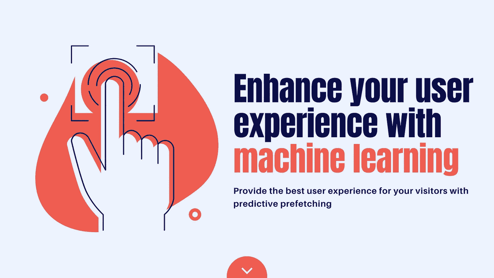
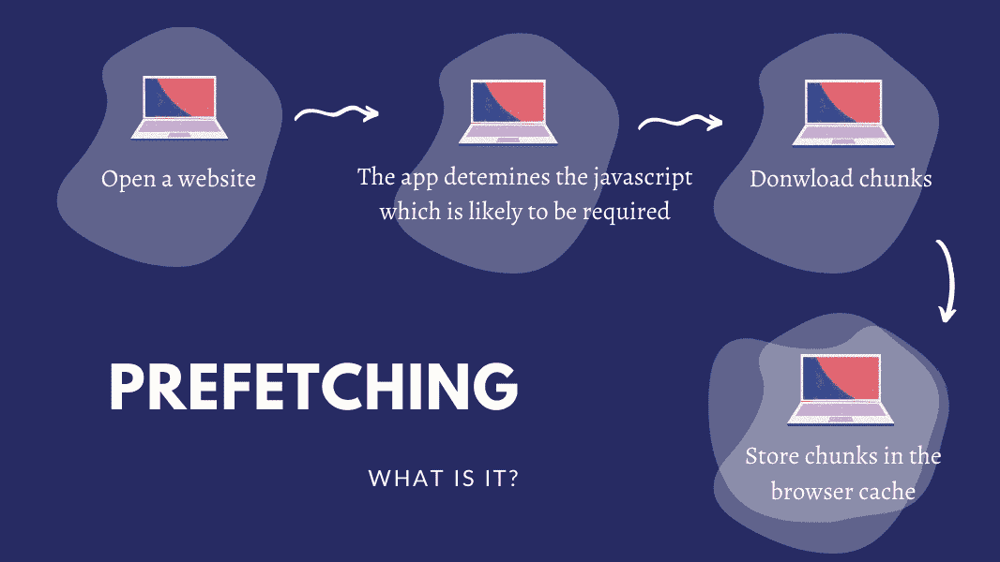

# 通过机器学习增强您的用户体验

> 原文：<https://medium.datadriveninvestor.com/enhance-your-user-experience-with-machine-learning-9aae6e30b761?source=collection_archive---------8----------------------->

## 通过预测预取为您的访客提供最佳用户体验

[Source](http://www.canva.com)

你是否经历过这样的情况:浏览一个网站，你有一个文章列表，你正在浏览以选择要阅读的文章，突然你的信号很差，并开始点击引起你注意的文章，但没有结果，并继续愤怒地点击，你感到沮丧。

作为一名 web 开发人员，我不希望我的网站的用户面临这种情况。如果你在关注我的文章，你可能已经阅读了关于[人工智能正在改变网络世界](https://levelup.gitconnected.com/ai-revolution-is-changing-the-web-world-fe38e751ede)的文章，如果没有，如果你想阅读它，这里有链接:

 [## 人工智能革命正在改变网络世界

### 用于 Web 开发的顶级人工智能和机器学习框架

levelup.gitconnected.com](https://levelup.gitconnected.com/ai-revolution-is-changing-the-web-world-fe38e751ede) 

机器学习用 [Guess.js](https://github.com/guess-js/guess) 来把用户从这种糟糕的情况中解救出来。

# Geuss.js 是什么？

Guess.js 为您提供了库和工具来简化预测数据分析驱动的方法，以改善用户的网络体验。这些数据可以由任何数量的来源驱动，包括分析或[机器学习](https://en.wikipedia.org/wiki/Machine_learning?sa=D&ust=1522637949792000)模型。

## Guess.js 网站的优势:

*   加速页面导航
*   提高用户满意度
*   减少数据使用
*   支持 Angular、Next.js 等流行框架…

所有这些都是可能的，会让你的应用更智能更快，从而增加你的用户体验。

为了实现这些目标，我们需要了解预测预取。

准备好了吗？我们走吧(づ｡◕‿‿◕｡)づ

# 首先，什么是预取？

> **"高速缓存预取**是计算机处理器使用的一种技术，通过在实际需要之前将指令或数据从较慢内存中的原始存储区提取到较快的本地内存来提高执行性能(因此出现了术语“预取”)。大多数现代计算机处理器都有快速本地高速缓冲存储器[,预取的数据保存在其中，直到需要时才取出。—维基百科](https://en.wikipedia.org/wiki/Cache_(computing))

 [## 什么是数据目录，它如何使机器学习取得成功？数据驱动的投资者

### 数据目录是机器学习和数据分析的燃料。没有它，你将不得不花费很多…

www.datadriveninvestor.com](https://www.datadriveninvestor.com/2020/08/27/what-is-a-data-catalog-and-how-does-it-enable-machine-learning-success/) 

下面是预取的一个示例:

[Source](http://www.canva.com)

要预取一个网站，我们可以使用几种策略:

*   全部预取
*   可见链接
*   鼠标经过时
*   预测预取

正如您可能已经猜到的，我们对这篇通过智能预取增强用户体验的文章感兴趣的是预测预取策略。

# 二、什么是预测预取策略？

预测预取是一种使用数据分析和机器学习方法来提供数据驱动方法的技术。

## 预测预取是如何工作的？

Guess.js 允许我们通过考虑从分析报告中提取的用户导航模式来使用预取。例如，Guess.js 可以使用来自 Google Analytics 的数据，建立一个机器学习模型，并在运行时预取接下来可能需要的资源。

所以总结一下，流程是这样的:

*   分析用户导航(例如使用谷歌分析报告)
*   将“页面”映射到 JavaScript 路由器
*   模拟下一页预测
*   将 JavaScript 路由捆绑成块
*   当用户浏览应用程序时，预取用户很可能会访问的路线的块。

这是 Guess.js 已经为您完成的工作，您需要它来将 Guess.js 集成到您的项目中。

## 使用 Guess.js 获得的额外优化:

*   适应连接速度
*   按可能性预取
*   计算构建时需要的所有块的概率
*   不阻塞主线程

# 三、Guess.js 怎么用？

要使用 Guess.js，您需要安装并配置它。这取决于您的应用，以下是完整的指南:

*   [静态站点](https://guess-js.github.io/docs/static)
*   [角 App](https://guess-js.github.io/docs/angular)
*   [盖茨比 App](https://guess-js.github.io/docs/gatsby)
*   [Next.js App](https://guess-js.github.io/docs/next)
*   [Nuxt.js App](https://guess-js.github.io/docs/nuxt)

# 💡外卖:

*   预测预取加速页面导航
*   提高用户体验
*   减少数据使用
*   支持流行的框架
*   快速 3G 用户使用 guess.js 预取的准确率高达 90%
*   微软 office 364 也使用预测预取和 Youtube。**为什么不是你也是；)**

亲爱的读者朋友们，感谢你们的支持和宝贵时间。我希望这对你有用和有帮助。

**关注我关于** [**中**](https://medium.com/@famzil/) **和**[**Linkedin**](https://www.linkedin.com/in/fatima-amzil-9031ba95/)**的更多文章。**

回头见(ﾉ◕ヮ◕)ﾉ*:･ﾟ✧)

**FAM**

**进入专家视角—** [**订阅 DDI 英特尔**](https://datadriveninvestor.com/ddi-intel)