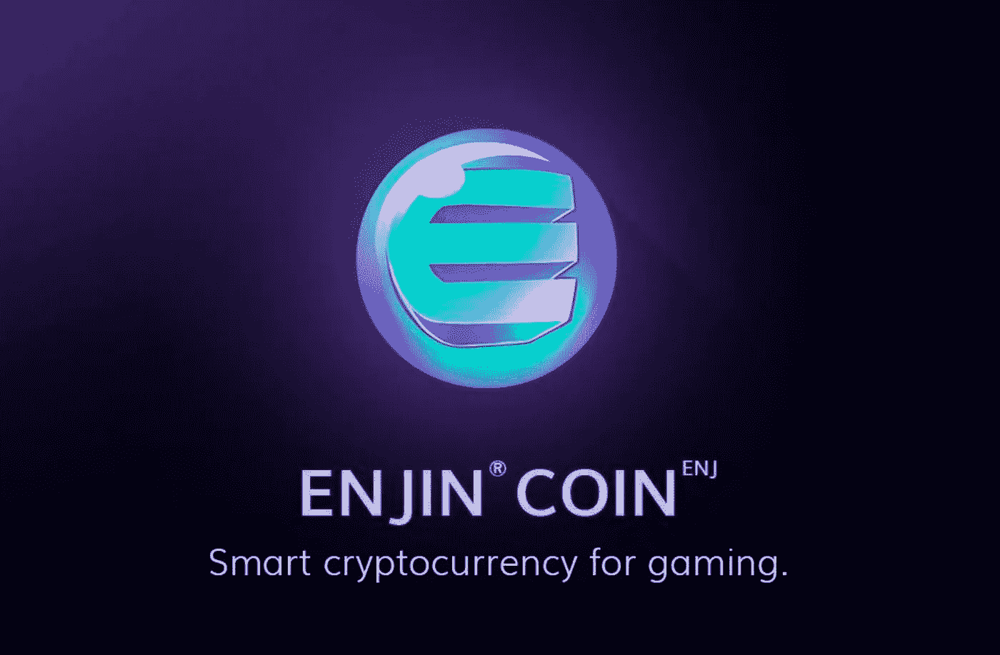
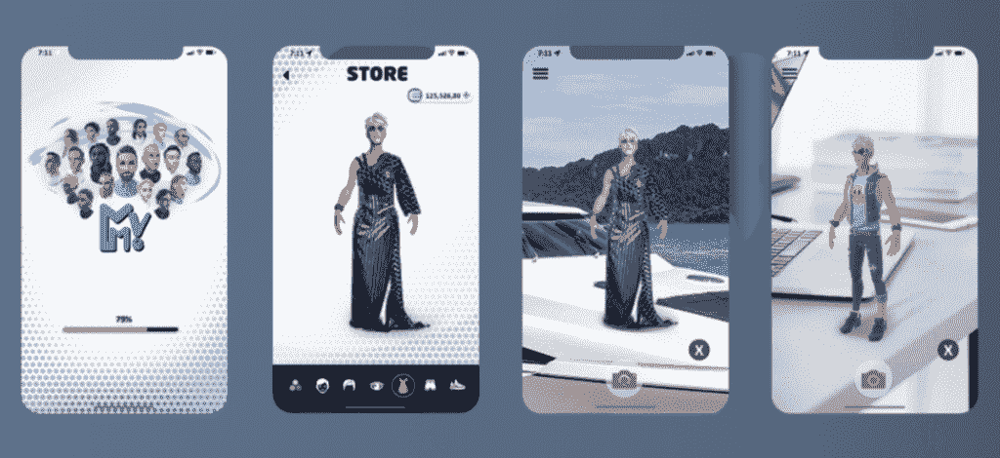

# 金恩和梅塔维塞姆将 NFT 与增强现实融合在一起

> 原文：<https://medium.datadriveninvestor.com/enjin-and-metaverseme-merge-nfts-with-augmented-reality-b428e98110da?source=collection_archive---------13----------------------->

区块链游戏平台金恩和增强现实(AR)平台 Metaverseme 计划在以太坊区块链推出可交易的 AR 模式资产。金恩驱动的不可替代令牌(NFT)将于 2 月 23 日推出，可由用户在 Metaverseme 应用程序中的头像携带。

根据金恩的一份新闻稿，Metaverseme 应用程序将允许用户在现实世界中快速自拍，并创建超现实的化身。AR 模式映射用户的真实世界环境，在这里他们的数字化身可以在穿着他们的 NFT 时装并与之互动时变得栩栩如生。用户可以在 ar 中录制他们穿着 NFT 时装的头像，并通过社交媒体分享视频。

Metaverseme 的创始人马丁·休斯(Martyn Hughes)在声明后的讲话中谈到了区块链技术的重要性和潜力。他指出:

> 用不了多久，区块链就会被公认为所有沉浸式体验的价值互联网。能够将您的资产用于所有您喜爱的游戏和应用程序将彻底改变数字经济。

# 金恩创造新机遇

与此同时，这两个实体在他们的声明中解释说，第一个 NFTs Metaverseme 将采用一个名为 Pluriform 的系列，这是一个限量版的纯数字时尚项目，由金恩、雅达利、Metaverseme 和 Fabricant 之间的持续合作创建。Pluriform NFTs 将在 2 月 28 日之前上市，任何未售出的股票将在销售结束时被烧毁。

金恩的首席执行官马克西姆·布拉戈夫称赞了区块链和 AR 的结合所创造的机会。他表示:

> 很快，你的肖像将会在互联网上传播开来，我们期待着与 Metaverseme 团队合作实现这一目标。"

自从加入金恩以来，Atari 和其他游戏开发商已经将超过 1000 万个金恩代币锁定在高功能的 NFT 中，包括可以在 Metaverseme 中使用的代币。

我在每月的[时事通讯中分享了更多私密的想法，你可以在这里查看](https://mailchi.mp/bf8f8e8ed697/keep-in-touch-with-lukas)。请在评论中告诉我，让我们通过 [Patreon](https://www.patreon.com/lukaswiesflecker) 建立你的秘密世界。在各种社交媒体平台上加入我:

[推特](https://twitter.com/WiesfleckerL) ● [Instagram](https://www.instagram.com/lukaswiesflecker/) ● [帕特里翁](https://www.patreon.com/lukaswiesflecker) ● [脸书](https://www.facebook.com/lukaswiesfleckerr)●[Snapchat](https://www.snapchat.com/add/luggooo)●[LinkedIn](https://www.linkedin.com/in/lukas-wiesflecker-1b11251a5/)