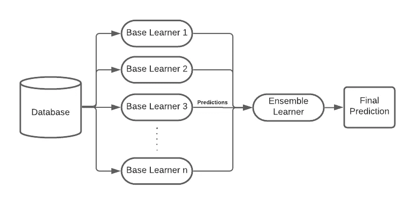
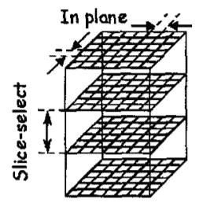
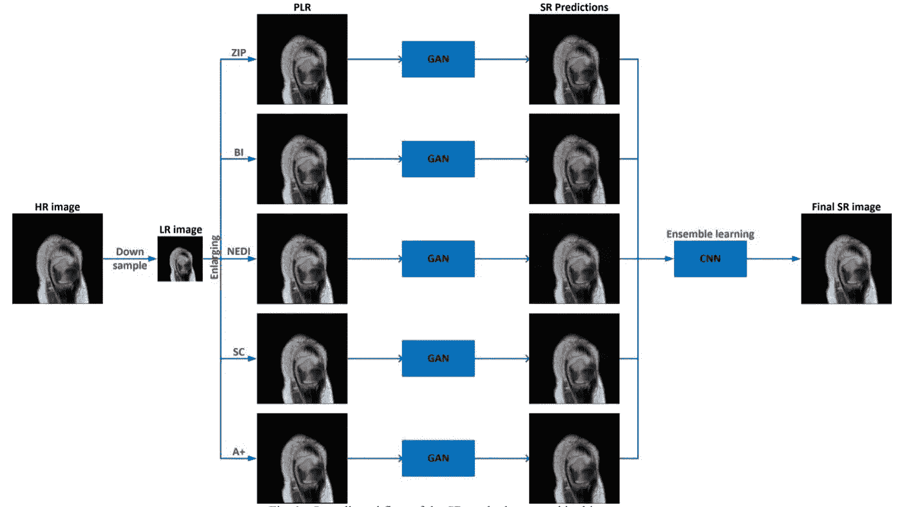
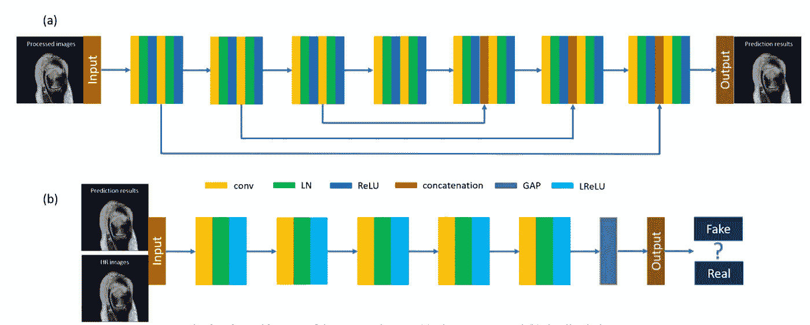
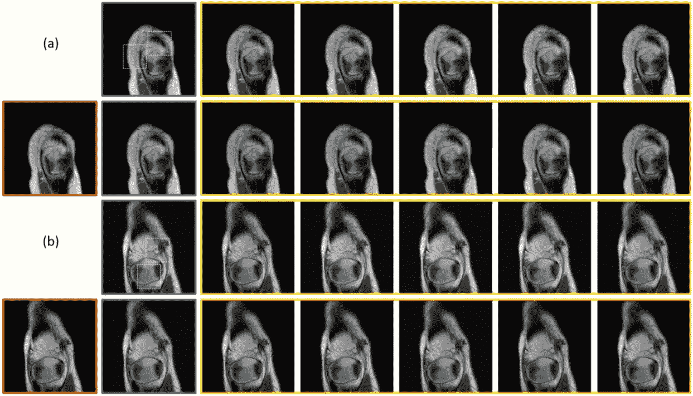
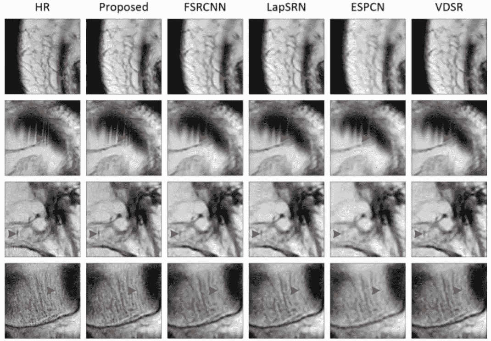
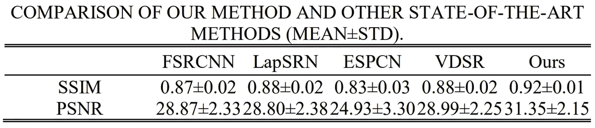

# 基于深度学习的 MRI 超分辨率集成学习

> 原文：<https://medium.datadriveninvestor.com/ensemble-learning-for-deep-learning-based-mri-super-resolution-2daef2491144?source=collection_archive---------23----------------------->

> 在这篇文章中，集成学习的概念及其在深度学习超分辨率中的应用在论文“ [MRI 超分辨率与集成学习和互补先验](https://arxiv.org/ftp/arxiv/papers/1907/1907.03063.pdf)”中作为例子进行了讨论。

## 深度学习网络的集成学习

我们知道深度学习模型是高度非线性的，并且通常对数据集和模型超参数中的噪声敏感。这一事实意味着，每次在特定数据集上训练神经网络时，它可能会给出轻微或高度变化的结果，即深度网络具有高方差。为了减少这种差异并建立一个性能更好的模型，我们可以结合不同较弱模型(基础学习者)的优势，并最终构建一个更强大的模型(元学习者)。这种简单但健壮的技术被称为集成学习。基础学习者可以根据他们接收的训练数据或学习者模型本身的选择而变化。有不同的方法可以用来设计元学习者，它结合了这些基础学习者的成果。

这种方法已经被许多在各种 ML 和 [Kaggle 比赛中获胜的参与者所采用。关于集成学习中不同技术的更多细节可以在这篇](https://mlwave.com/kaggle-ensembling-guide/)[文章](https://towardsdatascience.com/ensemble-methods-bagging-boosting-and-stacking-c9214a10a205)中找到。

A Basic Structure of Ensemble Learning

## 磁共振成像中的超分辨率

磁共振成像在医疗诊断领域发挥着主导作用，因此检索 MRI 扫描中的复杂细节是至关重要的。以高分辨率获取这些扫描消耗大量时间，并且需要巨大的硬件和操作成本。较长的扫描时间还会导致运动伪影，因为人们不能期望患者在整个过程中保持静止(例如:对于毫米级分辨率，20 分钟或更长)。在这种情况下，一个好的[超分辨率](https://medium.com/analytics-vidhya/super-resolution-and-its-recent-advances-in-deep-learning-part-1-c6d927914d32)算法可以以低得多的成本从基本 MRI 扫描仪上扫描的低分辨率(LR)图像生成高分辨率(HR)扫描。

Resolution in slice (Z) direction is usually low compared to the in-plane (XY) direction. Ref: [paper](https://ieeexplore.ieee.org/stamp/stamp.jsp?tp=&arnumber=1029417)

有时，一些医疗诊断程序需要各向同性的空间分辨率。由于直接 3D 采集在 MRI 中不可行，专家通常采集 2D 切片来构建体积。与体积的 XY 平面分辨率相比，这通常会导致 z 方向(切片方向)的分辨率较差。在这种情况下，从两次或更多次 2D 采集重建高分辨率体积的迭代超分辨率算法在切片方向上也检索到更好的纹理。

现在，超分辨率是一个不适定的问题，并且不是一项容易的任务，因为对于特定的低分辨率图像，可能存在许多解决方案(超分辨率图像)。最近的进展发展了自然和医学图像领域中的各种超分辨率模型。虽然已经取得了很大的进展，但我们仍然远远没有开发出一个精确的模型。集成学习帮助我们更接近以超分辨率生成更真实的纹理的目标。在下一节中，我将详细介绍由吕青、单宏明和王戈在他们题为“集成学习和互补先验的 MRI 超分辨率”的论文中提出的一种方法

## 提议的架构

由于超分辨率，估计将 LR 映射到 HR 图像域的函数的过程是一个不明确的问题。作者建议在逼近该函数时使用先验。初始下采样步骤是为下图中的训练创建一个 LR 数据集，而 HR 数据集将作为训练模型时的基础事实。本文在频域而不是图像域中进行下采样过程。

Workflow of the SR methodology proposed in the [paper](https://arxiv.org/ftp/arxiv/papers/1907/1907.03063.pdf)

该架构在开始时采用上采样步骤，以通过采用现有的 SR 模型来生成放大的图像(处理后的 LR 图像——图中的 PLR)。由于这个原因，网络接收到的图像已经具有相当好的质量。此工作流程中使用的五种算法充当了先验的作用，它们是:-

(I)零插值填充(ZIP):最简单的随机共振方法

㈡双三次插值:一种基于插值的算法

㈢新的边缘定向插值(NEDI):一种基于插值的算法

稀疏编码:一种基于字典学习的算法

(v)调整锚定邻域回归(A+):基于字典学习的算法

这五个经处理的 LR 图像数据集具有与期望的 HR 图像的图像尺寸相等的图像尺寸，然后作为输入被发送到相应的五个[生成对抗网络](https://developers.google.com/machine-learning/gan/gan_structure) (GAN)模型。所有的 gan 都具有相同的架构，如下图所示。

Network architecture of the GANs used in the SR methodology

GAN 中的生成器有七个模块，每个模块由卷积层(Conv)、归一化层(LN)和激活层(ReLu)的顺序组合组成。它还具有三个跳跃连接，以实现梯度的流动，并保持 LR 和 HR 图像之间的结构相似性。鉴别器有五个类似顺序组合的块，最后有一个全局平均池层(GAP)。

最后，使用卷积神经网络(CNN)将来自 GAN 的五个预测集合在一起，该网络的架构与 GAN 的生成器的架构相同。这个最终的 CNN 接收一个矩阵，该矩阵是连接五个预测图像矩阵的结果。

 [## 医生管理工作量增加时的深度学习|数据驱动的投资者

### 行政工作量是我们这个时代大多数医生所经历的许多负担之一。医生，尤其是…

www.datadriveninvestor.com](https://www.datadriveninvestor.com/2020/11/27/deep-learning-amid-increased-physician-administrative-workload/) 

## 结果

集成学习利用由每个先验检索的特征，并将它们合并以生成质量失真更小的更好的图像。NYU fastMRI 数据集用于评估该架构的性能。下图显示了五个 gan 的结果和执行集成学习后的最终图像。

Input, intermediate, and output images in the SR workflow in (a) Cases 1 and (b) 2, where processed results are in the yellow boxes, LR images are in the purple boxes, HR images in the green boxes, ensemble learning results in the red boxes, and GAN predictions in the orange boxes. The processed results and GAN predictions from left to right are ZIP, BI, NEDI, SC, and A+.

Comparison of the proposed model with the state-of-art methods

从主图像中截取了几个分区，以便在视觉上将提出的模型与最先进的方法进行比较，如 [FSRCNN](https://arxiv.org/abs/1608.00367) 、 [LapSRN](https://arxiv.org/abs/1710.01992) 、 [ESPCN](https://arxiv.org/abs/1609.05158) 、 [VDSR](https://arxiv.org/abs/1511.04587) 。可以观察到，在某些标记的红点处，所提出的方法生成了更清晰的细节(孔洞和裂缝),其更接近地面真实 HR 图像。

Quantitative metric comparison of the proposed model with the state-of-art methods

在定量上，基于集成学习的模型比其他基于深度学习的基准方法实现了更高的结构相似性(SSIM)和峰值信噪比(PSNR)。

每种 SR 算法都擅长保留图像特征的一些特定方面。在作者选择的算法中，ZIP、BI 和 NEDI 保留了清晰的边缘和平滑的形状，而 SC 和 A+保留了纹理细节。这些互补图像先验来自 PLR (processed-LR)数据集，并最终在集成学习后获得的图像中观察到。

需要注意的另一点是，由于鉴别器间接控制发生器预测，训练 GAN 时的不稳定性会产生不同的伪像和噪声，这与目标函数控制优化问题的通用 CNN 不同。使用这种基于 CNN 的集成学习方法也可以抑制和消除这种伪影，因为数据集的大小被间接地扩大了。

总之，所提出的模型结合了各个网络的能力，并通过抑制伪像和失真来生成具有清晰细节的超分辨率图像。

## 参考资料:

1.  [深度学习神经网络的集成学习方法](https://machinelearningmastery.com/ensemble-methods-for-deep-learning-neural-networks/)
2.  [通过深度学习实现超分辨率核磁共振](https://arxiv.org/ftp/arxiv/papers/1810/1810.06776.pdf)
3.  [磁共振成像中的超分辨率](https://ieeexplore.ieee.org/stamp/stamp.jsp?tp=&arnumber=1029417)
4.  [利用集成学习和互补先验的 MRI 超分辨率](https://arxiv.org/ftp/arxiv/papers/1907/1907.03063.pdf)

**访问专家视图—** [**订阅 DDI 英特尔**](https://datadriveninvestor.com/ddi-intel)