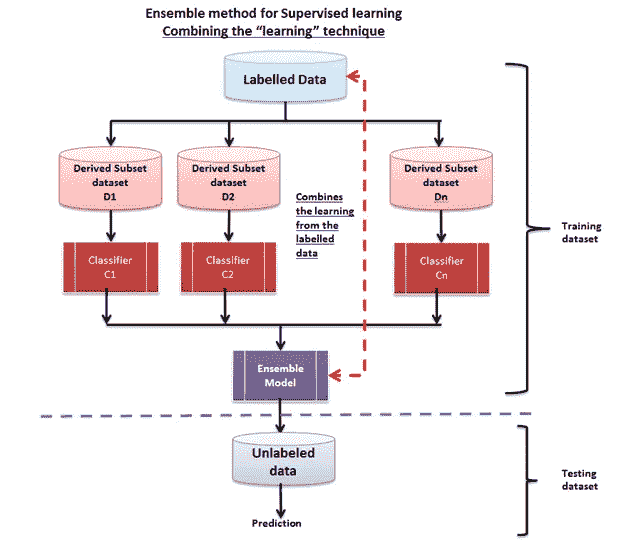

# 简化集成学习

> 原文：<https://medium.datadriveninvestor.com/ensemble-learning-simplified-868a99b6d945?source=collection_archive---------8----------------------->

根据我之前在“[强化学习简化版”](https://medium.com/datadriveninvestor/reinforcement-learning-rl-simplified-87b4aa74b85b)上的博客，我收到了很好的反响，现在我用类比解释了集成学习的基础和算法。请不要忘记分享您的意见和宝贵反馈。

**总体**，一般是指一组事物，通常被视为一个整体，而不是就其价值与个体价值而言。集成遵循分而治之的方法来提高性能。

我们将从介绍著名的群体智慧概念开始理解具体的算法。

# 群体的智慧

当不完美的判断以正确的方式汇总时，会产生集体智慧，从而产生更好的结果。群体的智慧就是这种集体智慧。一般来说，群体这个词通常与非理性和普遍认为存在某种影响联系在一起，这种影响在暴民和邪教的背景下左右着群体的行为。然而，事实是，这不一定总是负面的，并且在使用校对智力时工作得很好。群体智慧的关键概念是，由一群人做出的决定总是比个人做出的决定更稳健、更准确。机器学习方法中的集成学习方法已经有效地利用了这一思想，以在其结果中产生效率和准确性。

 [## 数据科学和软件工程哪个更有前途？数据驱动的投资者

### 大约一个月前，当我坐在咖啡馆里为一个客户开发网站时，我发现了这个女人…

www.datadriveninvestor.com](https://www.datadriveninvestor.com/2019/01/23/which-is-more-promising-data-science-or-software-engineering/) 

群体智慧这个术语是高尔顿在 1906 年发现的。有一次，他参加了一个农贸市场，那里有一个比赛，要猜一头被屠宰和屠宰的公牛的重量。最接近的猜测赢得了总共 800 名参赛者的奖项。他选择收集所有的回复并进行分析。当他取这些猜测的平均值时，他震惊地发现它们与实际值非常接近。这个集体猜测不仅比获奖的选手更好，而且被证明是与牛专家的猜测相比最好的。思想的民主显然是赢家。对于这样一个有用的输出，重要的是每个参赛者都有他/她强有力的信息来源。参赛者提供的独立猜测不应该受到他/她的邻居的猜测的影响，而且，有一个无错误的机制来整合整个组的猜测。所以简而言之，这不是一个容易的过程。另一个重要的方面是，这些猜测优于任何单个专家的猜测。

一些基本的日常例子包括:

*   谷歌搜索结果通常将最受欢迎的页面列在顶部
*   在“谁想成为亿万富翁”这样的游戏中，观众投票被用于参赛者毫不知情的答案。通常，被人群投票最多的答案被收集起来作为正确答案。

群策群力的方法并不能保证结果。以下是使用此方法获得最佳结果的基本标准:

1.  聚合:需要一种简单的方法将个人的反应整合成一个集体的反应或判断。没有这些，集体意见或全面反应的核心目的就会落空。
2.  **独立性**:在人群中，需要有一个纪律来控制一个实体对人群中其他实体的反应。任何影响都会扭曲响应，从而影响准确性。
3.  **去中心化**:个体的反应有其来源，并在有限的知识中茁壮成长。
4.  **意见的多样性:**每个人都有一个与众不同的回应，这一点很重要；这种反应的不寻常还是可以接受的。

> 系综这个词的意思是分组。为了构建集成分类器，我们首先需要从训练数据构建一组分类器，聚合这些分类器做出的预测，并使用该数据预测新记录的类别标签。

# 整体过程

从技术上讲，核心构建模块包括训练集、诱导器和集合生成器。诱导器处理为每个充足的训练数据集定义分类器。集成生成器创建分类器和合并器或聚合器，合并器合并组合器上的响应。有了这些构件和它们之间的关系，我们就有了下面的属性，我们将使用这些属性来对集成方法进行分类。下一节将介绍这些方法:

1.  **组合器的使用**:该属性定义了系综生成器和组合器之间的关系
2.  **分类器之间的依赖关系**:该属性定义了分类器之间的依赖程度
3.  **生成分集:**该属性定义了用于确保组合器分集的程序
4.  **集合的大小**:该属性表示集合中使用的分类器数量
5.  **交叉诱导器**:该属性定义分类器如何利用诱导器。有些情况下，分类器被构建为与一组特定的诱导物一起工作

总之，建筑模型合集首先涉及建筑专家，并让他们提供回应/投票。预期的好处是提高预测性能，并生成一个单一的全局结构。尽管如此，任何产生的中间结果最终都可能难以分析。

让我们全面地看看聚合/组合分类器的性能如何更好地工作。让我们考虑三个错误率为 0.35(ԑ或者准确度为 0.65 的分类器。对于每个分类器，分类器的预测出错的概率是 35%。

这里给出的是表示误差率为 0.35(35%)和准确率为 0.65(65%)的真值表:

# 监督集成方法

在监督学习方法的情况下，输入总是标记的数据。通过学习进行组合的方法包括增强堆栈泛化和规则集成技术。共识组合方法包括 bagging、随机森林和随机决策树技术。下面显示了通过学习进行组合的流程，然后是通过共识进行组合的另一个模型:

为了简单起见，我将在单独的博客中介绍一些技术，如装袋、摇摆、助推技术。

# 无监督集成方法

作为无监督集成学习方法的一部分，基于共识的集成之一是聚类集成。下图描述了基于聚类的集成的工作方式:

对于给定的未标记数据集 D={x1，x2，…，xn}，聚类集成计算一组聚类 C = { C1，C2，…，Ck}，每个聚类将数据映射到一个聚类。形成基于共识的统一集群。下图描述了这一流程:

**注:**这是我的一篇关于机器学习的出版物的更新版本和摘录。