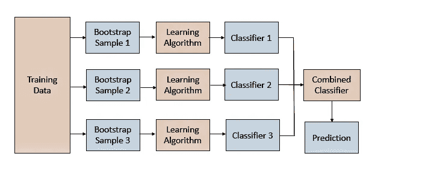
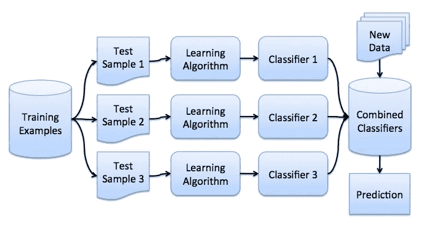
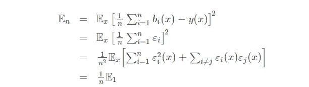
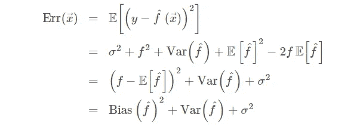
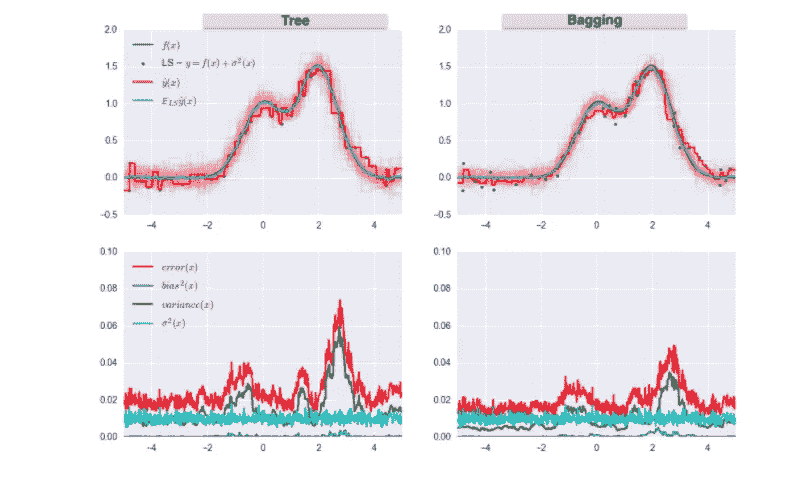

# 集成技术——Bagging(引导聚集)

> 原文：<https://medium.datadriveninvestor.com/ensemble-techniques-bagging-bootstrap-aggregating-c7a7e26bdc13?source=collection_archive---------4----------------------->

Photo by [Fitore F](https://unsplash.com/@daseine?utm_source=medium&utm_medium=referral) on [Unsplash](https://unsplash.com?utm_source=medium&utm_medium=referral)

## 集成机器学习可以主要分类为打包和提升。bagging 技术对回归和统计分类都有用。Bagging 与决策树一起使用。

Bootstrap aggregating 也称为 bagging，是一种机器学习集成元算法，旨在提高统计分类和回归中使用的机器学习算法的稳定性和准确性。它还减少了方差，有助于避免过度拟合。虽然它通常应用于决策树方法，但它可以用于任何类型的方法。Bagging 是模型平均方法的一个特例。

当我们想要减少决策树的方差(过度拟合)时，使用 Bagging (Bootstrap Aggregation)。装袋包括以下步骤:

**引导取样:**

通过替换，可以从随机选择的训练数据中获得几个数据子集。这个数据集合将用于训练决策树。Bagging 将使用训练数据的 bootstrap 采样来构建 n 个决策树。因此，我们最终会得到不同模型的集合。

打包由两部分组成:聚合和引导。Bootstrapping 是一种采样方法，使用替换方法从一组样本中选择一个样本。然后，对选择的样本运行学习算法。

自举技术使用替换采样来使选择过程完全随机。当选择一个没有替换的样本时，变量的后续选择总是依赖于先前的选择，因此使标准非随机。

**聚集:**

来自所有独立模型的输出被聚集成单个预测，作为最终模型的一部分。就回归而言，输出只是预测结果值的平均值。在分类方面，选择具有最高频率输出的类别。

与 boosting 不同，bagging 涉及以并行的方式训练一堆单独的模型。使用 Bootstrap 聚合的优点是，它允许通过对从总体数据的随机样本测量的多个估计值进行平均来减少模型的方差。

模型预测经过聚合，将它们组合成最终预测，以考虑所有可能的结果。可以基于结果的总数或者基于从过程中每个模型的引导中导出的预测的概率来进行聚集。

集成机器学习可以主要分类为打包和提升。bagging 技术对回归和统计分类都有用。Bagging 与决策树一起使用，它在减少方差和提高准确性方面显著提高了模型的稳定性，从而消除了过度拟合的挑战。

*Bagging* (也称为 [Bootstrap aggregation](https://en.wikipedia.org/wiki/Bootstrap_aggregating) )是第一个也是最基本的集成技术之一。它是由[利奥·布雷曼](https://en.wikipedia.org/wiki/Leo_Breiman)在 1994 年提出的。Bagging 基于[自举](https://en.wikipedia.org/wiki/Bootstrapping_%28statistics%29)的统计方法，使得复杂模型的很多统计量的评估变得可行。

自举方法如下。设有一个大小为 N 的样本 X，我们可以从原始样本中随机均匀地抽取 N 个元素，用替换的方法，从原始样本中制作一个新样本。换句话说，我们从原始大小的样本中选择一个随机元素，并这样做 N 次。所有元素被选择的可能性相等，因此每个元素以 1/N 的相等概率被绘制

假设我们一次从一个袋子里抽出一个球。在每一步，所选的球被放回袋中，以便等概率地进行下一次选择，即从相同数量的球 n 中进行选择。请注意，因为我们将球放回袋中，所以新样本中可能会有重复的球。我们姑且称这个新样品为 *X1* 。

通过重复这个过程 M 次，我们创建 M 个*引导样本* X1，… XM。最后，我们有足够数量的样本，可以计算原始分布的各种统计数据。

对于我们的例子，我们将使用熟悉的 telecom_churn 数据集。数据集可以在 Kaggle 网站上找到。让我们将数据可视化，看看这个特征的分布。

看起来忠诚的顾客打电话给客服的次数比那些最终离开的顾客少。现在，估计每组客户服务电话的平均数量可能是个好主意。由于我们的数据集很小，我们不能通过简单地计算原始样本的平均值来得到一个好的估计。应用自举方法会更好。让我们从原始总体中生成 1000 个新的 bootstrap 样本，并生成平均值的区间估计。

关于置信区间的解释，你可以参考[本](https://www.graphpad.com/guides/prism/7/statistics/stat_more_about_confidence_interval.htm?toc=0&printWindow)简明笔记或任何统计学课程。说置信区间包含 95%的值是不正确的。请注意，忠诚客户的时间间隔更窄，这是合理的，因为与那些一直打电话直到厌倦并决定更换提供商的烦躁客户相比，他们打电话的次数更少(0、1 或 2 次)。

# 装袋:

现在你已经掌握了自举的概念，我们可以继续进行*打包*。

假设我们有一个训练集 x。使用自举，我们生成样本 X1，…，Xm。现在，对于每个引导样本，我们训练它自己的分类器 *ai(x)* 。最终分类器将对所有这些单独分类器的输出进行平均。在分类的情况下，这种技术对应于投票:

下图说明了这种算法:

让我们考虑一个使用基本算法 *b1(x)* ，…， *bn(x)* 的回归问题。假设存在为所有输入定义的真实答案 y(x)的理想目标函数，并且定义了分布 p(x)。然后，我们可以将每个回归函数的误差表示如下:

以及均方误差的期望值:

然后，所有回归函数的平均误差将如下所示:

我们假设误差是无偏和不相关的，即:

现在，让我们构建一个新的回归函数，它将对各个函数的值进行平均:

让我们找出它的均方误差:

因此，通过平均个人答案，我们将均方差降低了 n 倍。

从上一课中，让我们回忆一下构成总样本外误差的成分:

当我们在不同数据集上训练模型时，Bagging 通过减少误差的差异来减少分类器的方差。换句话说，套袋可以防止过度拟合。bagging 的效率来自于这样的事实，即由于不同的训练数据，各个模型非常不同，并且它们的误差在投票期间相互抵消。此外，在一些训练 bootstrap 样本中，异常值可能会被忽略。

`scikit-learn`库支持用元估计器`BaggingRegressor`和`BaggingClassifier`打包。您可以使用大多数算法作为基础。

让我们看看 bagging 在实践中是如何工作的，并将其与决策树进行比较。为此，我们将使用来自 [sklearn 文档](http://scikit-learn.org/stable/auto_examples/ensemble/plot_bias_variance.html#sphx-glr-auto-examples-ensemble-plot-bias-variance-py)的一个例子。

决策树的错误:

使用装袋时的错误:

从上图可以看出，装袋的误差方差要低得多。记住，我们已经从理论上证明了这一点。

Bagging 在小数据集上是有效的。即使丢弃一小部分训练数据，也会导致构建本质上不同的基本分类器。如果您有一个大型数据集，您将生成一个小得多的引导样本。

上面的例子不太可能适用于任何实际工作。这是因为我们做了一个强有力的假设，即我们的个体误差是不相关的。通常，这对于现实世界的应用程序来说过于乐观了。当这一假设为假时，误差的减少将不会如此显著。在接下来的讲座中，我们将讨论一些更复杂的集成方法，这些方法可以在现实世界的问题中实现更准确的预测。

## 免责声明:

作者:[维塔利·拉德琴科](https://www.linkedin.com/in/vitaliyradchenk0/)和[尤里·卡什尼茨基](https://yorko.github.io/)。[克里斯蒂娜·布茨科](https://www.linkedin.com/in/christinabutsko/)、[叶戈尔·波鲁斯马克](https://www.linkedin.com/in/egor-polusmak/)、[阿纳斯塔西娅·马诺奇娜](https://www.linkedin.com/in/anastasiamanokhina/)、[安娜·希尔绍娃](http://linkedin.com/in/anna-shirshova-b908458b)、[鲍媛媛](https://www.linkedin.com/in/yuanyuanpao/)翻译编辑。

本材料受[知识共享 CC BY-NC-SA 4.0](https://creativecommons.org/licenses/by-nc-sa/4.0/) 许可的条款和条件约束。允许出于任何非商业目的免费使用。