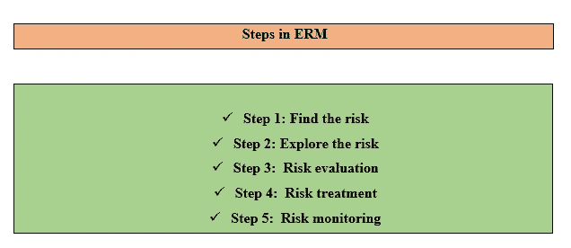
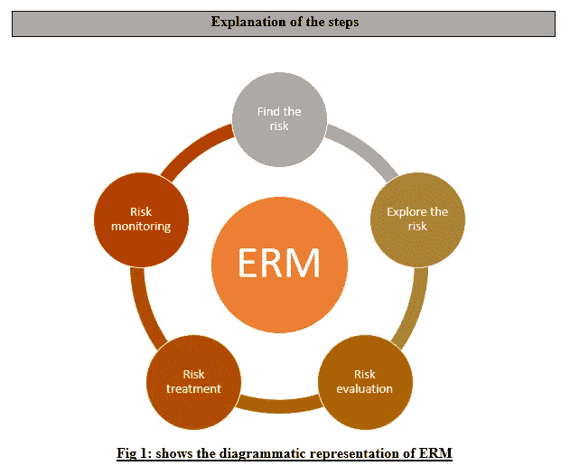

# 企业风险管理—什么是企业风险管理，为什么需要企业风险管理？

> 原文：<https://medium.datadriveninvestor.com/enterprise-risk-management-what-is-it-and-why-you-need-it-fe98f53fd007?source=collection_archive---------12----------------------->

Photo by [Luke Chesser](https://unsplash.com/@lukechesser?utm_source=medium&utm_medium=referral) on [Unsplash](https://unsplash.com?utm_source=medium&utm_medium=referral)

在一个组织中，所能发现的最大风险被称为安全风险。因此，为了解决这个安全风险**，**组织主要遵循一个风险管理程序来减轻这个问题。这个过程被称为风险管理。因为它发生在组织内部，它可以被称为企业风险管理

公司能够识别、优先考虑和评估风险并利用现有资源减少影响的过程可以称为企业风险管理。当企业风险管理付诸实践，那么未来的风险可以避免，新的机会可以确定。为了在组织内部实施风险管理流程，您需要遵循某些步骤

# 第一步:发现风险

这是最重要的一步，因为不同的公司有不同类型的风险。对于一家 IT 公司来说，风险将与安全性有关。对于一家金融公司来说，风险将与找到休眠账户和找出有不良信用评分的人有关。

使用风险管理程序，金融机构可以找到并确定哪些人有资格获得贷款，哪些客户应该避开。

# 第二步:探索风险

这一步是确定风险的影响。例如，一家 IT 公司可能面临员工不满的风险，也可能面临安全风险。

不满的员工可以稍后处理；首先，该公司将探索可能破坏他们的系统和窃取所有机密信息的风险。

# 第三步:风险评估

风险需要分为两部分。一个可以称为高级风险，另一个可以称为低级风险。在高级风险中，它与灾难性损失有关，而低级风险与不需要立即关注的事情有关。

例如，假设一家公司遭受了病毒攻击，窃取了最机密的信息，因此首席风险官需要了解风险，并防止它在未来发生。

这可以被称为高风险。一个存储员工数据的系统被入侵了。这可以在以后处理，可以被称为低级别风险。

# 第四步:风险处理

想象一个场景，一家 IT 公司的客户信息被盗。现在，为了解决这个问题，它需要通知其利益相关者，并召开一些会议来紧急讨论这个问题。

此外，还需要通过电话和邮件将此问题通知他们的上级，如总经理和首席执行官。当每一个利益相关者和董事会讨论这个问题时，一个可能的解决方案就会出现来缓解这个问题。

# 第五步:风险监控

现在必须注意的是，风险不可能完全消除，一些风险总是会存在，这些风险被称为环境风险和市场风险。

借助最新的技术进步，可以控制安全风险。在技术进步的帮助下，企业能够控制风险并保持连续性。

# 包扎

实施了 **ERM、**的企业主已经成功地有效处理了风险，并产生了新的商机。忽视这一点的企业主已经面临彻底关闭。这就是本文推荐您使用 **ERM 软件**监控风险的原因。现有的一些最佳方案有:

1.[托邦](https://www.vicarius.io/?utm_source=SoftwareAdvice)

2.[逻辑门](https://www.logicgate.com/)

3. [Navex Global](https://www.navexglobal.com/en-us)

[4。审计委员会](https://www.auditboard.com/)

5. [ZenGRC](https://www.auditboard.com/)