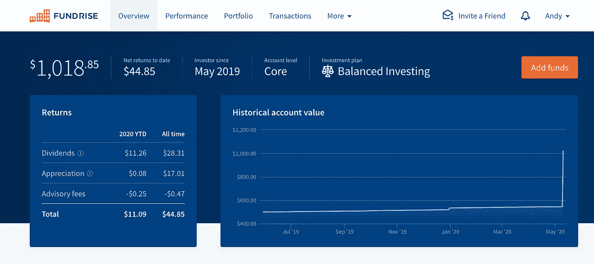
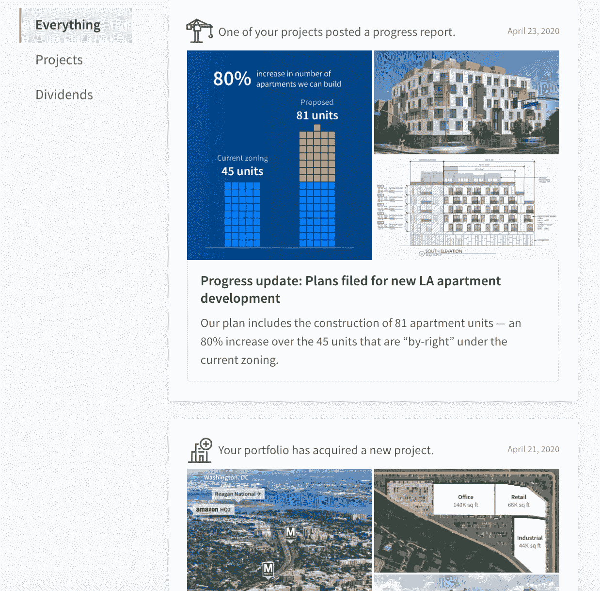
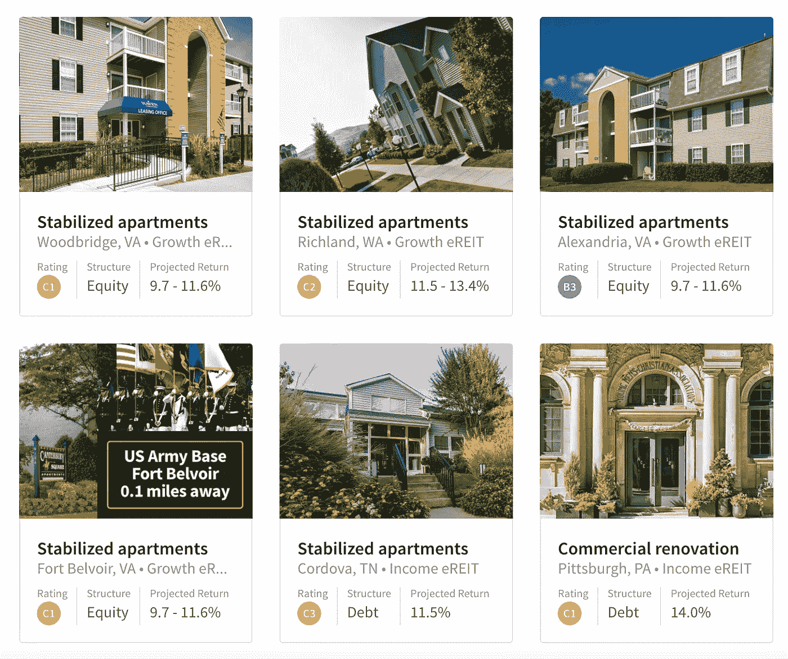
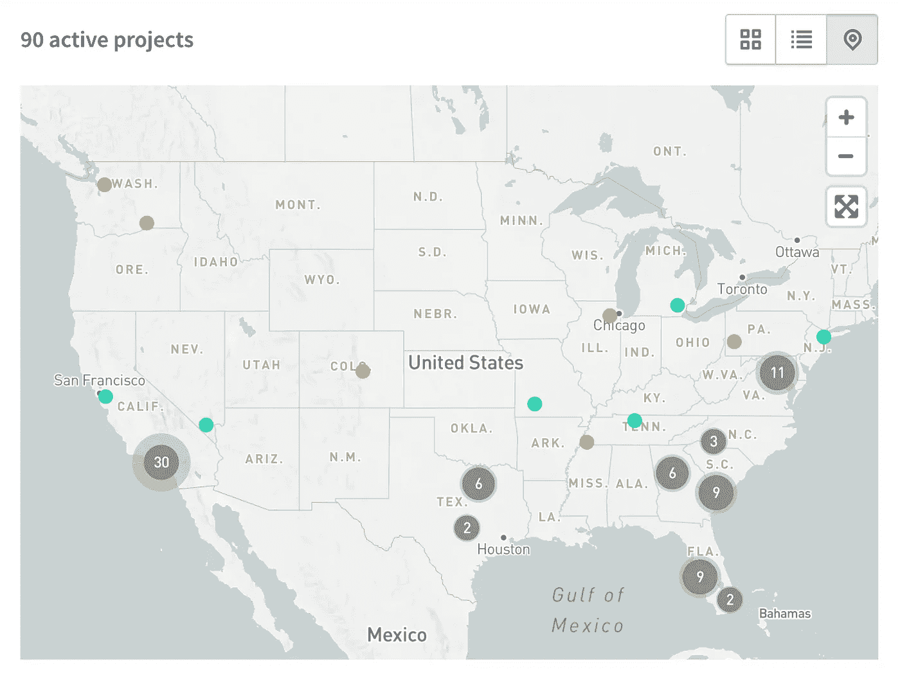
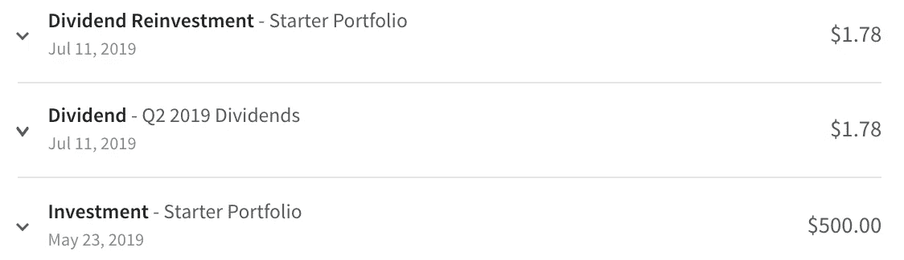

# 企业家:只用 500 美元投资房地产

> 原文：<https://medium.datadriveninvestor.com/entrepreneurs-invest-in-real-estate-with-only-500-e3a1500b7773?source=collection_archive---------8----------------------->

## 把你的钱投资到一个包含几十个房地产项目的投资组合中

Photo by [Francesca Tosolini](https://unsplash.com/@fromitaly?utm_source=unsplash&utm_medium=referral&utm_content=creditCopyText) on [Unsplash](https://unsplash.com/s/photos/real-estate?utm_source=unsplash&utm_medium=referral&utm_content=creditCopyText)

# 简介:

一年多前，我开始用 fund rise 进行投资。在过去的几年里，我已经投资于股票市场，并持续不断地向我的 401k 和 IRA 账户存款。

我认为 Fundrise 是一个很酷的概念——任何人都可以花 500 美元投资房地产。我想分散我的投资策略，所以我做了一个小测试。

一晃一年过去了，我现在是 Fundrise 的狂热支持者。我与 Fundrise 没有任何关系，这是我过去一年使用该平台的第一手经验。

 [## 我 25 岁时的 8 种收入来源

### 千禧年生活:我如何赚钱和存钱

medium.com](https://medium.com/makingofamillionaire/my-8-sources-of-income-at-age-25-d574ff5d14ff) 

# 什么是 Fundrise？

Fundrise 由长期投资者创立，目标是改革房地产行业，是一个在线平台，每天人们都可以通过一次性 500 美元的存款开始房地产投资。

Fundrise 通过一个投资组合来管理你的资金，这个投资组合中有几十个精心挑选的房地产项目。你的报酬有两种方式:股息、收益和增值。

> **股息**是作为现金分配的预计回报部分。**增值**是所赠送股票的净资产值(NAV)变化带来的那部分估计回报。
> 
> —Fundrise.com

该公司网站显示，房地产的历史年回报率在 8.7%至 12.4%之间。当我开始开户时，我预计我的年回报率在 8-12%之间。鉴于全国储蓄账户利率目前平均在 0.09%左右，这是相当可观的。

# 如何入门？

注册过程非常简单。首先，你从下面列出的三个投资选项中挑选。接下来，你链接你的银行账户，审查并签署一些协议，然后嘣…你现在是一个房地产投资者！

初级配置文件推荐给新投资者，而核心和高级配置文件则推荐给更有经验的投资者。

*   初学者(500 美元到 1000 美元):这是给想进入房地产投资的初学者的。你的投资组合将包括 5-10 个房地产项目。当我创建我的 Fundrise 账户时，我用 Starter profile 投资了 500 美元。
*   **核心(1，000 美元到 10，000 美元)**:这是为更有经验的投资者准备的。你的投资组合将包括 40+房地产项目。
*   **高级(＄10000+)**:此为高级投资者。你的投资组合将包括 80+房地产项目。

 [## 买入前 5 只股票:2020 年 5 月

### 高增长股票加入你的投资组合

medium.com](https://medium.com/makingofamillionaire/top-5-stocks-to-buy-may-2020-d150e6f5c07e) 

# **平台:**

在**概览选项卡**中，您会看到您迄今为止的表现。您的帐户余额、迄今为止的净回报和帐户级别(初级、核心或高级)都显示在这里。我最近升级到 Core，因为我对自己的投资表现很满意(更多细节将在后面介绍)。

My Fundrise Platform Overview — Screenshot from Author

摘要下面有一个新闻提要，显示您个人房地产投资、新收购的项目以及从您的房地产投资中获得的股息的表现和更新。

My Fundrise Newsfeed — Screenshot from Author

**性能选项卡**提供年初至今回报、年度回报和总账户价值。这一部分稍微高级一点，很可能是那些对你的房地产投资的财务方面感兴趣的人所喜欢的。

接下来是**文件夹标签，**，这是我最喜欢的部分。

My Fundrise Portfolio — Screenshot from Author

此部分列出了您的每个职位，以及每个活动项目的详细信息。这包括:

*   每处房产的位置
*   至少一张酒店的照片
*   每项财产的预计回报率
*   投资结构:股权还是债务
*   以及 Fundrise 自己的评级，该评级估计每项房地产资产的相对风险调整回报率

在下图中，我在 10 多个州有超过 90 个活跃的房地产项目。

酒店的图片和描述让这种体验变得栩栩如生。我在美国各地都有房地产投资，这仍然让我感到震惊——全都是通过互联网的力量！

My Fundrise Portfolio Map — Screenshot from Author

最后一个标签名为 **Transactions，**计算你投资的股息。Fundrise 显示每个季度从您的房地产投资组合中获得的股息。

Fundrise Transactions Tab — Screenshot from Author

 [## 脸书收购吉菲并引入头像

### 这些新变化对用户、合作伙伴和竞争对手意味着什么？

medium.com](https://medium.com/internet-marketing-service/facebook-buys-giphy-and-introduces-avatars-4163a2bc2bf4) 

# 我的经历和结果:

我在 2019 年 5 月用 Fundrise 创建了我的投资账户。

平台本身非常简单，完全不干涉。开始时，我每隔几周检查一次我的投资组合，但在意识到没有必要后，就减少了。该系统自动管理现有的和新的项目，并将我赚的钱重新投资到我的项目中。

起初，我的投资组合包括大约 10 个房地产项目。接近年底时，我又收购了大约 20 个房地产项目。每当我的投资组合中增加新的资产时，我都会收到电子邮件通知。

现在已经整整一年了，我想分享一下我最初 500 美元投资的变化。

我收到了以下付款:

*   28.31 美元的股息
*   升值 17.01 美元

到目前为止，我的净回报总计 44.85 美元，使我的总投资达到 544.85 美元。

## **整整一年后，我的原始投资增长了 8.97%！**

# 外卖:

Fundrise 真的是未来的房地产投资平台吗？我也这么认为你还能在哪里用仅仅 500 美元开始房地产投资并看到如此巨大的回报？

我真的相信 Fundrise 实现了公司在“使命宣言”中寻求的目标:彻底改变房地产投资。由于进入门槛低，任何人都可以在自己家里舒适地开始从事房地产。

你不需要存一大笔钱。你不需要对房地产购买或投资有深入的了解。你也不必与房地产经纪人、经纪人和其他涉及房地产过程的专业人士打交道。

对于所有层次的投资者来说，Fundrise 是分散投资组合的好方法。这是股票投资的一个很好的选择，因为股票投资的风险要大得多。更不用说，Fundrise 的回报超过了大多数其他投资策略(储蓄账户、债券和 CDs)。

你能赚多少取决于你的房地产项目和市场趋势。Fundrise 最大的好处在于，一旦你建立了账户，这个平台不仅使用简单，而且完全不需要干预。

谁不希望自己的投资以最小的努力每年增长 8-12%呢？

注意:我与 Fundrise 没有任何关系，也没有为我的评论付费。如果你使用我的链接[这里](http://fundrise.com/r/dj0jrq)，你可以得到你的咨询费免除。

 [## 为什么媒体作家需要营销

### 在你的媒体内容上增加读者的营销策略

medium.com](https://medium.com/internet-marketing-service/why-new-medium-writers-need-marketing-13aec9536912) 

如果你喜欢阅读这样的内容，不要忘记鼓掌或留下回应！你也可以今天[**加入我的邮箱列表**](https://docs.google.com/forms/u/1/d/e/1FAIpQLSezNt4o2S_v52T-kytvIsQgEuMi5CJpKSrOsIVP1lUQlqPKWw/viewform) **。**

感谢阅读！