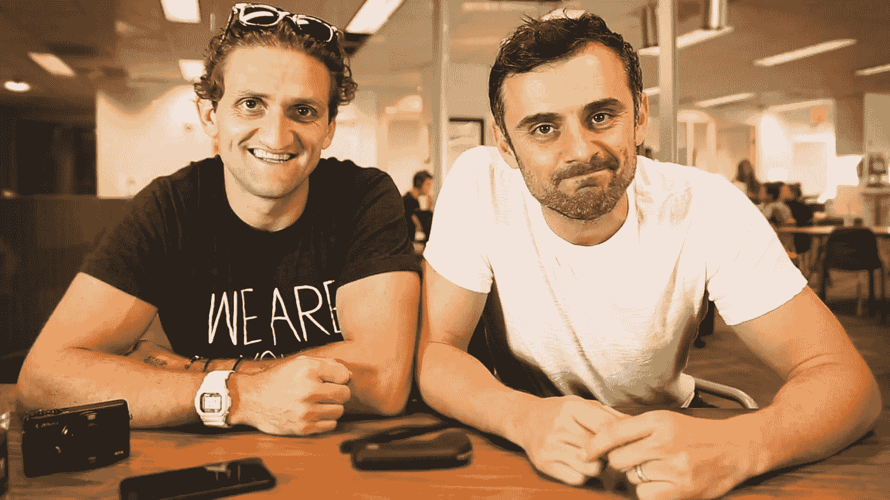

# 环境:概述如何把自己放在合适的环境中可以帮助你成长

> 原文：<https://medium.datadriveninvestor.com/environments-an-overview-on-how-putting-yourself-in-the-right-environment-can-help-you-grow-789fe1ac48c4?source=collection_archive---------10----------------------->

Through cool collaborations, you have thiis!

你听说过“你只得到你所投入的东西”这句话吗？这句话是我想说的要点。在经历了五个月的部署后，我可以说，让自己置身于最好的环境中既有好处也有坏处。在大学期间，我加入了学校提供的几乎每一个俱乐部，参加了我能参加的任何活动。在不同的环境中，我交到了超乎想象的朋友，学到了很多东西。

**做自己觉得舒服的事情并不可怕，但是还有更多，我的朋友们！**

另一方面，自从部署开始以来，我变得更加封闭了。我发现自己和几个月来一直很亲近的人在一起，只和完全陌生的人出去过几次。有时候，我会和陌生人打招呼，但大多数时候我会保持沉默，这不是我的典型作风。我接触的主要人群是超级粉碎兄弟团队，他们每周二都会举办由 20 人或更多人组成的锦标赛。你也可以看到我和健身队一起玩水。这两个都是很棒的社区，可以成为其中的一部分，但我一直在举办像拉丁之夜、嘻哈之夜、卡拉 ok 之夜、柔术之夜和纸牌游戏之夜这样的活动，这里有很多房地产在部署，以拓展我的视野，我只需要迈出这一步！

*如果你发现自己在努力尝试某事，我建议你在说不之前至少尝试一次。*

**后悔。那是不行的。**

我不想有任何遗憾，所以从现在开始，我会把自己放在那里，至少尝试一次每种环境，看看什么点击。有很多方法可以让你融入当地社区！从网络开始，你可以在脸书找到大量的内部社区。此外，去任何健身房都会让你接触到一些可能激发你兴趣的社区和活动。你是一个年轻的企业家，需要一些快钱吗？尝试使用 NextDoor，寻找可能需要帮助完成一些奇怪任务的人！这就是我如何更接近家乡的社区。让我告诉你，帮忙的感觉真好！

**你的时间就是你的时间。用心花掉它。**

我分享这些的目的不是要把你变成一个“应声虫”或“应声虫”。相反，目的是说服你尝试新的团体和活动！找出你喜欢什么和不喜欢什么的最好方法是尽你所能去尝试。请让我知道你的旅程进展如何！

> 记住…“你可能犯的最大的错误是害怕犯错误”。

insta gram:@乔丹。门迪奥拉

YouTube:乔丹·门迪奥拉