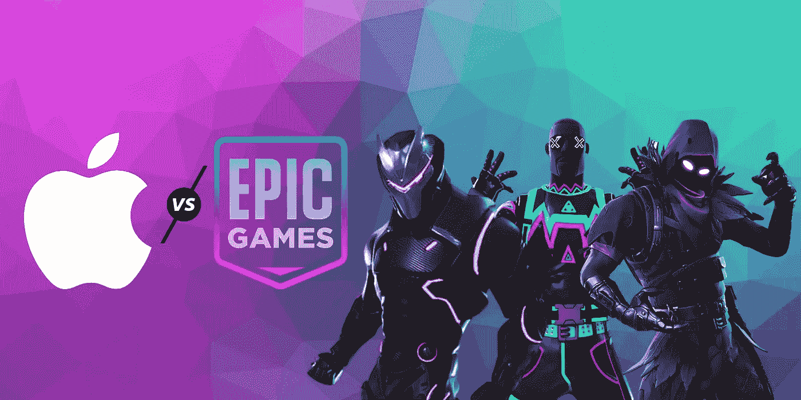

# 史诗游戏与重量级苹果公司的法律战

> 原文：<https://medium.datadriveninvestor.com/epic-games-in-legal-warfare-with-heavyweight-apple-f2715267fe98?source=collection_archive---------26----------------------->

## 史诗游戏 vs 苹果:为什么苹果可能赢得这场法律冲突，但却输掉了这场战争

Image designed by [Manvendra Singh](https://www.instagram.com/_.manvendrasingh/) on [Canva.com](https://www.canva.com/\)

最近几个月，苹果面临着开发者和监管者对其应用商店规则和监管规定越来越多的审查。其中一个批评者是堡垒之夜游戏公司的创始人 Epic Games。

## 这一切是如何开始的？

Epic Games 曾多次将 App Store 称为垄断。他们为什么不会？苹果向世界各地成千上万的应用程序开发者出售你和所有其他苹果设备所有者的访问权限。

你们中的大多数人会认为苹果正在努力营销开发者的应用和游戏是一件好事。但是有个问题。

苹果要求的只是应用开发者从销售给苹果客户的收入中获得 30%的收入。*我打赌你没想到会这样！*为什么一个应用开发者会选择放弃自己 30%的收入？

因为苹果公司设计其产品，只有通过其应用商店下载应用程序，应用程序才能下载到其设备上。

8 月 13 日，Epic Games 在应用中为其游戏内货币 V-Bucks 引入了直接支付选项，这违反了苹果应用商店的规则和规定。

 [## 吸引我还是激怒我:游戏化将主宰世界|数据驱动的投资者

### 不要只想着游戏。想想我们整个生活世界的游戏化。网飞已经认为游戏是一个更大的…

www.datadriveninvestor.com](https://www.datadriveninvestor.com/2020/10/01/engage-me-or-enrage-me-gamification-will-run-the-world/) 

显而易见的事情发生了。苹果将堡垒之夜从应用商店中移除。

Epic Games 迅速对苹果提起诉讼，指控该公司的反竞争行为，这似乎是一项战略举措。

Epic Games 是孤军奋战吗？

是也不是。Epic 是少数几家愿意在法庭上花钱与苹果和谷歌这样的巨头对抗的公司之一。不要以为这样就结束了。Epic 在应用程序社区拥有广泛的支持。

这场法律战吸引了游戏行业和数百万应用开发者的注意力，无论发生什么，他们的业务都可能发生变化。

两家公司在联邦法院就是否恢复苹果应用商店的流行游戏展开了争论。我们只能说*堡垒之夜*不会很快回到应用商店。

## 苹果面临的风险是什么？

对苹果来说，利害攸关的是应用程序如何在其所有移动设备上分发和货币化。特别是苹果，已经批准苹果的应用商店是 iPhone 应用开发者的唯一分销平台。

除了向应用开发者收取 30%的收入，苹果还要求应用开发者遵守色情、鼓励吸毒或真实描绘死亡和暴力等政策。

App Store 的政策也几乎一直是苹果争议的焦点。Epic 并不是唯一不同意苹果的开发者。

十几家公司，包括音乐服务 Spotify 和约会应用程序制造商 Match Group，与 Epic 一起成立了一个名为应用程序公平联盟的组织，以对抗苹果的规则。

## 苹果大战

Epic 不仅仅是在法庭上与苹果对抗。它还设计了一个公关活动，让公众了解这场斗争。

同一天，堡垒之夜被 App Store 除名，在 Epic 起诉后，该公司发布了一则模仿苹果雷德利·斯科特超级碗广告的广告。

“Epic Games 挑战了应用商店的垄断地位。作为报复，苹果正在阻止堡垒之夜的 10 亿台设备，”Epic 在 48 秒视频的结尾写道。“加入战斗，阻止 2020 年成为‘1984’”

在视频发布后的一个月里，它已经被观看了 600 多万次。

不管怎样…

与此同时，苹果和 Epic 之间的第一场法庭冲突为两家公司赢得了法律上的胜利。

苹果可能会败诉，并可能开创一个先例，颠覆整个科技行业所有应用商店的工作方式，这种风险可能会促使该公司达成和解。

Epic 首席执行官蒂姆·斯维尼表示:“苹果应该拒绝或至少改变其分销政策，因为这样做将捍卫创作者开发应用程序和直接与客户做生意的权利。”。

我希望我能够向你解释苹果和 Epic Games 之间的僵局，以及为什么苹果应该重新考虑它的发行政策。

这篇文章中的观点是我对这一僵局的观点，请随意在下面评论你的观点，因为我很想知道。出于任何你认为对你重要的目的，随时给我发电子邮件。在那之前，

和平

2020 年 10 月

## 访问专家视图— [订阅 DDI 英特尔](https://datadriveninvestor.com/ddi-intel)