# EPL 梦幻 GW14 回顾和 GW15–16 算法精选

> 原文：<https://medium.datadriveninvestor.com/epl-fantasy-gw14-recap-and-gw15-16-algo-picks-f9fa7f1bce53?source=collection_archive---------2----------------------->

## 我们的金钱球方法到幻想的 EPL(队 _id: 2122122)

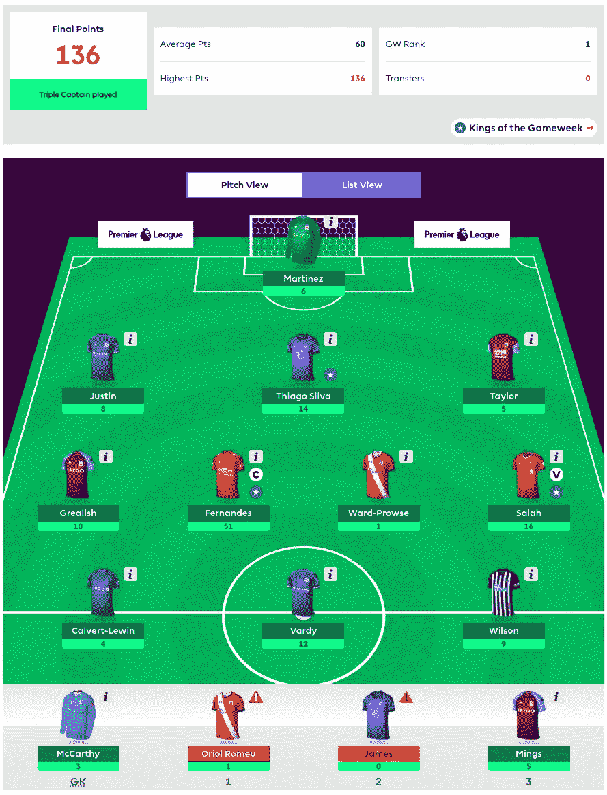

Top Team GW14

> **注意:**由于在短时间内有太多的游戏周即将到来，本博客将努力集中于挑选对 2-3 场游戏有利的**，因为我们很可能没有时间在假期期间的每个游戏周之间发布新的博客。**

如果这是你第一次登陆我们的幻想 EPL 博客，你可能想看看我的媒体档案中的一些我们最初的 EPL 博客，以熟悉这个项目是如何开始的，以及随着时间的推移我们所做的改进。

# 2014 年 FPL 队排名前 100

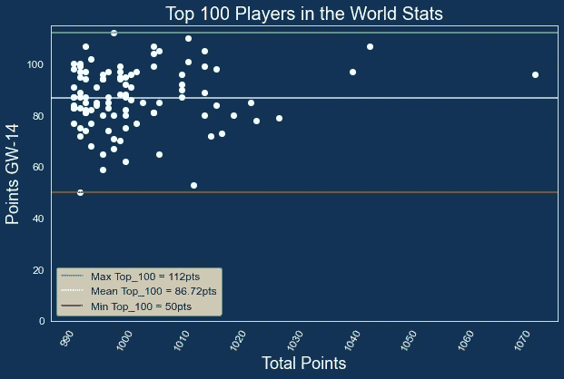

排名前 100 的选手又经历了一个非常强劲的一周，平均得分约为 86 分**。**仍然有很多顶级玩家得分在 50-75 分之间，所以如果你得分在这个范围内，你会感觉很好。幸运的是，**我们在两支队伍**中的得分高于顶级球员**的 AVG，分别为 93 分和 108 分，**所以对我们来说也是相当强劲的一周**。**

# 前 100 名最佳守门员

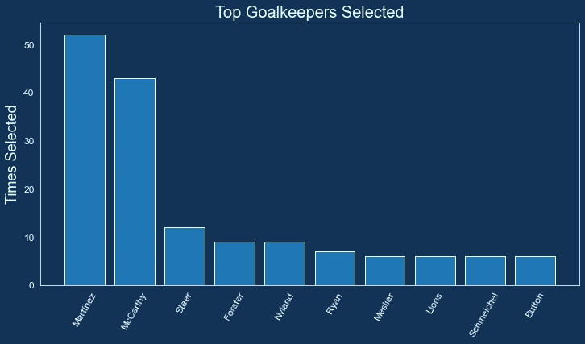

# 前 100 名中最受欢迎的捍卫者

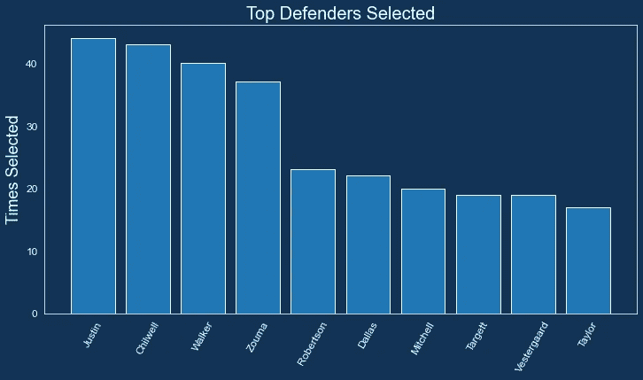

# 前 100 名最佳中场球员

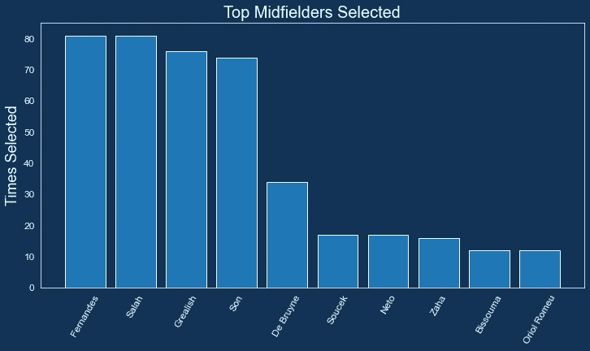

# 前 100 名中入选最多的前锋

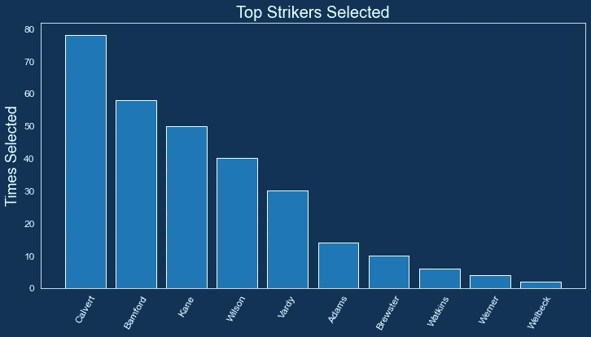

我们使用这些数据创建了下面的团队，它是由前 100 名中最受欢迎的球员组成的:

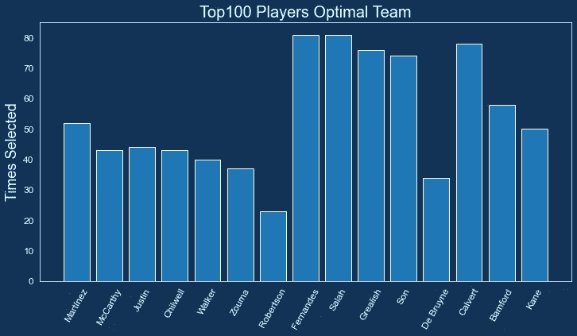

# 100 强中最受欢迎的团队

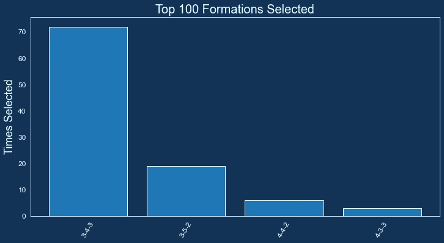

这些数据很有意义，因为大多数顶级球员都试图利用 3-4-3 阵型中的进攻型中场和前锋。

# GW14 团队绩效总结和总体统计

我们所有球队的得分都远高于平均水平，也高于世界前 100 名球员的平均水平，所以总体来说我们这一周表现不错。我们在船长的选择上做得很好，我们的算法推荐了两个人——萨拉赫和布鲁诺。唯一令人失望的是麦克斯·基尔曼为 WOL 效力，这使得贾斯汀无法获得+8 分。

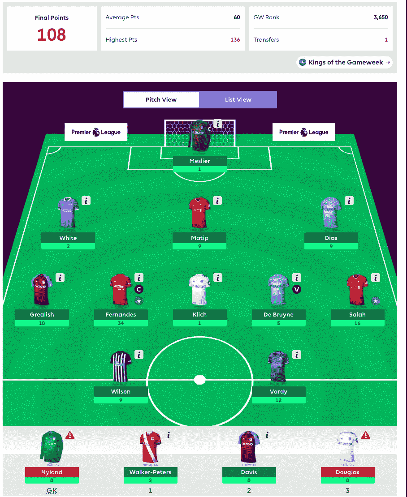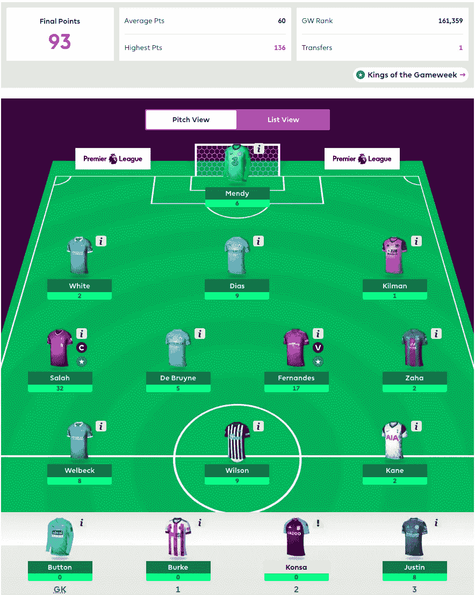

我们还参加了 FanTeam 版的 FPL，在那里我们的两支车队又经历了一个强劲的一周。

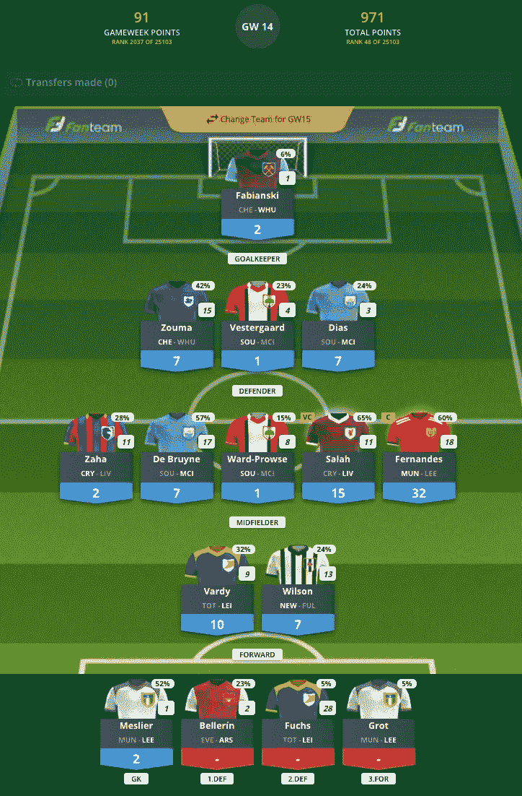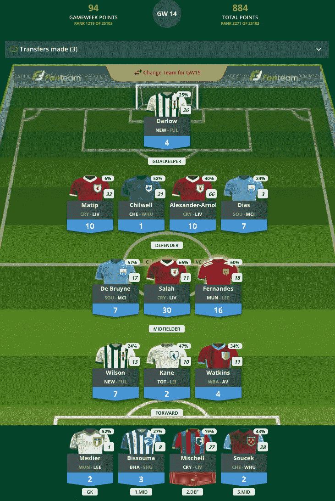

# 为我们的 GW15 精选提供有用的数据

由于我们今年在算法中加入了很多新的统计数据，随着时间的推移，这个博客将会有更多的统计数据和图表，更少的文字。让我们从下面三个比赛周的比赛难度等级(FDR)开始:

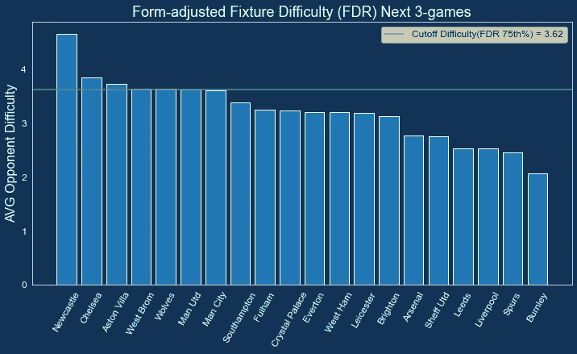

看起来像**新，车，，WBA，，MUN 和 MCI** 有一些艰难的比赛即将到来，所以我们的算法不建议长期投资这些球队的球员。BUR，TOT，LIV，LEE，ARS 和 LEI 在接下来的三周内似乎有更轻松的日程，所以我们的算法将有利于这些球队的球员。

# 博彩赔率

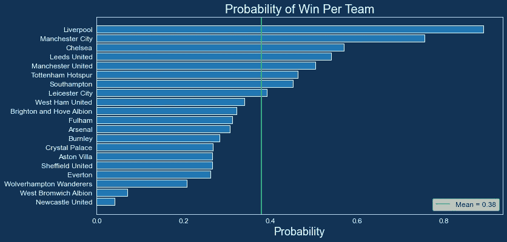

我们将尝试积累来自 ***队的有超过 50 %机会赢得*** 的玩家，例如**丽芙、MCI、CHE、LEE、MUN、TOT 和 SOU。**尽量不要有太多来自 **NEW，WBA，，EVE，舒，，CRY，EVE 的防守球员。**

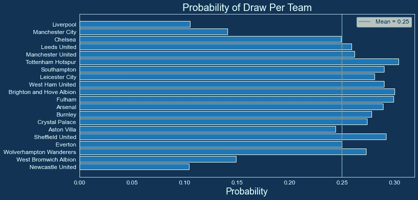

以 ***较高概率抽签*** 的队伍，尤其是当比赛是 ***结合高赔率为 2.5 以下的*** 时，可能会对选择*防守球员有利，因为如果比赛以 0:0 结束，那将会产生大量的加分。结合 下方的 ***下/上图，我们可以识别出以下 ***概率较高的至少一场不失球的比赛——WHU-BHA、WOL-托特、FUL-SOU、SHU-EVE。*******

*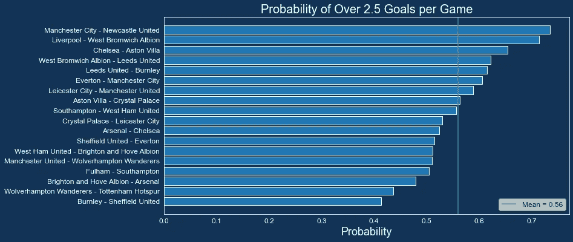*

*相反，我们可能希望有更多的 ***攻击玩家*** 来自 ***高赔率超过 2.5*** 的游戏，如 **LIV-WBA、MCI-NEW、LEE-BUR、LEI-MUN 或 AVL-CRY。***

* [## 一瞬间学会数据科学！？数据驱动的投资者

### 在我之前的职业生涯中，我是一名训练有素的古典钢琴家。还记得那些声称你可以…

www.datadriveninvestor.com](https://www.datadriveninvestor.com/2020/07/23/learn-data-science-in-a-flash/) 

# 裁判统计

从下面的统计数据来看，在比赛中出现点球的几率更高:**AVL-克雷，阿尔-切，舒-伊芙，和雷门**，所以我们建议**在这些球队中的一些球队中配备点球手**。看起来，像游戏 **WHA-BHA，LIV-WBA 和 SHU-EVE 有裁判喜欢给很多卡**，所以期待从黄/红牌中失去一些分数。

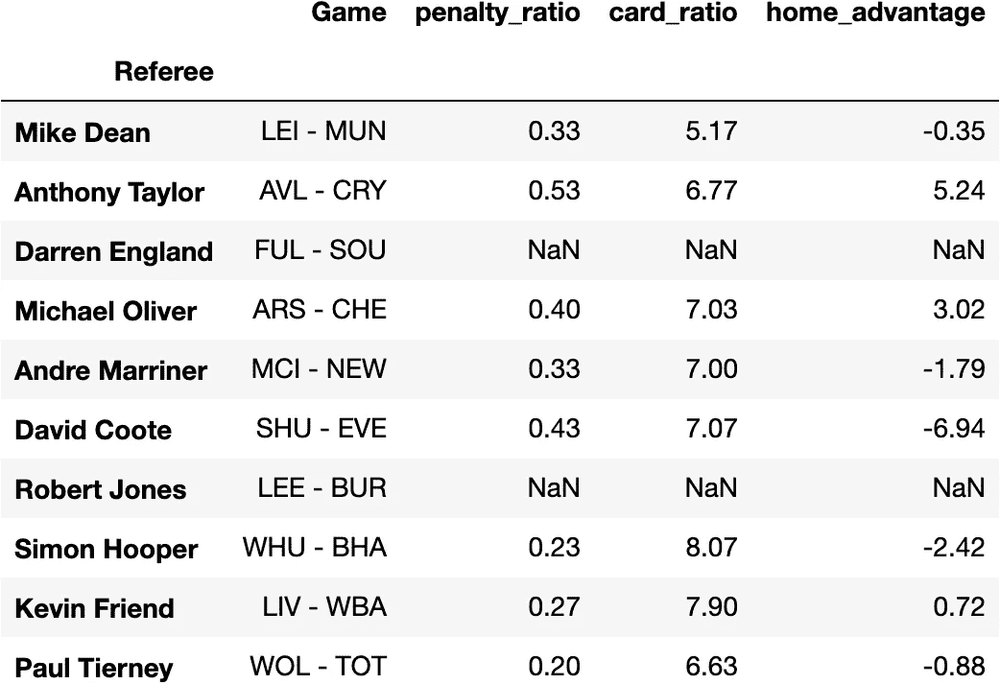

# 预计首发阵容

在我们运行最终的球队选择器之前，让我们考虑一下每支球队的预计首发 11 人以及可疑/受伤的球员。

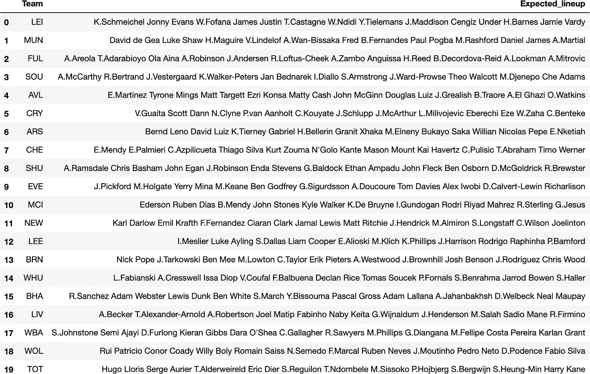

# 最新受伤情况

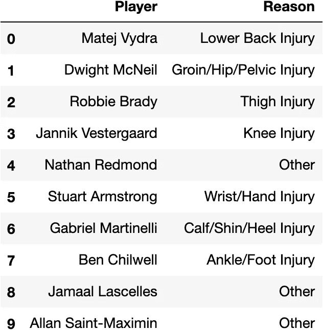

# 团队累积投资回报统计

这张表可以揭示哪些**球队总体上被认为是好的投资，哪些球队有很多定价过高、表现不佳的球员**。球队按平均每名球员得分排序，所以毫不奇怪的是，、、车、苏、托、李和丽芙是排名最靠前的球队，因为他们的球员价格已经超出了他们的预期。一些价格更高、表现不佳的球员可以在 **FUL、NEW、SHU、WBA、和 ARS 中找到，**所以从这些球队中挑选球员是一个很好的主意。

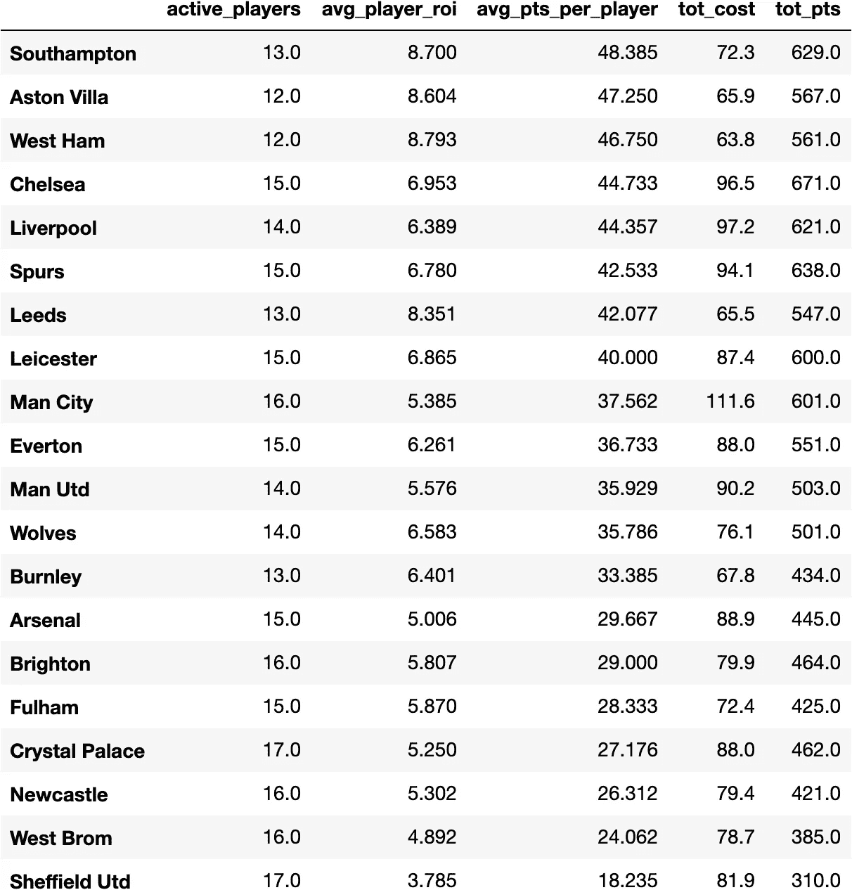

# 防守与进攻团队统计

到目前为止，拥有来自 LIV、、CHE、MUN、TOT、LEI、SOU 和 EVE 的进攻球员似乎是一项不错的投资。

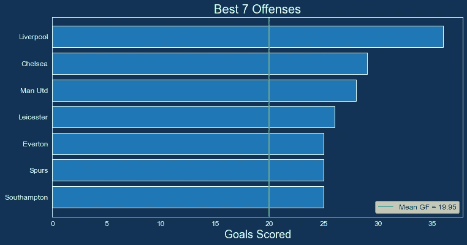

虽然有太多来自的进攻球员，但舒、WBA、ARS、FUL、和的球员似乎是一个糟糕的投资，除非你有一个在这些球队中进球最多的球员。

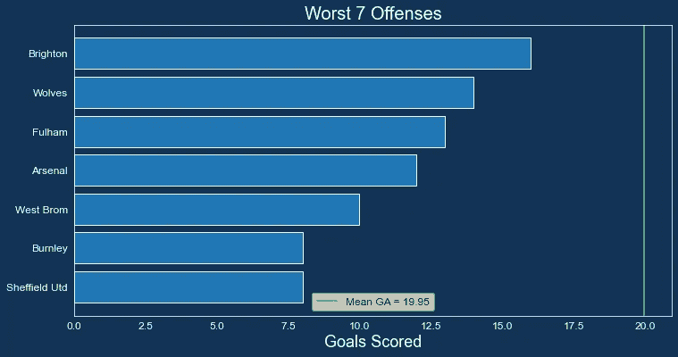

拥有来自 TOT，MCI，CHE，，ARS，和雷的防守球员似乎是一项不错的投资。

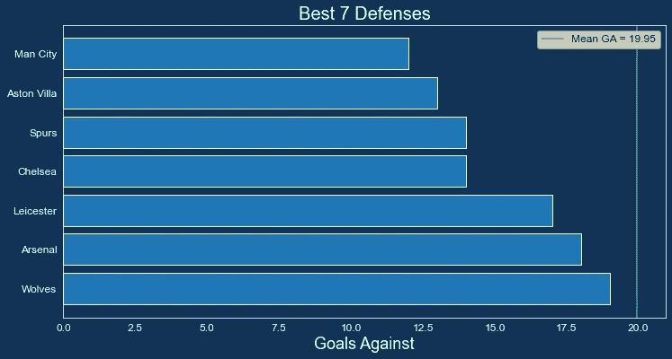

而拥有来自 WBA 的防守球员，FUL，LEE，SHU，CRY，，EVE 似乎是一个糟糕的投资。

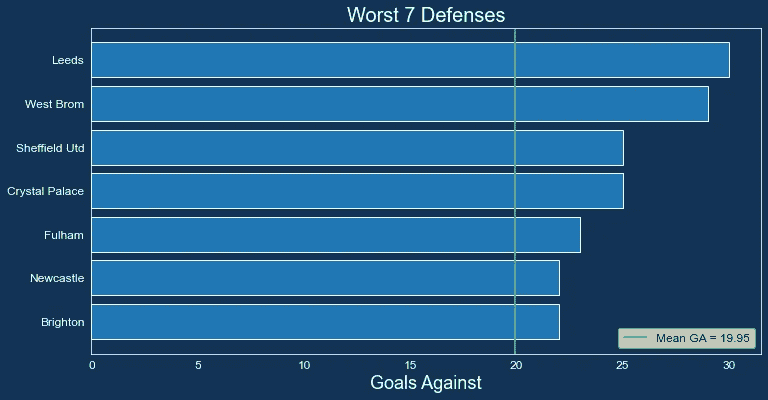

# 推荐人队长

我们的方法采用了即将到来的比赛的预测得分、球员罚点球、角球或任意球的概率、球员在过去 4 个赛季中的空中威胁系数、他们的球队打进 2 个或更多球的可能性，并以标准化的方式将所有这些混合成一个**最终队长选择系数**。然后，根据球员的下一个**对手调整后的 FDR** 和本赛季防守强度的标准化得分**，将系数**减去对手抗性得分**。熊猫 DF 看起来像下面的例子:**

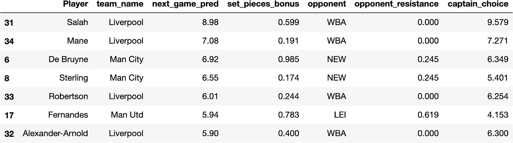

基于这个公式，这里列出了这个 GW 的 15 个推荐队长。那里有很多好的选择，所以无论如何都不是一个容易的选择。我们的推荐人认为你应该把**萨拉赫、马内、KDB、TAA 或罗博**作为你的前五名选择*。*

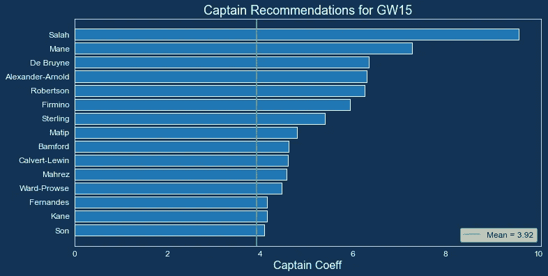

# 预测模型(球员统计)

现在是今年改进算法的皇冠上的宝石——预测球员统计数据的时候了。在我们将所有的 FDR、赌注系数、裁判首发、预计阵容和伤病分层后，有两个主要指标*我们在为下一个 n-gameweeks 团队选择调整我们的团队优化器时会考虑到— ***预测总积分和期望值(ROI)。*** 下面是每个指标的统计数据，也按职位细分。*

# *预计总积分—前 25 名玩家*

*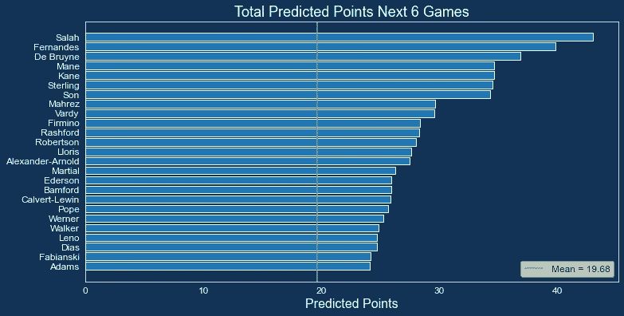*

# *预测积分——顶级守门员*

*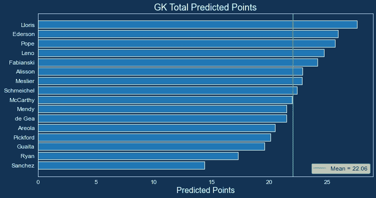*

# *投射点数—顶级防守者*

*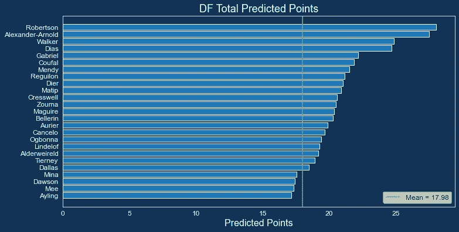*

# *预测得分——顶级中场*

*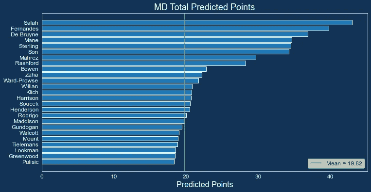*

# *预测分数——顶级前锋*

*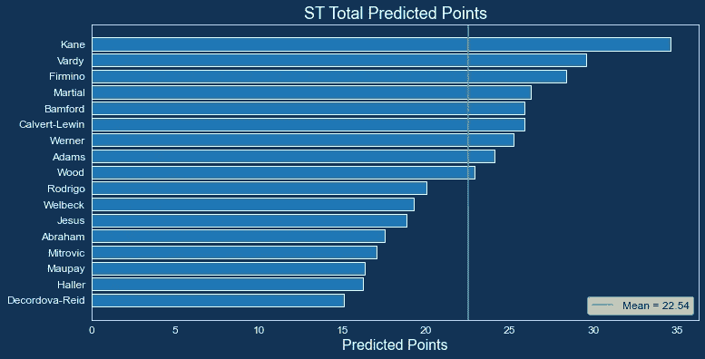*

*正如你所看到的，每个位置都有大量选项可供我们选择，因此我们将把上面的许多统计数据插入 Python 中的 ***优化函数，该函数将 ***输出具有最高预期总积分*** 的团队，给定我们的预算约束和进入我们决策过程的其他指标。在团队选择器代码生效之前应用的一些初步过滤器包括:****

1.  ***排除受伤或停赛的球员***
2.  ***排除高 FDR 队伍中的玩家***
3.  ***排除 GW1** 中没有赛程的队伍中的球员*
4.  ***同一团队不能有超过 3 名玩家***
5.  ***总共必须有 15 名球员(GK=2，DF=5，MD=5，ST=3)***

# *优化最常用信息的预算*

*上周前 100 名选手最常用的阵型是 3-4-3，所以我们将展示一个针对这种阵型的优化团队。正如你在下面看到的，模型首先查看参数，告诉它是否应该向 15 名球员的*全队优化，或者向拥有 ***11 名关键球员和 4 名廉价替补*** 的特定阵型优化。对于填充符，它首先查看 ***首选地层*** ，并使用那个 ***来决定每个位置*** 需要多少个填充符。然后，模型从我们的初始预算中减去花费在 4 个填充者上的总金额，并将剩余的预算花费在关键的 11 个参与者上， ***给出优化函数和模型约束*** 。**

## ****示例 1:向最大期望点数优化****

**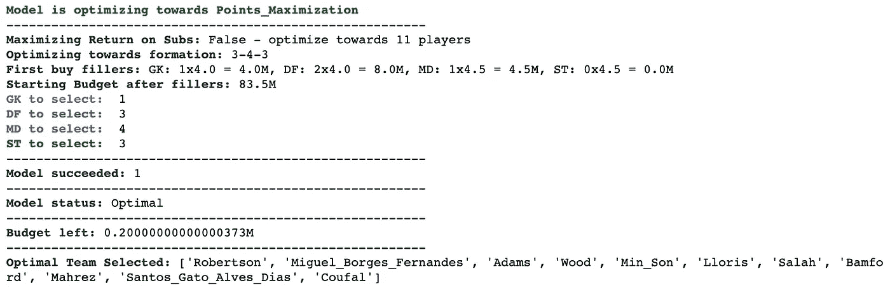****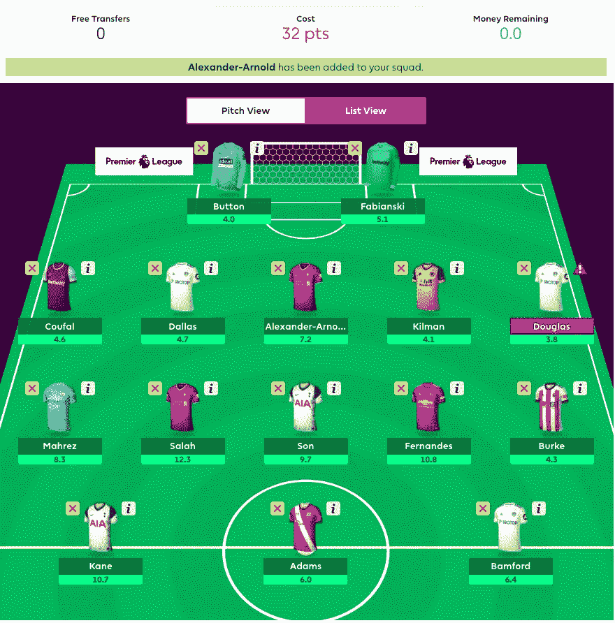**

## ****示例 2:针对所有 15 名玩家的最大值进行优化****

**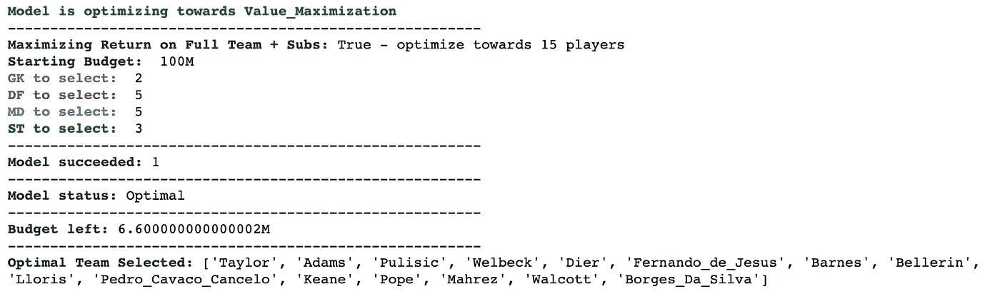****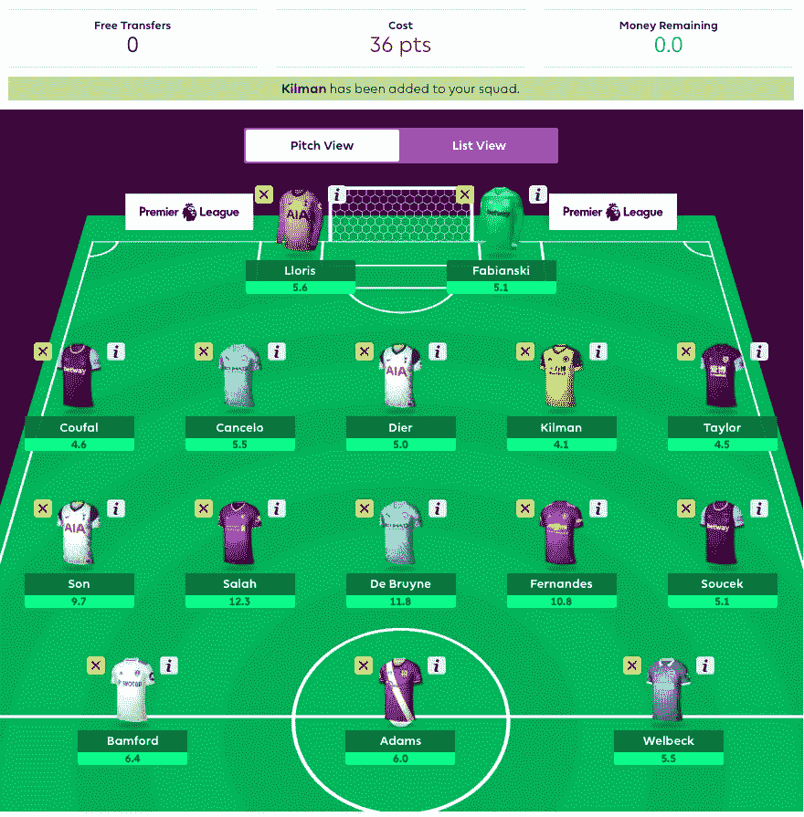**

**这支球队看起来一点也不差，有 15 名稳定的常规球员，有潜力得到+6 分，这在 COVID +受伤的情况下很有用。**

# **我们的 GW12 团队**

**我们将一直使用上周得分最高的球队，并尝试最多进行 1-2 次转会。由于我们在周三发布这个博客，并且有一些周中的比赛，我们将等到周五进行转移，那时大多数伤病和首发阵容的消息应该都可以得到。下面是我们考虑的 3-4-3 阵型的一个选项，有两个替补——班福德换威尔逊，内科·威廉姆斯换道格拉斯，为利兹球员腾出一个位置。**

**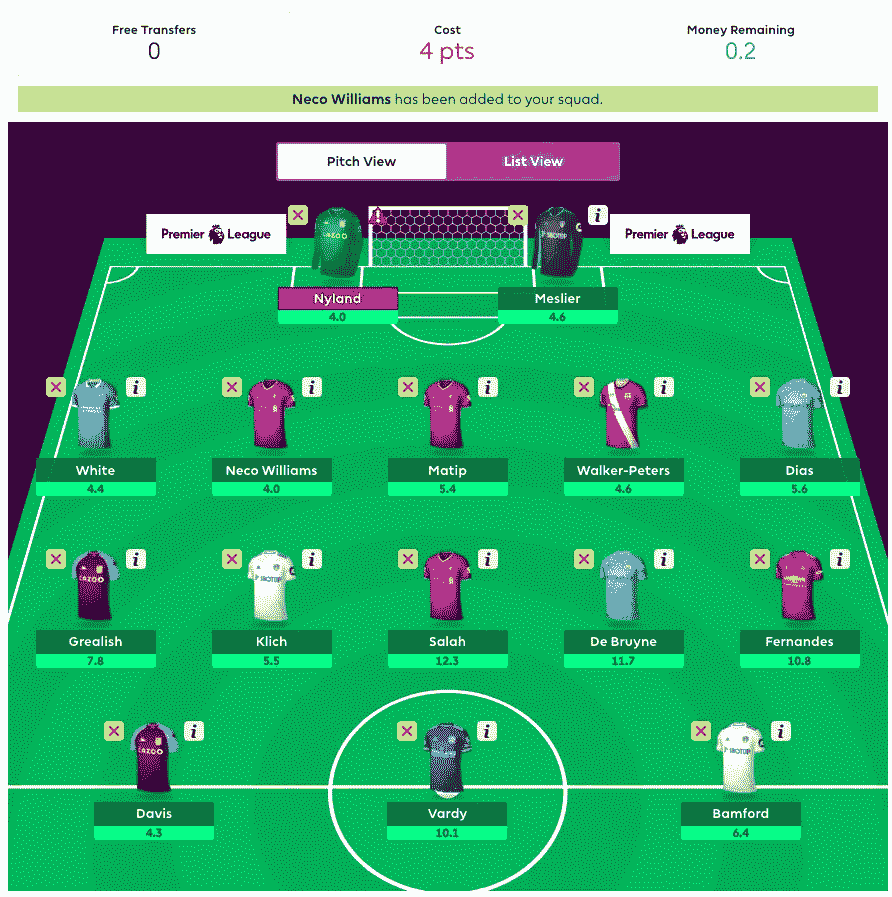**

# **结论**

**按照本赛季的发展方式，我们**建议放弃昂贵的防守球员**并尝试只拥有三名中档防守球员**在中场和进攻中积累大量筹码**，因为本赛季迄今为止一直在进球，而且没有迹象表明事情可能会很快放缓。此外，随着科维德和不断增加的伤病，如果你的首发阵容遭受意外的伤害，换几个有价值的球员做替补可能是一个不错的策略。感谢您阅读我们的博客《2020 年和节日快乐》,享受激动人心的不间断假期 EPL 行动！！！**

## **获得专家观点— [订阅 DDI 英特尔](https://datadriveninvestor.com/ddi-intel)***