# EPL 梦幻 GW16 回顾和 GW17 算法精选

> 原文：<https://medium.datadriveninvestor.com/epl-fantasy-gw16-recap-and-gw17-algo-picks-537f468bb78d?source=collection_archive---------10----------------------->

我们的金钱球方法到幻想的 EPL(队 _id: 2122122)

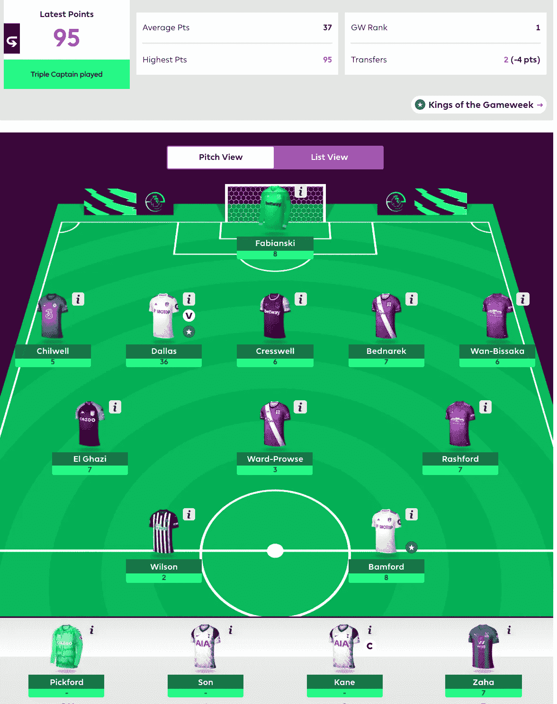

Top Team GW16

如果这是你第一次登陆我们的幻想 EPL 博客，你可能想看看我的媒体档案中的一些我们最初的 EPL 博客，以熟悉这个项目是如何开始的，以及随着时间的推移我们所做的改进。

# 2016 年 FPL 队 100 强统计

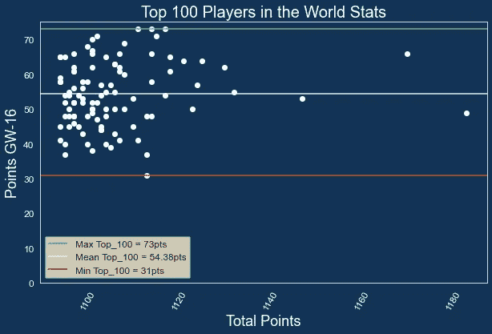

尽管经历了两次取消比赛的艰难一周，前 100 名球员不知何故仍然设法平均得分约为 54 分，只有少数球员得分在 40 分范围内。

# 前 100 名最佳守门员

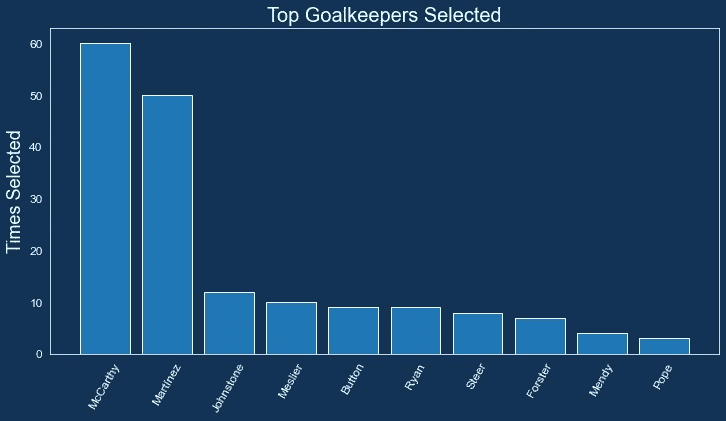

# 前 100 名中最受欢迎的捍卫者

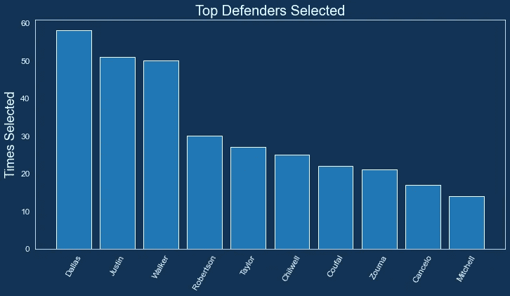

# 前 100 名最佳中场球员

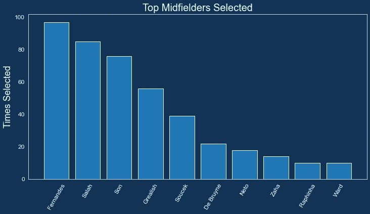

# 前 100 名中入选最多的前锋

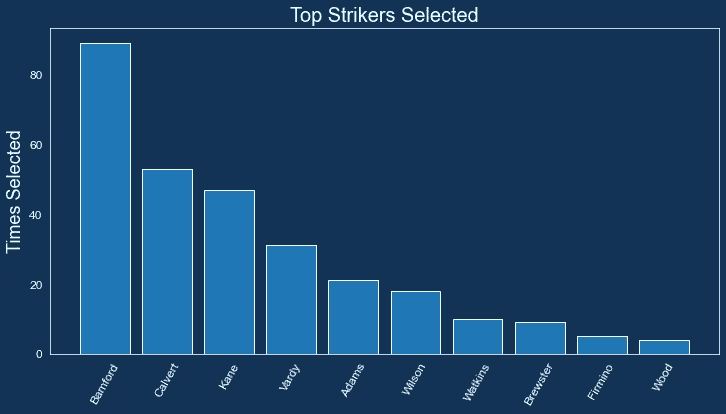

我们使用这些数据创建了下面的团队，它是由前 100 名中最受欢迎的球员组成的:

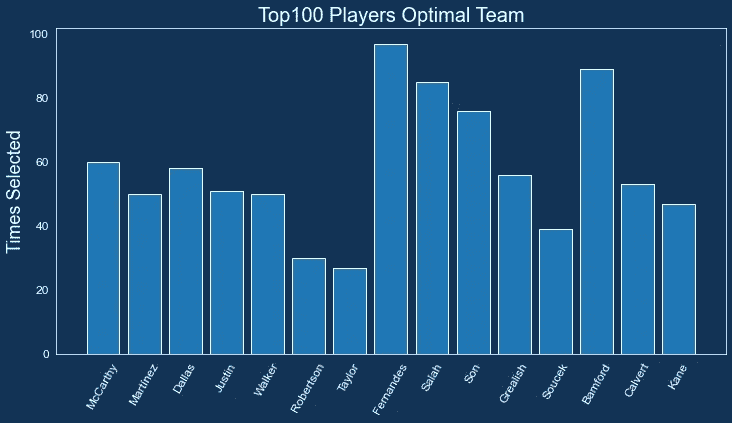

# 100 强中最受欢迎的团队

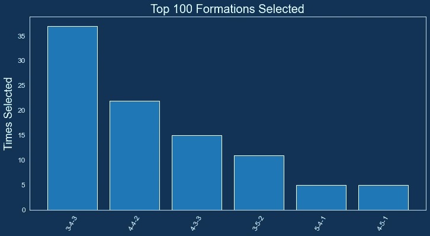

这些数据很有意义，因为大多数顶级球员都试图**利用 3-4-3 阵型的进攻型中场和前锋。**

# GW16 团队绩效总结和总体统计

正如你所想象的，我们度过了艰难的一周，我相信**你们中有很多 EVE、MCI 和 TOT 玩家的人也经历了**。除此之外，我们的一个转会——查理·泰勒——受伤了，伯恩利没有得到我们期望的零失球，所以 C .泰勒没有得到 6 分+,我们只有 1 分。萨拉赫的队长选择对我们很多人来说也不成功，所以对我们来说这是可怕的一周，但仍然得分高于平均水平，让我们活着。

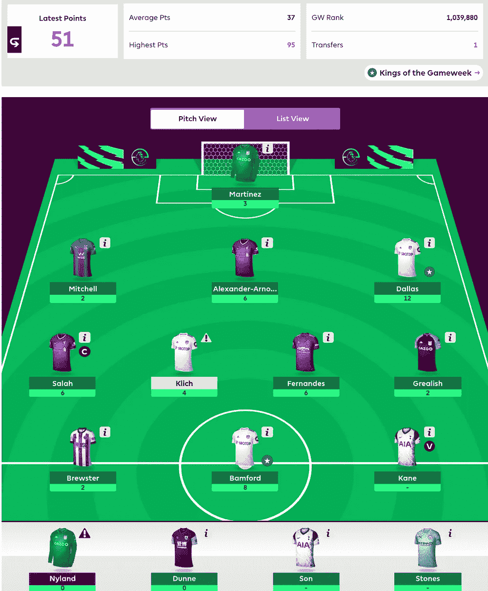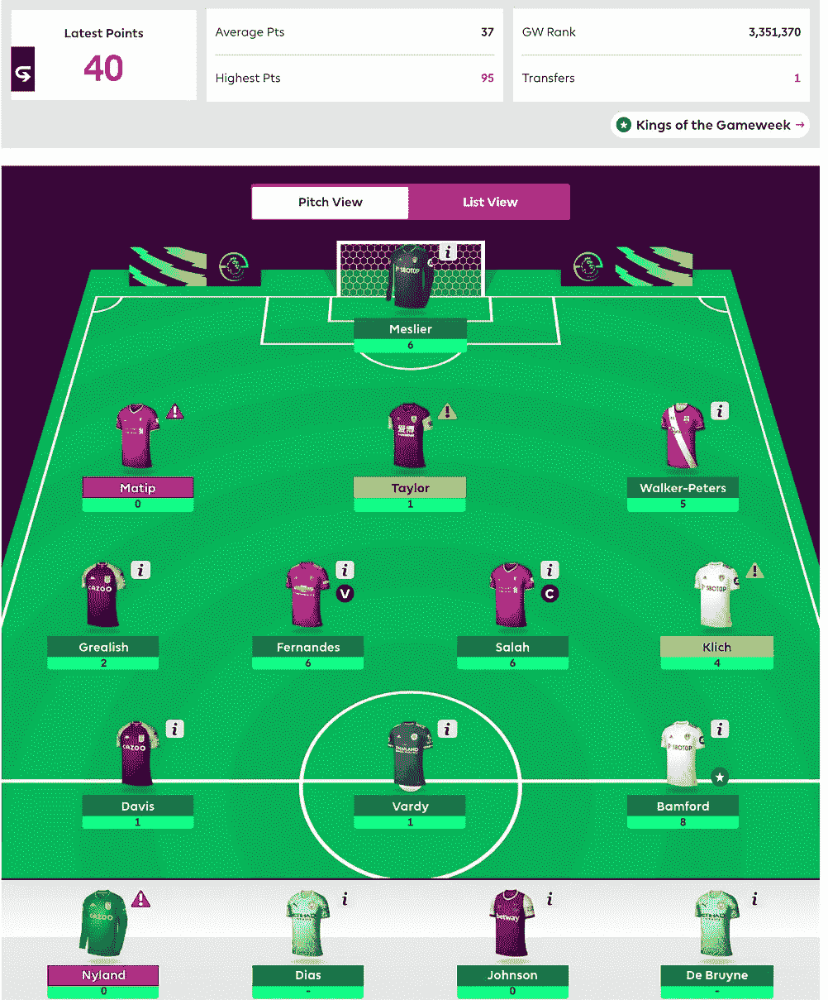

我们还参加了 FPL 的 FanTeam 版本，在那里我们也很挣扎，但幸运的是有几个潜艇让我们在未来几周内保持活力和竞争力。

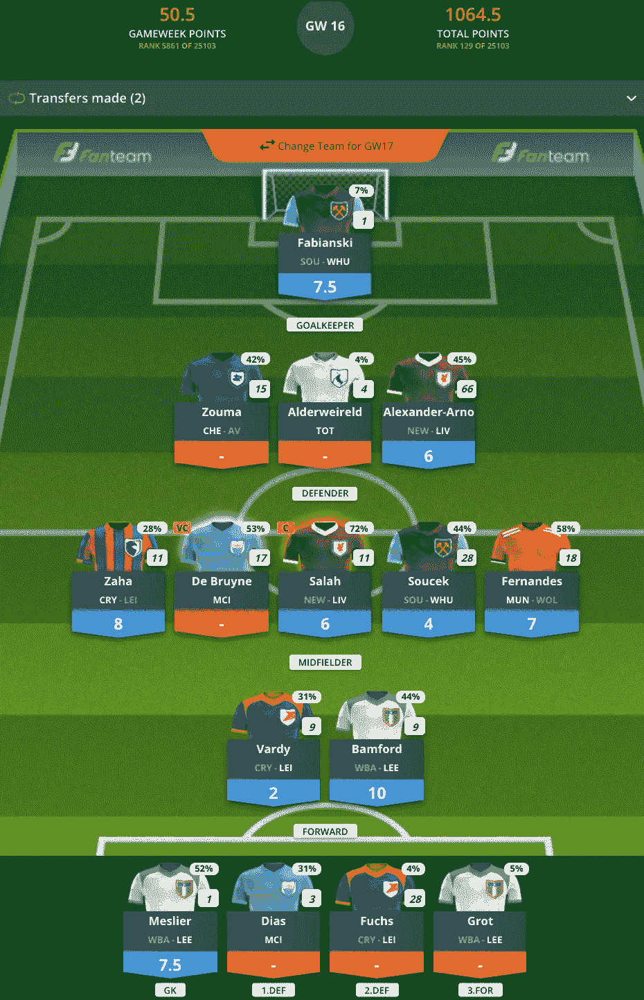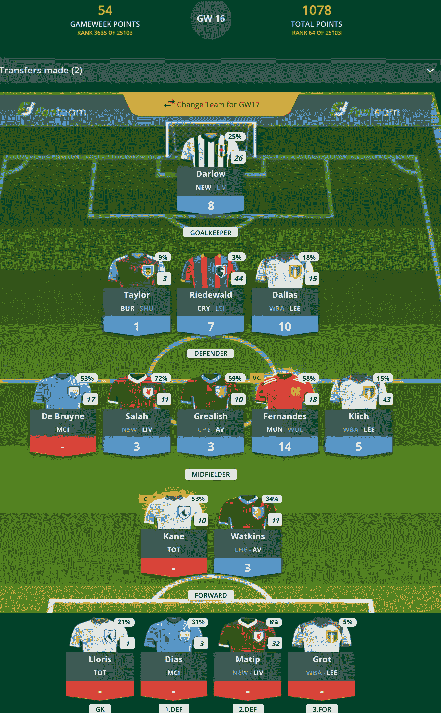

# 为我们的 GW17 精选提供有用的数据

让我们从下面三个比赛周的调整后的固定难度等级(FDR)开始:

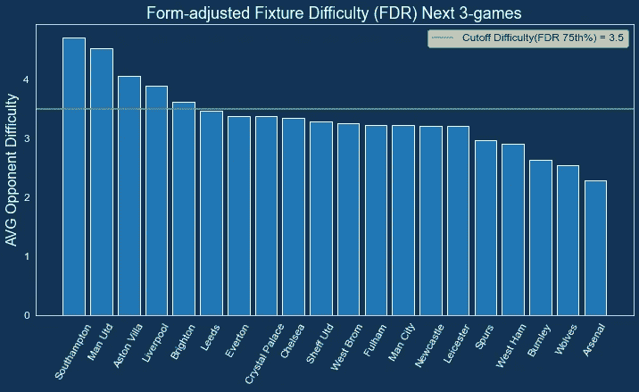

看起来**苏、门、AVL、丽芙和 BHA** 即将迎来一些艰难的比赛，所以我们的算法不建议对这些球队的许多球员进行长期投资。ARS、、BUR、、TOT、雷在接下来的三周时间里似乎有更轻松的赛程，所以我们的算法会偏向这些球队的球员。

# 博彩赔率

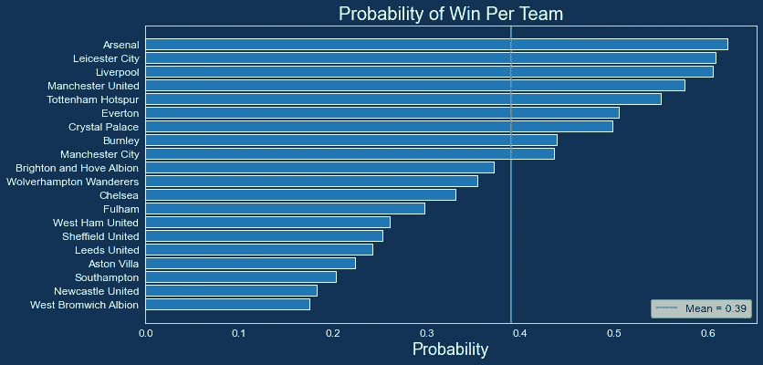

我们会尽量把 ***队伍中*** 胜率在 50 %以上的玩家，比如 **ARS、雷、LIV、MUN** 、 **TOT、EVE、CRY** 。我们应该尽量不要有太多来自 **WBA、**NEW、 **SOU、、LEE、SHU 的防守球员。******

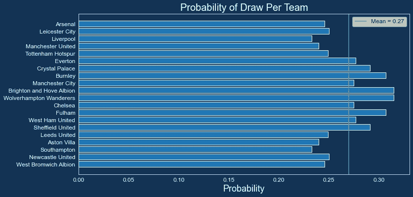

拥有 ***的队伍以更高的概率抽到了*** ，尤其是当比赛是 ***结合高赔率为 2.5 以下的*** 时，也许 ***对选择防守球员*** 有利，因为如果比赛以 0:0 结束，那将会产生大量的加分。结合 下方的 ***下/上图，我们可以确定以下几场 ***至少有一场不失球概率较高的比赛——伊夫-WHU、CRY-SHU、BUR-FUL 和 BHA-WOL。******

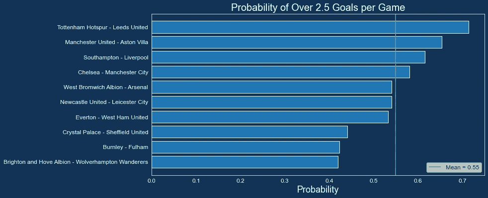

相反，我们可能希望从 ***赔率超过 2.5*** 的游戏中获得更多的 ***攻击玩家*** ，例如**托特-李、门-AVL、苏-丽芙、切-麦克伊和 BHA-阿雷斯*。***

# 裁判统计

从下面的统计数据来看，在比赛中出现点球的几率更高:**切-麦基，托特-李，门-AVL，和*哭-舒*** ，所以我们建议**为这些球队配备点球手**。看起来，像游戏 **EVE-WHU，TOT-LEE 和 WBA-ARS 都有喜欢给很多牌的裁判**，所以预计会被黄/红牌扣分。

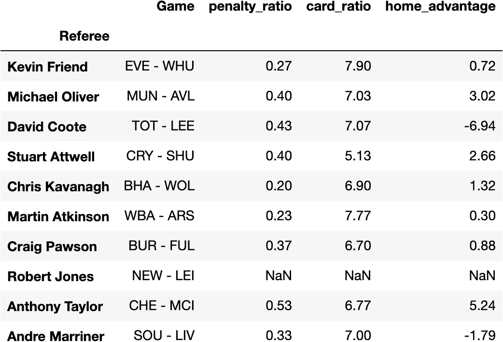

# 预计首发阵容

在我们运行最终的球队选择器之前，让我们考虑一下每支球队的预计首发 11 人以及可疑/受伤的球员。请 ***带着“半信半疑”的态度拍下下表*** *既然很多，那就在* ***COVID 测试后最后一刻修改更新和伤害。***

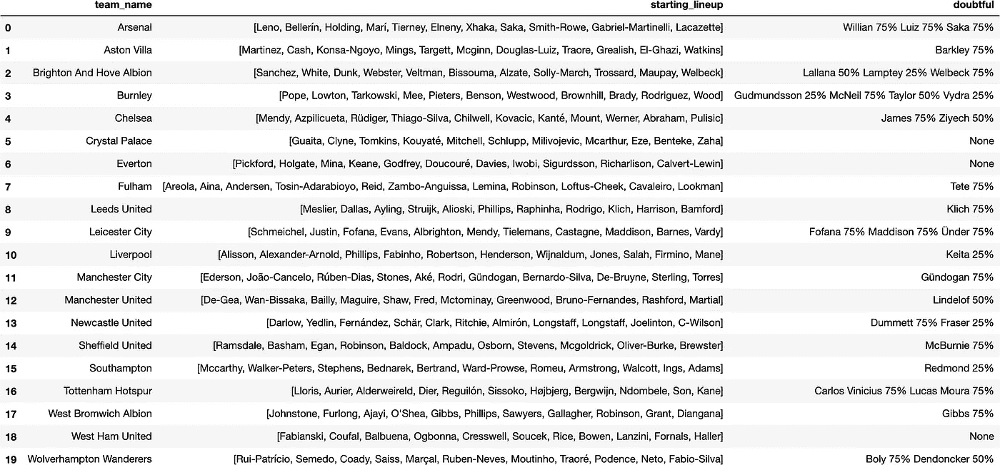

# 最新受伤情况

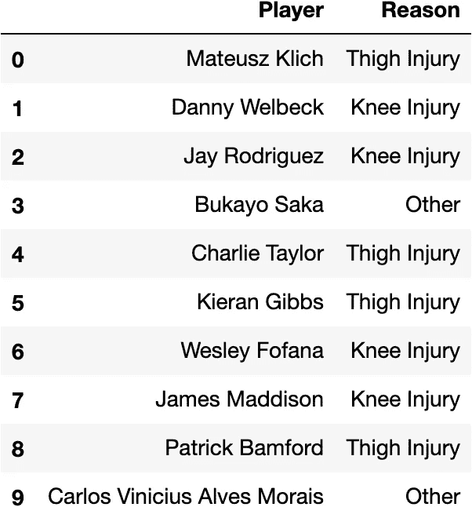

# 团队累积投资回报统计

这张表可以揭示哪些**球队总体上被认为是好的投资，哪些球队有很多定价过高、表现不佳的球员**。球队按平均每名球员得分排序，所以毫无疑问，**苏，，丽芙，，李和车是排名最靠前的球队，**因为他们的球员价格已经超出了他们的预期。一些价格更高、表现不佳的球员可以在 **NEW、SHU、WBA、CRY、和 FUL** 中找到，所以从这些球队中挑选球员是一个很好的主意。

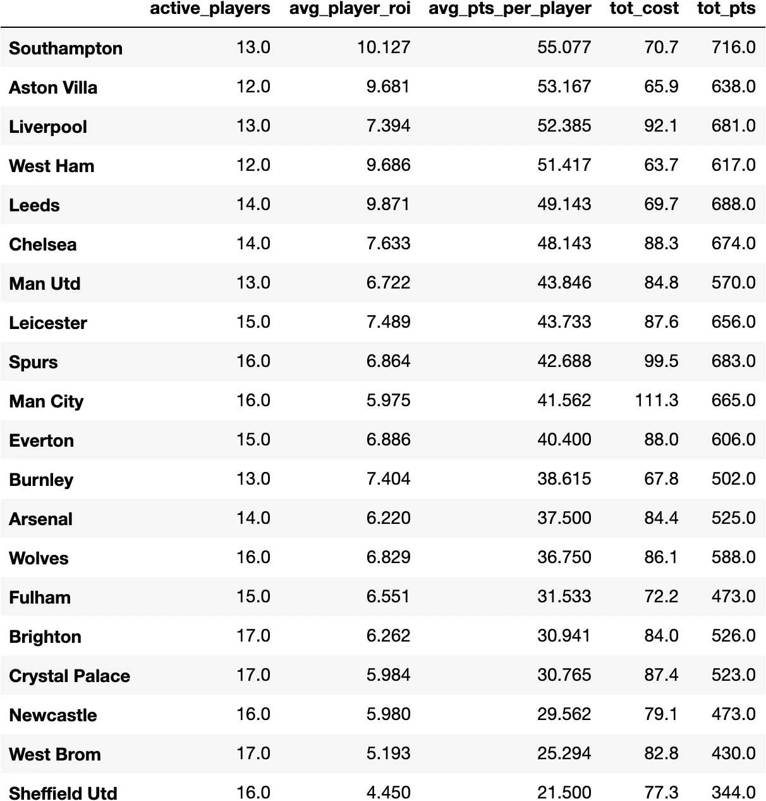

# 防守与进攻团队统计

到目前为止，拥有来自 LIV、CHE、MUN、LEE、LEI、和 EVE 的进攻球员似乎是一笔不错的投资。

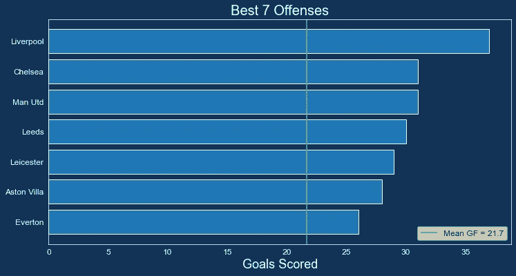

虽然有太多来自 BUR、SHU、WBA、ARS、FUL、和 NEW 的进攻球员似乎是一个糟糕的投资，除非你有一个像 C.Wilson 这样的球队中进球最多的**球员。**

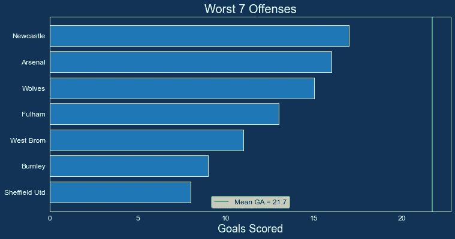

拥有来自的 TOT，MCI，CHE，，ARS，SOU 和 EVE 的防守球员似乎是一项不错的投资。

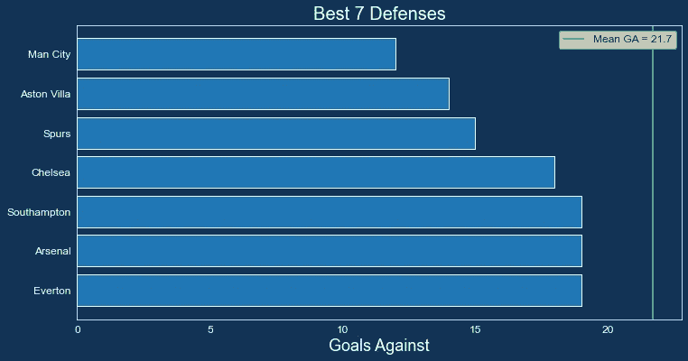

而拥有来自 WBA 的防守球员，李，CRY，舒，，NEW，和 MUN 似乎是一个糟糕的投资。

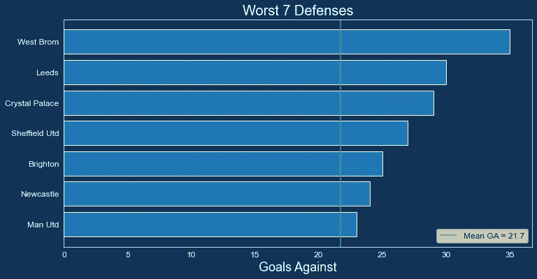

# 推荐人队长

我们的方法采用了即将到来的比赛的预测得分、球员罚点球、角球或任意球的概率、球员在过去 4 个赛季中空中威胁的系数、他们的球队打进 2 个或更多球的可能性，并以标准化的方式将所有这些混合成 ***最终队长选择系数*** 。然后，根据玩家的下一个**对手调整后的 FDR** 和本赛季防守强度的标准化分数**，将系数**减去*对手抗性分数*** 。熊猫 DF 看起来像下面的例子:**

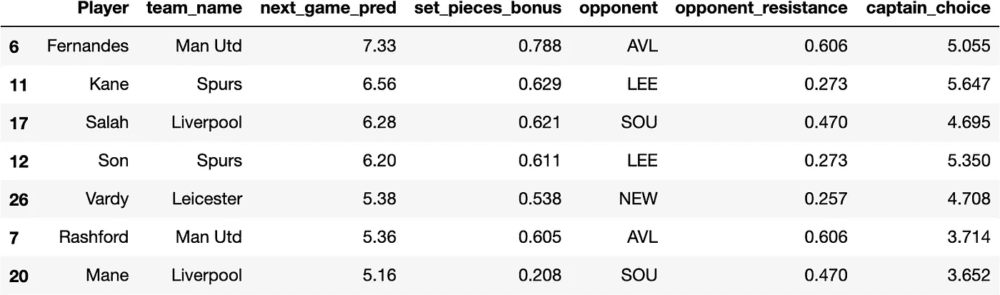

基于这个公式，这里是这个 GW 的前 15 名推荐队长的**名单。那里有很多好的选择，所以无论如何都不是一个容易的选择。我们的推荐人认为你应该选择**凯恩、奥巴、儿子、布鲁诺或瓦迪和萨拉赫**作为你的前五名选择*。***

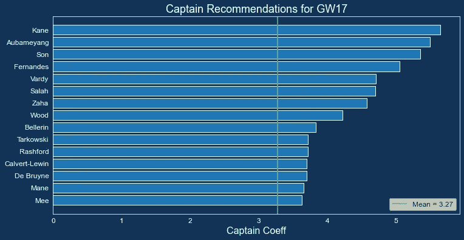

# 预测模型(球员统计)

现在是今年改进算法的皇冠上的宝石——预测球员统计数据的时候了。在我们将所有的 FDR、赌注系数、裁判首发、预计阵容和伤病分层后，有两个主要指标*我们在为下一个 n-gameweeks 团队选择调整我们的团队优化器时会考虑到— ***预测总积分和期望值(ROI)。*** 下面是每个指标的统计数据，也是按职位细分的。*

* [## 一瞬间学会数据科学！？数据驱动的投资者

### 在我之前的职业生涯中，我是一名训练有素的古典钢琴家。还记得那些声称你可以…

www.datadriveninvestor.com](https://www.datadriveninvestor.com/2020/07/23/learn-data-science-in-a-flash/) 

# 预计总积分—前 25 名玩家

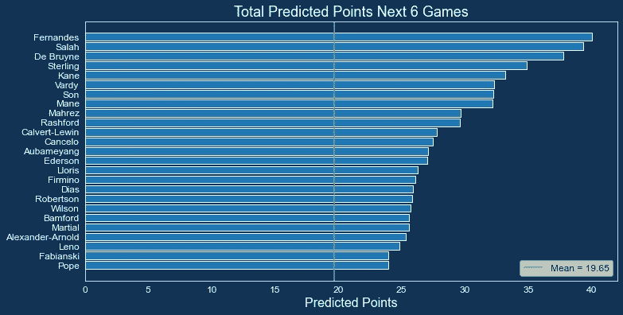

# 预计总价值—前 25 名玩家

> **注意:**通常，我们将我们的团队设计为上述两种属性的组合，以便在具有高积分期望的昂贵球员和预计在未来 5-6 周内产生良好价值的较便宜球员之间平衡我们的预算。

# 预测积分——顶级守门员

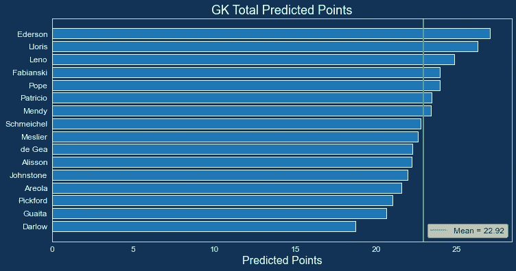

# 投射点数—顶级防守者

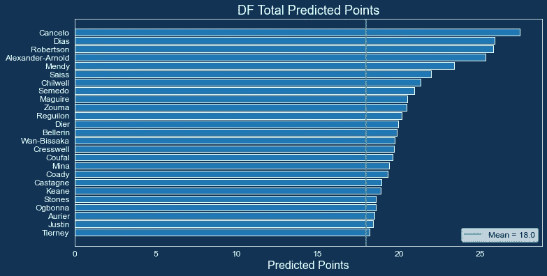

# 预测得分——顶级中场

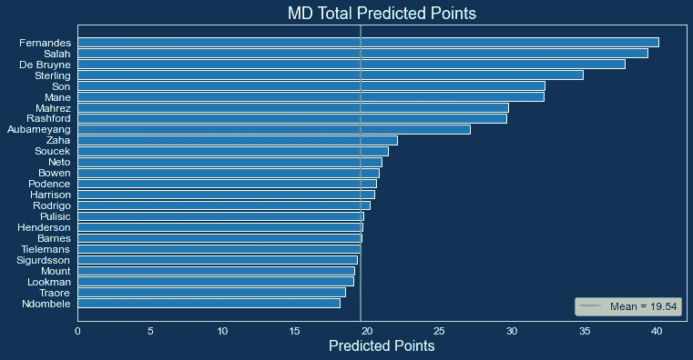

# 预测分数——顶级前锋

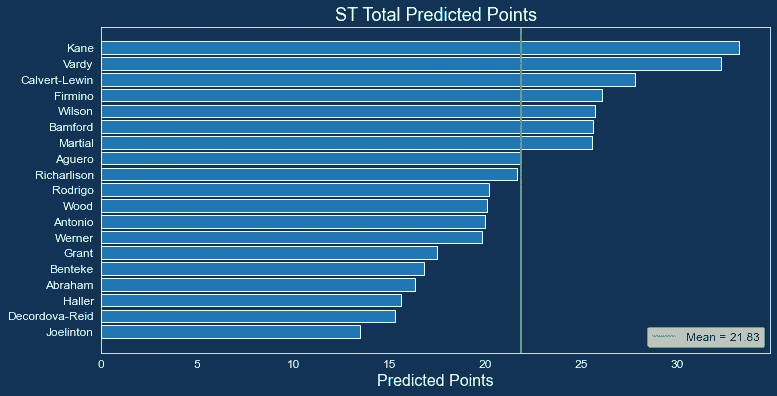

正如你所看到的，我们可以为每个位置选择大量选项，因此我们将把上面的许多统计数据插入 Python 中的 ***优化函数，该函数将 ***输出具有最高预期总积分*** 的团队，给定我们的预算约束和其他进入我们决策过程的指标。在团队选择器代码生效之前应用的一些初步过滤器包括:***

1.  **排除受伤或停赛球员**
2.  **将球员排除在 FDR 高的队伍之外**
3.  **排除即将到来空白周的玩家**
4.  **同一团队不能有超过 3 名玩家**
5.  **总共必须有 15 名球员(GK=2，DF=5，MD=5，ST=3)**

# 优化最常用信息的预算

上周前 100 名选手最常用的阵型是 3-4-3，所以我们将展示一个针对这种阵型的优化团队。正如你在下面看到的，模型首先查看参数，告诉它是否应该向 15 名球员的*全队优化，或者向有 ***11 名关键球员和 4 名廉价替补*** 的特定阵型优化。对于填充符，它首先查看 ***首选地层*** ，并使用该 ***来决定每个位置*** 需要多少个填充符。然后，该模型从我们的初始预算中减去花费在 4 个填充者上的总金额，并将剩余的预算花费在关键的 11 个参与者上， ***，给定优化函数和模型约束*** 。*

***示例 1:向最大期望点数优化***

*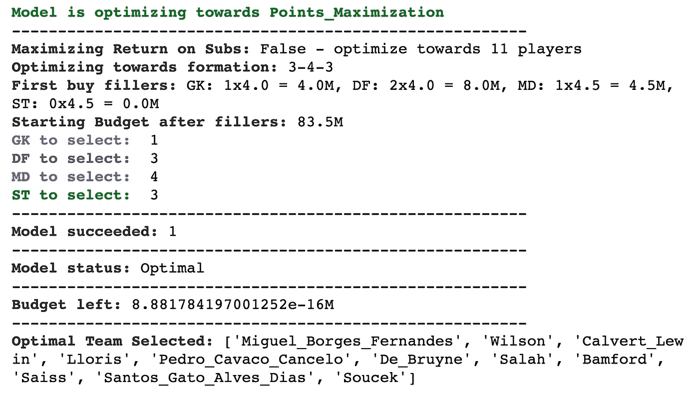*

*Recommended team for GW17 for total expected points*

*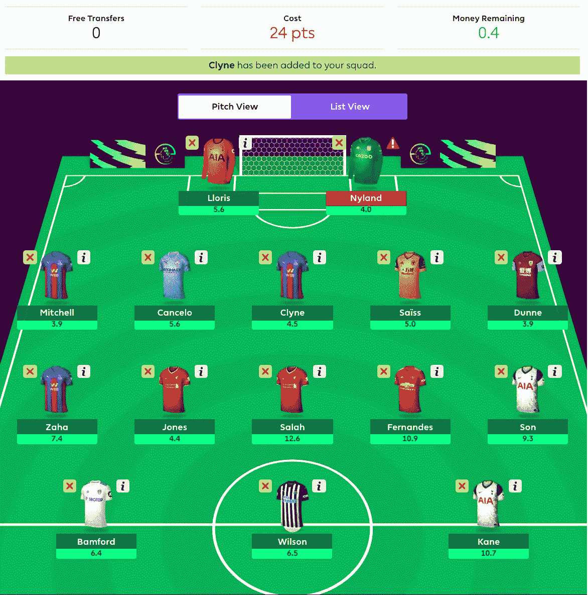*

***示例 2:针对所有 15 名玩家的最大值进行优化***

*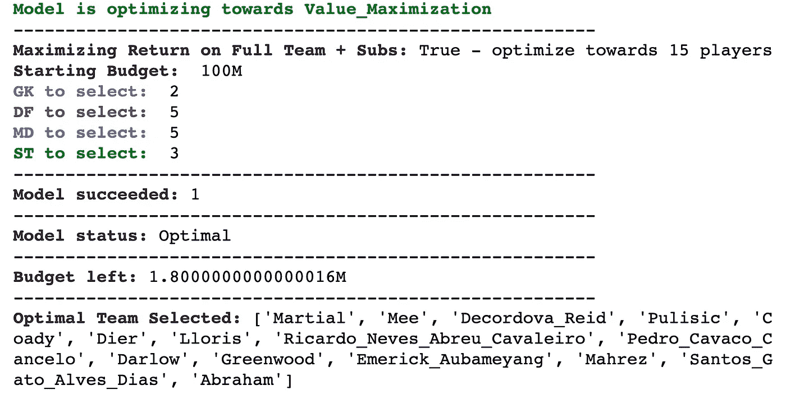*

*Recommended team for GW17 for total expected value (ROI)*

*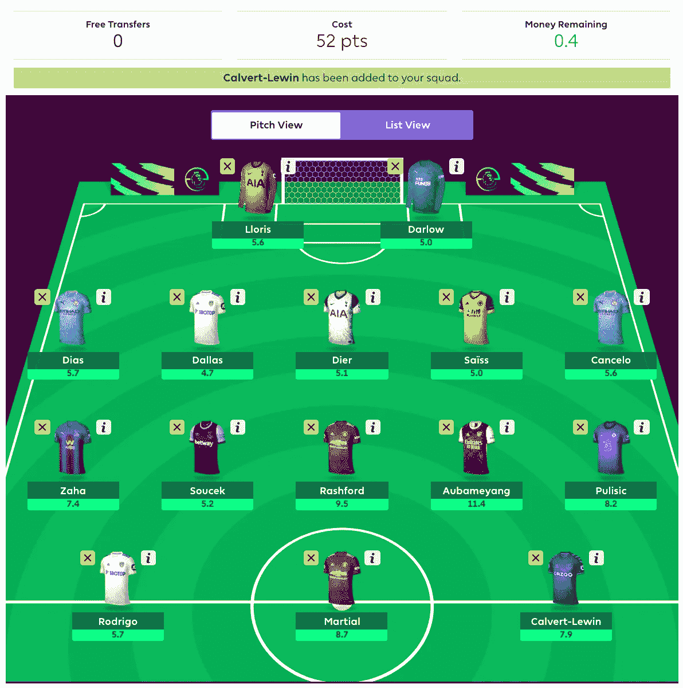*

*这支队伍看起来一点也不差，有 ***15 名稳定的常规球员*** 有潜力得分+6 分并且**银行里还有一些钱**。*

# *我们的 GW17 团队*

*我们将一直使用上周得分最高的球队，并尝试最多进行 1-2 次转会。由于我们在周四发布了这篇博客，并且由于 COVID 的原因，最后一分钟的赛程变化有很多不确定性，我们将等到周五再进行转会。下面是一个我们正在考虑的 3-4-3 阵型的选择，试图制造有望在 GW19 进行双杀的潜艇。*

*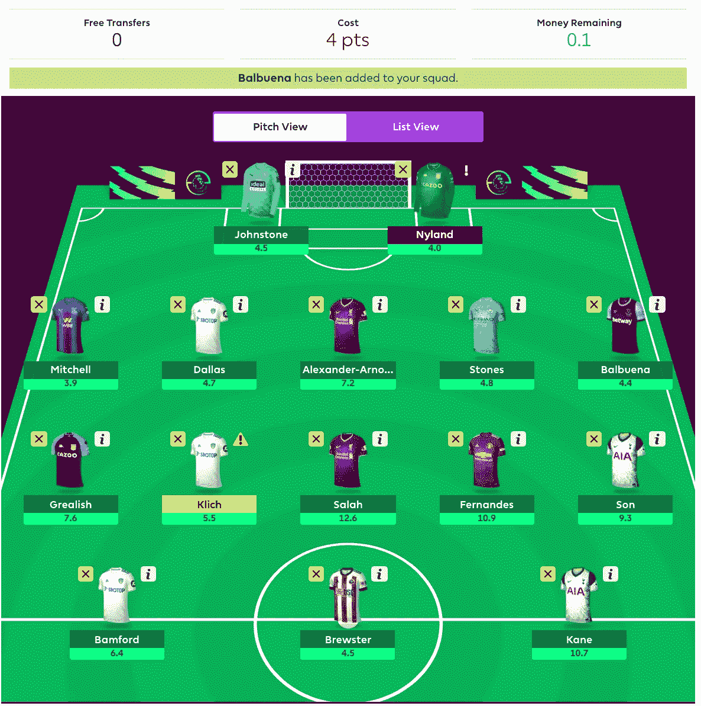*

# *结论*

*随着科维德和不断增加的伤病，如果你的首发阵容遭受意外的伤害，让 T2 换上几名价值球员作为替补可能是一个不错的策略。这可能是一个不错的策略**记住 GW19，在那里很多球队会有双赛**，所以在 GW19 和 15 个活跃玩家玩你的**板凳筹码，可能是一个伟大的举动。***

> *在我们点击 2020 年最后一篇博客的 ***【发布】*** 按钮之前，我们想祝大家新年快乐，身体健康，在 2021 年有许多积极的经历！！！去年对许多人来说都很艰难，包括 EPL 运动员、组织者和工作人员，所以让我们希望事情很快会变得更好，我们可以享受更多与朋友和家人在一起的时间，旅行，享受户外/室内聚会，以及在世界各地的体育赛事中挤满观众的体育场，找回让体育如此美丽和令人兴奋的激情和情感！感谢您在 2020 年阅读我们的博客，感谢您给我们发送了许多好的想法和改进建议，为更美好的 2021 年干杯！！！*

***访问专家视图—** [**订阅 DDI 英特尔**](https://datadriveninvestor.com/ddi-intel)**