# EPL 幻想 GW20 回顾和 GW21 算法选择

> 原文：<https://medium.datadriveninvestor.com/epl-fantasy-gw20-recap-and-gw21-algo-picks-40ef0d91827d?source=collection_archive---------1----------------------->

我们的钱球方法的幻想 EPL(队 _id: 3277501)

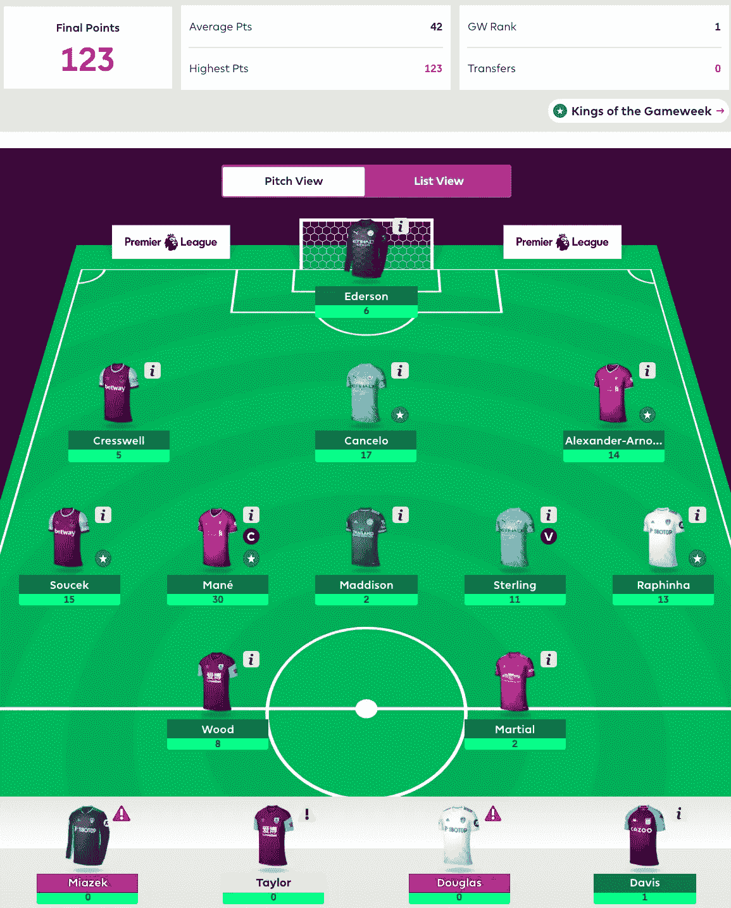

Top team GW20

如果这是你第一次登陆我们的幻想 EPL 博客，你可能想看看我的媒体档案中的一些我们最初的 EPL 博客，以熟悉这个项目是如何开始的，以及随着时间的推移我们所做的改进。

# GW20 前 100 名 FPL 团队统计数据

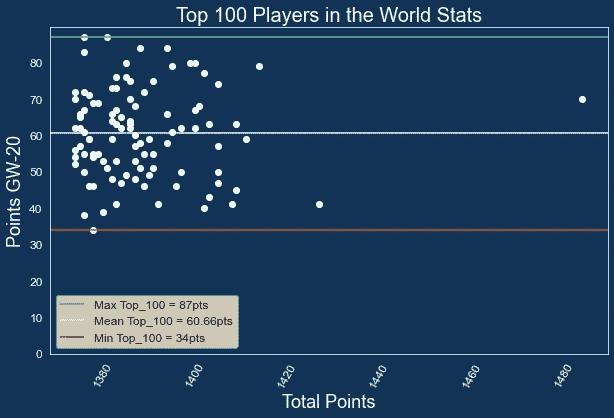

**前 100 名玩家**的分布非常有趣，分数分散在各处，从低至 34 分的**到 87 分的**，平均大约 61 分。这只是表明 GW20 对每个人来说都是一个艰难的游戏周。

# 前 100 名最佳守门员

有趣的是，注意到许多顶级玩家在他们的 GK 选择中有 **Jonhstone 和 Areola** 。

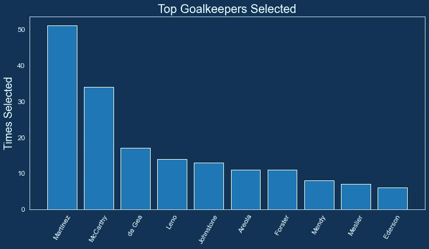

# 前 100 名中最受欢迎的捍卫者

看到这里有很多 MCI 和 WHU 的防守队员并不奇怪

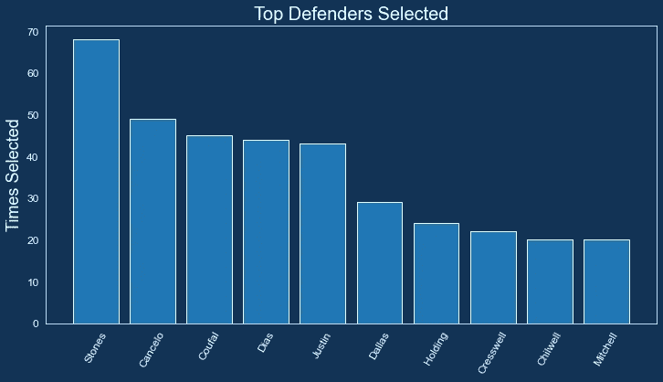

# 前 100 名最佳中场球员

有趣的是，索塞克位列第二，萨卡人、史密斯·罗和拉菲娜也位列前十。

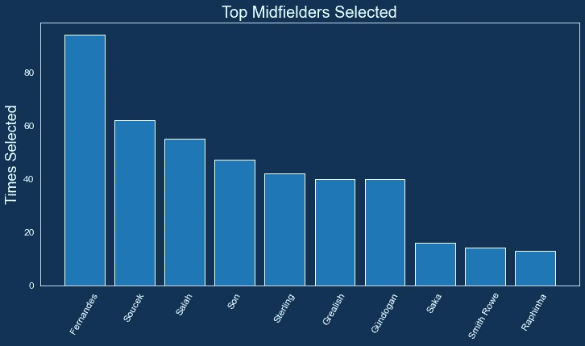

# 前 100 名中入选最多的前锋

有了 Bamford 和 Kane 这两个精选出来的球员，世界排名前 100 的球员本周表现不佳也就不足为奇了。

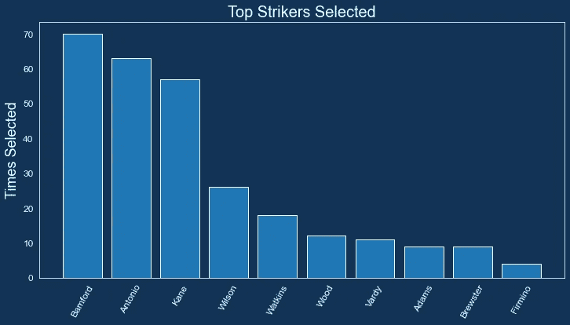

我们使用这些数据创建了下面的团队，它是由前 100 名中最受欢迎的球员组成的:

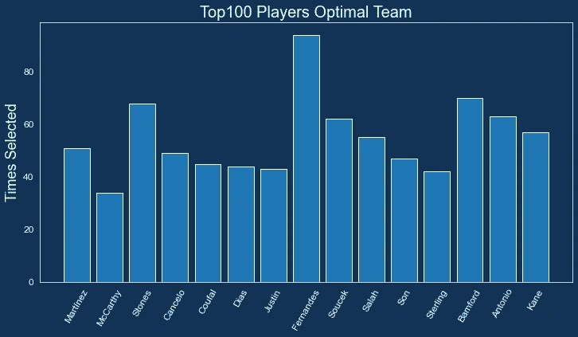

# 100 强中最受欢迎的团队

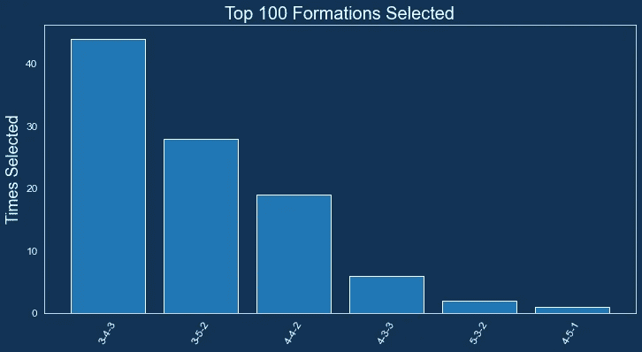

看起来前 100 名球员继续试图利用 3-4-3 阵型的进攻型中场和前锋。

# GW20 团队绩效总结和总体统计

我们对上一次 GW 有着复杂的感情。好消息是我们的一个团队得了 70 分，高于前 100 名选手的平均水平**。**坏消息是，在我们表现最好的团队中，我们在去年 GW 卖掉了 Vardy 得到了 Kane，**Kane 只得到 1 分，也受伤了。看到有多少顶尖选手得分在 50 分及以下，让我们对自己糟糕的分数感觉好一点。**

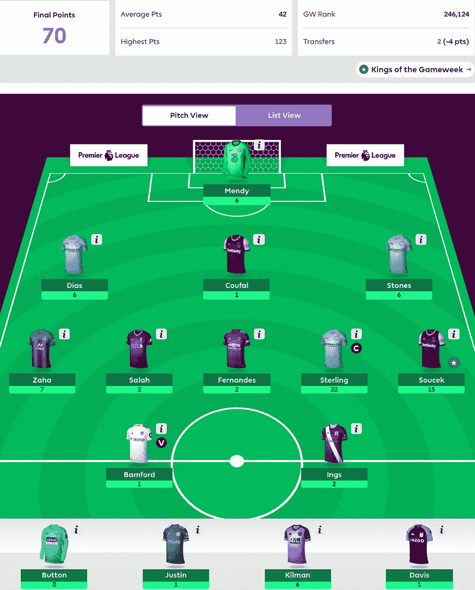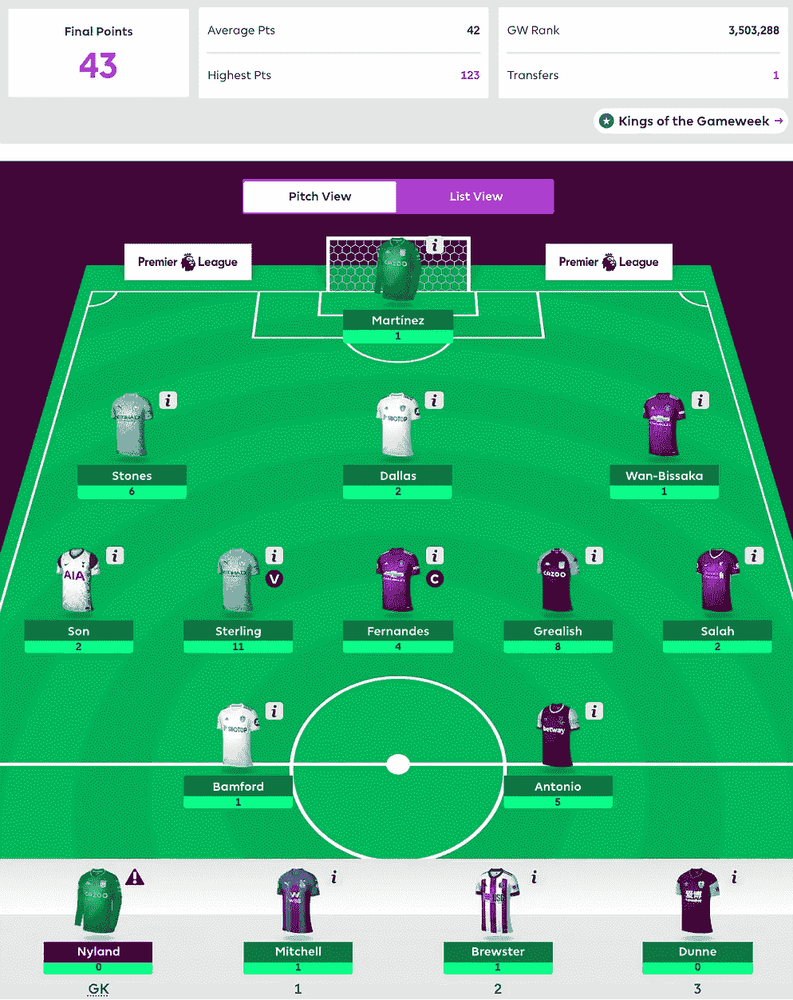

我们还参加了 FPL 的 FanTeam 版本，在那里我们比在 FPL 做得相对更好。

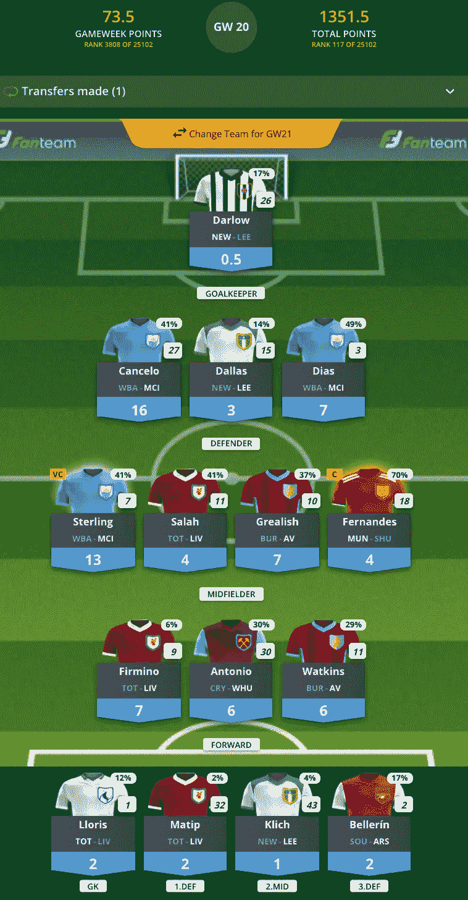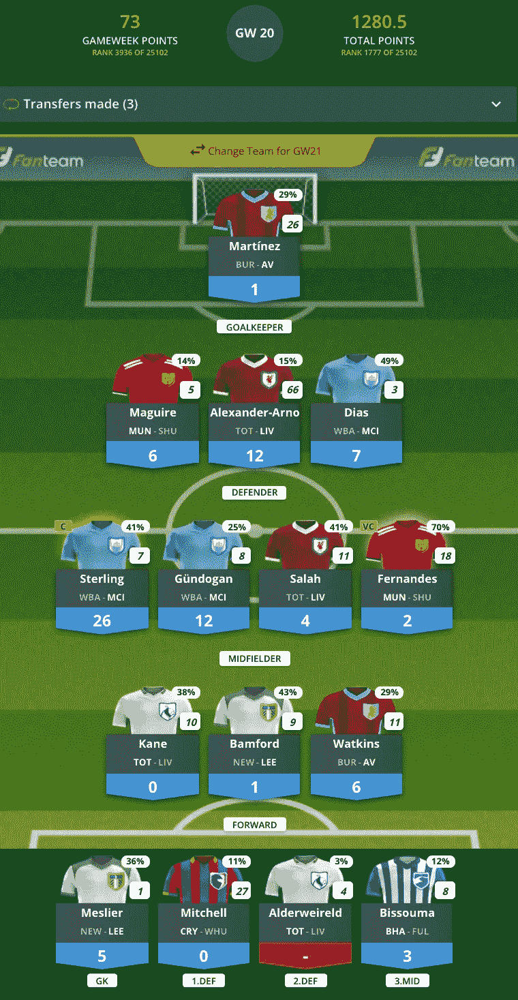

# 为我们的 GW21 精选提供有用的数据

让我们从下面三个比赛周的调整后的固定难度等级(FDR)开始:

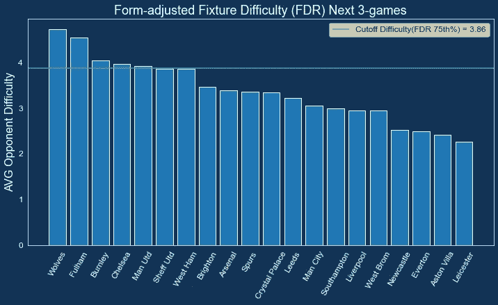

看起来、FUL、BUR、CHE 和 MUN 有一些艰难的比赛即将到来，所以我们的算法不建议对这些球队的许多球员进行长期投资。雷、、EVE、NEW、LIV、SOU 和 MCI 在接下来的三周内似乎有更轻松的日程安排，因此我们的算法将有利于这些球队的球员。

# 博彩赔率

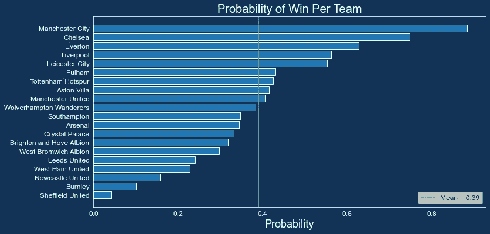

我们会尽量把 ***队中赢*** 的几率在 50 %以上的玩家，比如 **MCI、车、EVE、LIV、雷**。我们应该尽量不要让太多的防守球员来自于比尔，舒，纽卡，，和李。

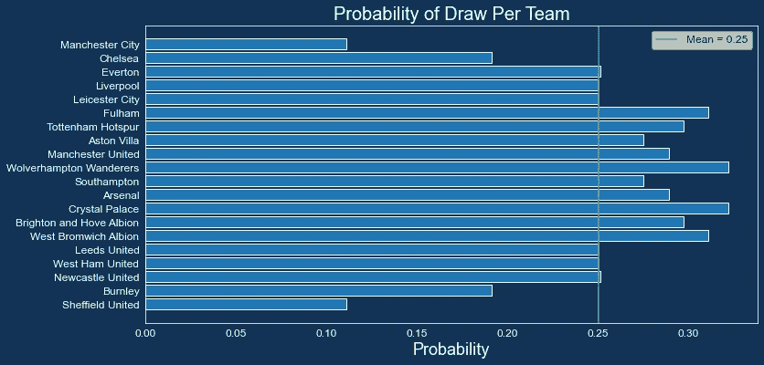

以 ***较高概率抽签*** 的队伍，尤其是当比赛是 ***结合高赔率为 2.5 以下的*** 时，可能会对选择*防守球员有利，因为如果比赛以 0:0 结束，那将会产生大量的加分。结合 下方的 ***下/上图，我们可以识别出以下 ***概率较高的游戏至少有一场不失球——CRY-WOL 和 WBA-FUL。*******

*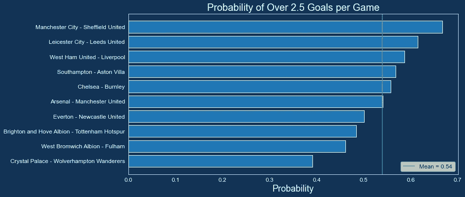*

*相反，我们可能希望有更多的 ***攻击玩家*** 来自 ***高赔率超过 2.5*** 的游戏，如 **MCI-SHU、LEI-LEE、WHU-LIV 和苏-AVL。***

# *裁判统计*

*从下面的统计数据来看，在比赛中出现点球的几率更高:WBA-FUL，ARS-MUN，MCI-SHU ，所以我们建议这些球队中的一些球队配备点球手。看起来，像游戏 **CRY-WOL 和 SOU-AVL 有裁判喜欢给很多牌**，所以期待从黄/红牌中失去一些分数。*

*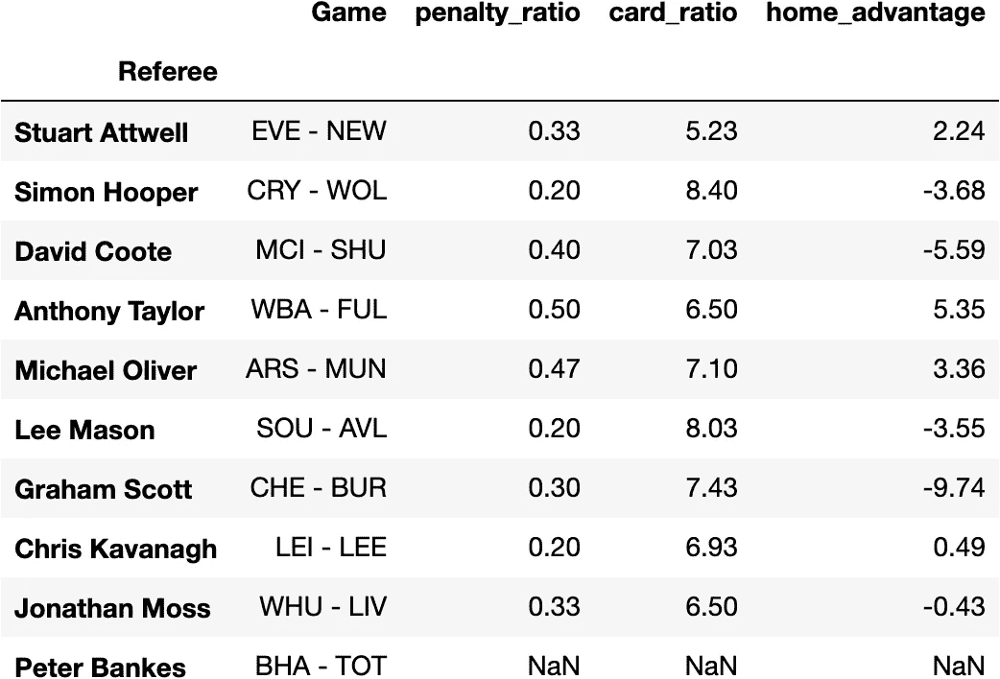*

# *预计首发阵容*

*在我们运行最终的球队选择器之前，让我们考虑一下每支球队的预计首发 11 人以及可疑/受伤的球员。请 ***带着“半信半疑”的态度拍下下表*** *既然很多，那就在* ***COVID 测试后的最后一分钟修改更新和伤害。****

*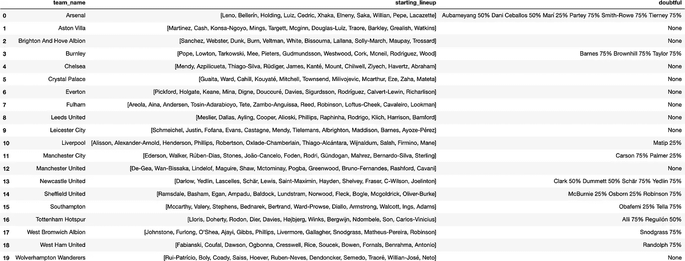**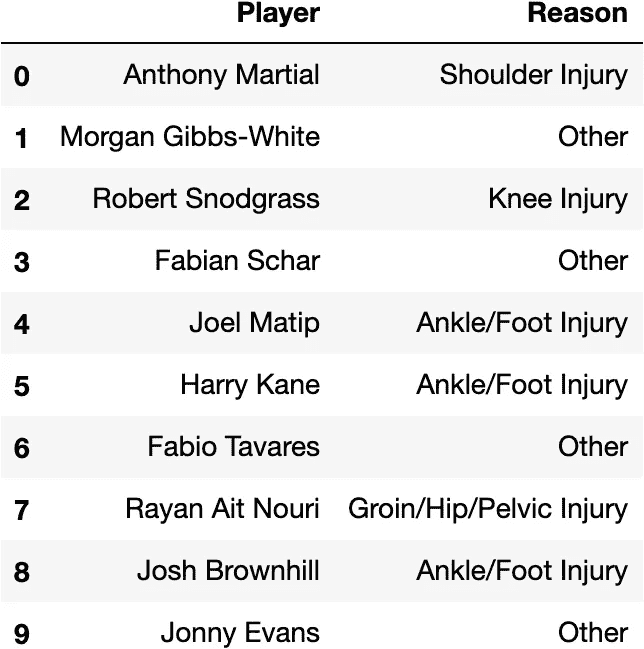*

# *团队累积投资回报统计*

*这张表可以揭示哪些**球队总体上被认为是好的投资，哪些球队有很多定价过高、表现不佳的球员**。球队按平均每名球员得分排序，队、队、队、队、队、T59 因为他们的球员价格已经超出了他们的预期，所以毫不奇怪地排在了第一位。一些价格更高、表现不佳的球员可以在 **NEW、SHU、WBA、CRY、和 FUL** 中找到，所以从这些球队中挑选球员是一个很好的主意。*

*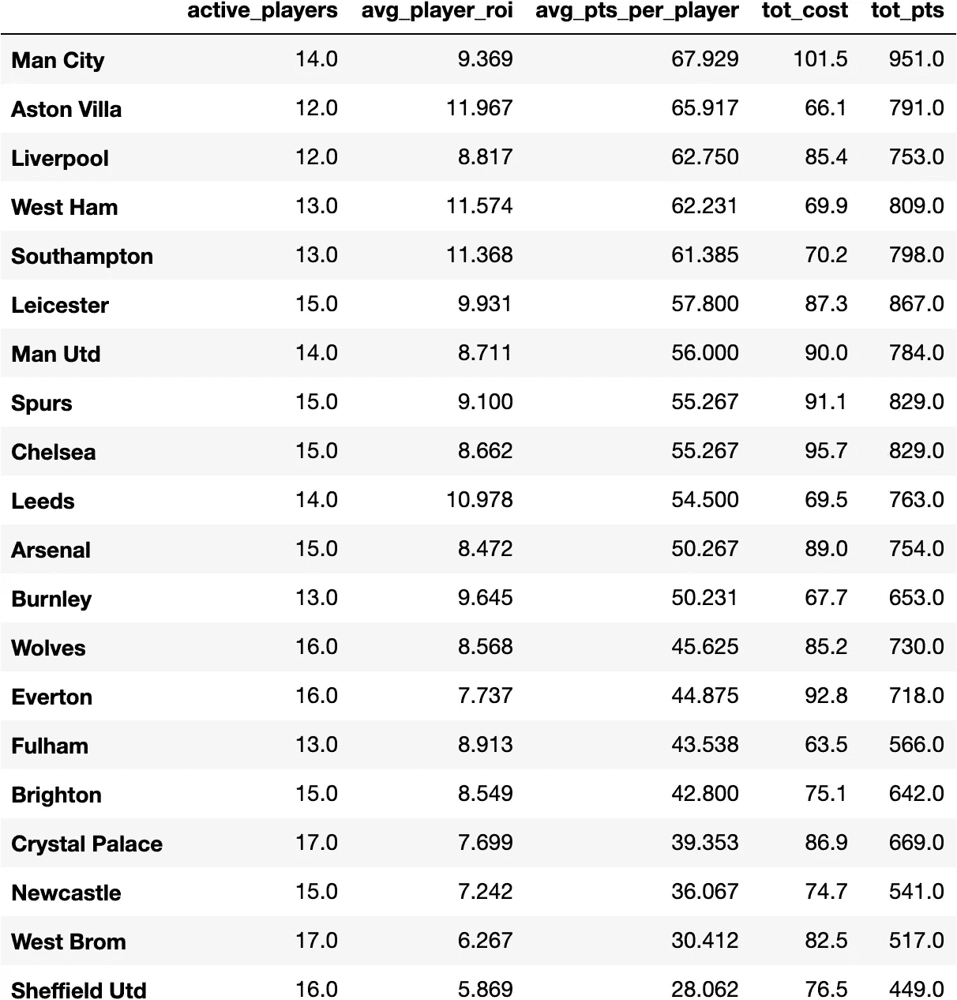*

# *防守与进攻团队统计*

*到目前为止，拥有来自 LIV、MUN、MCI、雷、TOT、CHE 和的进攻球员似乎是一笔不错的投资。*

*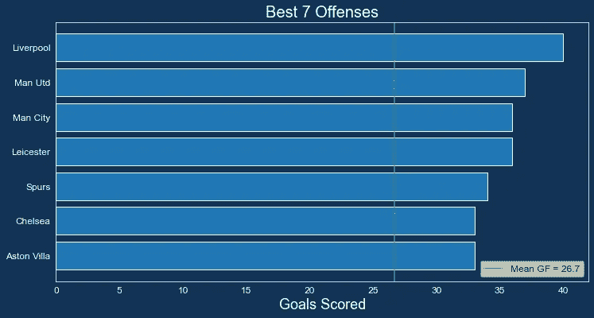*

*虽然有太多来自 BUR、SHU、WBA、FUL、、NEW 和的进攻球员，但这似乎是一项糟糕的投资，除非你有一个像 C . Wilson 这样的球队中进球最多的球员。*

*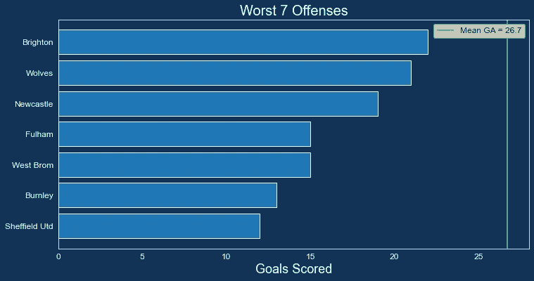*

*从的 TOT、MCI、、ARS、EVE、雷和 LIV 引进防守球员似乎是一项不错的投资。*

*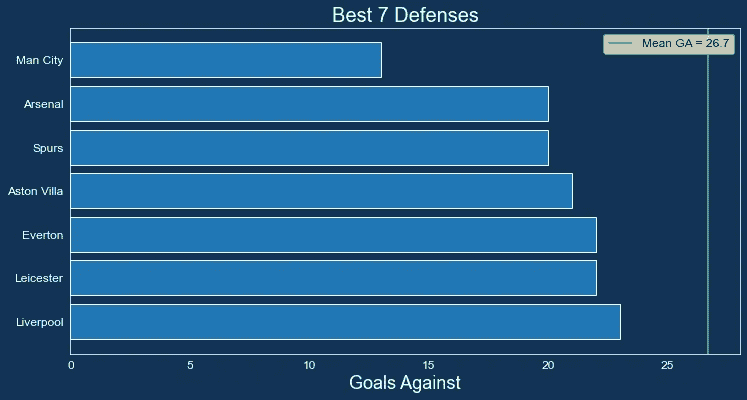*

*虽然有来自 WBA 的防守球员，李，CRY，舒，，纽卡和似乎是一个糟糕的投资。*

*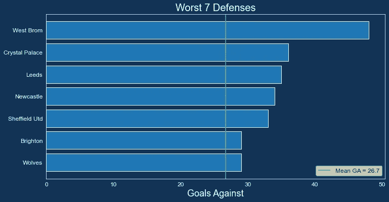*

# *推荐人队长*

*我们的方法采用了即将到来的比赛的预测得分、球员罚点球、角球或任意球的概率、球员在过去 4 个赛季中空中威胁的系数、他们的球队打进 2 个或更多球的可能性，并以标准化的方式将所有这些混合成 ***最终队长选择系数*** 。然后，根据玩家的下一个**对手调整后的 FDR** 和本赛季防守强度的标准化分数**，将系数**减去*对手抗性分数*** 。熊猫 DF 看起来像下面的例子:***

*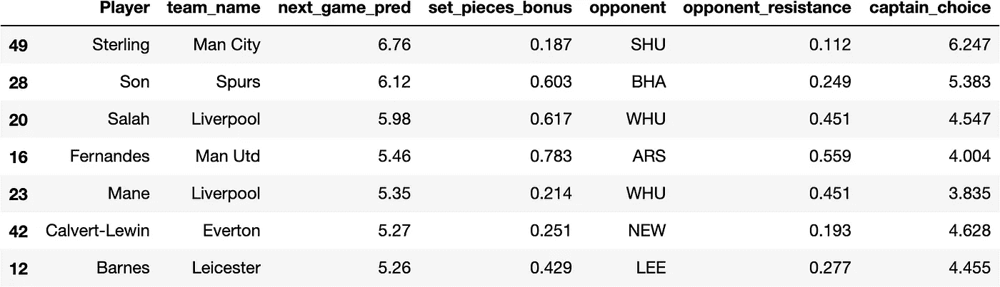*

## *定位球抢手和空中威胁*

*考虑让定位球选手和禁区威胁系数高的球员担任你的队长也很好，因为他们比其他球员获得更多进攻得分的机会。*

**

*基于这个公式，这里是这个 GW 的前 15 名推荐队长名单。那里有很多好的选择，所以无论如何都不是一个容易的选择。我们的推荐人认为你应该选择斯特林、森、坎塞罗、卡尔弗特-勒温或萨拉赫作为你的前五名选择。*

**

# *预测模型(球员统计)*

*现在是今年改进算法的皇冠上的宝石——预测球员统计数据的时候了。在我们将所有 FDR、赌注系数、ref 首发、预计阵容和伤病分层后，有两个主要指标*可供我们在为下一个 n-gameweeks 团队选择调整我们的团队优化器时考虑— ***预测总积分和期望值(ROI)。*** 下面是每个指标的统计数据，也按职位细分。**

# **预计总积分—前 25 名玩家**

**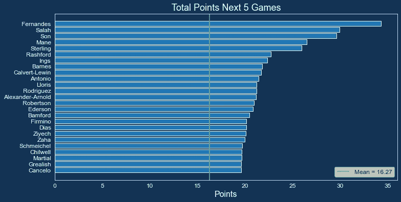**

# **预计总价值—前 25 名玩家**

**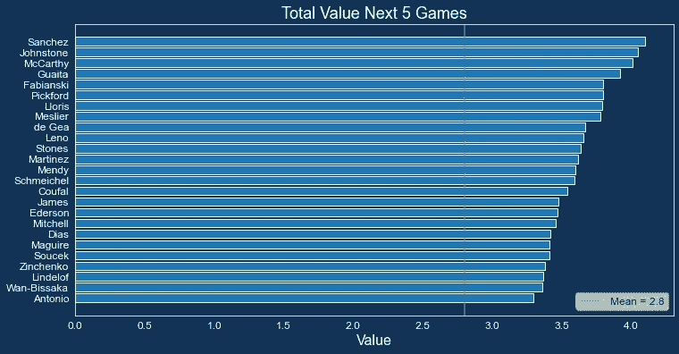**

# ****预测积分——顶级守门员****

****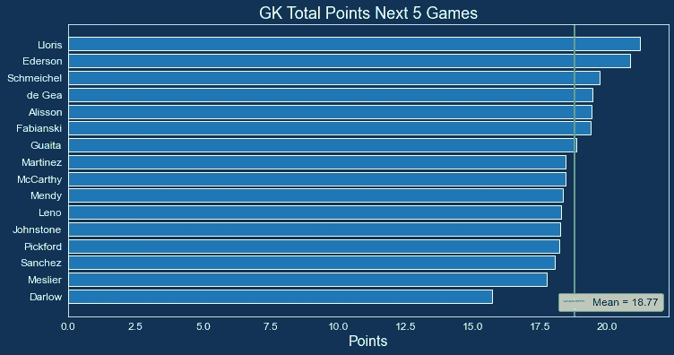****

# ****投射点数—顶级防守者****

****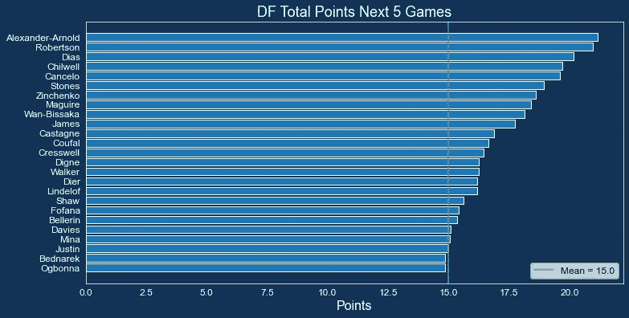****

# ****预测得分——顶级中场****

****一些有趣的名字是巴恩斯、罗德里格斯、扎哈、马迪森、佩雷拉、蒂勒曼斯和沃德-普罗斯。****

****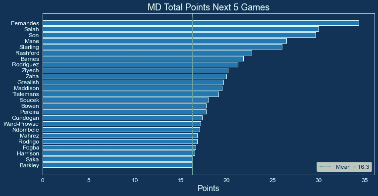****

# ****预测分数——顶级前锋****

****有趣的是看到大多数廉价的前锋在名单的顶端，如**英格斯，DCL，安东尼奥和巴福特。******

****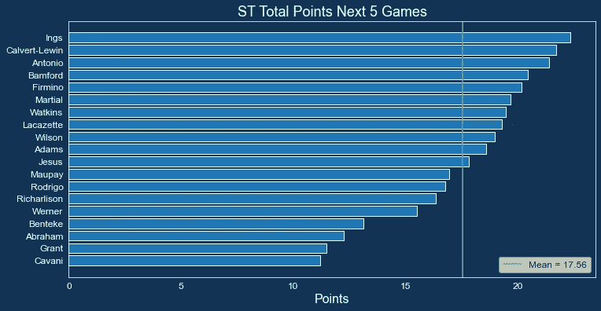****

****正如你所看到的，每个位置都有大量选项可供我们选择，因此我们将把上面的许多统计数据插入 Python 中的 ***优化函数，该函数将 ***输出具有最高预期总积分*** 的团队，给定我们的预算约束和进入我们决策过程的其他指标。在团队选择器代码生效之前应用的一些初步过滤器包括:*******

1.  *****排除受伤或停赛球员*****
2.  *****将球员排除在 FDR 高的队伍之外*****
3.  *****排除即将到来空白周的玩家*****
4.  *****同一团队不能有超过 3 名玩家*****
5.  ***总共必须有 15 名球员(GK=2，DF=5，MD=5，ST=3)***

# ***优化最常用信息的预算***

***上周前 100 名选手最常用的阵型是 3-4-3，所以我们将展示一个针对这种阵型的优化团队。正如你在下面看到的，模型首先查看参数，告诉它是否应该向 15 名球员的*全队优化，或者向有 ***11 名关键球员和 4 名廉价替补*** 的特定阵型优化。对于填充物，它首先查看 ***优选地层*** ，并使用该 ***来决定每个位置*** 获得多少填充物。然后，该模型从我们的初始预算中减去花费在 4 个填充者上的总金额，并将剩余的预算花费在关键的 11 个参与者上， ***给出优化函数和模型约束*** 。****

******示例 1:向最大期望点数优化******

****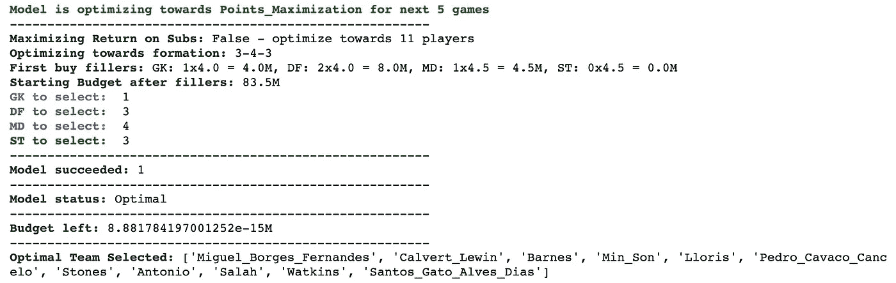********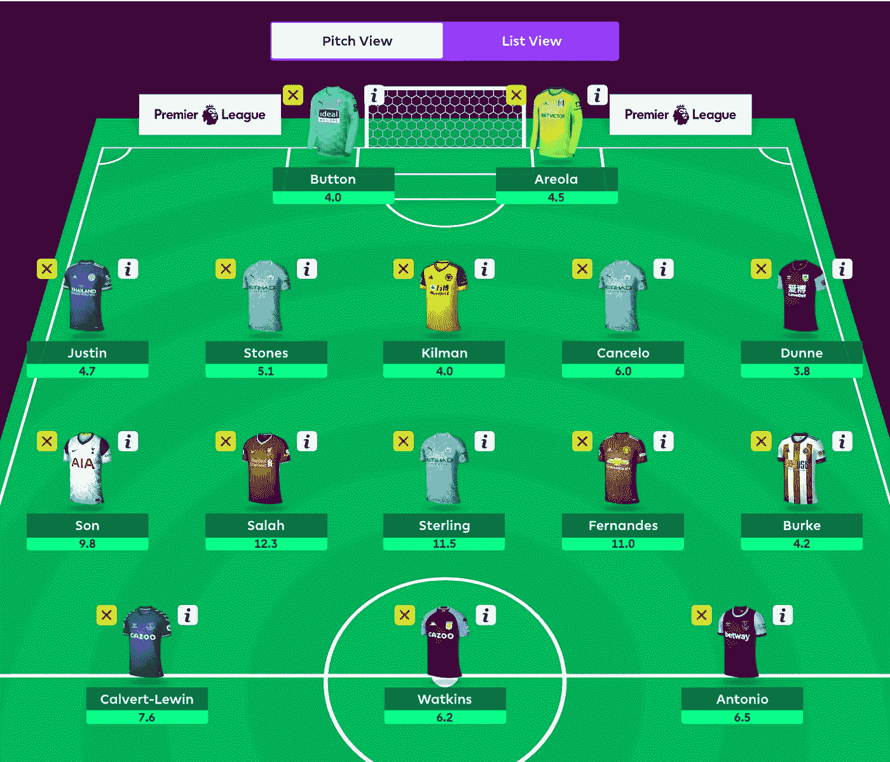****

******示例 2:针对所有 15 名玩家的最大值进行优化******

****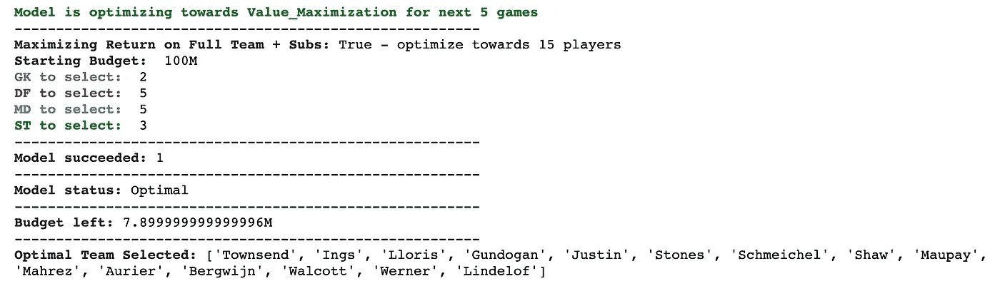********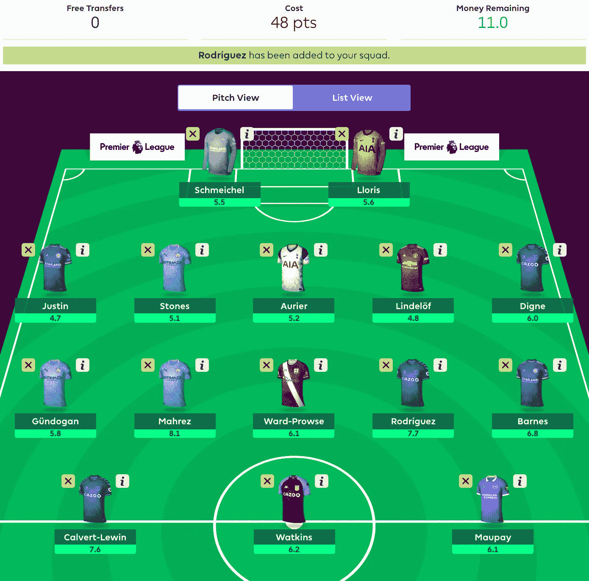****

****由 15 名价值球员组成的队伍看起来还不错，他们都有望首发并有可能获得+5 分。我们还有 **11M 的储备**有很大的空间来尝试一些位置的不同组合。****

# ****我们的 GW21 团队****

****我们将一直使用上周得分最高的球队，并尝试最多进行 1-2 次转会。因为我们已经有了 3 名来自 MCI 的球员和体面的门将、第三后卫和中场球员，我们决定本周不做任何转会，并保留一名自由球员以备不时之需。考虑过用索切克换蒂勒曼斯，但决定不这么做，因为索切克一直在左右开弓。****

****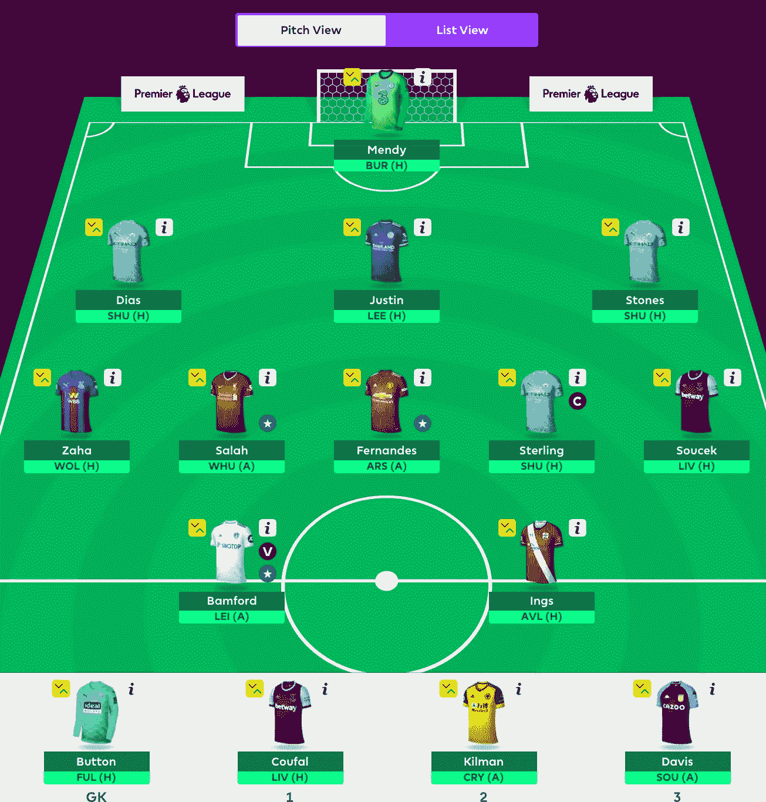****

# ****结论****

****随着**科维德和越来越多的伤病**，换上几名价值球员作为替补可能是一个不错的策略，以防你的首发阵容遭受意外的损害。我们也建议等到截止日期的最后一天再进行转会，因为计划和预测每个比赛周将有哪些球队/球员上场已经变得非常困难。一如既往地感谢您的阅读，祝您本周好运！****