# EPL 幻想 GW21 回顾和 GW22 算法选择

> 原文：<https://medium.datadriveninvestor.com/epl-fantasy-gw21-recap-and-gw22-algo-picks-943bc7164de4?source=collection_archive---------9----------------------->

我们的钱球方法的幻想 EPL(队 _id: 3277501)

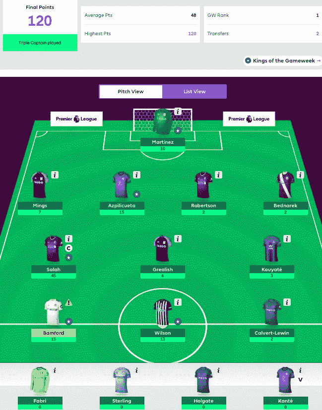

Top Team GW21

如果这是你第一次登陆我们的幻想 EPL 博客，你可能想看看我的媒体档案中的一些我们最初的 EPL 博客，以熟悉这个项目是如何开始的，以及随着时间的推移我们所做的改进。

# GW21 FPL 团队统计数据前 100 名

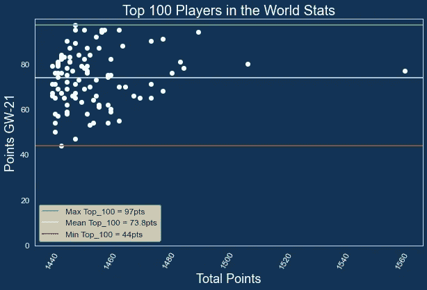

看起来世界排名前 100 位的玩家**本周总体表现强劲**，平均得分为 74 分**。仍然有很多排名前 100 的球员得分低于 60 分，所以如果你的得分在 50-60 分或以上，你会对自己感觉很好:)**

# 前 100 名最佳守门员

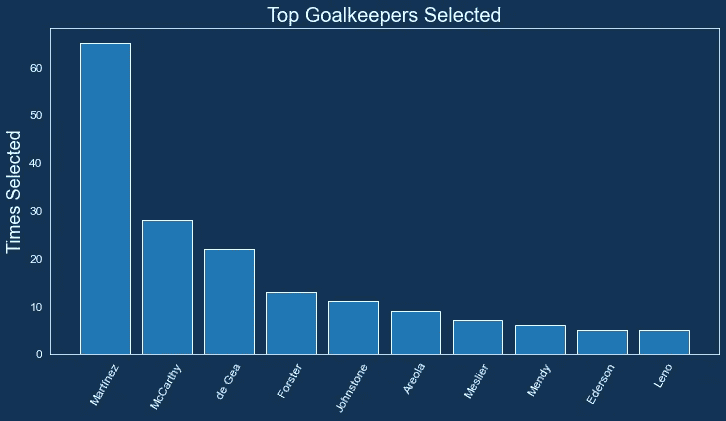

# 前 100 名中最受欢迎的捍卫者

看起来 DF 对前 100 名的选择并不成功

# 前 100 名最佳中场球员

有趣的是看到英镑的低选择，因为也许许多顶级 FPL 球员一定害怕 Pep 轮换。

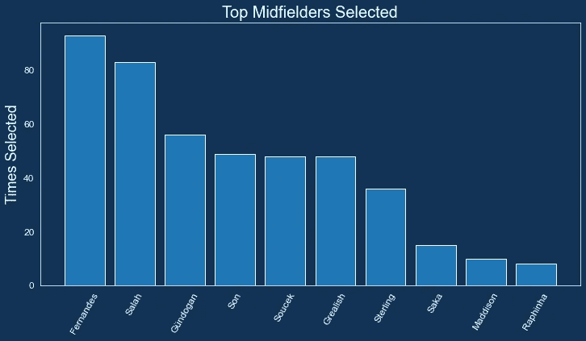

# 前 100 名中入选最多的前锋

毫不奇怪地看到**班福德成为第一选择**，加上相当数量的**威尔森和沃特金斯**，所以总体来说是不错的 ST 选择。

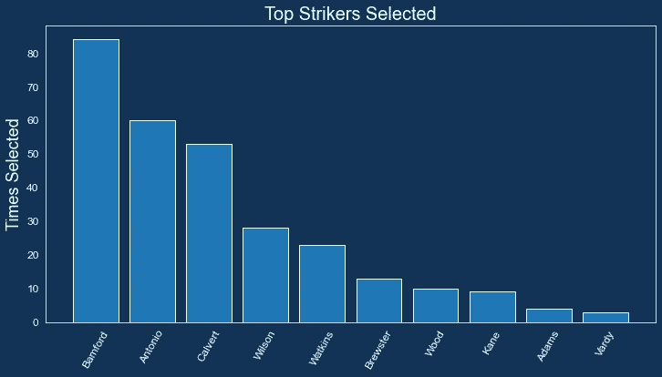

我们使用这些数据创建了下面的团队，它是由前 100 名中最受欢迎的球员组成的:

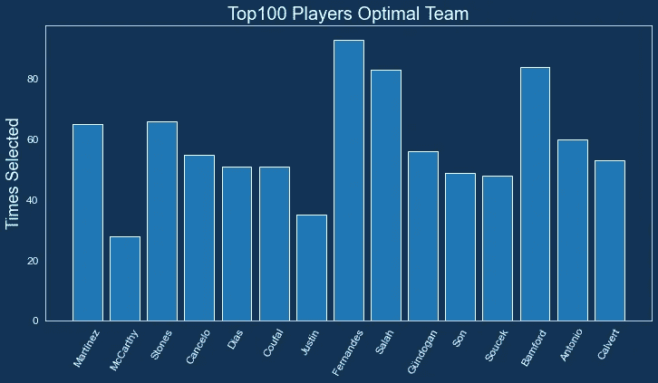

# 100 强中最受欢迎的团队

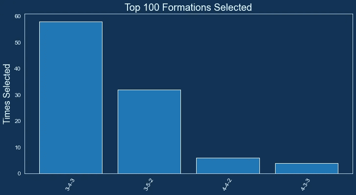

看起来前 100 名球员继续试图利用 3–4–3 阵型中的进攻型中场和前锋。

# GW21 团队绩效总结和总体统计

总的来说，我们对自己的表现很满意，因为我们有两支队伍的得分接近或超过了前 100 名 FPL 选手的平均得分 74 分。选择 Bamford 作为副队长是一个大胆的举动，在我们的主队长 Sterling 没有参加比赛后，他得到了回报。我们来自 GW21 的主要抱怨是 VAR 的一个非常接近的判决无效的**进球和**没有给扎哈**的点球，这在重播后似乎很清楚，但 VAR 不这么认为…**

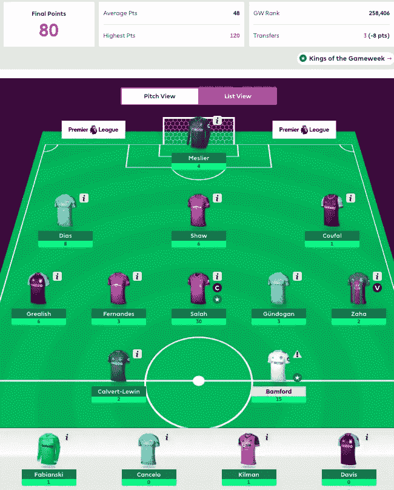

我们还参加了 FPL 的 FanTeam 版本，在那里我们做得不好，因为我们选择了不同的船长。

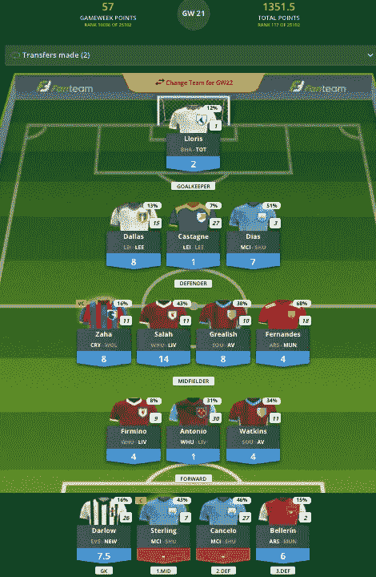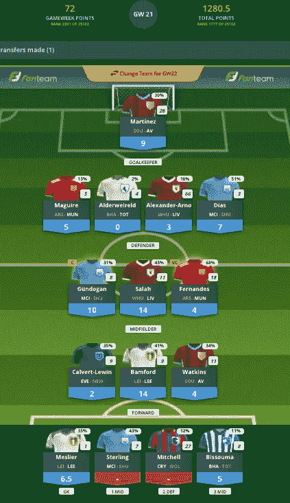

# 为我们的 GW21 精选提供有用的数据

让我们从下面三个比赛周的调整后的固定难度等级(FDR)开始:

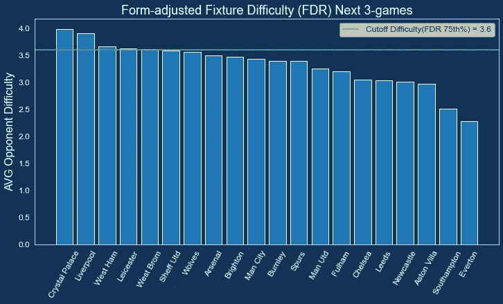

看起来像 **CRY，LIV，，LEI 和 WBA** 有一些艰难的比赛即将到来，所以我们的算法不建议对这些球队的许多球员进行长期投资。EVE、SOU、、NEW、LEE 和 CHE 在接下来的三周里似乎有更轻松的日程安排，因此我们的算法将有利于这些球队的球员。

# 博彩赔率

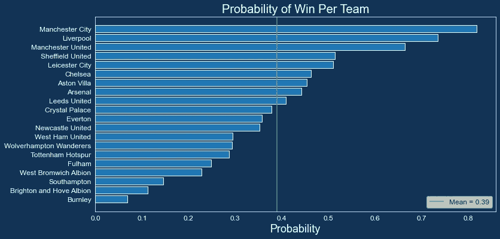

我们将尽量积累 ***队中有超过 50 %胜算的*** 的玩家，如 **MCI、CHE、MUN、LIV、雷**。我们应该尽量不要有太多来自 **BUR，BHA，SOU，WBA，FUL 的防守球员。**

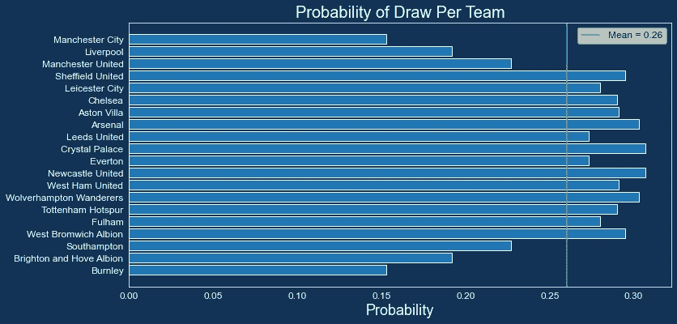

拥有 ***的队伍以更高的概率抽到了*** ，特别是当比赛是 ***结合 2.5*** 以下的高赔率时，可能会对选择 ***防守球员*** 有利，因为如果比赛以 0:0 结束，那将会产生大量的加分。结合 下方的 ***下/上图，我们可以识别出以下几款 ***概率较高的游戏至少有一场不失球——SHU-WBA、WOL-ARS、NEW-CRY。******

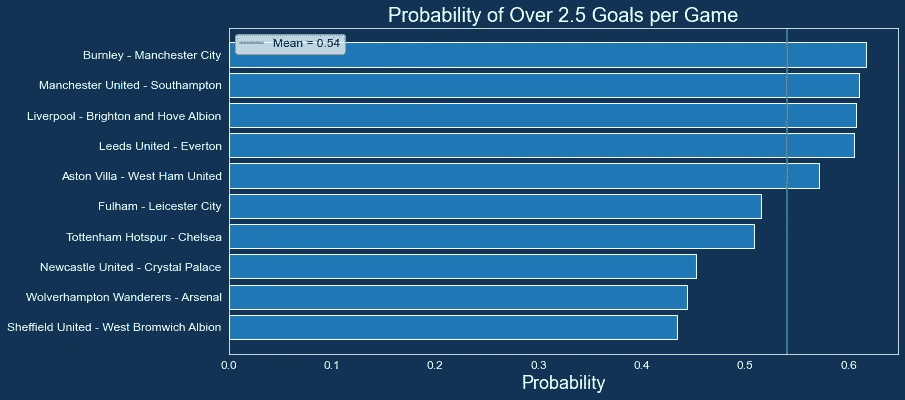

相反，我们可能希望从 ***赔率超过 2.5*** 的游戏中获得更多的 ***攻击玩家*** ，例如 **BUR-MCI、MUN-SOU、LIV-BHA 和 LEE-EVE。**

# 裁判统计

从下面的统计数据来看，在比赛中出现点球的几率更高:**李-伊夫、WOL-阿雷斯和门-苏**，所以我们建议**让这些球队中的一些球队拥有点球手**。看起来，像游戏 **AVL-WHU，李-伊夫和丽芙-BHA 有裁判喜欢给很多卡**，所以预计会失去一些黄/红牌。

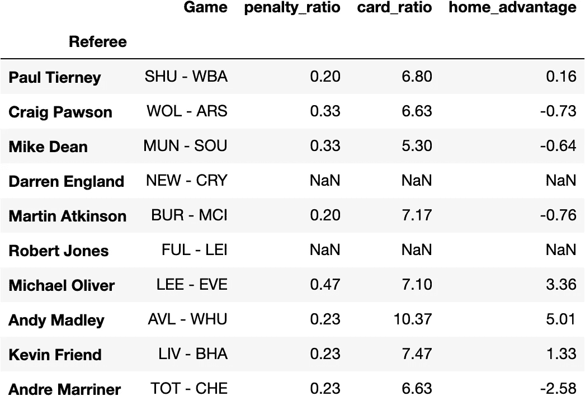

# 预计首发阵容

在我们运行最终的球队选择器之前，让我们考虑一下每支球队的预计首发 11 人以及可疑/受伤的球员。请 ***带着“半信半疑”的态度拍下下表*** *既然很多，那就在* ***COVID 测试后的最后一分钟修改更新和伤害。***

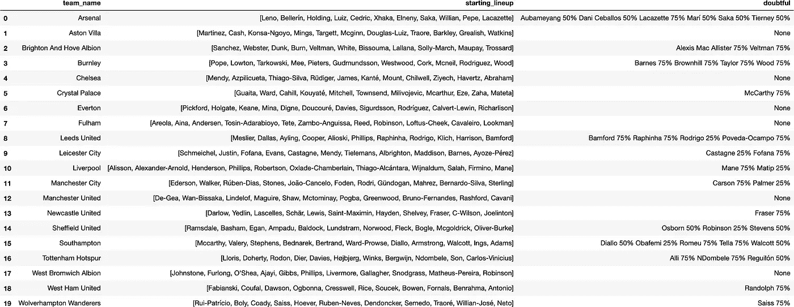

请注意上面的`doubtful`栏和下面的最新伤病表，尽量保护自己免受可能错过下场比赛的球员的伤害。

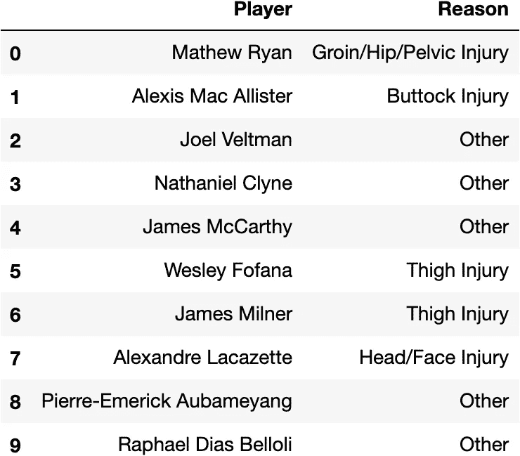

# 团队累积投资回报统计

这张表可以揭示哪些**球队总体上被认为是好的投资，哪些球队有很多定价过高、表现不佳的球员**。球队按平均每名球员得分排序，所以毫不奇怪 **AVL、MCI、SOU、WHU、LIV、TOT 和 MUN 是排名最靠前的球队，**因为他们的球员价格已经超出了他们的预期。一些价格更高、表现不佳的球员可以在 **NEW、SHU、WBA、CRY、EVE 和 FUL** 中找到，所以从这些球队中挑选球员是一个很好的主意。

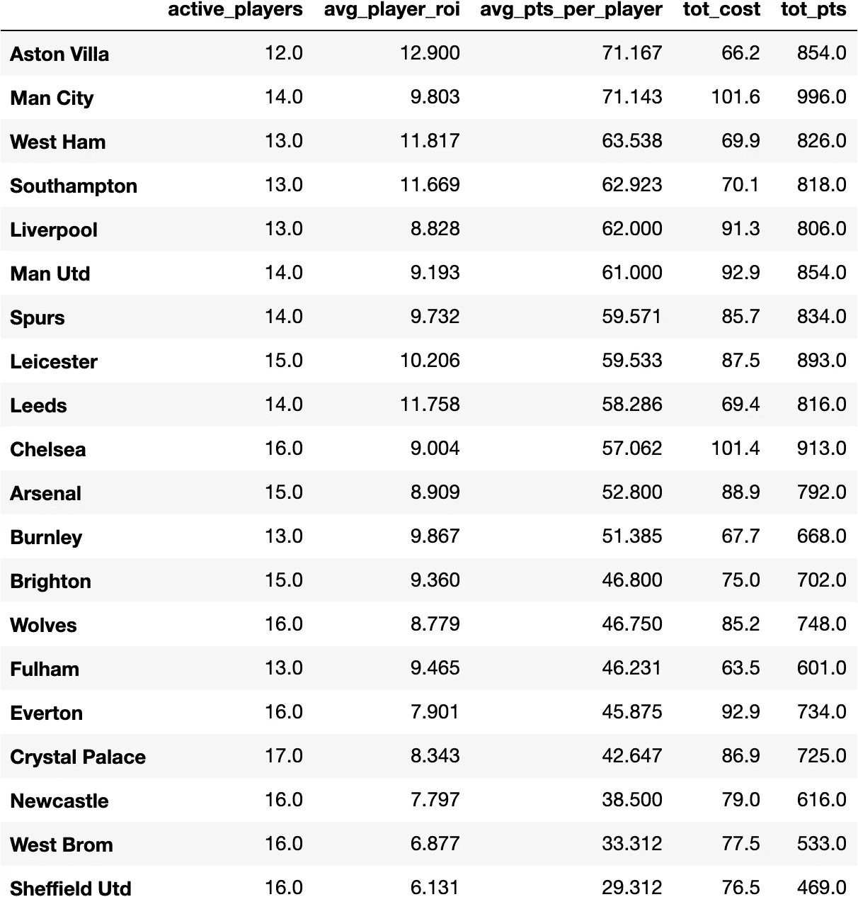

# 防守与进攻团队统计

到目前为止，拥有来自的李、、、李、、的进攻球员似乎是一笔不错的投资。

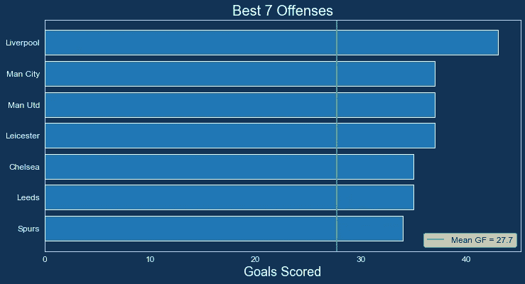

虽然有太多来自的进攻球员，但舒、WBA、FUL、、纽卡和的球员似乎是一个糟糕的投资，除非你有一个像威尔逊这样的球队中进球最多的球员。

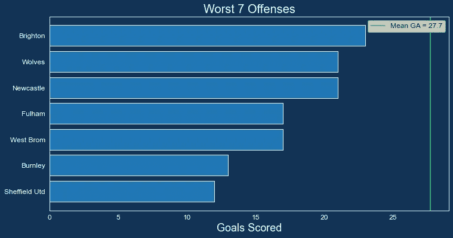

拥有来自 TOT，MCI，AVL，ARS，EVE，CHE 和 LIV 的防守球员似乎是一项不错的投资。

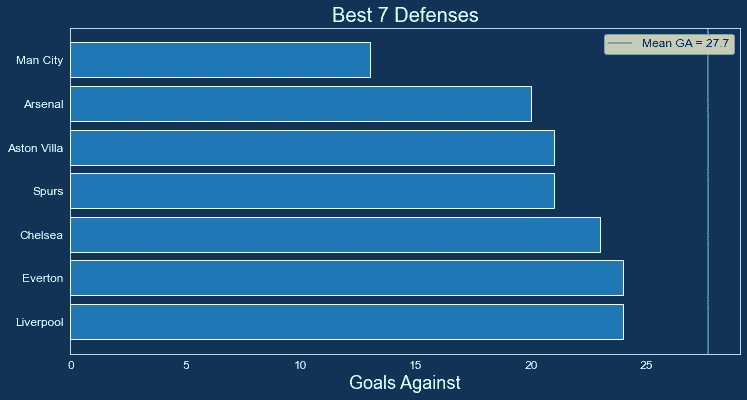

虽然有来自 WBA 的防守球员，李，CRY，舒，，纽卡和似乎是一个糟糕的投资。

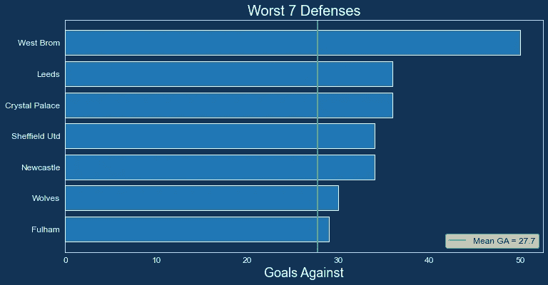

# 推荐人队长

我们的方法采用了即将到来的比赛的预测得分、球员罚点球、角球或任意球的概率、球员在过去 4 个赛季中空中威胁的系数、他们的球队打进 2 个或更多球的可能性，并以标准化的方式将所有这些混合成一个 ***最终队长选择系数*** 。然后，根据球员的下一个**对手调整后的 FDR** 和本赛季**防守强度的标准化得分**，将系数**减去*对手阻力得分*** 。熊猫 DF 看起来像下面的例子:

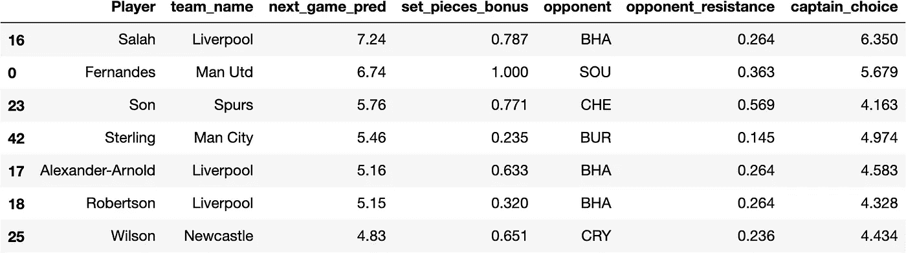

# 定位球抢手和空中威胁

考虑让定位球选手和禁区威胁系数高的球员做你的队长也很好，因为他们比其他球员获得更多进攻得分的机会。

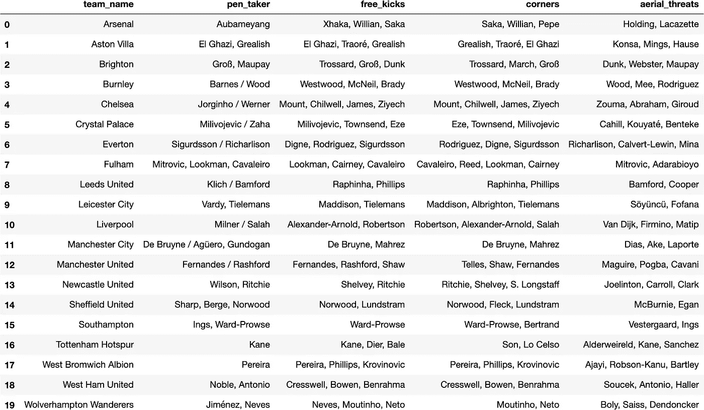

基于这个公式，这里是这个 GW 的前 15 名推荐队长名单。那里有很多好的选择，所以无论如何都不是一个容易的选择。我们的推荐人认为你应该选择**萨拉赫、布鲁诺、** **斯特林、TAA 和 C .威尔逊**作为你的前五名选择*。*

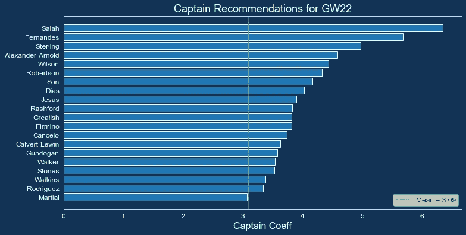

# 预测模型(球员统计)

现在是今年改进算法的皇冠上的宝石——预测球员统计数据的时候了。在我们将所有 FDR、赌注系数、ref 首发、预计阵容和伤病分层后，有两个主要指标*我们在为下一个 n-gameweeks 团队选择调整我们的团队优化器时会考虑到— ***预测总积分和期望值(ROI)。*** 下面是每个指标的统计数据，也是按职位细分的。*

# *预计总积分—前 25 名玩家*

*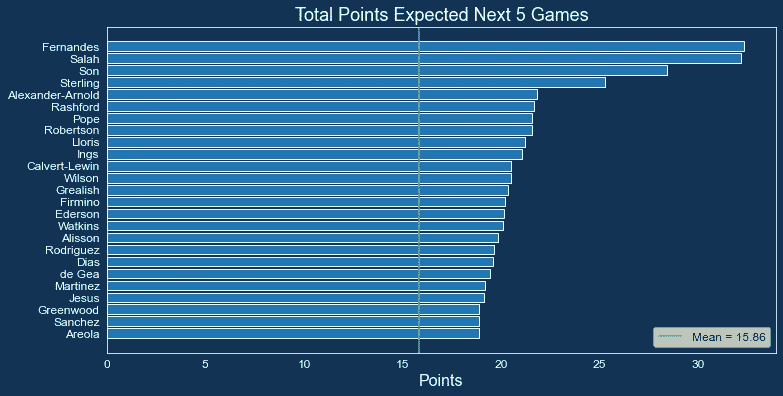*

# *预计总价值—前 25 名玩家*

*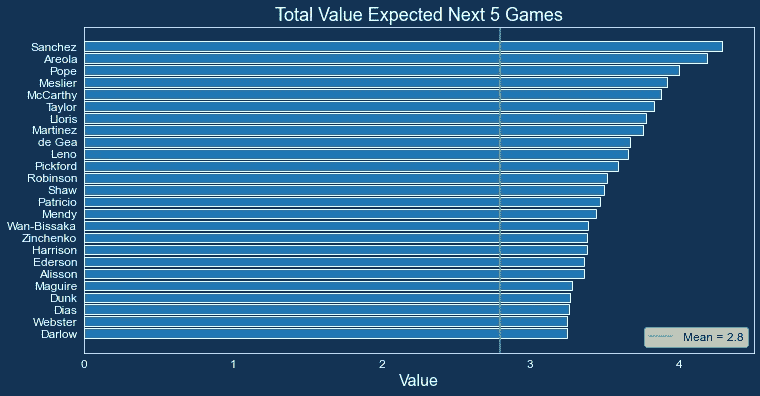*

> ***注意:**通常我们将我们的团队设计为上述两种状态的组合，以便在具有高积分期望的昂贵球员和预计在未来 4-5 周内产生良好价值的较便宜球员之间平衡我们的预算。*

# *预测积分——顶级守门员*

*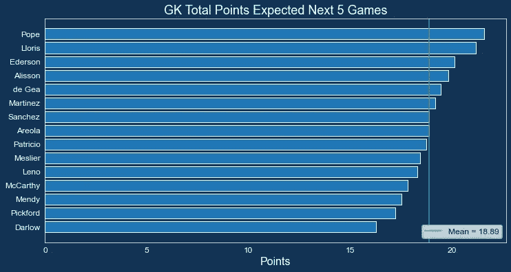*

# *投射点数—顶级防守者*

*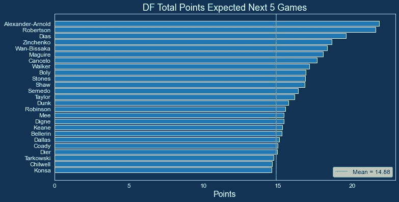*

# *预测得分——顶级中场*

*一些有趣的微分名字是**拉什福德，格林伍德，内图，哈里森，沃德-普劳斯，卢克曼和巴克利。***

*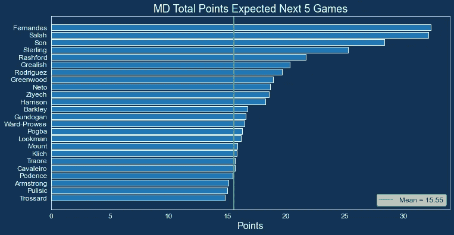*

# *预测分数——顶级前锋*

*有趣的是，看到大多数廉价的前锋在名单上，如 **Ings，DCL，Wilson，Firmino 和 Watkins。***

*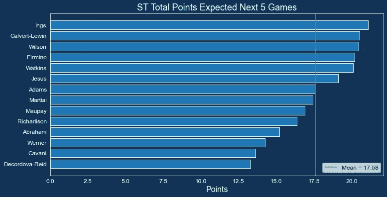*

*正如你所看到的，每个位置都有大量选项可供我们选择，因此我们将把上面的许多统计数据插入 Python 中的 ***优化函数，该函数将 ***输出具有最高预期总积分*** 的团队，给定我们的预算约束和进入我们决策过程的其他指标。在团队选择器代码生效之前应用的一些初步过滤器包括:****

1.  ***排除受伤或停赛球员***
2.  ***将球员排除在 FDR 高的队伍之外***
3.  ***排除即将到来空白周的玩家***
4.  ***同一支队伍不能有超过 3 名队员***
5.  ***总共必须有 15 名球员(GK=2，DF=5，MD=5，ST=3)***

# *优化最常用信息的预算*

*上周前 100 名选手最常用的阵型是 3-4-3，所以我们将展示一个针对这种阵型的优化团队。正如你在下面看到的，模型首先查看参数，告诉它是否应该向 15 名球员的*全队优化，或者向有 ***11 名关键球员和 4 名廉价替补*** 的特定阵型优化。对于填充符，它首先查看*，并使用该 ***来决定每个位置*** 需要多少个填充符。然后，模型从我们的初始预算中减去花费在 4 个填充者上的总金额，并将剩余的预算花费在关键的 11 个玩家上， ***给出优化函数和模型约束*** 。***

****示例 1:向最大期望点数优化****

**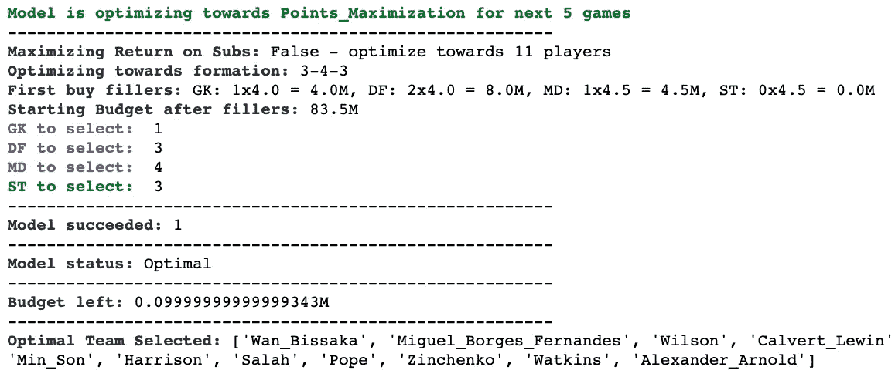****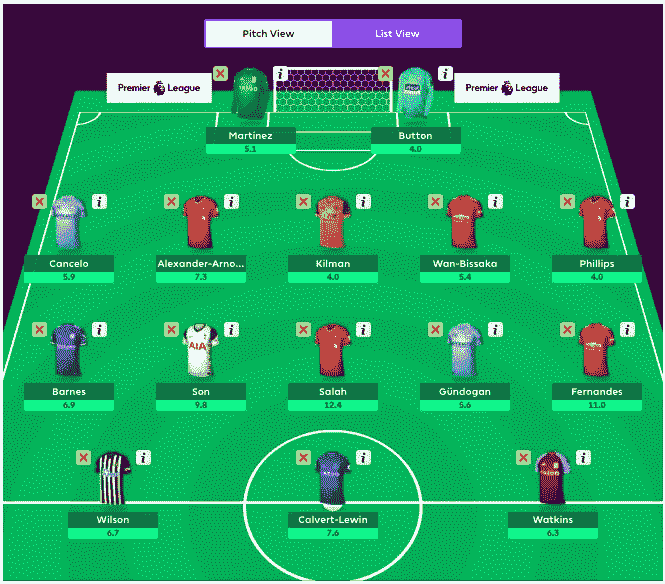**

****示例 2:优化所有 15 名玩家的最大值****

**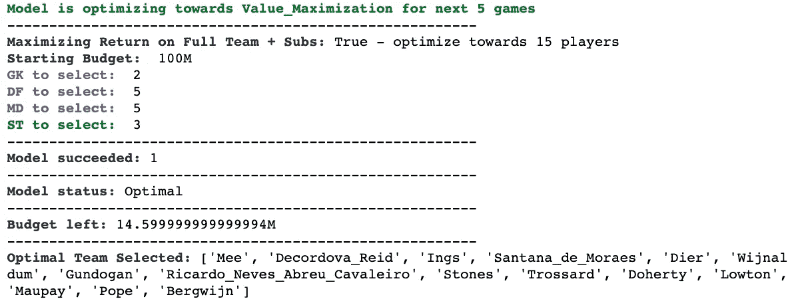**

# **我们的 GW22 团队**

**我们将一直使用上周得分最高的球队，并尝试最多进行 1-2 次转会。因为我们在 2 月 1 日写这篇博客，在 2 月 2 日比赛开始之前可能会有更多的伤病和转会消息，所以我们会等到最后一分钟再进行转会。下面是我们目前的团队，我们可能会决定只保留和保存一个转移到下一次。**

**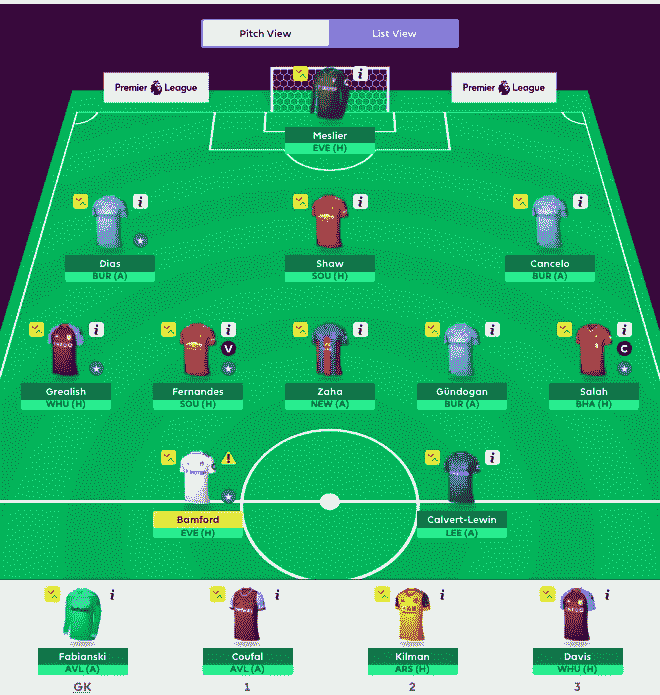**

# **结论**

**随着**科维德和不断增加的伤病**，考虑让**得到一些更便宜的价值球员可能是一个好策略，这些球员通常至少打 60 分钟**，以防你的首发阵容遭受意想不到的损害。我们也建议等到截止日期的最后一天再进行转会，因为计划和预测每个比赛周将有哪些球员上场已经变得非常困难。一如既往地感谢您的阅读，祝您本周好运！**