# EPL 幻想 GW23 重述和 GW24 算法选择

> 原文：<https://medium.datadriveninvestor.com/epl-fantasy-gw23-recap-and-gw24-algo-picks-71e9cfafa4da?source=collection_archive---------4----------------------->

我们的金钱球方法到幻想的 EPL(队 _id: 2122122)

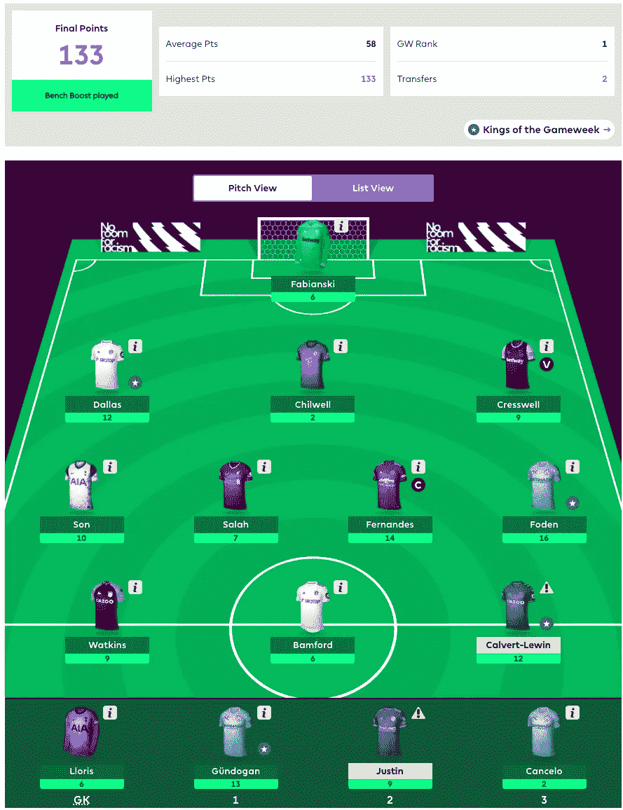

Top Team GW23

如果这是你第一次登陆我们的幻想 EPL 博客，你可能想看看我的媒体档案中的一些我们最初的 EPL 博客，以熟悉这个项目是如何开始的，以及随着时间的推移我们所做的改进。

# GW23 年度 FPL 团队 100 强经理统计

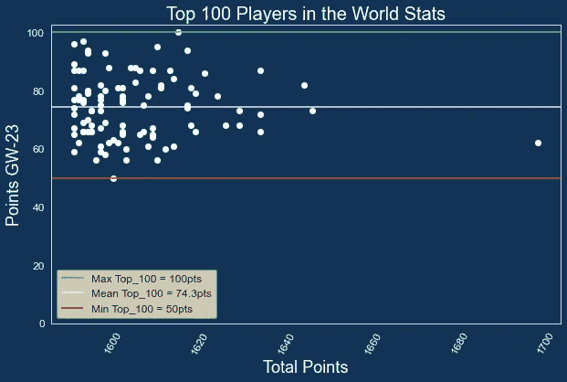

看起来世界排名前 100 位的玩家**过了一个不错的星期，平均得分约为 74 分，**但也有相当多的玩家得分在 50-60 分之间。所以**，**如果你的得分接近或超过 60 分，你会自我感觉良好:)

# 前 100 名经理评选出的最佳守门员

鉴于马丁内斯最近的表现，他在这里是一个很容易的选择，但我们也可以看到**许多高层经理为即将到来的双赛周**做计划，并在**波普、阿雷奥拉和麦卡锡**早期投资。

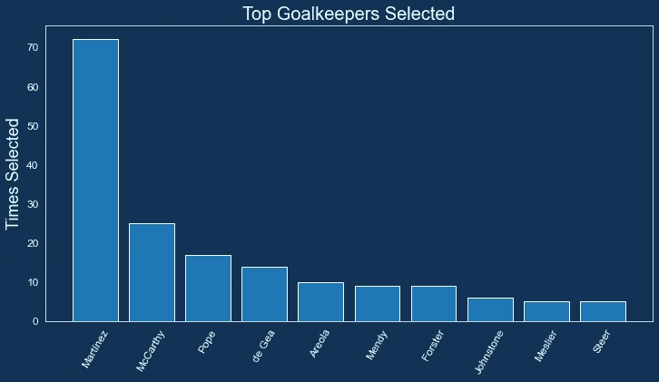

# 前 100 名经理选择最多的捍卫者

在这里看到许多表现出色的后卫和即将到来的双周比赛的后卫并不奇怪。

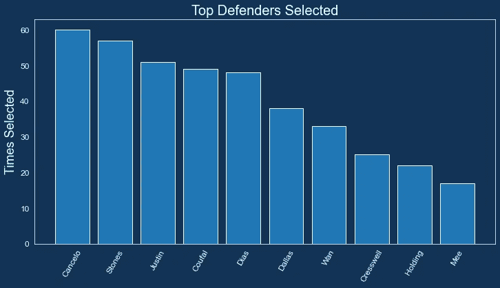

# 前 100 名教练选择最多的中场球员

在最高管理者的选择中，马迪森、拉菲尼亚和萨卡人似乎是一些更不寻常的名字。

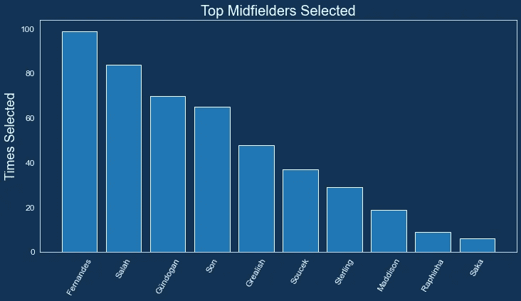

# 前 100 名经理选择最多的罢工者

这没什么奇怪的…除了也许**人仍然有沃纳** …

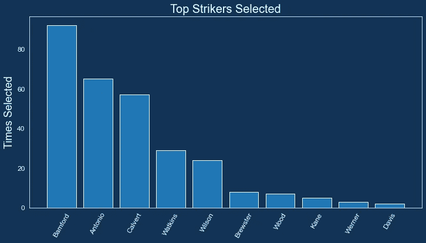

我们使用这些数据创建了下面的团队，它是由世界上 100 位顶级经理挑选的最优秀的球员组成的:

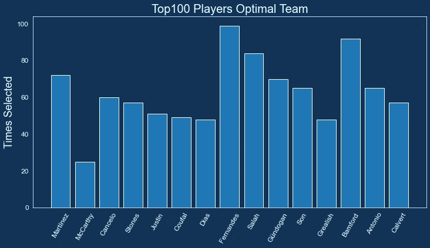

# GW23 团队绩效总结和总体统计

总的来说，我们对自己的表现很满意，因为我们有两个团队的得分接近前 100 名 FPL 经理人的平均得分 74 分。跟着**算法走队长推荐带着儿子再一次得到了**的回报。让基尔曼坐在板凳上拿 8 分是我们唯一失望的事情。

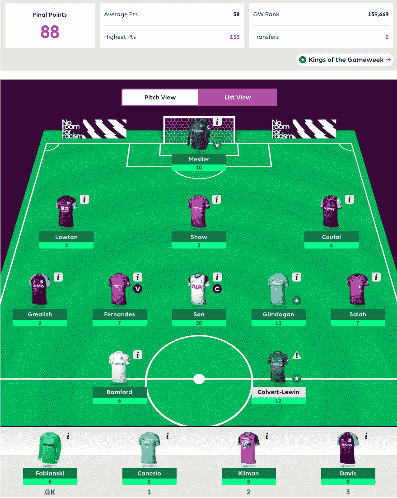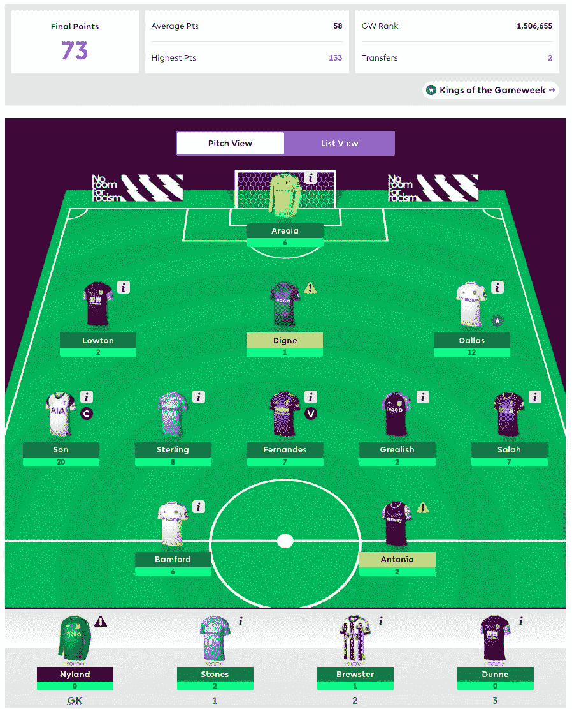

我们还参加了 FPL 的 FanTeam 版本，在那里我们也有两个坚实的分数，再次感谢选择优秀队长和替补正确人员的决定。

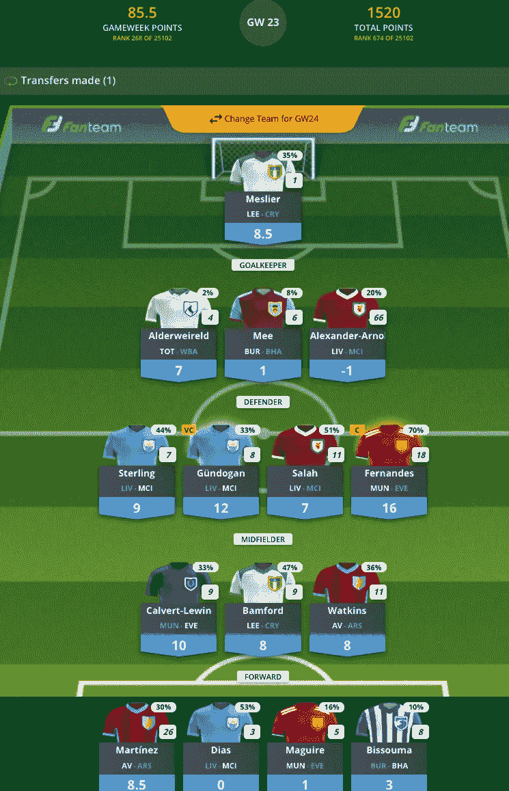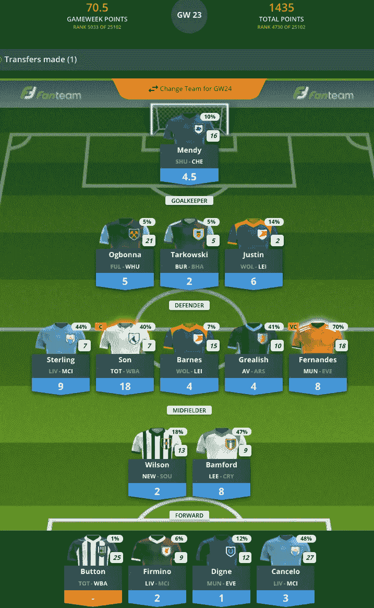

# 为我们的 GW24 精选提供有用的统计数据

让我们从下面三个比赛周的调整后的固定难度等级(FDR)开始:

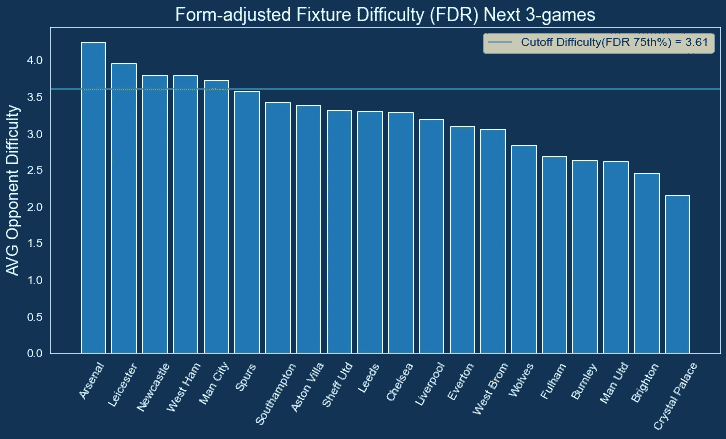

所以我们正处于一个有趣的时期，比赛会有很多双 GW，所以我们不能只看 FDR，还要看不同球队的球员可能得到的上场时间。例如，**即使 MCI 有一些艰难的比赛即将到来——TOT 和 EVE——我们可能仍然希望他们有更多的球员，因为累积的分数**。除此之外，看起来 ARS，雷，NEW，WHY 和 TOT 都有一些艰难的比赛即将到来，所以我们在投资这些球队的球员时可能要小心。 **CRY，BHA，MUN，BUR 和 FUL** 在接下来的三周内似乎有更轻松的赛程，所以我们的算法会倾向于这些球队的球员，特别是 BUR 和 FUL，他们有双 GW24。

# 博彩赔率

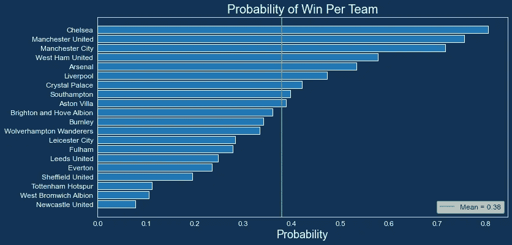

我们将尝试积累来自 ***队伍的玩家，他们有超过 50 %的机会赢得*** ，例如 **CHE、MUN、MCI、和 ARS。**尽量不要有太多来自 **NEW，WBA，TOT，SHU，EVE 的防守球员。**

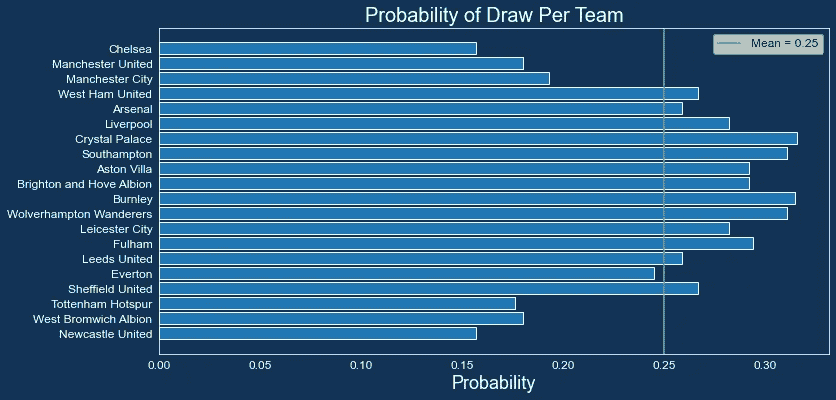

拥有 ***的队伍以更高的概率抽到了*** ，特别是当比赛是 ***结合高赔率为 2.5 以下的*** 时，可能会对选择 ***防守队员*** 有利，因为如果比赛以 0:0 结束，那将会产生大量的奖励点数。结合 下方的 ***Under/Over 图，我们可以确定以下游戏中 ***至少有一场不失球的概率较高——CRY-BUR、BUR-FUL、SOU-WOL 和 SHU 舒。******

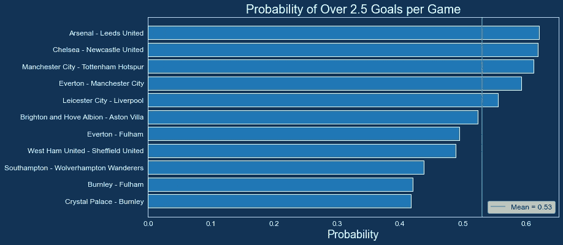

反过来，我们可能希望有更多的*来自 ***赔率超过 2.5*** 的游戏，如 **ARS-LEE、CHE-NEW、MCI-TOT、EVE-MCI、和 LEI-LIV。***

# *裁判统计*

*从下面的数据来看，在游戏中出现点球的几率更高: **CRY-BUR，WBA-MUN，LEI-LIV 和 ARS-LEE** 所以我们建议**从这些队伍中挑选点球手**。看起来，像游戏 **EVE-FUL，SHU 舒，和搜-WOL 有裁判喜欢给很多卡**，所以期待从黄/红牌中失去一些分数。*

**

# *预计首发阵容*

*在我们运行最终的球队选择器之前，让我们考虑一下每支球队的预计首发 11 人以及可疑/受伤的球员。请 ***带着“半信半疑”的态度对待下表*** *既然很多，那就在* ***COVID 测试后最后一刻修改更新和伤害。****

**

*请注意上面的`doubtful`栏和下面的最新伤病表，尽量保护自己免受可能错过下场比赛的球员的伤害。*

*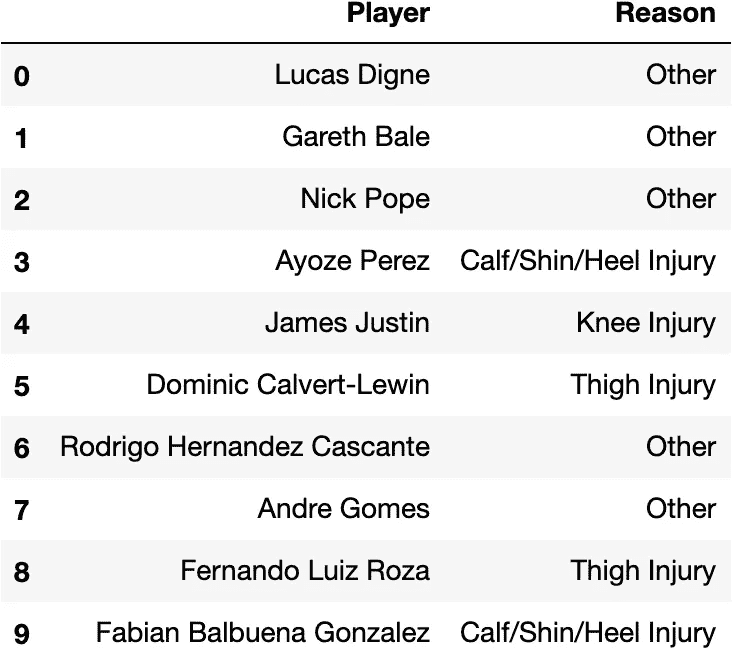*

# *团队累积投资回报统计*

*这张表可以揭示哪些球队总体上被认为是好的投资，哪些球队有很多定价过高、表现不佳的球员。球队按 **avg_pts_per_player、**排序，所以毫不奇怪 **AVL、MCI、MUN、LIV、TOT、WHU 和 LEE 是排名最靠前的球队，**因为他们的球员价格已经超出了他们的预期。一些价格更高、表现不佳的球员可以在 **NEW、SHU、WBA、CRY 和 FUL** 中找到，所以从这些球队中挑选球员是一个很好的主意。*

*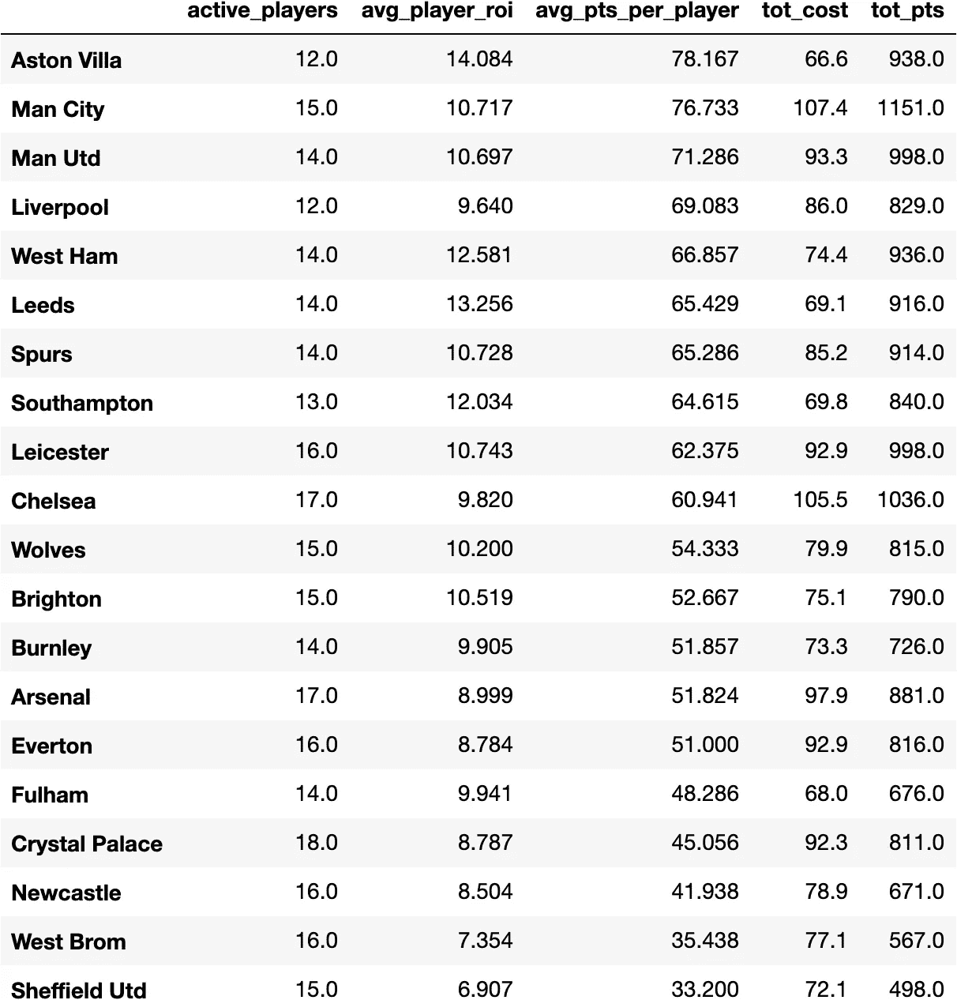*

# *防守与进攻团队统计*

*到目前为止，拥有来自 LIV，MUN，MCI，雷，TOT，CHE 和 LEE 的进攻球员似乎是一笔不错的投资。*

*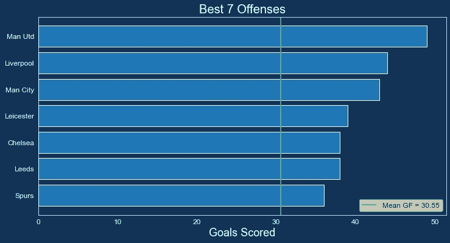*

*虽然有太多来自 BUR、SHU、WBA、FUL、、NEW 和的进攻球员，但这似乎是一项糟糕的投资，除非你有一个像 C.Wilson 这样的球队中进球最多的球员。*

*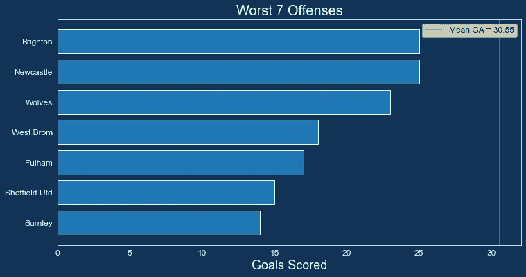*

*从 TOT、MCI、、ARS、车、雷和引进防守球员似乎是一笔不错的投资。*

*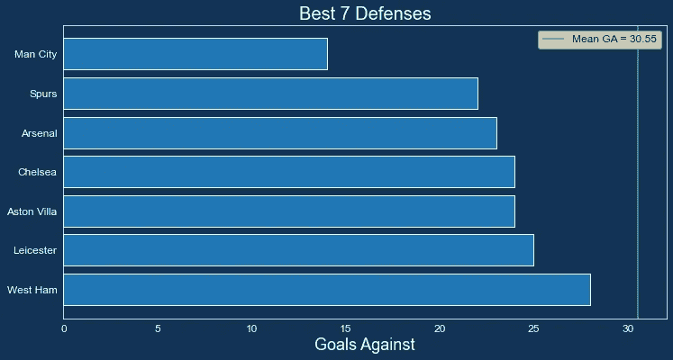*

*而拥有来自 WBA 的防守球员，李，CRY，舒，新，苏，和似乎是一个糟糕的投资。*

*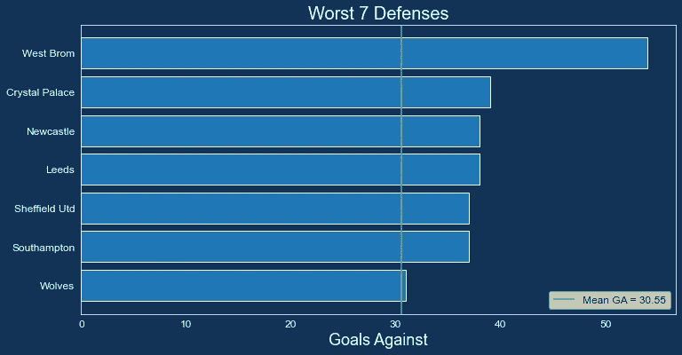*

# *推荐人队长*

*我们的方法采用了即将到来的比赛的预测分数，球员罚点球、角球或任意球的概率，球员在过去 4 个赛季中空中威胁的系数，他们的球队打进 2 个或更多球的可能性，并以标准化的方式将所有这些混合成一个 ***最终队长选择系数*** 。然后，根据玩家的下一个**对手调整后的 FDR** 和本赛季**防守强度的标准化得分**，将系数**减去*对手抗性得分*** 。熊猫 DF 看起来像下面的例子:*

*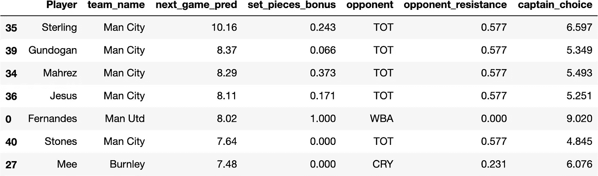*

# *定位球抢手和空中威胁*

*考虑让定位球选手和禁区威胁系数高的球员做你的队长也很好，因为他们比其他球员获得更多进攻得分的机会。*

**

*基于这个公式，这里是这个 GW 的前 20 名推荐队长名单。那里有很多好的选择，所以无论如何都不是一个容易的选择。我们的推荐人认为你应该选择**布鲁诺、斯特林、理查森、塔尔夫斯基/米或拉什福德**作为你的前五名选择*。**

*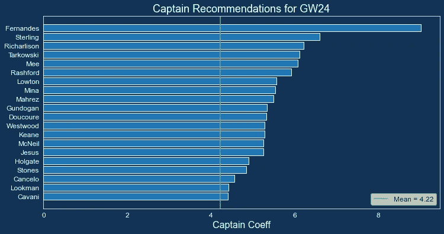*

# *预测模型(球员统计)*

*现在是今年改进算法的皇冠上的宝石——预测球员统计数据的时候了。在我们将所有的 FDR、赌注系数、裁判首发、预计阵容和伤病分层后，有两个主要指标*我们在为接下来的 n 场比赛周团队选择调整我们的团队优化器时会考虑到— ***预测总积分和期望值(ROI)。*** 下面是每个指标的统计数据，也是按职位细分的。**

# **未来 5 场比赛的预计总点数**

**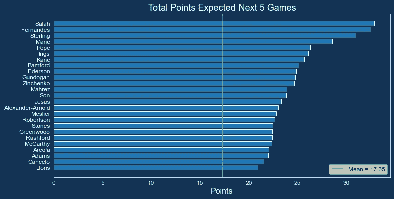**

# **下一场比赛的预计总点数**

**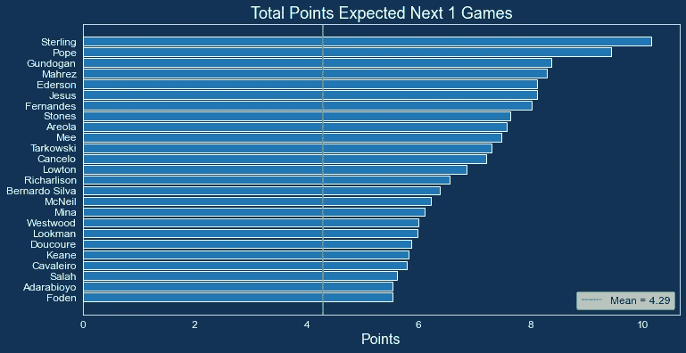**

# **未来 5 场比赛的预计总价值**

**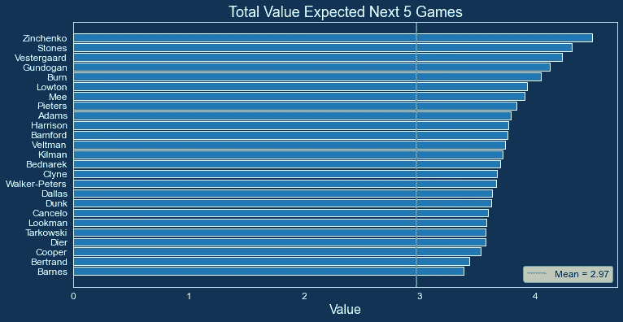**

****如你所见，每个位置都有大量选项可供我们选择，因此我们将把上面的大量统计数据插入 Python 中的 ***优化函数，该函数将 ***输出具有最高预期总积分*** 的团队，给定我们的预算约束和其他进入我们决策过程的指标。在团队选择器代码生效之前应用的一些初步过滤器包括:*******

1.  *****排除受伤或停赛球员*****
2.  *****将球员排除在 FDR 高的队伍之外*****
3.  *****排除即将到来空白周的玩家*****
4.  *****同一团队不能有超过 3 名玩家*****
5.  *****总共必须有 15 名球员(GK=2，DF=5，MD=5，ST=3)*****

# ***优化最常用信息的预算***

***上周前 100 名选手最常用的阵型是 3-4-3，所以我们将展示一个针对这种阵型的优化团队。正如你在下面看到的，模型首先查看参数，告诉它是否应该向 15 名球员的*全队优化，或者向具有 ***11 名关键球员和 4 名廉价填充球员*** 的特定阵型优化。对于填充符，它首先查看*，并使用那个 ***来决定每个位置*** 要获得多少个填充符。然后，模型从我们的初始预算中减去花费在 4 个填充者上的总金额，并将剩余的预算花费在关键的 11 个参与者上， ***给出优化函数和模型约束*** 。*****

******示例 1:向最大期望点数优化******

****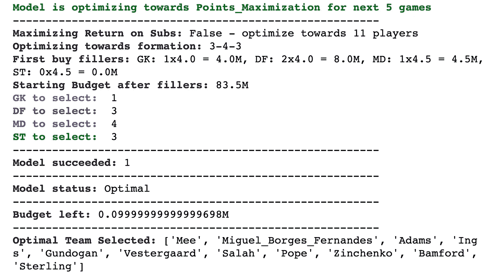********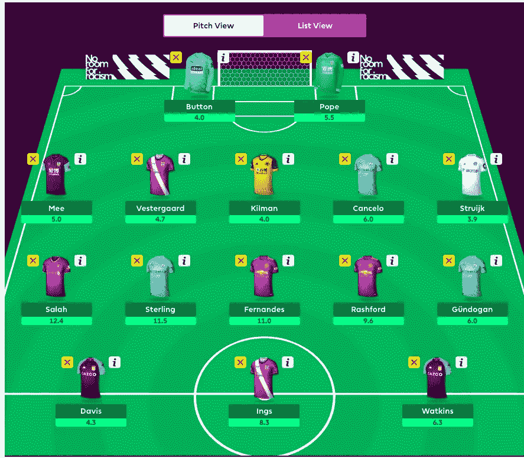****

****算法优化了 3-5-2 阵型，所以根据上面的模板，我们将让**基尔曼、斯特鲁吉克和戴维斯坐冷板凳。******

******示例 2:优化所有 15 名玩家的最大值******

****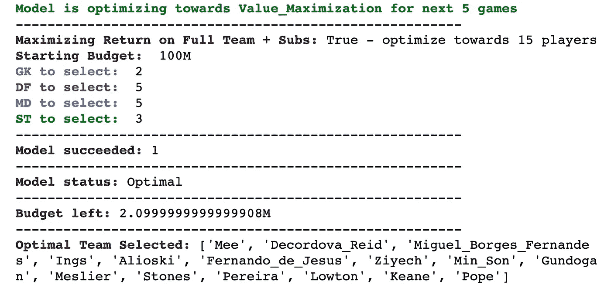****

# ****我们的 GW24 团队****

****我们将一直使用上周得分最高的球队，并尝试最多进行 1-2 次转会。不幸的是，我们上周匆忙转会，忘记了周中有足总杯和**现在我们有 DCL 怀疑**:(我们可能会等到周五更多关于 DCL 受伤有多严重的更新，如果我们可能不得不咬紧牙关和**摆脱 DCL，因为接下来会有 SOU double-GW。******

****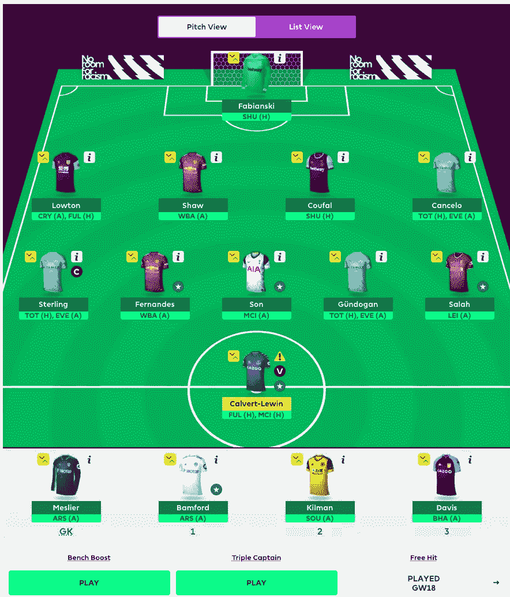****

# ****结论****

****随着确认的双游戏周在 GW 24–26 的到来，我们建议仔细挑选你的转会，并提前考虑 2–3 场比赛。尤其是如果你还剩下一些筹码，你可能想在这两个游戏周内采取激进的行动。**我们也建议不要在本周过早地进行转会**,因为许多背靠背的比赛似乎会给球队带来比平时更多的伤病问题。一如既往地感谢您的阅读，祝您本周好运！****