# EPL 幻想 GW24 回顾和 GW25 算法选择

> 原文：<https://medium.datadriveninvestor.com/epl-fantasy-gw24-recap-and-gw25-algo-picks-6775db744e5e?source=collection_archive---------6----------------------->

目前排名 12K -世界前 0.15%(team _ id:2122122)

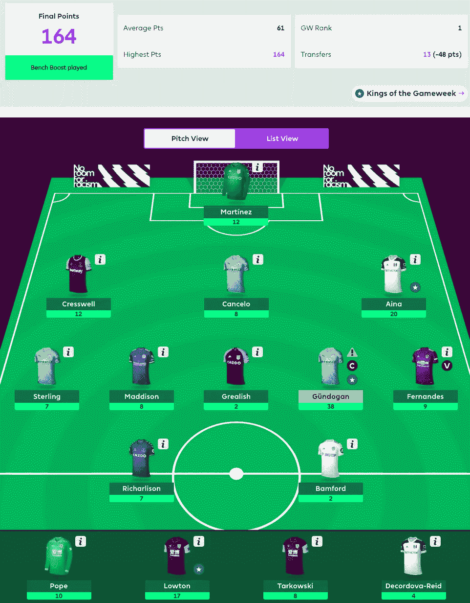

Top Team GW24

如果这是你第一次登陆我们的幻想 EPL 博客，你可能想看看我的媒体档案中的一些我们最初的 EPL 博客，以熟悉这个项目是如何开始的，以及随着时间的推移我们所做的改进。

# GW24 年度 FPL 团队 100 强经理统计

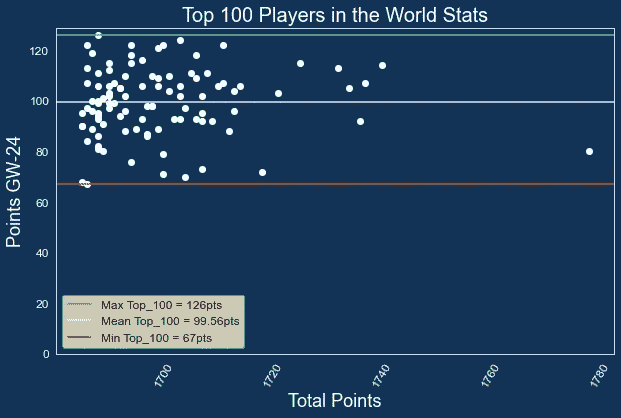

全球排名前 100 位的 FPL 经理人度过了疯狂的一周，他们的平均得分高达 100 分，许多人的得分在 110-120 分之间！！！所以**，**如果你设法取得了接近或超过 100 分的分数，你会对自己感觉非常好:)

# 前 100 名经理评选出的最佳守门员

尽管 Pope 和 Areola 拥有双 GW，但似乎大多数经理都选择了马丁内斯，这被证明是一个伟大的举动。

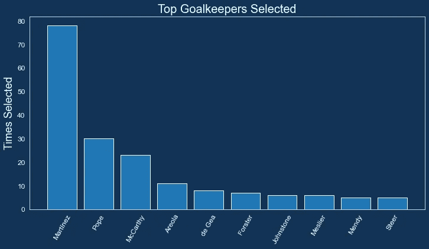

# 前 100 名经理选择最多的捍卫者

在这里看到许多表现出色的后卫和即将到来的双周比赛的后卫并不奇怪。

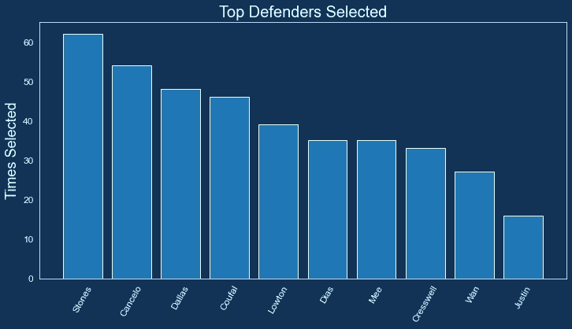

# 前 100 名教练选择最多的中场球员

**令人惊讶地看到如此低的英镑所有权**，回想起来这也被证明是正确的举措…

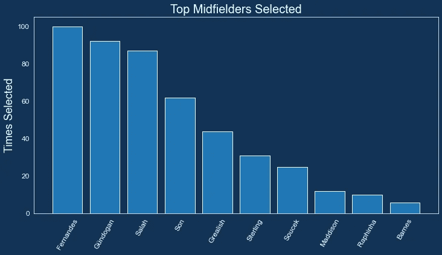

# 前 100 名经理选择最多的罢工者

看起来很多高层经理**被 DCL 困住，Antonio 受伤**，但不知何故仍然设法得分超过 100 分 AVG！

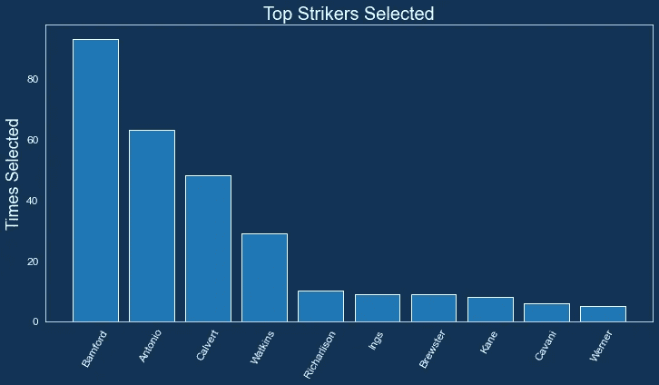

我们使用这些数据创建了下面的团队，它是由全球【Top100 位顶级经理人选出的最优秀的球员组成的:

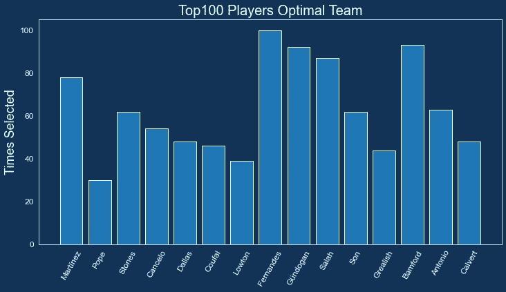

# GW24 团队绩效总结和总体统计

除了没有选择冈多作为我们的队长，总的来说，我们对我们的表现很满意，因为我们有两个队的得分高于 GW 平均水平。选择前两名**算法队长推荐——斯特林和布鲁诺——结果仍然不错**，尽管错过了冈多的机会。我们也很高兴我们没有在板凳上留下太多的分数。

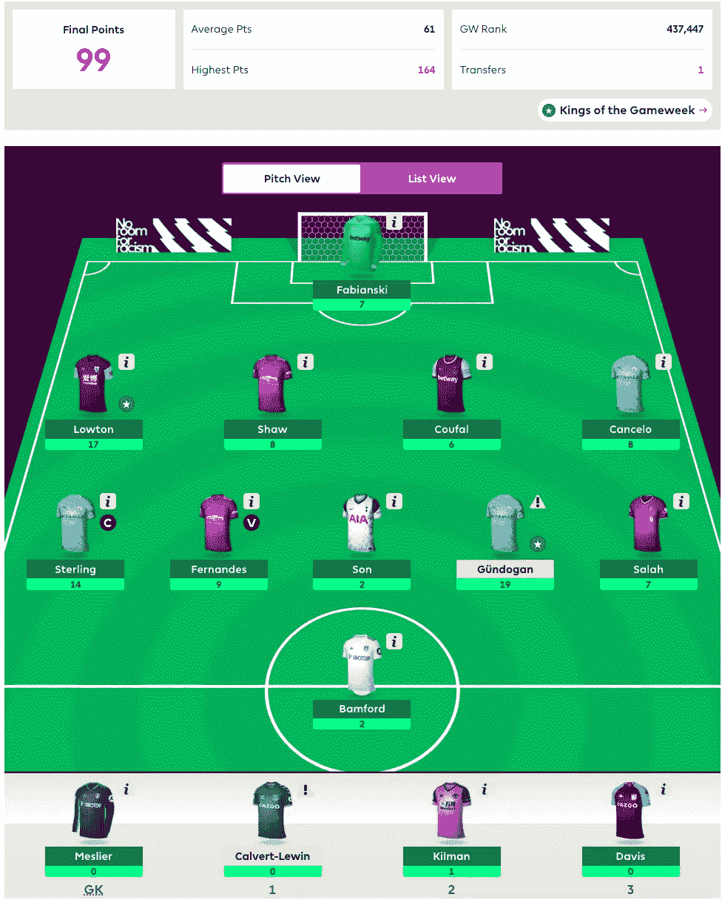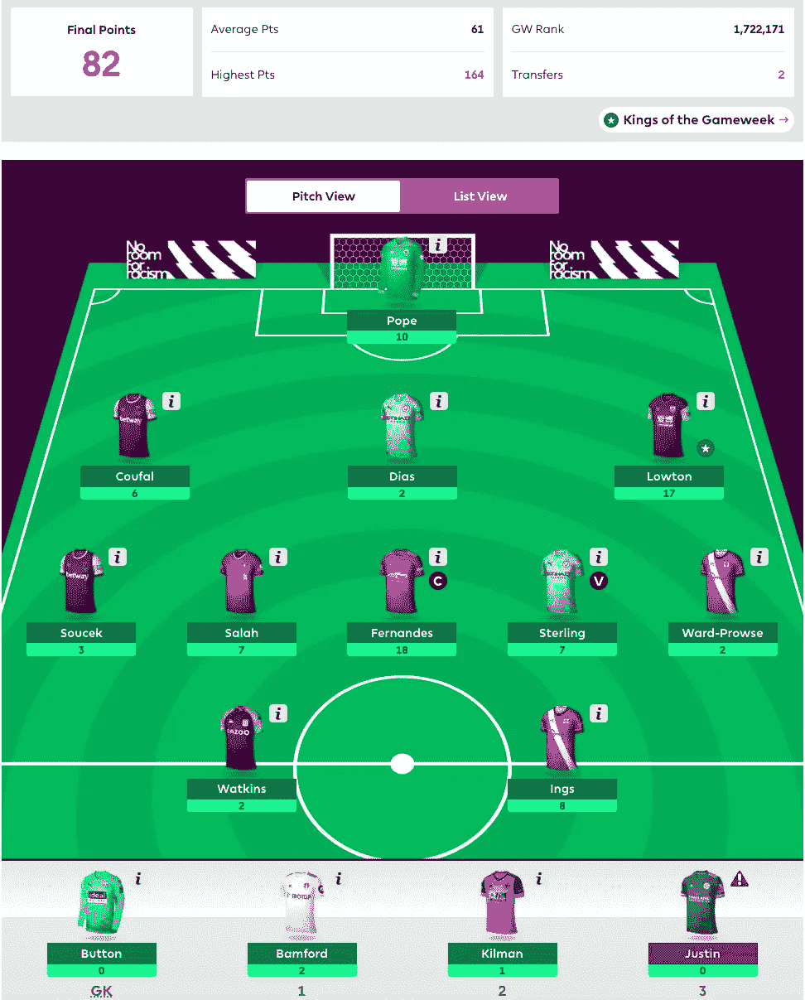

我们还参加了 FPL 的 FanTeam 版本，在那里我们也有两个坚实的得分，但我们再次错过了冈多队长的机会:(

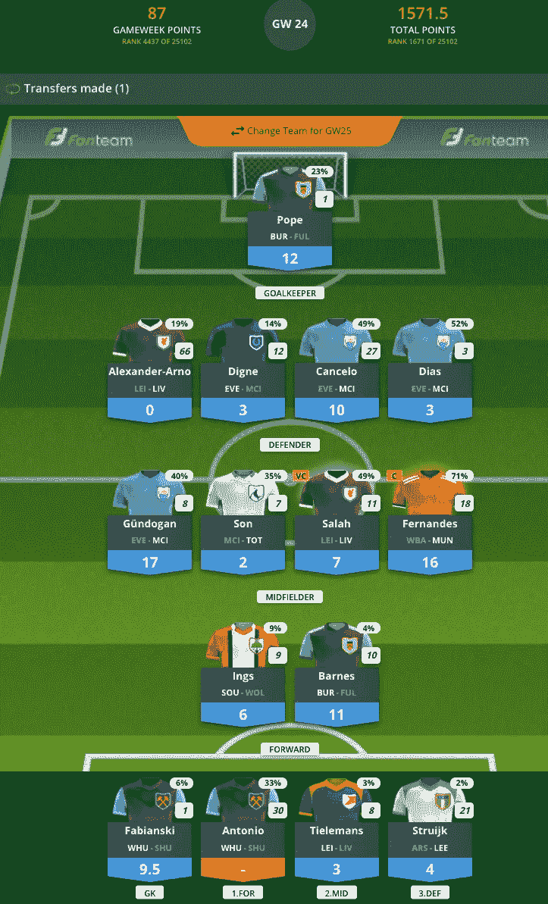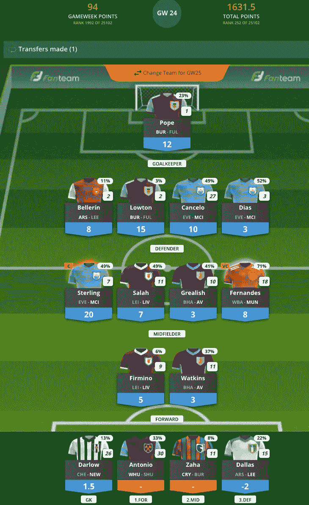

# 为我们的 GW25 精选提供有用的统计数据

下面让我们从调整后的未来三周比赛难度等级(FDR)开始。**请注意，下面的 FDR 计算没有随着最新的双 GW 更新进行调整**，这就是为什么一些团队如 MCI 显示出更高的 FDR。

排除 MCI 因为双倍 GW 而不准确的 FDR，其他一些即将进行艰苦比赛的球队是 WHU，ARS，MUN，EVE 和 CHE，所以我们在投资这些球队的球员时可能要小心。丽芙、托特、WBA、BHA 和 MCI(如果我们算上双 GW 的话)在接下来的三周里似乎有更轻松的赛程，所以我们的算法会偏向这些球队的球员。

# 博彩赔率

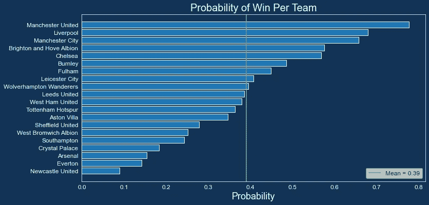

我们将尝试积累 ***队中有超过 50 %机会赢得*** 的球员，如**车、MUN、LIV、MCI、BHA 和 BUR。**尽量不要有太多来自 **NEW，EVE，ARS，CRY，SOU，WBA，SHU 的防守球员。**

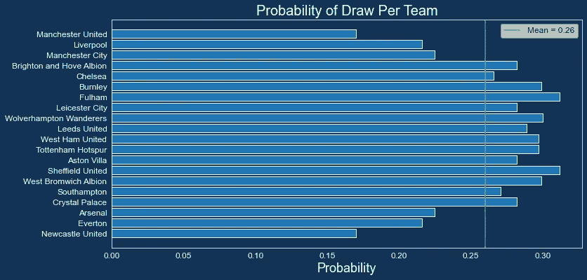

拥有 ***的队伍以更高的概率抽到了*** ，特别是当比赛是 ***结合 2.5*** 以下的高赔率时，可能会对选择 ***防守球员*** 有利，因为如果比赛以 0:0 结束，那将会产生大量的加分。结合 下方的 ***下/上图，我们可以识别出以下 ***概率较高的至少一场不失球的游戏——FUL-SHU、BHA-CRY、BUR-WBA、WHU-TOT。******

反过来，我们可能希望从 ***赔率超过 2.5*** 的游戏中有更多的 ***攻击玩家*** ，例如**门新、丽芙-伊芙、李苏、ARS-MCI、搜车和 AVL-雷。**

# 裁判统计

从下面的统计数据来看，在比赛中出现点球的几率更高:**雷，李，托，和布尔 WBA** ，所以我们推荐**从这些球队中挑选点球手**。看起来，像游戏**哭，雷，和 FUL-SHU 有裁判喜欢给很多卡**，所以预计会失去一些黄/红牌。

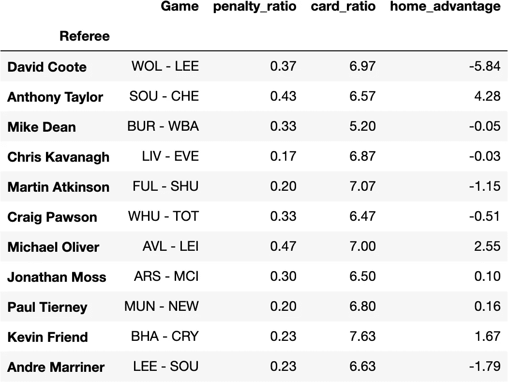

# 预计首发阵容

在我们运行最终的球队选择器之前，让我们考虑一下每支球队的预计首发 11 人以及可疑/受伤的球员。请 ***带着“半信半疑”的态度拍下下表*** *既然很多，那就在* ***COVID 测试后的最后一分钟修改更新和伤害。***

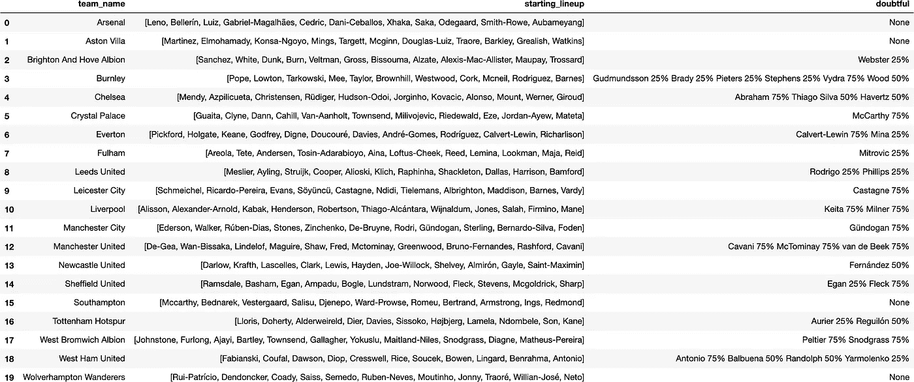

请注意上面的`doubtful`栏和下面的最新伤病表，尽量保护自己免受可能错过下场比赛的球员的伤害。

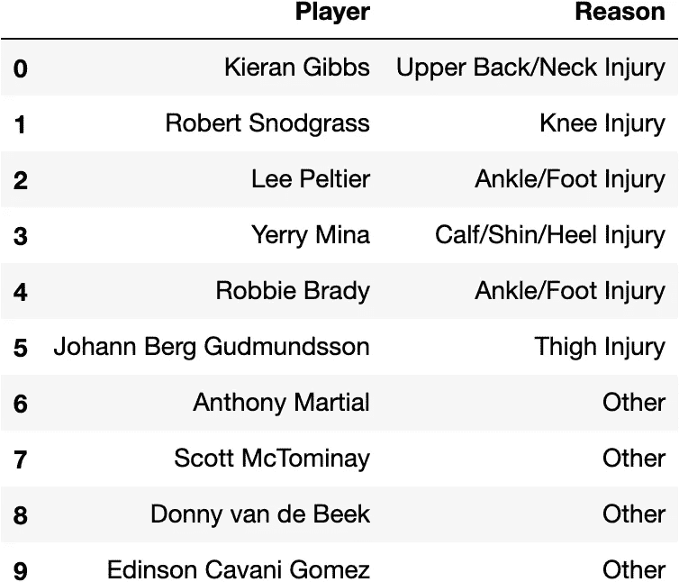

# 团队累积投资回报统计

这张表可以揭示哪些**球队被认为是整体上的好投资，哪些球队有很多定价过高、表现不佳的球员**。球队按**平均每名球员得分排序，**所以毫不奇怪 **AVL，MCI，MUN，LIV，TOT，WHU 和 LEE 是排名最靠前的球队，**因为他们的球员价格已经超出了他们的预期。一些价格更高、表现不佳的球员可以在 **NEW、SHU、WBA、CRY 和 FUL** 中找到，所以从这些球队中挑选球员是一个很好的主意。

# 防守与进攻团队统计

到目前为止，拥有来自门、中、利、雷、李、车和的进攻球员似乎是一笔不错的投资。

虽然有太多来自 BUR、SHU、WBA、FUL、、NEW 和的进攻球员，但这似乎是一项糟糕的投资，除非你有一个像 C.Wilson 这样的球队中进球最多的球员。

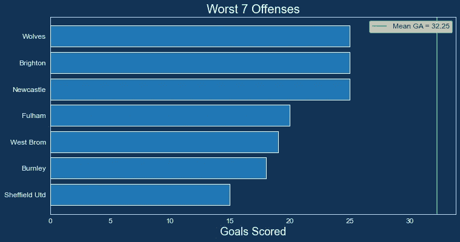

从 MCI、、ARS、CHE、TOT、雷和引进防守球员似乎是一笔不错的投资。

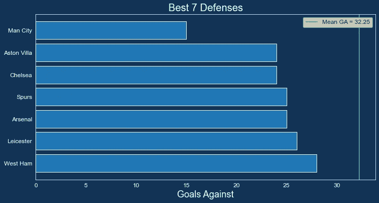

而拥有来自 WBA 的防守球员，李、CRY、舒、纽卡、苏和似乎是一笔不划算的投资。

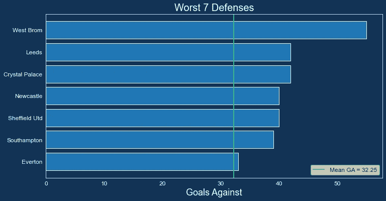

# 推荐人队长

我们的方法采用了即将到来的比赛的预测得分，球员罚点球、角球或任意球的概率，球员在过去 4 个赛季中空中威胁的系数，他们的球队打进 2 个或更多球的可能性，并以标准化的方式将所有这些混合成 ***最终队长选择系数*** 。然后，根据玩家的下一个**对手调整的 FDR** 和本赛季**防守强度的标准化得分**，将系数**减去*对手阻力得分*** 。熊猫 DF 看起来像下面的例子:

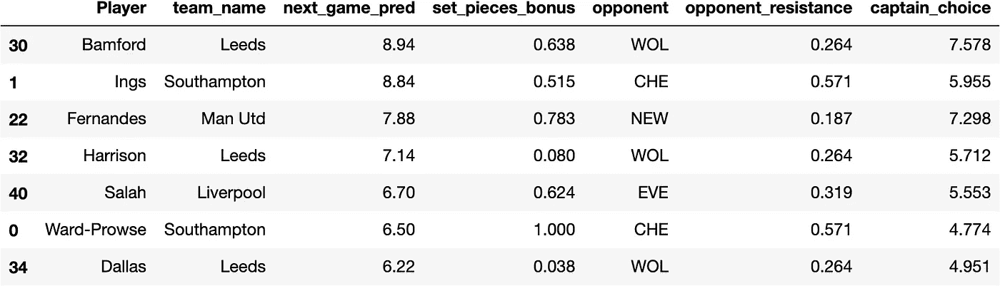

# 定位球抢手和空中威胁

考虑让定位球选手和禁区威胁系数高的球员做你的队长也很好，因为他们比其他球员获得更多进攻得分的机会。

基于这个公式，这里是这个 GW 的前 20 名推荐队长名单。那里有很多好的选择，所以无论如何都不是一个容易的选择。我们的推荐人认为你应该把**班福德、布鲁诺、因斯、哈里森和萨拉赫**作为你的前五名选择*。*

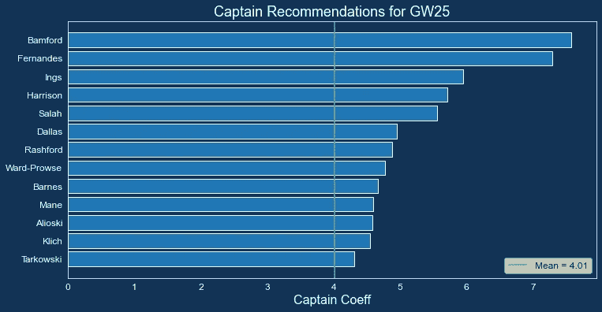

# 预测模型(球员统计)

现在是今年改进算法的皇冠上的宝石——预测球员统计数据的时候了。在我们将所有的 FDR、赌注系数、裁判首发、预计阵容和伤病分层后，有两个主要指标*我们在为接下来的 n 场比赛周团队选择调整我们的团队优化器时会考虑到— ***预测总积分和期望值(ROI)。*** 下面是每个指标的统计数据，也是按职位细分的。*

# *未来 5 场比赛的预计总点数*

*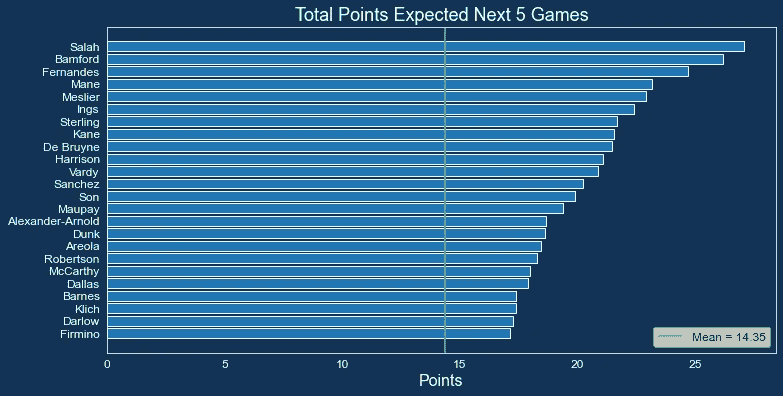*

# *下一场比赛的预计总点数*

*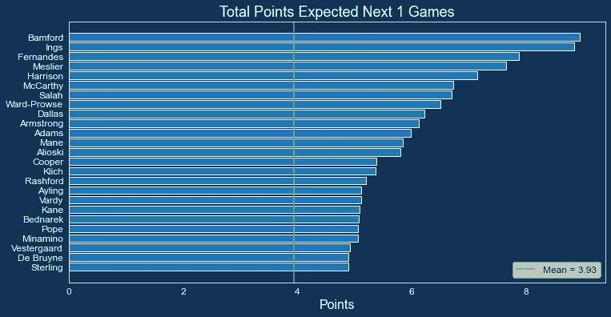*

# *未来 5 场比赛的预计总价值*

*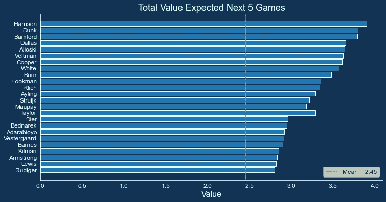*

> ***注意:**通常我们将我们的团队设计为上述两种状态的组合，以便在具有高积分期望的昂贵球员和预计在未来 4-5 周内产生良好价值的较便宜球员之间平衡我们的预算。*

*正如你所看到的，每个位置都有大量选项可供我们选择，因此我们将把上面的许多统计数据插入 Python 中的 ***优化函数，该函数将 ***输出具有最高预期总积分*** 的团队，给定我们的预算约束和进入我们决策过程的其他指标。在团队选择器代码生效之前应用的一些初步过滤器包括:****

1.  ***排除受伤或停赛球员***
2.  *将球员排除在 FDR 高的队伍之外*
3.  ***排除即将到来空白周的玩家***
4.  ***同一团队不能有超过 3 名玩家***
5.  ***总共必须有 15 名球员(GK=2，DF=5，MD=5，ST=3)***

# *优化最常用信息的预算*

*上周前 100 名选手最常用的阵型是 3-4-3，所以我们将展示一个针对这种阵型的优化团队。正如你在下面看到的，模型首先查看参数，告诉它是否应该向 15 名球员的*全队优化，或者向有 ***11 名关键球员和 4 名廉价填充球员*** 的特定阵型优化。对于填充符，它首先查看 ***首选地层*** ，并使用那个 ***来决定每个位置*** 需要多少个填充符。然后，模型从我们的初始预算中减去花费在 4 个填充者上的总金额，并将剩余的预算花费在关键的 11 个玩家上， ***给出优化函数和模型约束*** 。**

****示例 1:向最大期望点数优化****

**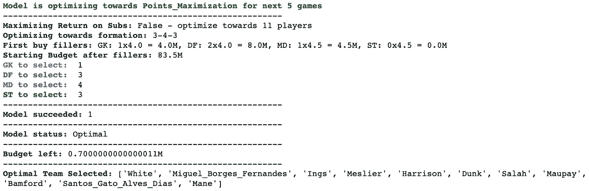****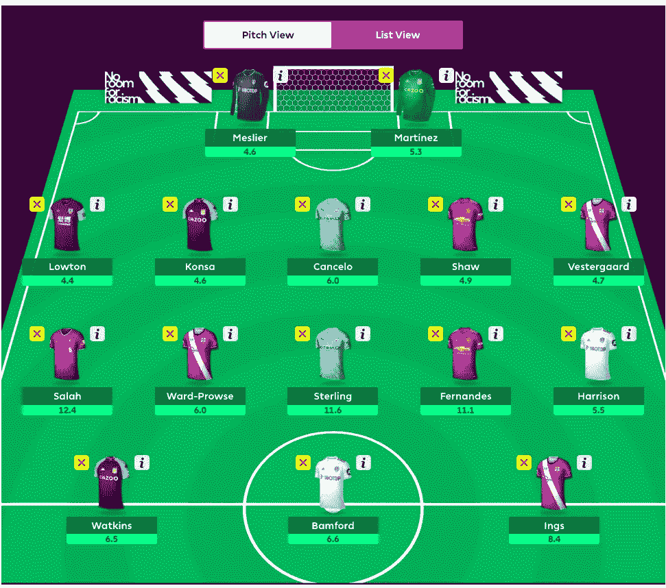**

**算法优化了 3-5-2 阵型，因此根据上面的模板，我们将让**马丁内斯、康萨、坎塞罗和沃特金斯坐冷板凳。我们有很多中等价位的替补的原因是万一你现在想玩你的 WC 并且计划在 GW26 中玩 BB。再加上几个 GW26 的替补，比如沃德-普劳斯换冈多，Ings 换 DCL，我们就能有 10 个球员拥有双 GW26 了！****

****示例 2:优化所有 15 名玩家的最大值****

**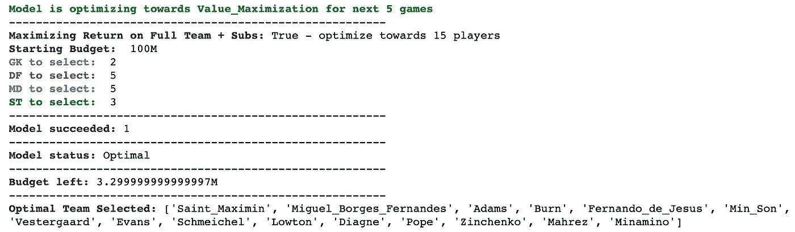**

# **我们的 GW25 团队**

**我们将一直使用上周得分最高的球队，并尝试最多进行 1-2 次转会。我们决定**不玩我们的 WC** ，因为我们已经为即将到来的 GW 有了一个像样的团队，并且有了一些替补，如 Ings 的 **DCL 和 Watkins 的**Davis，我们最终可以有 10-11 名球员拥有一个双 GW26 和 3 个替补，所以在 GW26 中使用 BB 成为一种选择。**

**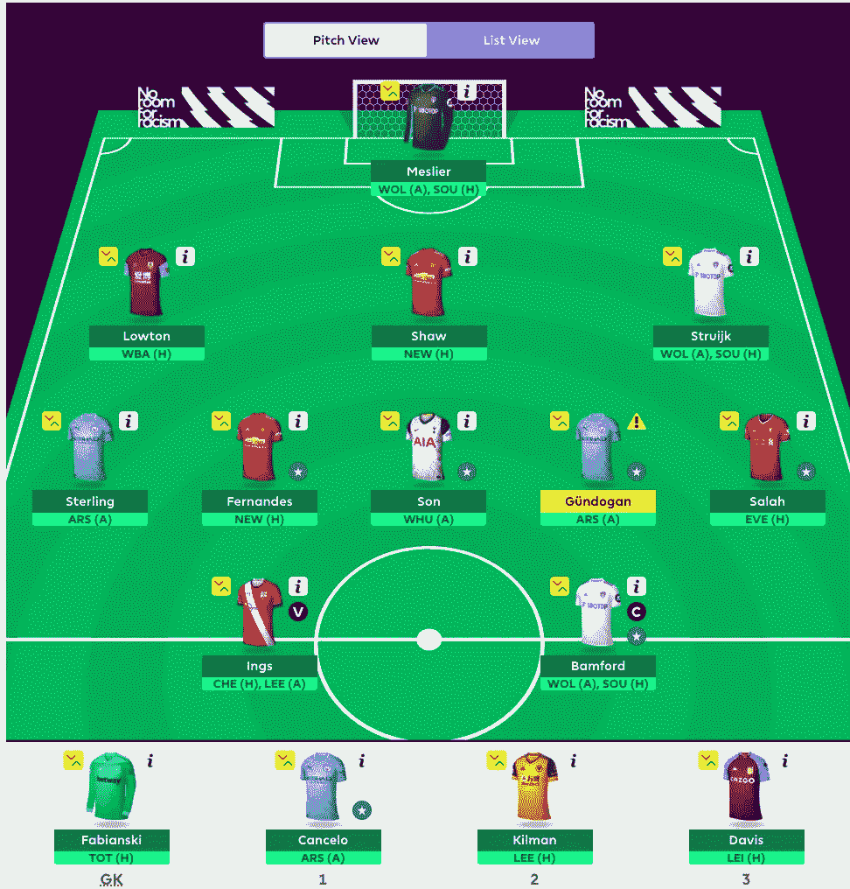**

# **结论**

**随着确认的双游戏周在 GW 25–27 到来，我们建议仔细挑选你的转会，提前考虑 2–3 场比赛。尤其是如果你还剩下一些筹码，你可能想在这两个游戏周内采取激进的行动。**我们也建议不要在本周过早地进行转会**,因为许多背靠背的比赛似乎会给球队带来比平时更多的伤病问题。一如既往地感谢您的阅读，祝您本周好运！**