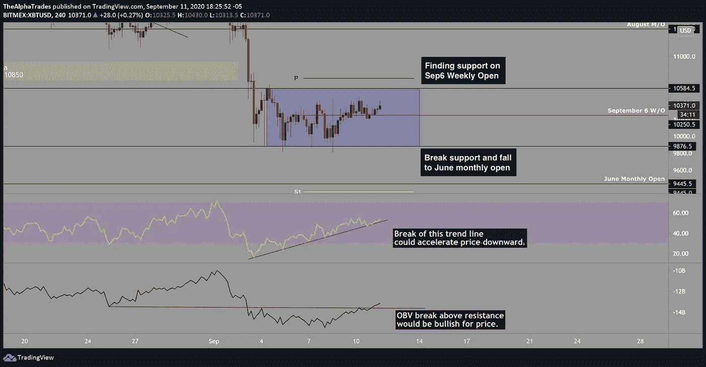
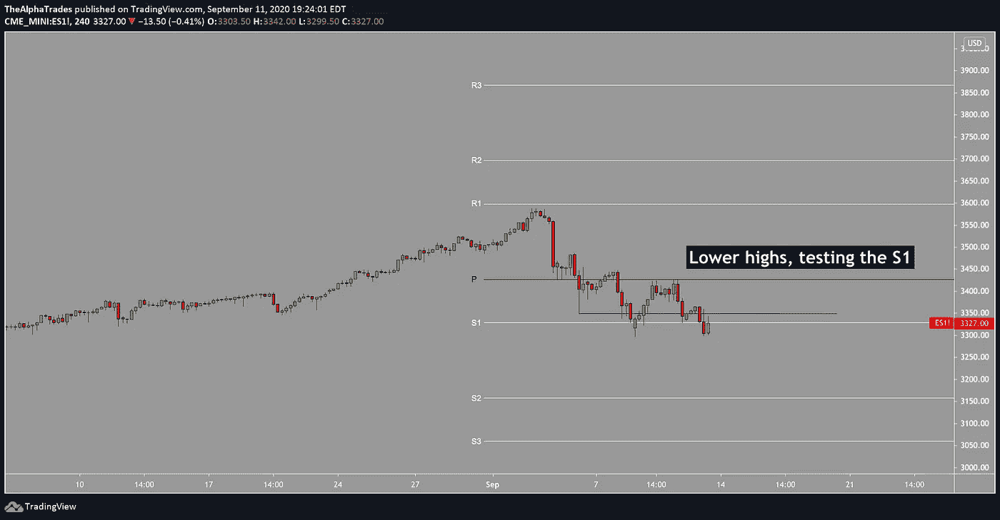
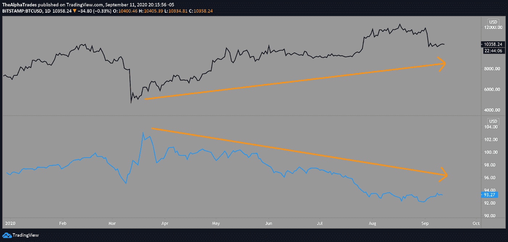

# 破解比特币与美元的关联密码

> 原文：<https://medium.datadriveninvestor.com/es-breaking-the-code-of-bitcoins-correlation-with-the-greenback-e2f55cb88477?source=collection_archive---------1----------------------->

## 如何在你的交易策略中使用 DXY-SPX-BTC 相关性

## 比特币(BTC)的关注级别

*   六月月度开放:9450 美元
*   每年的 VWAP:8880 美元
*   200 毫安:9100 美元

Bitcoin levels to watch; Source: Alpha Trades

S&P 500 Futures pivot points to watch; Source: Alpha Trades

**今日分析总结:**变化不大。如果你想知道我是如何开始几乎所有的分析的，下面有一篇很棒的文章。

 [## 3 个技巧、2 条黄金法则和 1 个简单策略如何帮助你今天交易比特币

### 阿尔法交易市场分析。

medium.com](https://medium.com/datadriveninvestor/how-3-tips-2-golden-rules-and-1-simple-strategy-help-you-trade-bitcoin-today-9694eea52e6f) 

时间紧迫？这是里面的索引:

*   [如何以交易为生](https://www.datadriveninvestor.com/2020/08/17/how-to-trade-for-a-living/)
*   [从更高的时间框架开始，然后放大。](https://medium.com/datadriveninvestor/how-3-tips-2-golden-rules-and-1-simple-strategy-help-you-trade-bitcoin-today-9694eea52e6f#3530:~:text=Begin%20with%20a%20higher%20time%20frame,-%2C)
*   [接下来，检查价格在什么范围内。](https://medium.com/datadriveninvestor/how-3-tips-2-golden-rules-and-1-simple-strategy-help-you-trade-bitcoin-today-9694eea52e6f#18b0:~:text=check%20the%20price%20range)
*   [使用 20 期均线交易比特币的简单策略](https://medium.com/datadriveninvestor/how-3-tips-2-golden-rules-and-1-simple-strategy-help-you-trade-bitcoin-today-9694eea52e6f#7ad8:~:text=strategy,-for)

# 相关性很重要。

我在上一篇文章中解释了 DXY 为何是如此强大的经济指标。

当美元走强时，市场往往会回调。

因为美元是全球储备货币，强势美元会导致股票和贵金属价格暴跌。

比特币等加密资产与美元表现负相关，原因如下:

*   随着比特币与数字黄金联系在一起，其价格相关性开始表现得与贵金属相似。
*   冠状病毒、美国总统选举焦虑和通胀担忧导致美元走软。贵金属，以及最近的比特币，往往被认为是一种安全的对冲工具，并享有上升趋势。
*   作为一种应对措施，加密资产具有高度的风险性。有风险的环境是投资者在风险更高的资产中寻求收益时感觉更舒服的环境。这种环境是美联储在 2020 年通过激进的刺激计划创造的。有风险的资产往往会在无风险的环境中回撤或整合，因为投资者会涌向现金作为避风港。这种情况在 2020 年黑色星期四市场崩盘期间最为突出。
*   另一方面，如果市场一直很热，就像在 2020 年由于央行的刺激而出现的那样，投资者将在第一次出现疲软迹象时寻求兑现他们的美元利润。这样，DXY 将会上涨，而黄金、标准普尔 500 和比特币将会回调并盘整。

基于以上几点，你可以看到，虽然这些都是宏观趋势，但投资者的情绪仍然可以从一天到另一天显著影响资产价格。

**结果:**加上美联储日益加剧的通胀政策，BTC 和 DXY 美元指数之间的相关性是[显著负](https://www.coindesk.com/coindesk-research-bitcoin-dollar-ethereum-fees#node-4:~:text=The%20correlation%20between%20BTC%20and%20the,both%20within%20and%20outside%20the%20industry.)。

 [## 比特币 2025 年路线图|数据驱动的投资者

### 在这篇文章中，我将准确地描绘出我对未来几周、几个月和几个月比特币价格走势的看法

www.datadriveninvestor.com](https://www.datadriveninvestor.com/2020/05/26/bitcoin-roadmap-to-2025/) 

**这意味着:**对于拥有大量资金的投资者来说，这种方式将[完全不同](https://www.investopedia.com/articles/forex/051415/pros-cons-strong-dollar.asp)。如果你是一个摇摆交易者，你将很难捕捉到在相关资产改变方向之前出现的轻微背离。交易算法的存在就是为了利用这些差异，但这超出了本文的主题范围。

你最好的选择是使用基于$DXY 中较高时间框架的支撑位和阻力位，作为你是否应该改变仓位大小的指示。请记住，美联储、重大灾难和关键政治事件可能会超越技术水平。

在设置止损和止盈目标时，最好尊重支撑位和阻力位。没有人能预测未来，但一旦重大事件尘埃落定，价格走势往往会回归技术层面。

DXY US Dollar Index to Bitcoin price correlation; Source: Alpha Trades

**参见:**

[恶性通货膨胀、货币需求和崩溃式繁荣|米塞斯研究所](https://mises.org/library/hyperinflation-money-demand-and-crack-boom)

[美元奶昔|达伦·温特斯](https://www.darrenwinters.com/dollar-milkshake/#:~:text=The%20Dollar%20Milkshake%20theory%20is,flows%20from%20across%20the%20globe.)

[美元奶昔 vs 数字浓奶昔。通货膨胀还是通货紧缩？圣地亚哥资本的布伦特·约翰逊——YouTube](https://www.youtube.com/watch?v=6_INOkPIc38)

你对 BTC-DXY 相关性有什么看法？留下你对这篇文章的回应。让我们开始一段对话。

# SushiSwap 更新($SUSHI)

*声明:本文合作者为龙$寿司。此内容不是理财建议。*

对于阿尔法交易的完整独家报道，[点击进入文章](https://medium.com/datadriveninvestor/how-3-tips-2-golden-rules-and-1-simple-strategy-help-you-trade-bitcoin-today-9694eea52e6f#dd95:~:text=Bonus%20idea%3A%20SushiSwap%20(%24SUSHI))。

SushiSwap 的创始人 Chef Nomi 最近把这个项目交给了 FTX 加密资产交易所的首席执行官 Sam Bankman-Fried。在收到来自项目社区的极端抨击后，主厨[将近 1200 万美元的资金](https://twitter.com/NomiChef/status/1304442521137811457?s=20)返还给了开发团队。

Chef Nomi says sorry, gives $14 million back to the SushiSwap development fund

考虑到 SushiSwap 的目标是一个建立在社区所有权基础上的项目，当创始人带着一大笔用于开发项目的以太坊基金退出该项目时，令人震惊。

这条新闻在发布的时候已经过时了，但是把它当作一段有教育意义的历史吧。当您看到一个协议上的 70%的资产在大约 48 小时内迁移到另一个特定的项目时，您就把这个标记放到了您的观察列表中。在这种情况下，这就是 SushiSwap 从 Uniswap 吸走超过 20 亿美元流动性的原因。

所有权的转移已经[将 SushiSwap 社区的治理](https://www.coindesk.com/sushiswap-migration-defi-protocol-politicians)政治化，导致类似于选举产生的董事会。“礼仪政治家”的崛起并不是全新的，但肯定会更加熟悉 SushiSwap 等社区所有项目的传播和发展。

# 观看表演

[Alpha Trades](https://twitter.com/the_alphatrades) 的团队本周深入研究市场、密码和经济。当谈到抛出一些图表和提供交易者心理服务时，我们无愧于“阿尔法”这个绰号**找到你的优势**最新剧集:

[比特币&市场更新|如何使用 DXY-SPX-BTC 相关性](https://youtu.be/J0ys9lSmlIs)

[BTC 可以移动到 11000 美元，但这是看涨吗？|为什么 SushiSwap 会比 Uniswap 大！](https://youtu.be/QX7j76beaWI)

## 当我们在这里的时候，

Join the Alpha Trades Discord community to learn about trading and investing.

加入阿尔法交易[不和频道](https://discord.gg/a97qq2s)与来自世界各地的数百名成员。无论我们是交易 DeFi、石器时代(2017)的 alt-coins，还是比特币，都有你的一席之地。

*本文的研究部分归功于* [*布兰登*](https://www.linkedin.com/in/brandon-fusaro-44b4031a0) *。*

# 放弃

Alpha Trades，LLC 提供的信息不用于制定任何财务决策，也不是购买、持有和/或出售特定证券或金融工具的请求或建议。

访问 Alpha Trades 的完整服务条款:[https://bit.ly/3faVeeV](https://bit.ly/3faVeeV)

**访问专家视图—** [**订阅 DDI 英特尔**](https://datadriveninvestor.com/ddi-intel)