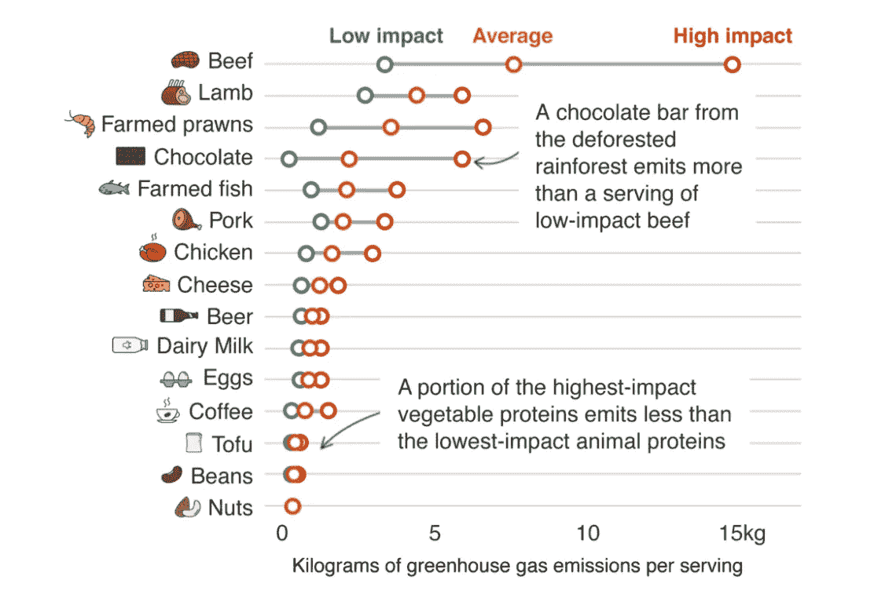

# ESG —食品行业正在以多种方式使用区块链技术

> 原文：<https://medium.datadriveninvestor.com/esg-food-sector-is-using-blockchain-technology-in-a-variety-of-ways-c4a49b2336b5?source=collection_archive---------14----------------------->

牛津饥荒救济委员会声称，由于气候变化，至少有 6000 万人面临日益恶化的饥饿和贫困，科学家认为，气候变化主要是由于过多的碳被释放到大气中造成的。与此同时，全球供应链变得更长、更复杂，提供了在一年中的任何时候食用几乎任何类型的水果或蔬菜的机会。下次你在超市的时候，看看你的食物来自哪里！不幸的是，不按季节提供食物，而是全年给消费者如此丰富的选择，这是有代价的。代价是，随着越来越多的货物被运输到世界各地的偏远地区并在那里生长，碳排放对我们的环境造成了越来越大的影响。在发展中国家，超过 5 亿的小农生产了 80%的粮食。尽管 IMB 有支持零售商沃尔玛和家乐福的食品信托基金，以及帮助海地农民从他们生产的食品中获得更多收入的 [Ariledger](https://aspioneer.com/agriledger-democratizing-agriculture-data-using-blockchain/) ，但是小农的数量之多给整理和存储食品生产方式和生产地点的信息带来了挑战。食品生产占所有温室气体(GHG)排放的 25%[,这意味着人们需要更加关注消费低碳食品。令人难以置信的是，一块来自森林消失的雨林的巧克力比一份低冲击牛肉的碳足迹还要大！](https://ourworldindata.org/food-ghg-emissions)

你所吃的食物产生的碳的千克数

资料来源: [Poore Nemecek](https://www.bbc.co.uk/news/science-environment-46459714)

公众越来越多地要求更大的透明度，要求品牌希望与顾客建立信任。这些都可以通过在供应链中更多地使用区块链技术来实现。美国食品营销研究所的一份报告发现，75%的消费者会购买提供更多信息的品牌，而不仅仅是物理标签上的信息。我们已经看到中国的 JD.com 和法国的家乐福等零售商使用带有二维码的区块链技术，使消费者能够用手机扫描食品，澄清他们将要购买的食品来自哪里、何时、如何以及可持续发展证书。

[Gartner](https://www.gartner.com/en/newsroom/press-releases/2019-04-30-gartner-predicts-20-percent-of-top-global-grocers-wil) 预测，到 2025 年，20%的全球顶级杂货店将使用区块链实现食品安全和可追溯性。根据 Juniper Research 的数据，到 2024 年，潜在的区块链技术将促进[310 亿美元的食品欺诈储蓄](https://www.cnbc.com/2019/11/27/blockchain-to-save-food-industry-31-billion-new-research-says.html)。世界经济论坛有一个项目，[重新设计信任:供应链的区块链](https://www.weforum.org/projects/redesigning-trust)，合作伙伴代表了全球可可供应链的 85% ,包括日立高管、来自世界各地的 60 位交通部长和来自阿联酋区块链生态系统的 30 多家组织。使用智能合同的区块链平台可以利用物联网和设备捕获更多关于供应链的数据，这表明更准确地测量供应链的碳排放变得越来越容易。

此外，越来越多的证据表明，机构正在响应客户需求，并寻求使用专业金融科技公司开发的区块链技术。其中一家公司是 Halotrade，其区块链平台正在接受法国巴黎银行、巴克莱银行、荷兰合作银行、渣打银行、J Sainsbury PLC 和联合利华集团的测试。它旨在收集和存储供应商的 ESG 数据，作为可持续供应链金融计划的一部分。投资者也在寻找能够证明其 ESG 资质的基金。根据[埃森哲](https://financialservicesblog.accenture.com/growth-markets/purpose-and-profit-ai-for-esg-investing)的数据，基金占全球管理的所有基金的 30%(31 万亿美元)。此外，绿色债券正在债务市场上为那些具有积极环境或社会影响的项目发行，在 10 年内，绿色债券市场已经迅速增长到大约[5000 亿美元的价值](https://bankingblog.accenture.com/advances-in-sustainable-finance-but-more-needed)。汇丰银行是 2019 年全球领先的绿色债券管理公司，监管着超过 148 亿美元的资产，并声称通过使用区块链技术，汇丰银行可以发行债券，并节省高达 [90%](https://webcache.googleusercontent.com/search?q=cache:j0RIZldlrd8J:https://www.sustainablefinance.hsbc.com/-/media/gbm/reports/sustainable-financing/blockchain-gateway-for-sustainability-linked-bonds.pdf+&cd=1&hl=en&ct=clnk&gl=uk) 的通常与发行传统债券相关的成本。

毫无疑问，对于公司来说，在为客户和股东提供产品和服务方面，ESG 正变得越来越重要。如果你看看[谷歌趋势](https://trends.google.com/trends/explore?date=today%205-y&q=esg)，在 ESG 上搜索信息的人一直在稳步增加。也有各种调查和报告证实，消费者将为来源可靠的产品支付更多费用，可持续性、包容性和其他关键的环境、社会和公司治理考虑因素无疑对潜在投资者越来越重要。