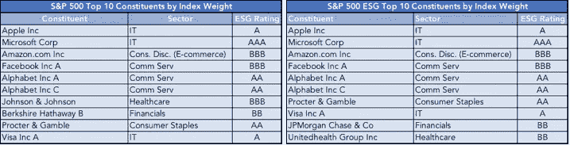
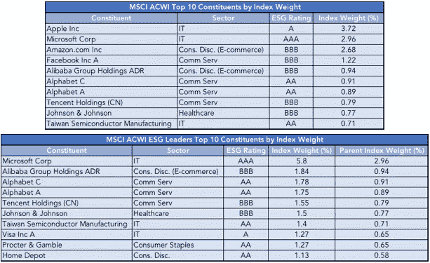
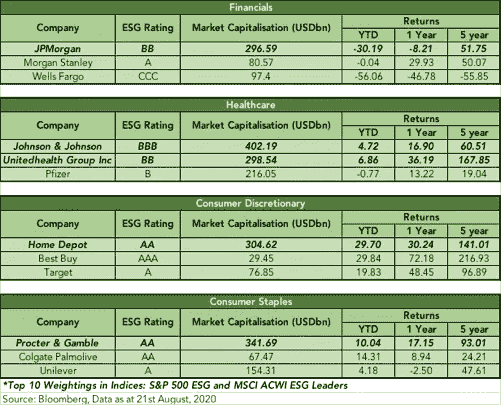

# ESG 和 Tech——这两个领域的高回报有联系吗？

> 原文：<https://medium.datadriveninvestor.com/esg-tech-are-high-returns-of-the-two-sectors-linked-85d29c127a32?source=collection_archive---------9----------------------->

Photo by [Ravi Kumar](https://unsplash.com/@_ra_vi_kumar?utm_source=unsplash&utm_medium=referral&utm_content=creditCopyText) on [Unsplash](https://unsplash.com/s/photos/green-technology?utm_source=unsplash&utm_medium=referral&utm_content=creditCopyText)

随着市场试图从新冠肺炎的冲击中复苏，ESG 和科技股都表现出比其他行业更高的回报率。这两个板块的表现是否齐头并进？到什么程度？还是一个部门受益于另一个部门的积极成果？

[S & P 500 ESG 指数](https://www.spglobal.com/spdji/en/indices/equity/sp-500-esg-index/#overview)，旨在衡量符合可持续性标准的证券的表现，同时保持与 S & P 500 相似的整体行业权重，其表现比 S & P 500 指数高出 2.61%(截至 2020 年 8 月 21 日的数据)。

[摩根士丹利资本国际 ACWI ESG 领导者指数](https://www.msci.com/documents/10199/9a760a3b-4dc0-4059-b33e-fe67eae92460) —一个由 23 个发达市场和 26 个新兴市场的中大型公司组成的市值加权指数，涉及相对于行业同行具有高 ESG 表现的公司，去年跑赢了摩根士丹利资本国际 ACWI 1.4%(截至 2020 年 7 月 31 日的数据)。

如果我们按照两个指数的指数权重来看排名靠前的成分，我们会发现这些以 ESG 为中心的指数主要由科技公司组成，尤其是来自 IT、通信服务和电子商务行业的公司。标准普尔 500 和摩根士丹利资本国际 ACWI ESG Leaders 指数中约有一半由科技股组成，与其母指数大致相同。

Sources: S&P and MSCI

虽然这两个 ESG 指数的成分复制了其母指数的成分，但是 ESG 版本更集中于具有较高 ESG 评级的名称。

在新冠肺炎危机期间，成份股中的大多数公司都出现了比 2020 年更深的下跌更高的涨幅，特别是科技股——与其他行业相比，亚马逊、苹果、腾讯、微软、脸书、Alphabet 和阿里巴巴。

科技股的飙升也反映在摩根士丹利资本国际 ACWI [信息技术](https://www.msci.com/documents/10199/aa4a6b46-4e72-45af-8d1b-5c8f00459666)和[通信服务](https://www.msci.com/documents/10199/0f3044ef-ca1c-486a-9851-050a2a3e419c)指数的回报中，这两个指数今年以来分别比摩根士丹利资本国际 ACWI 的回报高出 21.39%和 7.61%(截至 2020 年 7 月 31 日的数据)。

 [## 国会如何盲目地看待科技公司的未来

### 美国国会召集 4 家大型科技公司的首席执行官在全国电视上表演马戏…

www.datadriveninvestor.com](https://www.datadriveninvestor.com/2020/08/12/how-congress-blindly-sees-the-future-of-tech-companies/) 

虽然 IT 股票几乎总是高收益，但由于全球范围内的家庭订单，通信服务行业今年出现了显著增长，这导致了在线娱乐、信息娱乐、商业服务和社交媒体的使用量增加。

这就给我们带来了问题:**科技股正在推高 ESG 指数的表现吗？还是说，ESG 包容性实践推动了科技股的表现？**

但首先，理解为什么 ESG 指数主要由科技股组成是很重要的。

## **在高科技领域轻松实施 ESG**

很难找到一家 ESG 评级较低的科技公司。这是因为将 ESG 考虑因素纳入科技企业并不困难——它们很容易因产生低水平的碳排放和物理废物、通过其产品创造社会价值以及保持透明、以人为本的工作文化而获得高分。

尽管应该注意的是，所述 ESG 指数中的领导者并不是默认在 ESG 上得分高的公司；相反，那些有意识地努力采用 ESG 最佳实践的公司——[Alphabet 发行了一种可持续债券，本月早些时候，这种债券的销售创下了纪录，其收益将用于支持支持黑人企业家、受新冠肺炎影响的企业、经济适用房和绿色建筑等事业的组织。](https://www.bloomberg.com/news/articles/2020-08-07/sustainable-finance-sees-big-tech-boom-after-record-google-deal?cmpid=BBD081020_GREENDAILY&utm_medium=email&utm_source=newsletter&utm_term=200810&utm_campaign=greendaily)苹果公司承诺到 2030 年完全使用清洁能源制造产品；而亚马逊正在全球投资可再生能源项目，以实现其到 2040 年实现净零碳排放的目标。

现在，我们讨论 ESG 整合如何对科技公司产生积极影响。

## **ESG 对科技公司至关重要**

在其 [2020 年科技行业创新调查](https://home.kpmg/cn/en/home/news-media/press-releases/2020/05/covid-19-could-be-catalyst-fo-esg-adoption-by-tech-companies.html)中，毕马威发现 34%的受访者认为气候变化对他们公司的投资和融资有很大影响。

调查结果强调，科技公司不关注环境、社会和治理因素，其唯一目的是通过绿色债券和可再生能源项目等非常规投资筹集额外资金。57%接受采访的科技公司首席执行官同意，为了实现长期可持续的成功，他们必须超越纯粹的财务增长。除了从风险管理的角度更好地定位之外，倾向于 ESG 还会给他们带来无形的好处。

由于大多数技术消费群体是千禧一代，他们的客户不仅寻求具有竞争力的价格和高质量的产品和服务，还期望获得高 ESG 值。对 ESG 的关注大大提升了组织的声誉和商誉，因为企业被认为拥有资源，能够比个人实现更高程度的慈善事业。科技公司的首席执行官们承认这个事实；74%的受访者认为，确保组织的 ESG 政策反映客户的价值观是他们的责任。此外，公司在这方面面临更大的压力，因为公司受到研究公司的审查，这些公司根据其对环境、社会和公司治理问题的态度不断对公司进行审查和评级。

毕马威的报告还强调，企业和 ESG 之间还有另一个盈利相关性，它超越了声誉和商誉。表现出能够更快适应环境和社会变化的企业在管理风险方面比竞争对手更有优势。有准备的组织在面对逆境时会表现出更强的应变能力，正如我们在新冠肺炎所目睹的那样，许多公司看到了供应链和 IT 运营的中断。在其业务连续性计划中对环境和社会因素承担更高责任的公司表现出有效的恢复和势头。

新冠肺炎为利益相关者带来了一个意想不到的机会，让他们可以审查公司的 ESG 参与情况，并确定整合这些功能所需的增长空间。更高的管理层不能再忽视可持续金融可以为他们带来的额外资本——特别是随着今年流入该领域的资金增加，客户希望他们的品牌忠诚度能够反映负责任的原则，而投资者则希望在管理运营风险时表现出对环境和社会的关注。当前的市场状况揭示了 ESG 对科技行业的重要性，以及对其他商业行业的重要性。

最后，我们转向最大的问题:**科技股正在推高 ESG 指数的表现吗？**

总体而言，科技股是一个高增长行业，无论其 ESG 评级如何，科技股都会增长。无可争议的事实是，今年科技股的飙升有利于持有大量科技股的 ESG 指数。

我们如何才能不偏不倚地判断 ESG 整合是否有益于任何公司，方法是查看其他行业的股票表现。在这里，我们来看看其他权重较大的行业的回报——金融、医疗保健、非必需消费品和日常消费品。

在大多数情况下，具有较高 ESG 评级的公司确实在其他行业表现更好，尤其是在市场动荡时期和长期而言。

回到主题——科技和环境、社会和治理的回报是联系在一起的，这两个领域确实受益于彼此的优点；尽管就像 ESG 不是推高科技股表现的唯一因素一样，科技股的高度集中也不是 ESG 指数表现良好的唯一原因。其他行业也从 ESG 整合中受益。

投资者已经开始认识到 ESG 整合股票的可靠性和回报，这反映在 2020 年上半年流向 ESG 领域的[创纪录流量中。总结今年科技和 ESG 行业的走势，很明显我们正处于投资模式转变的边缘。随着在家订单中对科技的依赖日益增加，以及对投资科技行业及其他行业的可持续考虑的意识，有理由预计这些领域将进一步增长，并优于其他行业，特别是非 ESG 重点股票。](https://www.ft.com/content/27025f35-283f-4956-b6a0-0adbfd4c7a0e)

**访问专家视图—** [**订阅 DDI 英特尔**](https://datadriveninvestor.com/ddi-intel)