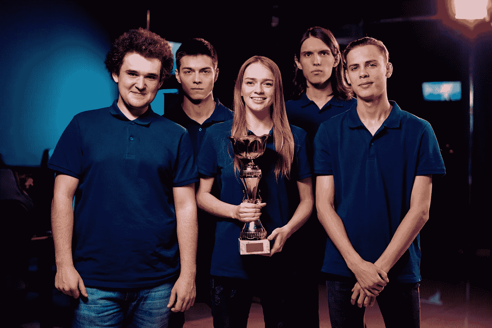

# 电子竞技和 STEM 教育:2020 年展望

> 原文：<https://medium.datadriveninvestor.com/esports-and-stem-education-a-2020-perspective-a3f2cc934e33?source=collection_archive---------14----------------------->

## 结构化视频游戏在学校有一席之地吗？

Image: Getty ID# 1132281836 / Male Student Playing Esports

*作者:* [*安德鲁·b·劳普*](https://medium.com/u/d8c8d333927a?source=post_page-----bc7b73a1ac7b----------------------)*/*[*@ stem CEO*](https://twitter.com/stemceo)

在过去的几年里，体育运动——分为业余和职业赛季的视频游戏以及巅峰锦标赛——已经大受欢迎。Newzoo 的一份报告预测，到 2021 年，休闲观众将增长到约 3 . 07 亿人，而德勤发现，2017 年至 2018 年，行业投资增长了 837%。Z 世代是游戏的一代，91%的 2-17 岁的孩子喜欢某种形式的电子游戏。

鉴于电子游戏的巨大人气，电子竞技的崛起应该不足为奇。随着学生组建俱乐部并开始参加有组织的联盟，许多学校现在都在接受电子竞技。越来越多的大学甚至将电子竞技列为大学运动项目，与传统的大学运动相提并论——包括比赛奖学金。

Image: Getty ID# 1129494218 / Esports Competitors In Action

电子竞技在学校有一席之地吗？许多家长和教育工作者对此持怀疑态度，但越来越多的人支持电子竞技作为一种积极的社会项目和全面 STEM 教育的健康组成部分。我们来看看研究。

# **对视频游戏和屏幕时间的担忧**

2016 年，美国儿科学会(AAP)公布了关于儿童屏幕时间的[新建议](https://www.aap.org/en-us/about-the-aap/aap-press-room/Pages/American-Academy-of-Pediatrics-Announces-New-Recommendations-for-Childrens-Media-Use.aspx)，建议将 5 岁以下儿童的屏幕时间限制在每天一小时，并仔细监控 6 岁及以上儿童的屏幕时间。AAP 列举了这些建议背后的原因，包括对充足的睡眠、体育活动、良好的心理健康和牢固的家庭关系的关注。

Image: Getty ID# 1200027501 / Children Focusing On Screens

国家生物技术信息中心(NCBI)也报告了儿童和青少年玩电子游戏的具体缺点。其中包括以下内容:

*   电子游戏成瘾。
*   癫痫发作的风险增加。
*   重复性压力损伤。
*   肥胖和疾病。

需要说明的是，NCBI 还指出，真正对视频游戏上瘾的人非常罕见，癫痫发作似乎在一开始就容易上瘾的人群中更常见，比如癫痫患者。

# **电子竞技给学生带来的好处**

Image: Getty ID# 1171076366 / Gaming Hand Close-up

许多关于健康使用屏幕时间的担忧源于缺乏平衡，而不是视频游戏本身有害的证据。事实上，结构化电子竞技项目也有很多好处，包括以下几点:

*   自尊心增强。
*   更好的[手眼协调](https://www.psychologytoday.com/us/blog/ulterior-motives/201608/video-game-play-benefits-coordination)。
*   改进的[视觉空间推理](https://www.sciencedaily.com/releases/2017/06/170622103824.htm)。
*   视力提高(带保护镜片)。
*   [有意义的社交互动](https://www.usnews.com/news/stem-solutions/articles/2018-06-12/commentary-game-to-grow-esports-as-a-learning-platform)对于那些原本会在家里玩耍的学生来说。
*   通过参加[课外活动](https://www.theatlantic.com/education/archive/2015/01/the-activity-gap/384961/)提高毕业率和学习成果。
*   奖学金和旅游机会。

Image: Getty ID# 1218630495 / Esports Students Winning Award

# **电竞如何支持 STEM 学习**

视频游戏和 STEM 科目之间的表面联系显而易见，但只是将技术投入使用并不一定会带来学习。如果是这样的话，美国学生现在应该已经是 STEM 奇才了。为了让电子竞技为 STEM 提供真正的支持，俱乐部领导人和教育工作者必须考虑如何组织他们的项目。

幸运的是，有新的证据表明，一个精心策划的电子竞技项目确实能够以多种方式支持 STEM 学习。特别是，它鼓励:

*   **团队合作解决问题:**队友们很快学会将失败视为解决问题和提高绩效的机会，转向[成长思维](https://fs.blog/2015/03/carol-dweck-mindset/)，而不是接受成功取决于天赋的观点。
*   **科学方法论:**当玩家努力想出一个游戏时，他们的思维变得更加系统，因为他们开发和测试假设来改善游戏。
*   **使用数据和证据:**电子竞技玩家收集关于时间和概率的数据，以计划更快的速度跑，最大化找到游戏内奖金的几率，并通常根据确凿的证据微调表现。

Image: Getty ID# 1157289630 / Young Woman Playing Esports

*   **技术熟练程度:**学生使用的不仅仅是游戏手柄和游戏机。他们还拍摄播放器，编辑声音和视频，发布教程，在线连接，并开发程序来管理他们的会议，数据等。
*   **教育公平:**对于缺乏资源在家玩电子游戏的学生来说，学校赞助的电子竞技项目可以创造公平的竞争环境，并以有意义的方式帮助他们获得技术。
*   **教育包容性:**同样，游戏的乐趣鼓励更多的学生加入 STEM 活动——这种拓展对于 STEM 中代表性不足的群体来说尤为重要，例如女学生、残疾学生和有色人种学生。

# **做电竞正确的资源**

如果组织得好，并被设计为广泛学生的跨学科活动，电子竞技有可能将学生聚集在一起，加强学习，并为资源较少的学生减轻技术不平等。有几个组织通过提供课程、支持和社区，致力于将强大的电子竞技项目带到各地的学校:

Image: Getty ID# 1147607842 / Neon Cubes And Mirrored Background

*   **高中电子竞技联盟:**美国最大的高中电子竞技联盟， [HSEL](https://edtechmagazine.com/k12/article/2019/01/esports-programs-start-pop-k-12-schools) 提供完整的课程和已建立的组织，参加为期八周的赛季比赛和比赛日程。它的使命是将电子竞技带到所有学校，并将这项活动提升到传统大学运动的水平。
*   大学电子竞技基金会: VEF 是一个非营利组织，[促进电子竞技](https://esportsinsider.com/2019/10/hsel-varsity-esports-foundation/)并努力建立一个健康的游戏玩家社区。VEF 为学校提供课程，并致力于支持多样性、包容性、积极心理健康和 STEM 全民学习的倡议。该基金会还为陷入困境的学校提供财政支持，以增加公平获得游戏技术的机会。
*   **胡萝卜集团:**胡萝卜的使命是[增加学生在 STEM 领域的参与度](https://thejournal.com/articles/2019/10/01/compton-district-combines-esports-and-steam.aspx)，该集团提供完整的电子竞技项目来支持这一使命。除了有组织的比赛，胡萝卜还提供了一个职业道路计划，旨在让学生对编码，编程和游戏设计的幕后工作感兴趣。

Image: Getty ID# 1157159216 / Young Woman PC Gaming

结构化的电子竞技产品有可能建立包容、亲社会的环境，以令人兴奋的方式促进良好的教育结果。将电子竞技与 STEM 教育相结合可以帮助学生发挥他们的全部潜力。

 [## 教科书行业如何最终被颠覆，并将继续改变|数据驱动…

### 就此而言，教科书产业在美国乃至全世界都有着悠久的历史。事实上，他们已经…

www.datadriveninvestor.com](https://www.datadriveninvestor.com/2018/09/25/how-the-textbook-industry-has-finally-been-disrupted-and-will-continue-to-change/) 

本文最初于 2020 年 4 月 16 日刊登在*福布斯社区之声*上，并于 2020 年 5 月 3 日*更新为*媒体*。*

[安德鲁·b·劳普](https://medium.com/u/d8c8d333927a?source=post_page-----bc7b73a1ac7b----------------------)是创始人/执行董事 [@stemdotorg](https://twitter.com/stemdotorg) 。*“通过健全的政策实践使科学、技术、工程和数学(STEM)教育民主化……我们应用 STEM 来更好地理解它。”*