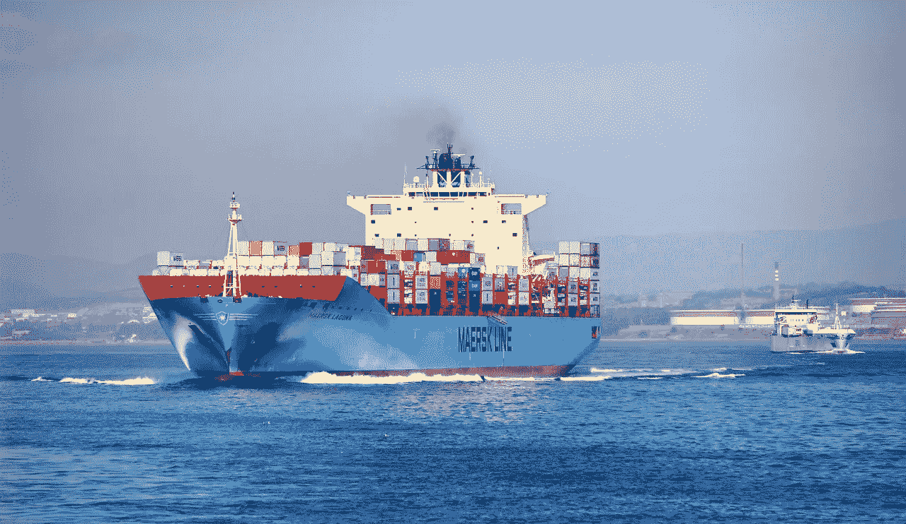
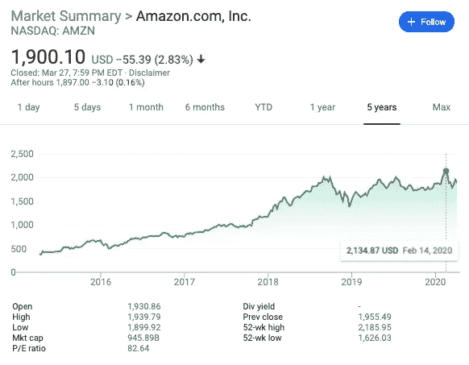

# 基本业务也将很快倒闭

> 原文：<https://medium.datadriveninvestor.com/essential-businesses-too-will-soon-fail-e2502489c39c?source=collection_archive---------11----------------------->

## 没有廉价劳动力，我们的经济将像没有火种的篝火一样熄灭。

随着美国宣布全国紧急状态以来第二周的结束，关于当前经济状况的辩论已成为主流话语，仅次于病毒本身。尽管特朗普总统关于经济低迷会对人类产生巨大影响的观点是正确的，但他未能认识到病毒本身的根本问题已经让美国陷入了灾难性的失败。虽然我可以轻松地用几个小时来解释为什么我们应该优先考虑公共健康而不是股票市场，但我想借此机会重新考虑我们作为一个国家所做的一些假设。

 [## 如果资本主义失败了，那么还有什么选择呢？数据驱动的投资者

### 在当前政治领域的修辞之旅中，我们都可以面对面地接触到流行词汇，如…

www.datadriveninvestor.com](https://www.datadriveninvestor.com/2020/03/16/if-capitalism-is-a-failure-then-what-is-the-alternative/) 

## 病毒不会选择阵营。

是的，这显然是一个显而易见的声明。毕竟，它只是一种病毒。然而，我所质疑的假设是我相信这个国家的大部分人已经做出的。这一假设体现在最重要的信念和信心中，即病毒会以某种方式避开关键员工。很可能，你是在个人隔离区的舒适环境中读到这篇文章的。如果没有，而你仍然每天通勤于你的重要工作，我想借此机会感谢你在这个紧急时刻所做的工作。虽然我们中的许多人继续享受我们正常生活中的奢侈品，如从餐馆点餐和跑步，但我们能够完全将自己与他人分开。我们能够保持隔离的完整性，确保我们不会感染病毒或将其传播给他人。

然而，关键工人却享受不到这种奢侈，他们现在比以往任何时候都更有可能感染新冠肺炎病毒。当然，人们可以采取预防措施来降低感染病毒的可能性。但是随着美国最近才开始大范围的检测，这种病毒有机会在许多携带者不知情的情况下疯狂传播。

正如我们所知，这再次对人类生命构成了悲剧性的威胁。作为一个在出现症状八天之后于昨天检测出新冠肺炎病毒呈阳性的人，我意识到它对身体和精神健康的影响。虽然这篇文章的目的是讨论病毒的经济影响，但我必须重申，作为一个国家，我们的首要任务应该是限制病毒的传播并帮助那些受感染的人。我相信，从长远来看，这些措施也将有益于经济。

Global supply chains are not immune to COVID-19.

## 一级防范禁闭，但是有一个错误

在一个完美的世界里，我们可以继续我们的生活，就像什么都没发生一样。在一个完美的世界里，就地避难意味着和朋友喝几杯啤酒还是可以的。在一个完美的世界里，重要的工人将对这种病毒免疫，能够日复一日地继续维持我们国家的庞大任务。但这不是一个完美的世界。没有人能忽视正在发生的大事。即使是周二晚上和你的朋友一起吃回扣也是不可接受的。最重要的是，核心员工会生病。由于联邦政府基本上回避遏制建议，假设一切都将不受干扰地继续下去就太天真了。

从杂货店货架存货商到空中交通管制员，甚至参议员，这种病毒已经使竞技场变得平坦。世界领导人和看门人都会经历同样的痛苦和致命的症状。由于犹豫要不要实行全国隔离，我们只是让这些重要的工人变得更加危险。冠状病毒现已在美国参议院、亚马逊履约中心、快餐店、杂货店，尤其是医院内传播。那些如此努力工作以确保每个美国人都能有食物和卫生纸的人们刚刚开始显示出被感染的迹象。考虑到新冠肺炎极高的传染性，三天后我们会怎样？从现在起一周怎么样？

不幸的现实是，许多州启动的封锁是一种有缺陷的封锁。你可以强迫所有不重要的员工呆在家里，但是如果他们出去买食物、啤酒和电子游戏，我们真的被封锁了吗？事实上，答案是否定的。再过几天，我们就会开始经历所有行业的混乱。

## 总罢工

劳动人民将会生病，他们将呆在家里——不管他们的州长是否宣布这项工作是必要的。那些害怕生病的人将宣布集体罢工，尤其是现在政府正在提供经济援助。公司的回应将是向留下来的员工提供巨额奖金，但这难道不是他们在这一切开始的那一刻就应该做的事情吗？星巴克是这场混乱中的一颗闪亮的星星，在整个危机中为员工提供全额工资，或者如果他们出现，每小时额外支付 3 美元。但是这些政策直到 [30，000 名员工签署请愿书后才得以实施。](https://thehill.com/regulation/business/488766-starbucks-closes-all-but-drive-thrus-during-coronavirus-outbreak-will-pay)许多公司即将经历一个成败攸关的时刻。为员工提供一个可持续的替代方案来代替上班，否则就会发生罢工。

虽然星巴克的行为堪称典范，但这绝不是现状。例如，亚马逊现在已经记录了 17 个仓库设施的疫情。工人们乞求更好的待遇，数千人签署了请愿书。亚马逊的回应？每小时 2 美元的加薪。

好像正在进行的疫情还不足以成为总罢工的理由，但当前的政治气候已经让社会主义成为主流。随着伯尼·桑德斯的社会主义平台和唐纳德·特朗普的社会主义行动，我们从未见过如此广泛的政治意识形态。

考虑到所有这些因素，我认为总罢工是不可避免的。由于新冠肺炎，工人阶级在与雇主的谈判中占了上风。随着联邦刺激计划提供急需的货币救济，这些工人可能最终能够承受这样的罢工。目前，大公司和投资者都期待像亚马逊和沃尔玛这样的公司蓬勃发展。作为参考，当疫情到达美洲时，亚马逊股票达到了有史以来最高的估价**。**

****

**AMZN stock reaches an all-time high and continues to outperform the falling stock market**

**然而，如果员工开始死亡，他们会选择关门大吉还是“为了经济的更大利益接受牺牲”？对于像亚马逊这样的公司来说，员工只是另一种可替代的资产，所以很难想象一个他们只是*关闭商店*的世界。**

**只有时间能告诉我们真正的结果，但前景似乎是严峻的。企业要么做出正确的决定并长期繁荣，要么就会犯下严重的错误，过度对待员工。**