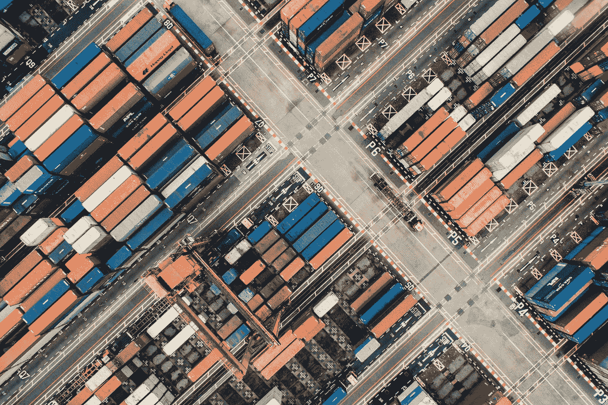

# 基本宏观经济学第三部分:贸易和专业化

> 原文：<https://medium.datadriveninvestor.com/essential-macroeconomics-part-3-trade-and-specialization-8d380062d486?source=collection_archive---------7----------------------->

Photo by [chuttersnap](https://unsplash.com/@chuttersnap?utm_source=medium&utm_medium=referral) on [Unsplash](https://unsplash.com?utm_source=medium&utm_medium=referral)

欢迎来到“基本宏观经济学”系列的第三篇文章。我们将讨论宏观经济学中我最喜欢的话题之一:专业化和贸易。专业化和贸易构成了当今经济体系的核心，几乎每个远离贸易和专业化的国家都表现出较低的生活水平。

我们来详细看看。

经济学是研究如何管理经济中的有限资源，并找出利用这些资源获得最大生产力的最佳方式。学习经济学不会帮助你变得富有，但会帮助你做出更好的决定。

它不止于此。

这也有助于我们理解过去。历史上几乎每一个重大事件都可以用经济学来理解。人们支持希特勒，不是因为他的泛德国主义和反犹太主义政策。他承诺给德国人更好的生活质量。他保证了因第一次世界大战战败而严重受损的就业机会。平心而论，他确实兑现了自己的承诺。这解释了为什么他有很高的支持率。

类似地，人们投票给唐纳德·特朗普不仅仅是因为他的白人至上主义思想和伊斯兰恐惧症，还因为奥巴马政府未能妥善监管 400 万个制造业就业岗位的自动化，这促使摇摆州的大多数独立选民投票给共和党候选人，而不是希望继续奥巴马政府政策的民主党人。英国退出欧盟也有类似的情况。

带着同样的历史教训，根据人均 GDP、预期寿命和中位年龄等参数，可以公平地宣称，在很长一段时间里，人类过着可怕的生活。工业革命之后，事情发生了天翻地覆的变化。尽管最初存在担忧，但工业革命促进了就业、食品供应、研发和医疗保健。现代经济学之父亚当·斯密认为，正是专业化导致了这一重大的经济变革。

那么，什么是专业化呢？

当我想到专业化时，我喜欢把它和餐馆相提并论。想想汉堡店。在汉堡店工作的每个员工都有一项独特的任务要完成。一个人负责开账单，另一个人负责准备配料，另一个人负责用这些配料正确地准备汉堡，最后还有一个人负责把汉堡装在一个漂亮的小盒子里。正是这种将任务分配给擅长某项特定任务的人的想法，形成了专业化的核心。想一想让一个人完成上述每一项任务会浪费多少生产力。

让我们来看看同一个例子，但是从更宏观的角度来看。为了汉堡店的存在，我们需要能够生产原料的农民，能够烘烤所需面包的面包师，能够设计烤箱的工程师，以及能够设计和生产那些放置汉堡的漂亮小盒子的制造商。如果我不得不在没有这些人帮助的情况下自己做一个汉堡，我需要花几个月的时间来收获，理解微波炉背后的科学和工程，准备配料，设计和制作包装，然后交给别人。这就是专业化理念如此重要的原因。

专业化是这种分工，帮助个人专注于他们擅长的事情，以便我们可以获得最大的生产力。想想看，我们需要多少专业人员来开发我写这篇文章所需的硬件和软件。

在第一次工业革命期间，专业化在经济学家中变得流行，人们开始认真对待专业化的想法。即使在那时，在大多数亚洲、南美和非洲国家，专业化程度很低，现在仍然很低。正是在这个时期，亚当·斯密写道，“在每一个改良的社会里，农民一般不过是农民；制造商只不过是制造商。生产一件商品所需的劳动总是被分配给许多人”。

亚当·斯密后来写道，尽管专业化提高了生产率，但让人们过得更好的是“贸易”。我们举个简单的例子。我擅长开发软件，真的不擅长做衣服。对我来说，最好是专门从事软件开发，而不是试图学习设计或编织衣服。我可以用我的技能生产更好的软件，用它我可以赚钱，从专门做衣服的人那里买衣服。反之亦然。这种想法被称为“交易”。

还是那句话，让我们从宏观的角度来看贸易。我们假设只有两种商品；鞋子和飞机。制造飞机，我们需要好的技术和更少的人力，而生产鞋子，我们需要更多的人力和更少的技术。假设法国生产飞机的技术比中国优越，而中国的人力比法国多。根据我们对专业化的理解，当法国生产飞机并向世界销售，从中国这样的国家进口鞋子时会更好。这是因为，如果法国决定生产自己的鞋子，它就必须把重点放在将已经很低的人力资本投资于制鞋上，老实说，这是对生产率的浪费。另一方面，中国应该从法国进口飞机，并专注于生产技术和基础设施，以生产更多的鞋子，因为它有更多的人力资本。

经济学家称之为“比较优势”。

中国在生产鞋子方面比法国有比较优势，而法国在生产飞机方面有比较优势。各国应专注于生产它们具有比较优势的商品，并与在其他方面具有比较优势的其他国家进行贸易。这就是贸易互利的原因。

这种贸易、专业化和相对优势的理念使全球化成为可能。尽管贸易和专业化在理论上听起来非常好，但它确实存在某些细微差别。许多右翼政客认为国际贸易会导致国内就业岗位的流失。中国和印度就是一个很好的例子。中国和印度在技术进步和人力资本方面相似。然而，由于中国有更廉价的劳动力，印度从中国进口大部分商品，导致印度劳动密集型工作岗位的流失，因为印度人无法以更低的成本与中国人竞争生产同样的商品。各国制定了一些复杂的财政政策来应对这种情况，我们将在以后的文章中讨论。但经济学家普遍认同的一点是，贸易和专业化让人们生活得更好。像印度和日本这样最近对国际贸易开放的国家比津巴布韦和伊朗这样对国际贸易开放不多的国家表现得好得多。

关于贸易和专业化还有很多我在本文中没有涉及的内容。贸易和专业化是一个巨大的主题，不可能在一篇文章甚至一个小系列的文章中涵盖。我试图涵盖贸易和专业化的基本概念，这是理解政府和时事的大部分经济政策所必需的。然而，如果你想了解更多关于这个话题的知识，我建议你从学习生产可能性边界开始，这涉及到大量的图表和数字。

如果你有任何关于贸易和专业化的问题，请在评论中提出。另外，如果你想让我写一些与宏观经济学或宏观经济学案例研究相关的东西，也请在评论中提及。

注意:这一系列关于宏观经济学的文章很大程度上受到了来自 [MRUniversity](https://mru.org/) 、 [MIT 14.01SC 微观经济学原理](https://ocw.mit.edu/courses/economics/14-01sc-principles-of-microeconomics-fall-2011/)、 [MIT 14.73 世界贫困的挑战](https://ocw.mit.edu/courses/economics/14-73-the-challenge-of-world-poverty-spring-2011/)的经济学视频讲座和 [CORE-ECON](https://www.core-econ.org/) 的书籍的启发。