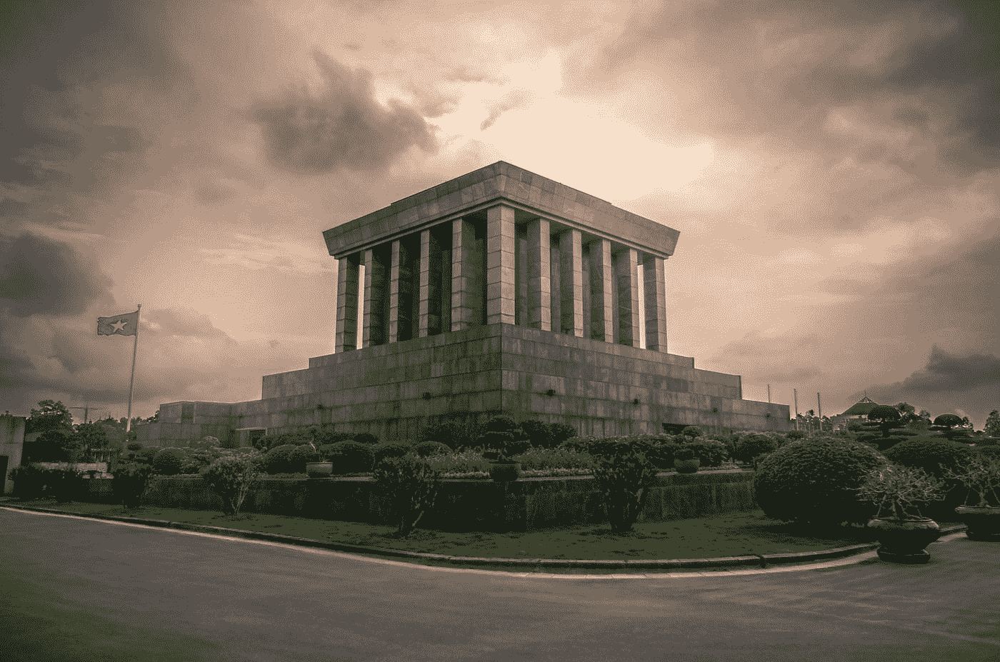

# 基本宏观经济学—第 4 部分:经济体系—资本主义、共产主义、社会主义及其他

> 原文：<https://medium.datadriveninvestor.com/essential-macroeconomics-part-4-economic-systems-capitalism-communism-socialism-and-the-rest-d8e8906960f4?source=collection_archive---------3----------------------->

Photo by [Marcus Marlowe](https://unsplash.com/@moerwijk?utm_source=medium&utm_medium=referral) on [Unsplash](https://unsplash.com?utm_source=medium&utm_medium=referral)

在我开始写这一系列关于宏观经济的文章后，很多人一直问我，“普拉文，你为什么认为每个公民都应该了解基础经济学？”。答案很简单，但是停下来思考一下是很重要的。民主背后的核心理念是，人们应该做出正确的决定，选择合适的人来组建政府。但是，正确的政府会怎么做呢？称一个政府为好政府意味着什么？财政预算是否足以解决国家面临的问题？新的税收制度是必需的吗？它会对经济有帮助吗？

在决定由谁组建政府时，这些问题至关重要。这篇文章和接下来的三篇文章将重点讨论这四个问题。我认为，要使民主正常运转，了解情况的选民很重要。媒体有责任报道政府的政策和活动，而政府所作的决定好与不好，则由我们选民来决定。这就是了解宏观经济学的基础知识可以帮助我们做出更好的决策的地方，这也是这一系列文章的唯一目的。

不管怎样，让我们从这篇文章的主题开始。经济体系。

关于什么是经济体系，有太多的定义，没有一个定义足以恰当地解释它。一些经济学家将其定义为，“经济系统是提供定义社会共同体的组织结构的机构和实体的集合”。一些经济学家将其定义为，“国家和政府分配资源以及交易商品和服务的手段”。其他人将其定义为“一套原则规则，通过这些原则来解决经济中面临的问题”。

是的，我明白了。很难理解，对吧？这正是我在读经济学书籍时的感受。

请耐心等我一会儿，我来给你解释一下。

经济学是研究如何管理我们可用的有限资源，如金钱、原材料、人力和时间。经济体系由政府内部的一系列组织组成，政府利用这些组织制定政策和福利计划，并最终根据这些政策和福利计划将可用资源分配给普通公众。政府内部的这些机构负责管理资源，并确保国内可用资源得到适当利用，以确保最大限度的生产力。

国与国之间的经济体系各不相同，并且深受文化及其殖民地父辈的影响。但是这些系统总是属于以下三类之一:

*   计划经济
*   市场经济
*   混合经济

一个国家的经济体系的分类基于三个简单的问题:

1.  应该生产什么商品才能保证经济运行良好？
2.  商品应该如何生产？
3.  谁生产商品，谁获得商品？

回答这三个问题可以很容易地让我们确定一个国家所遵循的经济制度的类型。最终，为了让你放心，这一切都归结于谁拥有一个国家的土地、劳动力和金钱。例如，在共产主义经济体系中，政府拥有这三者。

让我们详细地看一下每个经济体系，以便更清楚地理解它。

# **计划经济**

计划经济是政府控制和拥有一切的经济。政府控制着每一种资源(食物、衣服、水等)的分配。)由人民产生。政府决定生产什么商品，生产多少商品，也决定哪一群人应该得到商品，哪一群人不应该得到。

很容易把计划经济和共产主义混为一谈。但是两者之间有一个微妙的区别。共产主义是一种计划经济，也是一种“无阶级社会”。根据卡尔·马克思的说法，在共产主义经济中，没有私有财产，每个人都平等地分享国家生产的一切。例如，如果一个由 1000 人组成的共产主义经济体生产了 2000 篮食品杂货，那么该经济体中的每个人都会得到 2 篮食品杂货，不管他们做了什么工作。

这是基于“社会的需要应该是个人的需要”这一思想。这在某种程度上与古巴、苏联甚至纳粹德国相当接近。没有一个国家实行过真正的共产主义制度，即使是苏联和古巴，因为这些国家有一个阶级制度，在这个制度下，一群人对经济中可利用的或生产的资源施加更高水平的控制。

但是在计划经济中，没有必要让每个人都平等地分享一个国家生产的所有东西。它仅仅意味着该国生产的每一种商品，如食品、电子产品、汽车等。属于这个国家的政府，它分割农产品并决定应该返还给人民的农产品的数量。事实上，没有必要让每个人都分享某种特定的资源。

以朝鲜或利比亚为例。这两个国家的经济都完全由中央政府计划和监控。按照计划经济的定义，这两个国家都是计划经济。君主或中央政府决定应该生产什么，生产多少货物，谁应该生产货物，以及如何生产货物。然而，生产出来的商品并没有在这些国家的公民中平均分配。高级政府官员得到了大部分产品，而普通人只得到一小部分产品。

这种官僚主义行为是导致苏联解体和中国在 20 世纪 50 年代经济增长下降的原因之一。

# **市场经济**

市场经济也被称为自由市场经济或资本主义经济。正如我们已经提到的，在计划经济中，政府拥有从土地到经济中生产的产品的一切。在市场经济中，情况正好相反。公民拥有土地，也可以拥有土地生产的商品和服务。在这里，商品的产量是由消费者的需求决定的，而商品的生产方式和服务的提供是由竞争决定的。

在一个 100%的自由市场体系中，政府根本不参与对企业的控制。在这里，政府只关心贸易、国际关系和军事。

在自由市场体系中，人们有生产他们想要的东西的自由，人们也可以选择从他们喜欢的卖家那里购买，这与计划经济中的情况不同。还有，在这个经济体系中，人们一般不是因为要为经济服务而生产商品，而是因为要盈利，要改善自己的生活。

例如，企业出售手机不是因为他们想为人类做好事，而是因为他们想获利。如果人们喜欢某个公司的手机，更多的人会从该公司购买手机，这将刺激该公司生产更多更好的手机。如果人们不喜欢某个公司的某个产品，那么他们就不会购买，从而让公司蒙受损失。一家类似的公司可以生产同样的产品，并对其进行改进，或者以人们愿意购买的价格出售(还记得 Jio 吗？).

公司需要以合适的价格和合适的质量生产合适的产品，这样人们才会信任并购买它们。经济学家称之为“看不见的手”。

这就是资本主义成功的原因。我们已经提到，在任何经济体中，可用的资源都是有限的。在资本主义社会，人们不会购买不需要的产品，因此，公司不会生产更多的产品。这允许更有效地使用稀缺资源。在计划经济中，这种制度很难实行。一个中央政府几乎不可能恰当地决定应该生产什么样的产品，并立即对市场需求做出反应。此外，在计划经济中，人们没有创新的动力，没有比别人更有生产力和生产更高质量产品的动力。在市场经济中，努力工作和创新是有回报的。

上面提到的一切似乎都很棒，这让政府看起来没有存在的必要，除非是为了贸易、国际关系和国防。但事实并非如此。市场并不总是按预期运行，而且有许多细微差别，如腐败、垄断、裙带资本主义、环境问题和国际贸易。政府需要介入这些问题并进行监管。这就是混合经济和社会主义的意义所在。

# **混合经济**

当今世界没有一个国家遵循 100%的计划经济或 100%的自由市场体系。除了朝鲜和古巴，其他所有经济体都是上述两种经济体系的混合体。

把它当成一个光谱。在最左边，你有计划经济，在最右边，你有自由市场体系。西方和非洲的大多数国家都接近光谱的中心，其中大多数是中间偏右或中间偏左。

让我们，以印度为例。我喜欢把印度的经济看作是 29 个不同经济体的集合体。印度有 29 个邦，几乎每个邦都有不同的文化历史和经济行为。

最南部的邦，喀拉拉邦和泰米尔纳德邦是中间偏左的。这两个邦都有允许商业自由的自由市场经济，但喀拉拉邦对私有财产有更多的政府干预，对企业有更多的政府监管，使其从中间向左翼倾斜。例如，电影票价格受到喀拉拉邦政府和旅游部门的严格控制。喀拉拉邦的医疗和教育部门也受到喀拉拉邦政府的严格控制和监管。

泰米尔纳德邦对商业的监管较少，这使得它比喀拉拉邦更有利于商业发展。该州的教育和医疗保健由州政府提供，但是，允许私人机构提供与政府相同的服务。这些私立机构在泰米尔纳德邦的医疗和教育方面提供了更好的服务。然而，与印度其他邦相比，教育和医疗保健部门受到泰米尔纳德邦政府的严密监控，他们是最终的权威。这是过去几十年泰米尔纳德邦财富不平等加剧的主要原因之一(将在以后的文章中详细讨论)。

因此，与喀拉拉邦相比，泰米尔纳德邦不那么左倾。

另一方面，古吉拉特邦是一个中间偏右的邦，邦政府只管理公共交通和旅游部门，其余都外包给私营企业。

斯堪的纳维亚国家的经济体系接近泰米尔纳德邦和喀拉拉邦，但在斯堪的纳维亚国家，教育和医疗保健部门归政府所有，私营企业无法在这些部门与国家竞争。斯堪的纳维亚政府允许私营企业在住房和房地产领域与他们竞争，但在过去几十年中，政府已经胜过了私营企业。事实上，泰米尔纳德邦和喀拉拉邦的经济体系在很大程度上受到了斯堪的纳维亚国家的启发。斯堪的纳维亚国家的立场是有争议的，我会把他们放在泰米尔纳德邦附近。

此外，斯堪的纳维亚国家是社会主义国家的观点是不正确的。社会主义意味着政府控制生产资料。在这里，尽管私有财产存在，人们拥有自己的产品，但要生产的商品数量以及是否能生产某种特定产品是由政府决定的。

另一方面，韩国和新西兰是政府几乎不干预任何部门的国家。政府是如此之小，以至于他们只能控制军队和国际贸易法规，直到最近，这两个国家才开始对设在他们国家的公司实施环境法规。这两个国家可以被置于经济光谱的中间和最右边。

自由市场体系是迄今为止最受欢迎的经济体系，在提高许多国家的生活水平方面发挥了很好的作用。韩国和日本是 20 世纪 50 年代从计划经济体制转向自由市场体制的光辉典范，它们的生活水平有了很大提高。我不想在这里推动右翼政治议程，但从统计数据来看，拥有允许私营企业创新和满足消费者需求的自由市场体系的国家比古巴、苏联、津巴布韦和利比亚等计划经济国家表现更好。

世界上还没有一个国家采用计划经济体制，并以可与西方经济体相媲美的速度繁荣起来(基于 HDI)。事实上，即使是中国，尽管其 GDP 和增长率很高，但在人类发展指数、幸福指数、人权指数和包容性财富指数等指标上却表现不佳。在中国，GDP 的增长并不意味着公民个人的生活水平提高了。由于其计划经济体制，只有政府变得更加富有，但普通公民的平均工资在过去几十年中基本上保持不变。我保证会在另一篇文章中介绍中国。

有了这些想法，其他问题就出现了。为什么自由市场经济比计划经济好？是什么导致一些经济体比另一些运行得更好？为什么有的国家富，有的国家穷？为什么像阿根廷这样的国家增长停滞了几十年？尽管委内瑞拉拥有丰富的石油等原材料，但为什么会陷入经济危机？所有这些问题对于理解某些政府政策的成功及其长期可行性至关重要。

如果你对这篇文章的内容有任何疑问，请在评论中提出来。另外，如果你想让我写一些与宏观经济学或宏观经济学案例研究相关的东西，也请在评论中提及。

注意:这一系列关于宏观经济学的文章很大程度上受到了来自 [MRUniversity](https://mru.org/) 、 [MIT 14.01SC 微观经济学原理](https://ocw.mit.edu/courses/economics/14-01sc-principles-of-microeconomics-fall-2011/)、 [MIT 14.73 世界贫困的挑战](https://ocw.mit.edu/courses/economics/14-73-the-challenge-of-world-poverty-spring-2011/)的经济学视频讲座和 [CORE-ECON](https://www.core-econ.org/) 的书籍的启发。