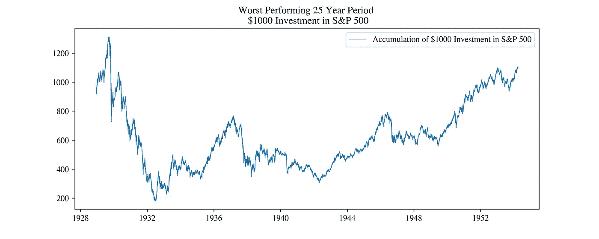

# ETF 投资|什么可能出错？

> 原文：<https://medium.datadriveninvestor.com/etf-investing-what-could-possibly-go-wrong-4154774e2f75?source=collection_archive---------4----------------------->

## 标准普尔 500 历史上最糟糕的情况

Photo by [Micheile Henderson](https://unsplash.com/@micheile?utm_source=unsplash&utm_medium=referral&utm_content=creditCopyText) on [Unsplash](https://unsplash.com/s/photos/money?utm_source=unsplash&utm_medium=referral&utm_content=creditCopyText)

衡量美国最大的 500 家上市公司的表现，标准普尔 500 指数可能是最受关注的指数。此外，追踪标准普尔 500 的交易所交易基金(ETF)可能是新投资者进入股市最受欢迎的途径。事实上，在撰写本文时，追踪标准普尔 500 的三只 ETF(道富银行的 SPY、iShares 的 IVV 和先锋 VOO)在市值最高的 50 只资产中。

Data Source: [https://assetdash.com/](https://assetdash.com/) (August 2020)

总体而言，标准普尔 500 追踪工具和 ETF 的主要卖点是低成本的多元化。这个想法是，通过持有数百家公司的一小部分股份，投资者可以减轻公司/行业特有的风险。然而，通常情况下，取出并维持数百个单个头寸既会因为经纪人费用而非常昂贵，又会因为不断的再平衡而非常耗时，这就是 ETF 的吸引力所在。

但是，俗话说，没有免费的午餐，就像其他投资一样，ETF 可能有风险，并产生负回报。在这篇文章中，我们着眼于未来标准普尔&投资者在不同时期的最坏情况:1 年、5 年、10 年和 25 年。

## 1929 年的大崩盘

正如人们可能预期的那样，在分析数据后，所有最糟糕的时期都始于 1929 年华尔街崩盘前后，不管投资期限有多长。因此，本文分为两个部分——包括 1929 年的大崩盘和排除。

首先，我们考虑自 1928 年初以来的每一个可能的 1 年期，并考虑在期末 1000 美元投资的累计价值。

1931 年 7 月 6 日，继“咆哮的二十年代”的战后乐观主义之后，表现最差的一年期开始了(假设每年有 253 个交易日)。在此期间，我们最初的 1000 美元投资将缩水至 291.61 美元。这相当于我们初始投资的 70.8%的灾难性损失！

同样，表现最差的 5 年期、10 年期和 25 年期始于 1929 年前后，不出所料与 1929 年大崩盘巧合。它们的总回报率分别为-72.2%、-65%和+10%，相当于年回报率为-22.5%、-9.96%和+0.4%。

## 1929 年后的崩盘

同样，当我们考虑更近期的事件时，有一个事件主导了分析，那就是 2008 年的金融危机。1 年、5 年和 10 年的最差时期都包含 2008 年；然而，25 年的最坏情况不会发生。

从 2008 年 3 月 6 日到 2009 年的同一天是最糟糕的一年，导致我们的初始投资价值几乎减半，达到 512.39 美元(-49%)。

最糟糕的 5 年期基本上由上面讨论的 1 年期和接下来的 4 年组成。类似地，如下图所示，10 年期间显示了相同的趋势，以 08-09 年期间结束。

在这 5 年和 10 年期间，投资者的回报率分别为-41% (-10%年化)和-46% (-5.98%)。

有趣的是，标准普尔 500 历史上表现最差的 25 年(不包括 1929 年)不包括 2008 年金融危机，而是从 1957 年年中到 1982 年年中。

支撑着令人印象深刻的 117%的回报率(年化 3.15%)，这让任何购买并持有 S&P 的投资者放心，在这表现最差的 25 年期间，他们的资金翻了一倍多。

## 结论

从这一分析可以清楚地看出，ETF 绝不是低风险投资，短期投资范围内的峰谷亏损可能是毁灭性的。然而，计划长期持有的投资者可能会放心，25 年的投资从未产生过负回报。尽管过去的表现不能保证未来，但下面这句马克·吐温的名言非常适合金融领域:

> "历史永远不会重演，但它确实经常押韵。"——马克·吐温

值得注意的是，这一分析的一个主要注意事项是，所考虑的投资是在最糟糕时期开始时的一次性投资。在最坏的情况下，平均成本策略(DCA)无疑会取得更好的效果，并导致更低的最大提取额(关于这一点的文章即将发表！).

*本次分析使用的代码在我的 Github 上有，* [*这里*](https://github.com/rian-dolphin/SPY_Returns) *。*