# 以太——UX/UI 金融科技案例研究

> 原文：<https://medium.datadriveninvestor.com/ether-ux-ui-fintech-case-study-603031c6856b?source=collection_archive---------3----------------------->

**以你的方式处理金融科技**

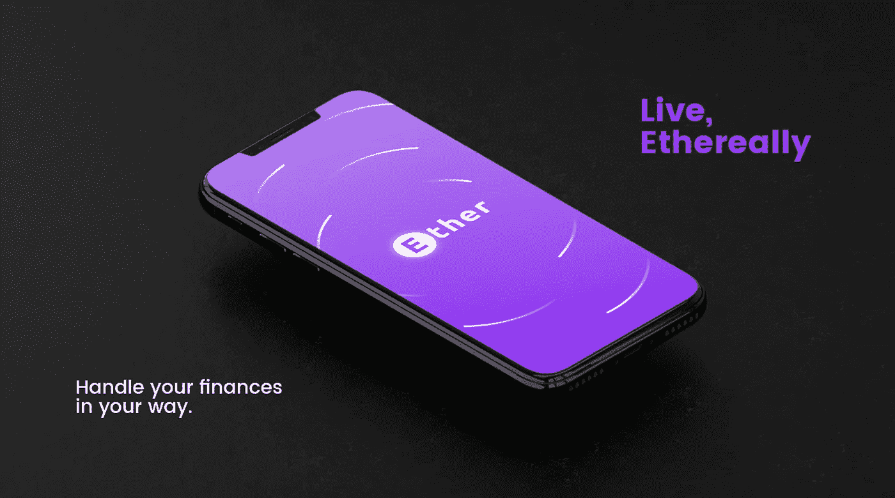

随着科技的发展和调整科技使其更有效率的方法的出现，对金融科技的需求越来越大。无墙意味着有更多的方式支付、转账、跟踪交易、存取资金、创建虚拟卡等等。

牢记这一点，总会有改进的空间和机会。然后，在我的专业 UX/用户界面设计专业期间，我在互动运动的最终项目中创建了一个金融科技应用的概念。

# 用户访谈

采访了年龄在 21-27 岁之间的 6 个人，有男有女，
；

**1-您是否使用任何应用程序来理财？如果没有，为什么？
如果是，为什么？它对你有什么帮助？**

**2/6** 的受访者**没有理财应用**，他们表示不知道有这种应用，或者认为没有必要。

在你的日常生活中，经济上你的主要需求是什么？

**4/6** 受访的金融应用用户主要用于**度假、支付、网上购物，以及足不出户就能了解活动详情**；

**3-在使用
它们来满足某些需求时，你有什么困难吗？**

**2/6** 使用过日常财务应用的人评论说**难以使用这些应用上的界面**来满足他们的需求。

# 案头研究

主要话题搜索网站——agilie.com，sofi.com，关于金融领域机器学习的文章:为什么，什么&如何在 towardsdatascience.com/,了解使用聊天机器人的**好处**，**呼叫中心自动化**，**文书工作自动化**，以及**游戏化**。获取一些关于金融应用程序的主要需求和功能的数据。

此外，比较应用程序的特性、优势和难点，以建立待办事项列表。

# 视力

ETHER 是为年轻一代设计的，他们刚刚获得经济独立，需要一个管理开支的起点。因此，被认为是年轻人，甚至是小企业，帮助他们保持健康的财务生活，但也减轻了这样做的压力，使财务成为生活的一部分，而不是一种责任。

# 问题陈述/解决方案

根据早期的研究，年轻人和企业面临的主要问题似乎是如何开始管理目标或跟踪预算的困难。因此，考虑到需求，主要重点是:

1.  找到一种更简单的方法来记录开销，并且不会忘记付款；
2.  让人们关注长期和短期目标；
3.  **创造一种为特定实例编制预算的方法。**

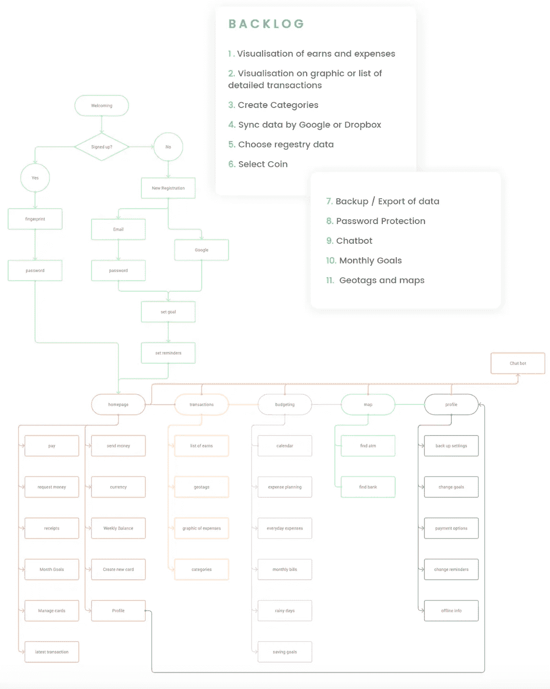

# 原型

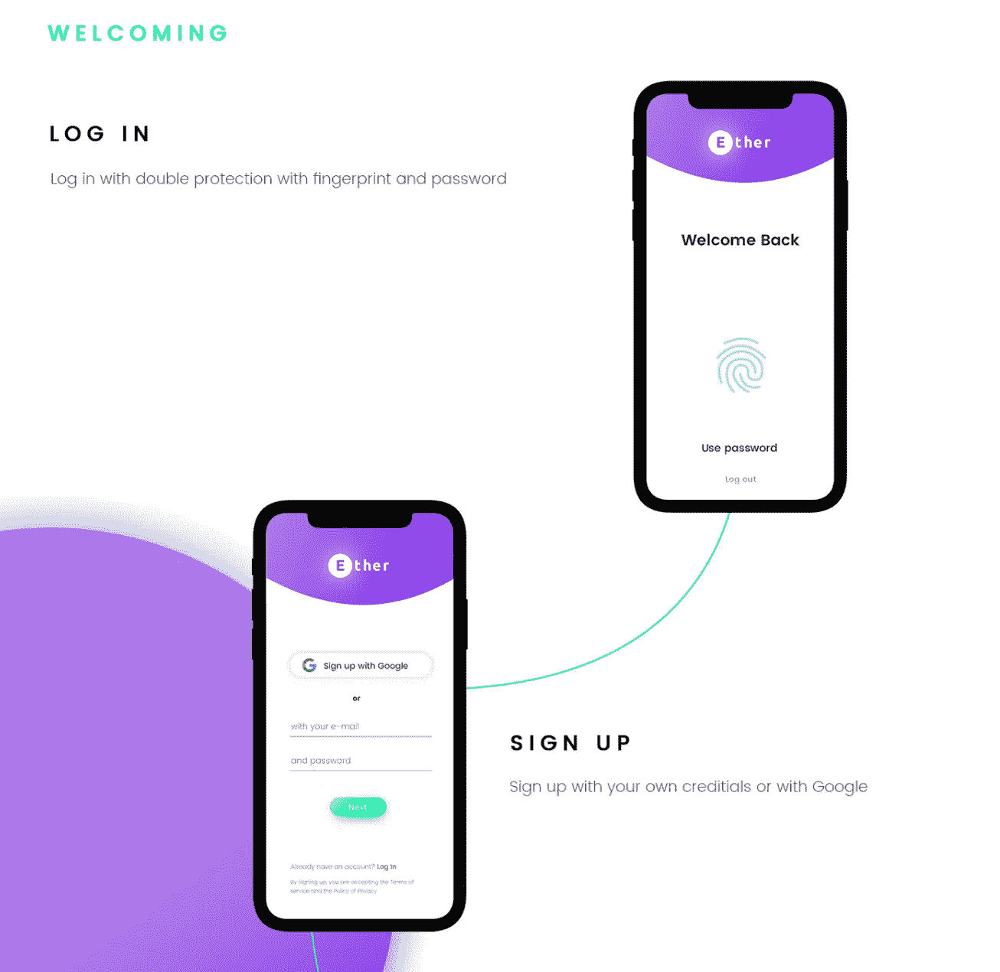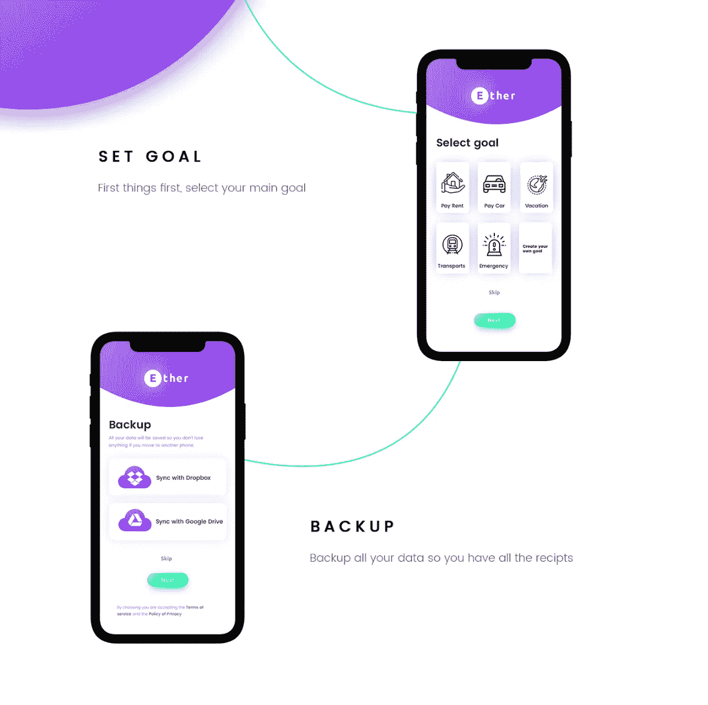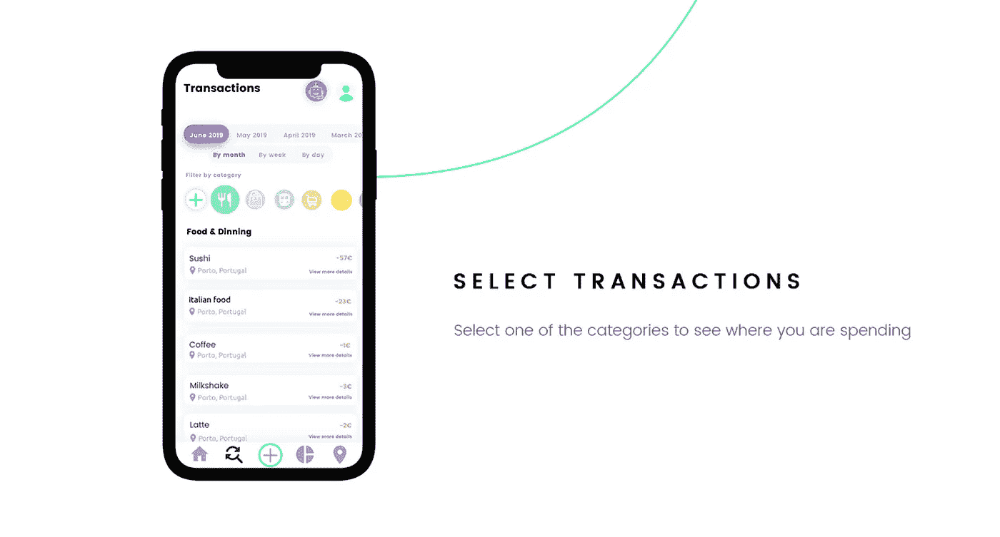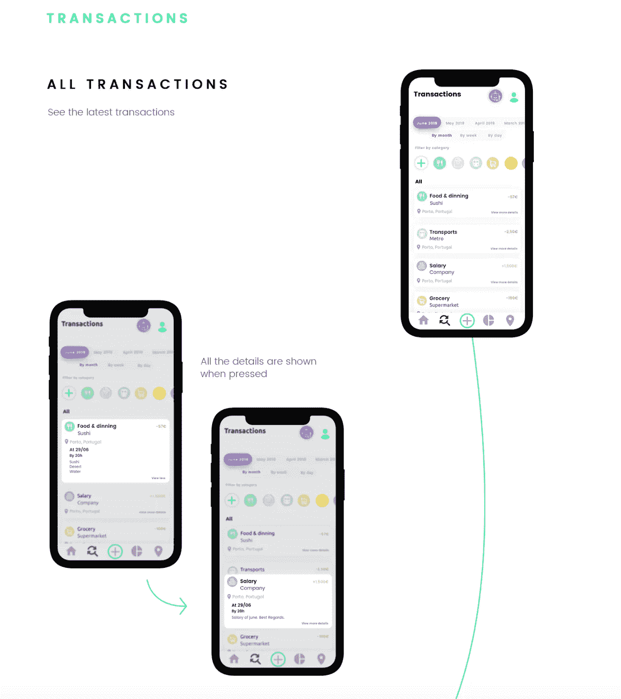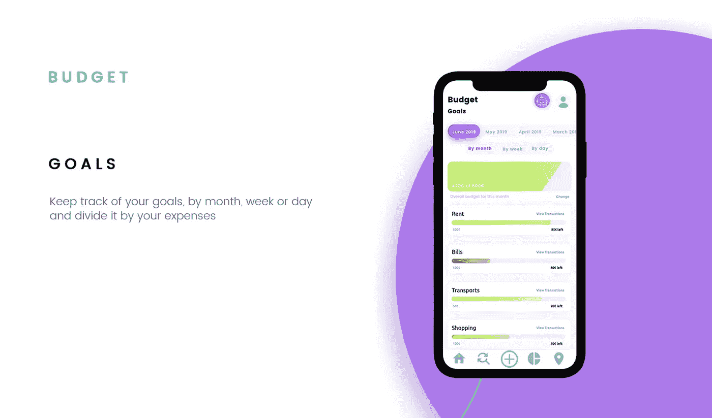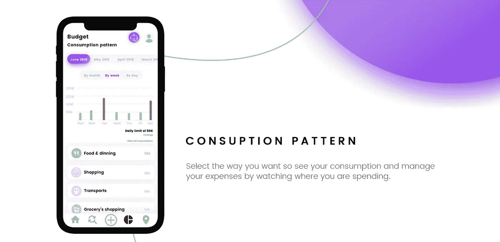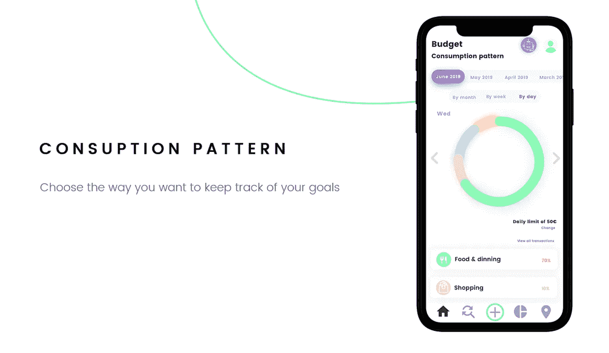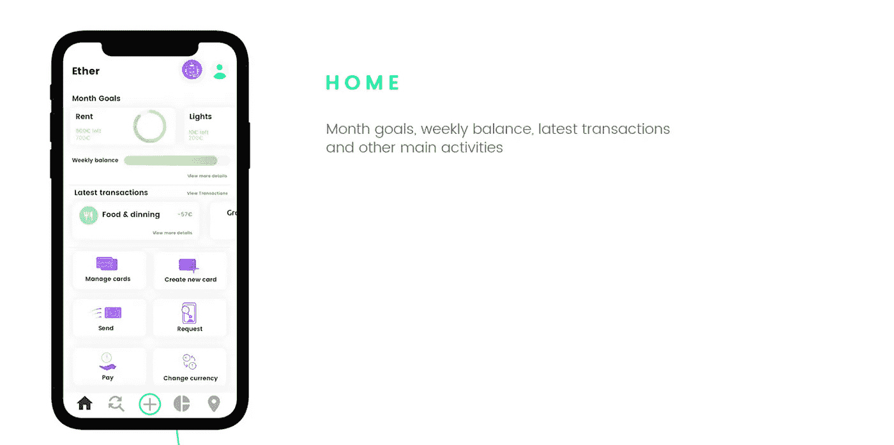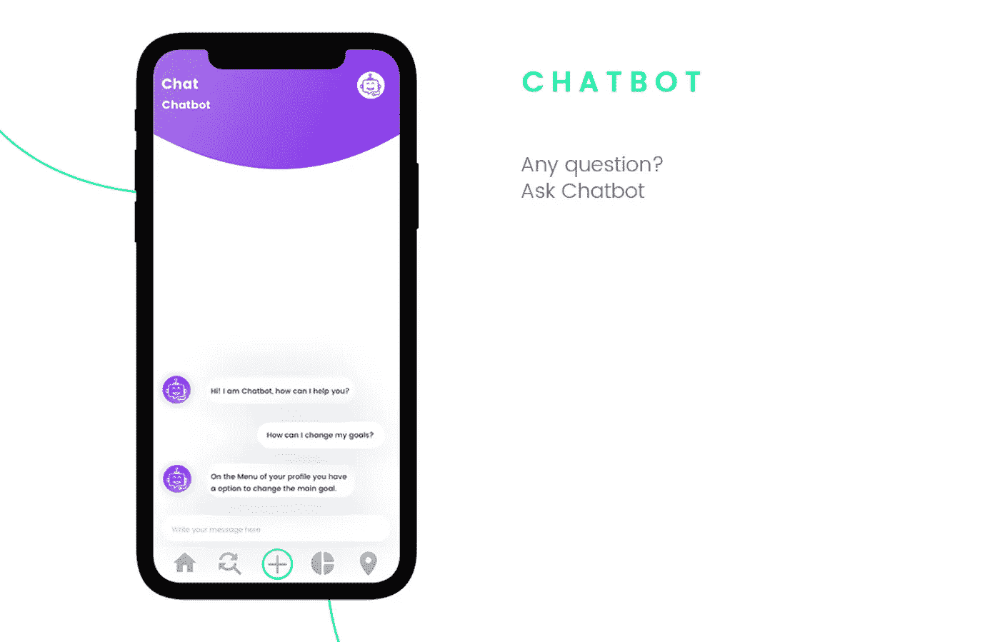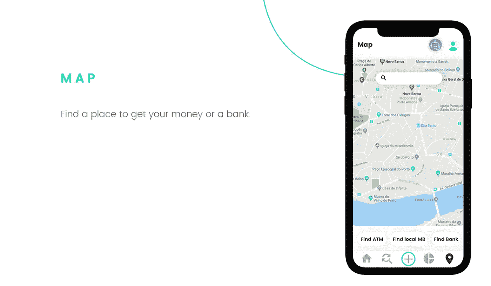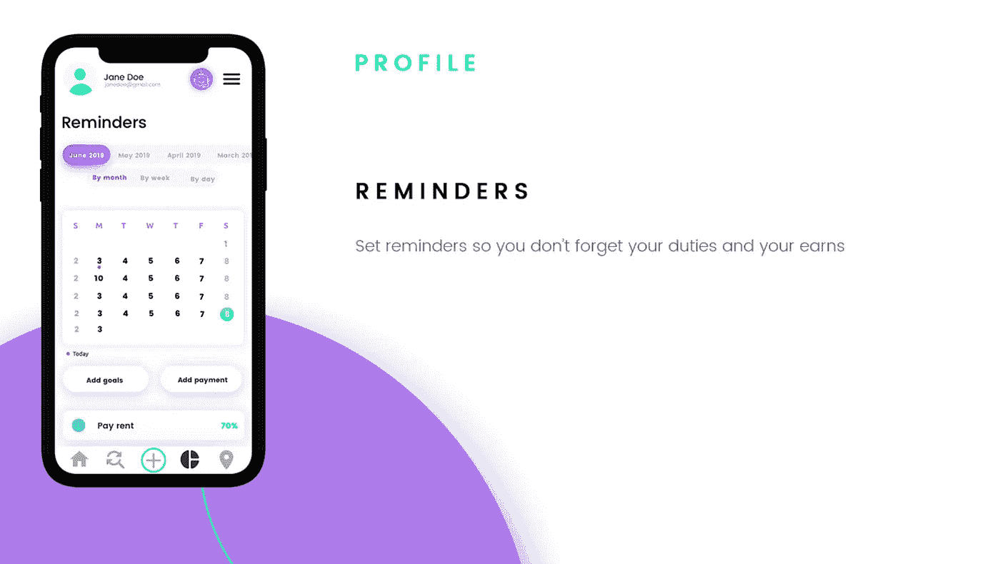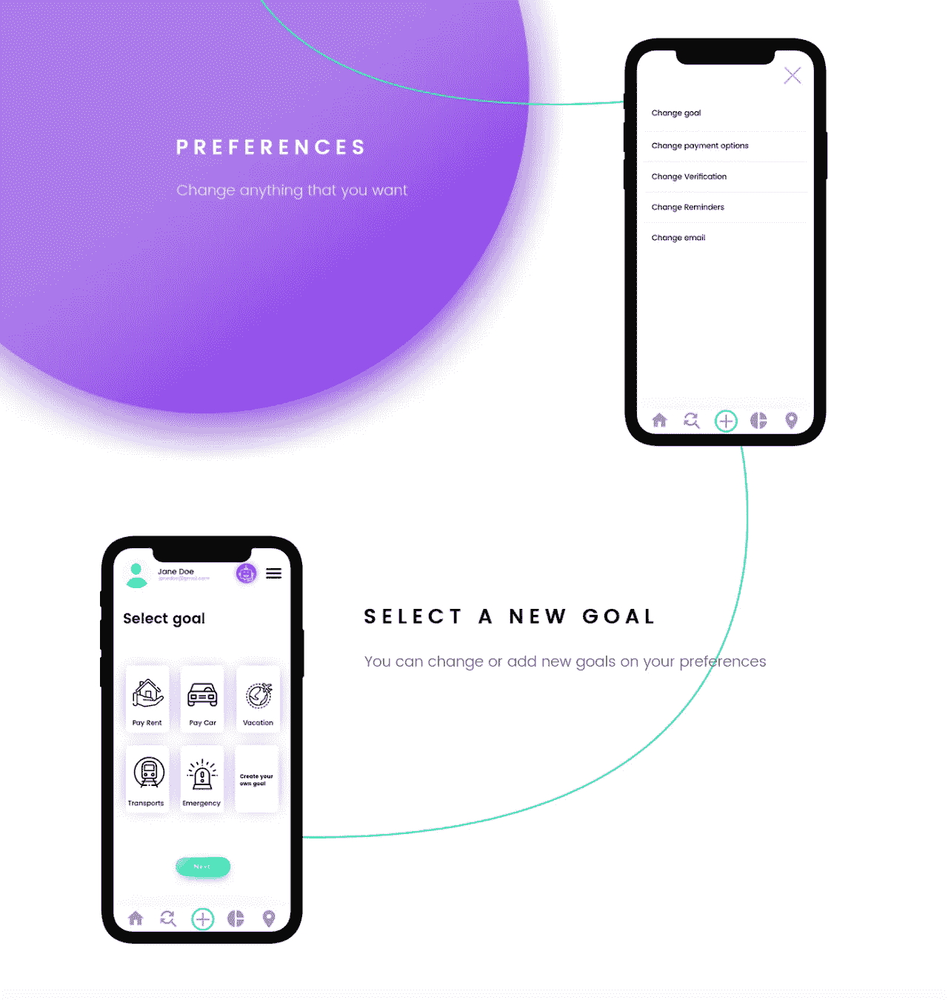

# 我学到了什么

金融科技正处于起步阶段，有许多选择可供选择，这使得他们的创新成为可能，并有机会扩展和尝试能让生活更轻松的新事物。

## 感谢您的阅读！如需更多背景或反馈，请通过 [LinkedIn](https://www.linkedin.com/in/minesribeiro/) 或我的[联系页面](http://www.inesribeiro.pt/contact)联系我。

## 该项目在[我的网站](https://inesribeiro.pt/ether)上完全可用。