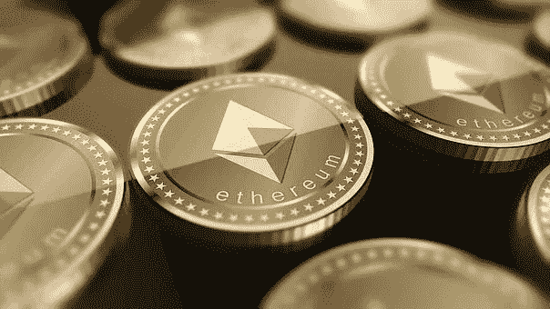

# 以太坊 2.0 和 Defi 的崛起

> 原文：<https://medium.datadriveninvestor.com/ethereum-2-0-and-the-rise-of-defi-4cc81a0e8430?source=collection_archive---------15----------------------->

以太坊是市值第二大的加密货币，仅次于比特币。以太坊是一个去中心化的开源区块链，也是去中心化金融(Defi)的中心。

许多人对以太坊网络即将升级感到兴奋。这次升级被称为以太坊 2.0 宁静。此次升级旨在为用户提供更高的安全性、性能和可扩展性。本文的目的是强调一些个人和组织对以太坊 2.0 感到兴奋的主要原因。

以太坊 2.0 允许用户利用诸如股权证明等功能。利害关系证明是一种功能，它允许社区将他们自己的一定数量的资金用于以太资产(如一杯咖啡)的使用，以创建一种“有形”的证明。

 [## DeFi 正在蓬勃发展，但对这位黑仔 DApp |数据驱动的投资者有一些警告

### 加密货币可能在 DeFi(去中心化金融)找到了一个杀手 DApp。它开辟了加密货币的空间…

www.datadriveninvestor.com](https://www.datadriveninvestor.com/2020/09/22/defi-is-booming-but-there-are-caveats-to-this-killer-dapp/) 

使用“以太”协议的开发人员数量的另一个显著增加是，开发人员可以创建他们自己的“以太合同”

许多主要玩家对以太坊 2.0 充满热情的主要原因之一是因为升级显著降低了交易成本和交易费用。以太坊网络上实施的新更新使交易更加可靠和高效，从而降低了最终用户的交易成本。

当你看到以太坊 2.0 的升级过程时，你会发现它需要开发者更少的时间和精力。因此，许多使用该网络的企业和组织将在新升级实施后的几周内看到新成员的涌入。就本文而言，这种升级有几个阶段，目前实现日期待定。

尽管有很多人表达了他们对以太坊 2.0 的兴奋，但事实是现在谈论升级还为时过早。这意味着您将从升级中获得的结果可能在一段时间内不可见。

有了以太坊 2.0，产生被动收入的能力对那些初学加密并寻求更大回报而不是从银行获得不存在的收益的人来说是最有吸引力的好处。我建议这些人下载雪球钱应用程序，并通过法明 Defi yield 产生被动收入。下面是最近推出的 iOS 和 Android 版雪球金钱应用的链接。[https://www.snowball.money/](https://www.snowball.money/)

## 获得专家视图— [订阅 DDI 英特尔](https://datadriveninvestor.com/ddi-intel)