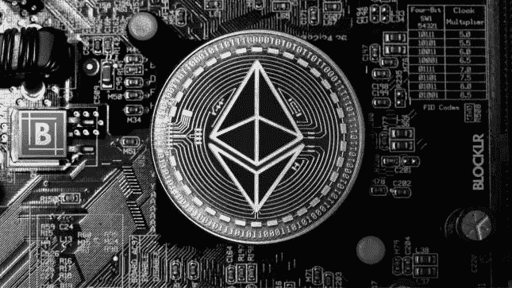
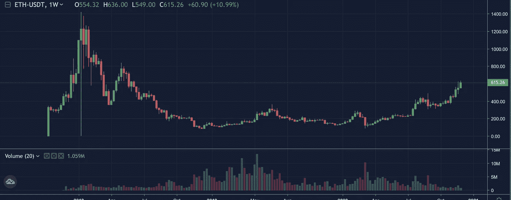

# 以太坊 2.0 已经成功上线——价格会涨吗？

> 原文：<https://medium.datadriveninvestor.com/ethereum-2-0-has-been-launched-successfully-will-the-price-go-up-71d1670ef22a?source=collection_archive---------0----------------------->

根据区块链开发者圈子的说法，这个想法应该是在维也纳诞生的。2014 年，据说 Vitalik Buterin 在一次会议后决定将以太坊从工作证明(采矿)转移到股权证明。然而，可以肯定的是，多年来，世界上第二重要的区块链都有最重要的升级计划——今天就是这一天:随着今天 12 月 1 日信标链的开始，向 ETH 2.0 的过渡将开始。

以太坊 2.0 标志着区块链项目新资本的开始。这是因为新的共识模型对于能量消耗、参与的可能性以及每秒可以进行的可能的事务数量具有决定性的后果。当然——向 ETH 2.0 的过渡可能需要数年时间，但截至今天，已有超过 27，000 家验证机构同意用他们的股份支持该网络(至少 32 家 ETH)。

ETH 2.0 Genesis Stakers 今年第二次确保以太坊节点总数超过比特币。因此，以太坊已经在 8 个指标中的 3 个指标上超过了比特币，这些指标衡量的是与主要加密货币相对的数字 2 的翻转潜力。

据 Ethernodes.org 称，目前有 11259 个以太坊节点处于活跃状态。因此，我们认为以太坊比比特币多 1%的节点，比特币有 11136 个节点。以太坊节点的数量最近在 9 月初超过了比特币节点的数量。

以太坊基金会(Ethereum Foundation)现已宣布 Beacon Chain 的成功推出，它是区块链项目的核心。顾名思义，它旨在为许多其他所谓的碎片链充当一种灯塔，每个碎片链都可以为其应用领域而创建。这应该会增加可能的交易总数。就在 2020 年，DeFi 领域的许多开发者已经看到了建立在以太坊上意味着什么，然后不得不接受交易费用的急剧增加。

 [## 稳定币会危及比特币在加密领域的地位吗？数据驱动的投资者

### Stablecoin 是一种加密货币，主要用于维持稳定的市场价值。它可以通过…

www.datadriveninvestor.com](https://www.datadriveninvestor.com/2020/06/08/can-a-stablecoin-jeopardize-the-position-of-bitcoin-in-the-crypto-space/) 

# OKEx 将支持标桩

对于以太坊 2.0，全球数以万计的以太网所有者决定加强至少 32 个以太网，即将它们纳入网络。他们将因此在未来获得 ETH 分配的奖励(和矿山一样)。领先的加密交易所之一 OKEx 已经宣布未来将支持以太坊 2.0。ETH 所有者将能够用他们的令牌交换 ETH2，他们也将有机会参与赌注。

# ETH 技术分析

由于以太坊 2.0 将于今天正式推出，我们需要警惕“卖新闻”的价格行动。作为参考，乙醚的日内阈值位于 594 美元，而上方阻力位于 620 美元，这是 11 月 24 日以来的最高水平。

# 轻松投资以太坊，没有复杂因素

尤其是加密货币领域的新人，非常重视高舒适度。一开始，设置以太坊钱包和手动发送加密货币可能会令人望而生畏。这是一个好主意，开始与一个可靠的，规范的经纪人谁可以提供你在这种情况下。

*   获得 100 多种不同的加密货币。
*   就交易量而言， [OKEx](https://www.okex.com/join/1/2428945) 仅次于币安位居第二。
*   [OKEx](https://www.okex.com/join/1/2428945) 提供特殊的交易功能，比如保证金交易最高可达 10 倍，衍生品交易最高可达 100 倍。
*   该交易所已经经营了四年，历史悠久。
*   简单的界面使交易相对容易。
*   通过 PayPal 存款
*   使用 OKEx 贷款，您可以通过向其他 OKEx 客户提供 C2C 贷款，直接从您的代币中赚取利息。

这些恰恰是你用 [**OKEx**](https://www.okex.com/join/1/2428945) 得到的好处。只要试一试，让自己相信上面说的优点就行了。现在就开始投资吧！

我在每月的[时事通讯中分享了更多私密的想法，你可以在这里查看](https://mailchi.mp/bf8f8e8ed697/keep-in-touch-with-lukas)。请在评论中告诉我，并在各种社交媒体平台上加入我:

[推特](https://twitter.com/WiesfleckerL) ● [Instagram](https://www.instagram.com/lukaswiesflecker/) ● [脸书](https://www.facebook.com/lukaswiesfleckerr)●[Snapchat](https://www.snapchat.com/add/luggooo)●[LinkedIn](https://www.linkedin.com/in/lukas-wiesflecker-1b11251a5/)

无论你做什么，都要带着爱和激情去做！

## 访问专家视图— [订阅 DDI 英特尔](https://datadriveninvestor.com/ddi-intel)