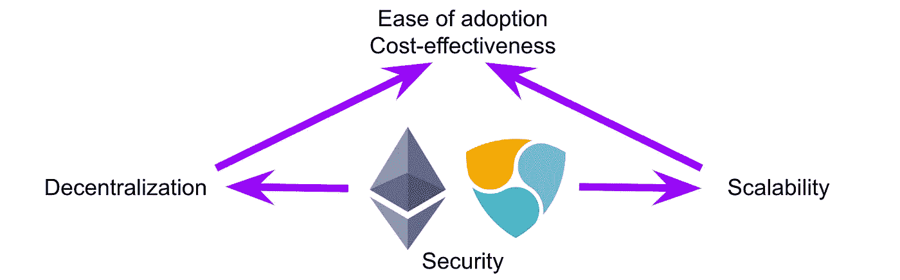

# 以太坊 2.0 vs 符号(第一部分)

> 原文：<https://medium.datadriveninvestor.com/ethereum-2-0-vs-symbol-part-1-c289ac68ad2c?source=collection_archive---------5----------------------->

这两款区块链都将于 2015 年发布，并且几乎同时发布了它们的 2.0 版本。随着他们第二次迭代的进行，我开始寻找他们之间的相同点和不同点。

## ***历史***

我总是认为回顾历史是重要的，因为它告诉我们未来的方向。

> "这是世界上可编程的区块链."—www.ethereum.org

以太坊引入了智能合约(满足标准时执行的计算机代码)、DApp(去中心化应用)和以太坊虚拟机(EVM、图灵完全和基于股份)。它允许执行有条件的动作。比如比特币，允许 A 把钱(比特币)汇给 B，差不多就是这样。以太坊使 C 有可能将数字资产发送给 B，如果 A 向 C 发送特定数量的钱(加密)。它把自动取款机(只能分发一种货币)变成了出售任何东西的自动售货机。

以太坊提供了所有的可能性，但也有代价。是可扩展性。虽然复杂的智能合同可以在 EVM 执行，但有时会导致平台拥塞，有时汽油(费用)会很贵。这就是[可伸缩性三难困境](https://medium.com/@aakash_13214/the-scalability-trilemma-in-blockchain-75fb57f646df)，为了去中心化和安全性，牺牲了可伸缩性。

另一方面，NIS1 (NEM 基础设施系统 1)可扩展性更强，费用更低。NIS1 不是图灵完全的。任何复杂的指令都需要离线执行。合同未在链上部署。

以太坊使用的是工作证明，而 NIS1 使用的是利益证明的衍生物，称为重要性证明(PoI)。每台收割机(如 PoS 的验证机)需要获得 10，000 XEM(NEM 的本地货币)。大约每 24 小时就有 10%的股份归属。这可以防止恶意攻击。

这两个区块链为链上记录的数据提供了不变性、透明性和安全性，为使用它们的组织提供了可信度。在我看来，以太坊更适合公共项目，NIS1 更适合企业采用。

## ***信标链 vs 收割***

Beacon Chain 将 PoS 引入以太坊，以太坊最终将与 mainnet 合并，这是技术路线图的第 0 阶段。它还协调碎片(将在阶段 1 中实现)和验证器。在最后阶段，宁静号，带有碎片的主网将停靠在信标链上。

Beacon Chain 将管理整个以太坊平台，在碎片之间进行协调，随机分配块提议和证明的验证器。它不能处理帐户和/或智能合同。

类似于 NIS1 和 Symbol 中的收集过程，其中节点是执行事务的节点(就像以太坊的 mainnet ),收集者(就像以太坊中的验证者)提出块。收获机是随机选择的，具有较高重要性分数的收获机具有较高的机会。重要性分数由网络中收割机帐户的赌注和活跃程度决定。

## ***取款键 vs 委托收款***

以太坊 2.0 中的验证器有两个私钥，用于验证和撤销。使用不同的密钥可以保护帐户不被泄露，因为在建议或证明块时需要验证程序私钥。

在 NIS1 和 Symbol 中，提议阻塞的过程是由远程帐户完成的，该远程帐户由具有股份的主帐户委托给节点。这个过程被称为委托收集，其中远程帐户的私钥用于签名块和收集，而主帐户的私钥可以安全地保存。所有收取的费用将被重新路由到主帐户，而远程帐户不持有任何密码，因此所有者不必担心帐户被泄露。

## ***智能合约 vs 集合交易***

Symbol 的一个新内置特性是聚合事务。

> 聚合交易将多个交易合并为一个，允许**无信任互换**和其他高级逻辑。Symbol 通过生成一次性智能合同来实现这一点。—https://docs.symbolplatform.com

对于聚合事务，前面引用的涉及 A、B 和 C 的示例将能够在 Symbol 上执行。与以太坊不同，这个特性内置在 Symbol 上，可以通过 API 调用。这使得生成高级逻辑和根据业务需求进行修改变得更加容易。

开始的目的是扩大区块链的可能性，但冒险进入不同的方向，以太坊和符号都保持真实，以保持区块链的安全，不可改变和透明。

在我看来，以太坊着眼于变得更加分散，而 NEM 着眼于变得可扩展。在他们的第二次迭代中，以太坊更关注可伸缩性，而 Symbol 则更倾向于去中心化。最终，双方都在努力使区块链技术更容易被大众接受，在保持去中心化的同时最具成本效益。

要研究的东西太多了，不可能一次就把它们都列出来。随着两个区块链的进步，更多的将被讨论。敬请关注。

特别感谢[安东尼](https://dev.to/anthonylaw)审阅本文。

## *参考文献*

1.  以太坊，智能合约，DApps[https://link . springer . com/chapter/10.1007/978-981-15-3376-1 _ 5](https://link.springer.com/chapter/10.1007/978-981-15-3376-1_5)
2.  以太坊 2.0:完全指南。缩放，第一部分 https://medium . com/chain safe-systems/ether eum-2-0-a-complete-guide-3739 a 74 be 61a
3.  区块链中的可扩展性三难困境[https://medium . com/@ aa kash _ 13214/the-Scalability-tri lemma-in-区块链-75fb57f646df](https://medium.com/@aakash_13214/the-scalability-trilemma-in-blockchain-75fb57f646df)
4.  NEM 技术参考[https://nem platform . com/WP-content/uploads/2020/05/NEM _ tech ref . pdf](https://nemplatform.com/wp-content/uploads/2020/05/NEM_techRef.pdf)
5.  完全指南。Casper 和信标链[https://medium . com/Chain safe-systems/ether eum-2-0-a-complete-guide-Casper-and-the-Beacon-Chain-be 95129 fc6 c 1](https://medium.com/chainsafe-systems/ethereum-2-0-a-complete-guide-casper-and-the-beacon-chain-be95129fc6c1)
6.  来自 NEM 技术参考的符号[https://docs . symbol platform . com/catapult-white paper/main . pdf](https://docs.symbolplatform.com/catapult-whitepaper/main.pdf)
7.  激活委托采集[https://docs . symbol platform . com/guides/account link/activating-Delegated-Harvesting . html # activating-Delegated-Harvesting](https://docs.symbolplatform.com/guides/accountlink/activating-delegated-harvesting.html#activating-delegated-harvesting)
8.  聚合交易[https://docs . symbol platform . com/concepts/consensus-algorithm . html # consensus](https://docs.symbolplatform.com/guides/aggregate/index.html)