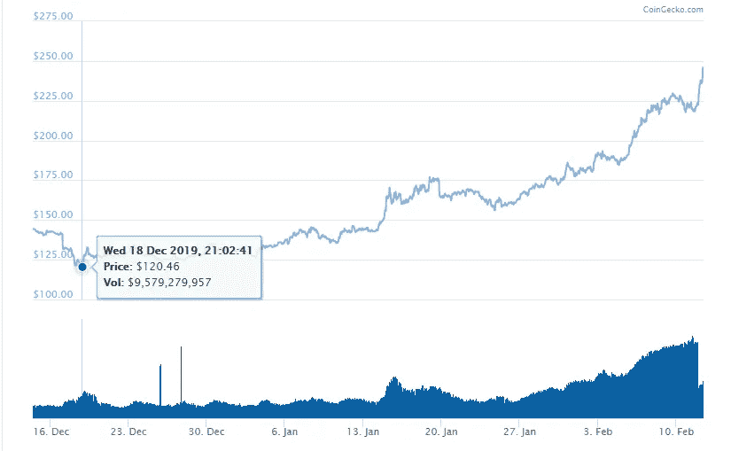

# 2020 年以太坊在使用和价格上继续增长，但是为什么呢？

> 原文：<https://medium.datadriveninvestor.com/ethereum-continues-to-grow-in-use-and-price-in-2020-but-why-fd37f357ae5b?source=collection_archive---------7----------------------->


区块链以太坊已经成为新代币诞生的平台。许多开发者在进入交易所和其他服务市场之前，使用以太坊作为链接来创建他们的业务和代币经济。

到了 2020 年，价格已经大幅上涨，不到两个月就从 120 美元涨到了 225 美元以上。但是有什么原因吗？



```
*Coingecko: Ethereum Price from December 2019 - Feb 2020*
```

2019 年，以太坊去中心化应用(d apps)在热门领域取得了巨大进步，包括[游戏](https://blockchain.news/news/korean-blockchain-games-are-becoming-more-mainstream-in-global-markets)和[体育](https://blockchain.news/news/nba-sacramento-kings-leveraging-blockchain-for-authentic-in-game-gear-purchases)。

继 2019 年的增长之后，钱包持有者在 2020 年初看到了巨大的进一步增长，超过 80%的新日常活跃钱包来自 Dapps 以及游戏和市场用户，跃升了 163%。

游戏是以太坊去中心化市场上最受欢迎的类别，过去几个月里，该细分市场的游戏和新推出的游戏数量增加了 7%，供玩家享受。

[](https://www.datadriveninvestor.com/2019/03/10/swiss-based-etp-enters-the-crypto-trading-market/) [## 总部位于瑞士的 ETP 进入加密交易市场|数据驱动的投资者

### 虽然金融市场几乎没有沉闷的时刻，特别是在引入…

www.datadriveninvestor.com](https://www.datadriveninvestor.com/2019/03/10/swiss-based-etp-enters-the-crypto-trading-market/) 

单单对游戏的持续增长和兴趣就是以太坊持续扩张和吸引新用户的巨大原因。这当然可以看出为什么价格也稳步上升。在 2020 年 1 月，我们可以得出结论，在今年这么快就增长了 7%之后，以太坊显示出真正有前途的迹象。

如果以太坊能够继续主导游戏领域，并在其市场上发展，击败市场上的其他平台，那么 2020 年可能是加密货币的重要一年。游戏、体育和分散金融将是驱动因素，以及链条的最新更新如何影响业绩。期待已久的[君士坦丁堡更新](https://blockchain.news/news/ethereum-the-whole-forking-history)也将最终发生，为区块链最大和最强大的平台创造相当大的动力。

```
*Image via Shutterstock*
```

*最初发布于*[*https://block chain . news*](https://blockchain.news/news/ethereum-continues-to-grow-in-use-and-price-in-2020-but-why)*。*