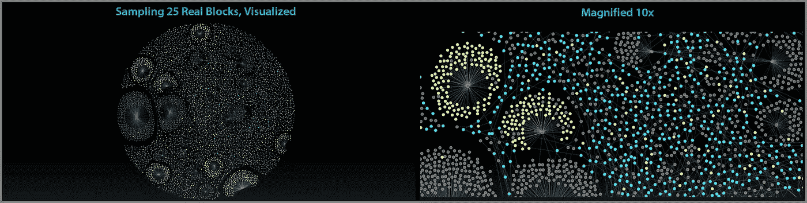
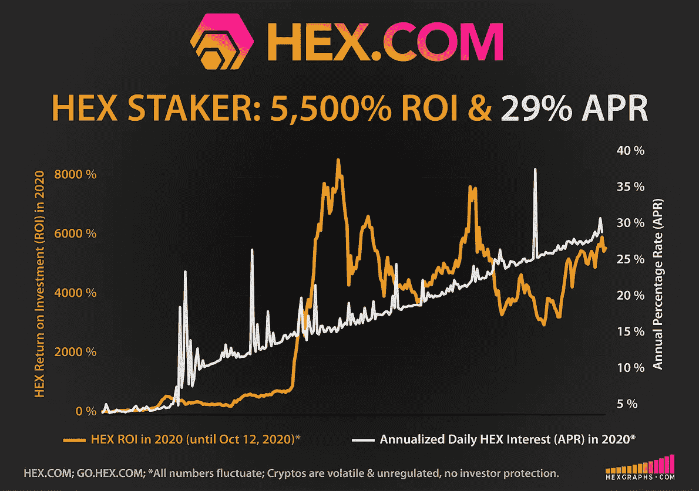
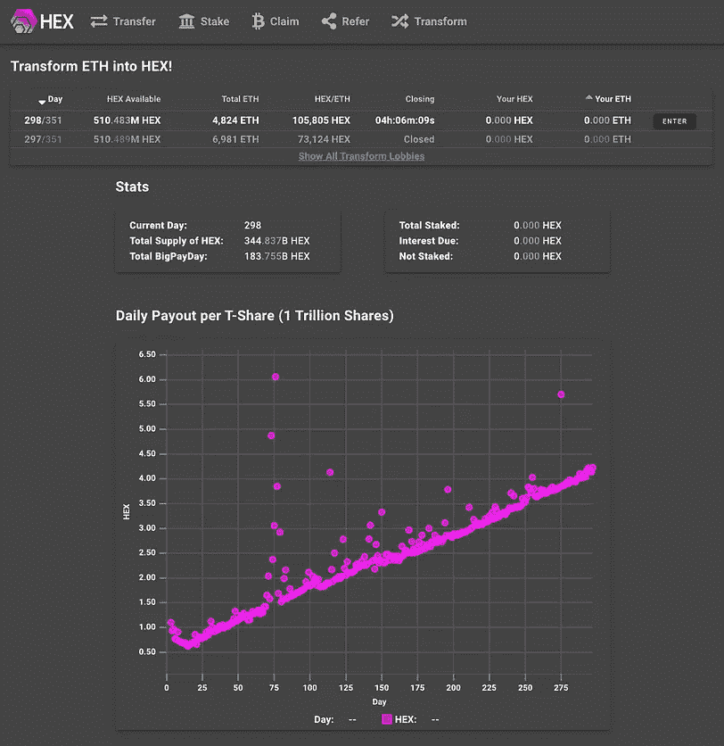
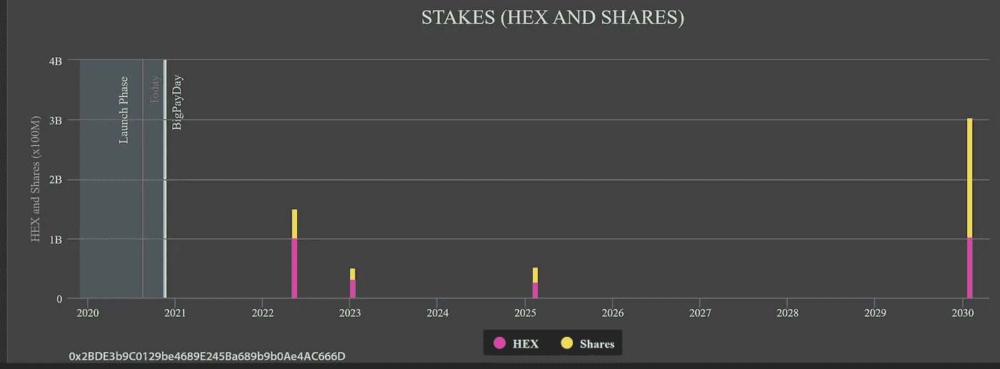
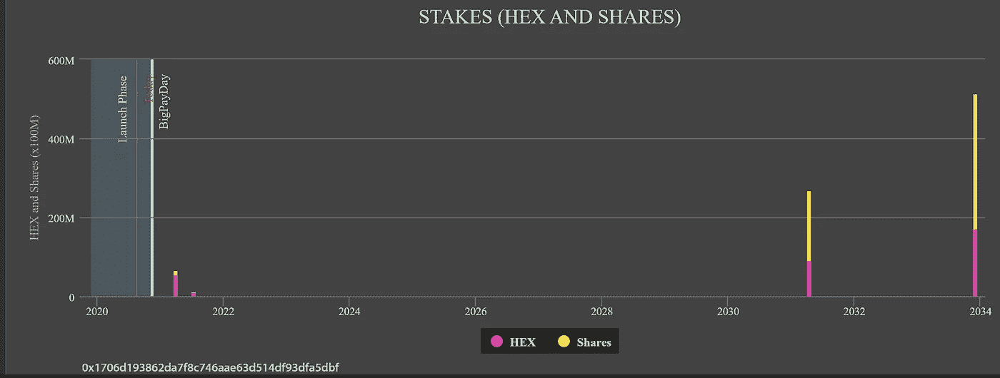
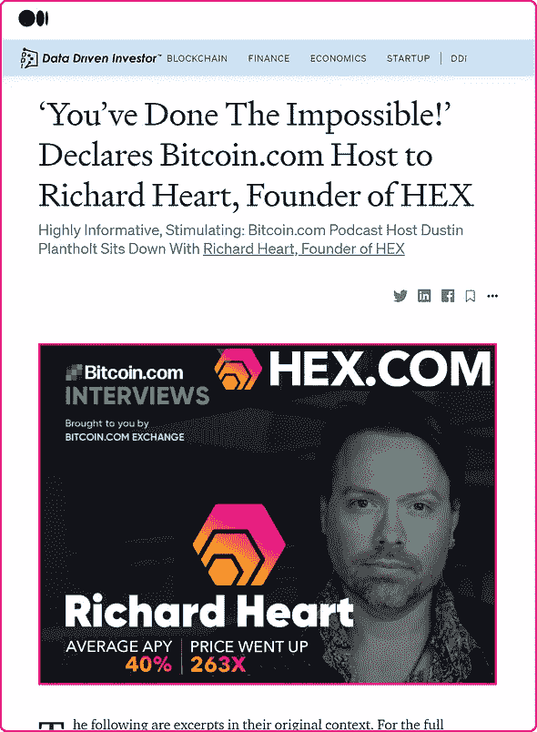

# Chainalysis 透露，70 多万 ETH 的以太坊创世纪钱包将大块移动到 DeFi Staking 产品 HEX

> 原文：<https://medium.datadriveninvestor.com/ethereum-genesis-wallets-of-700-000-eth-move-big-blocks-into-defi-staking-product-hex-39107d2c9cc0?source=collection_archive---------1----------------------->

## 2020 年 10 月 14 日更新。[以太坊创世纪钱包](https://etherscan.io/)赌注大进 [DeFi 赌注产品六角](https://hex.com/)

2020 年 10 月 14 日更新

当 [DeFi](https://www.coindesk.com/what-is-defi) 标桩产品设计良好时——经过审计且 100%在链——每个地址都可以检查。这意味着看到谁买了或卖了，一个地址是否有赌注，当这些赌注到期时，他们持有的其他硬币——一切！

甚至有可能看到未来大额股份何时到期，并围绕它们制定计划。**在** [**DeFi**](https://www.coindesk.com/what-is-defi) **中，这种新型的链上透明度改善了价格发现，减少了波动性，并促进了整体市场的透明度。**

在第一个高息区块链定期存款 [HEX](https://hex.com/) 上运行 chainalysis，发现了许多成功早期采用当今市值最大的加密货币的人的惊人数量的鲸鱼活动。在这里，我们快速浏览一下几个[以太坊创世纪钱包](https://etherscan.io/)购买大块的 HEX 并下注。

作为一个题外话，也应该注意到有许多单个钱包中有 100 个 BTC(在某些情况下甚至 1000 个)的比特币钱包被观察到链上参与 HEX。这篇文章鼓励你自己做一些探索——你可能会对你的发现非常感兴趣。*(参见底部建议的有用资源。)*

> **在这里，我们看到两个不同的以太坊创世纪钱包，分别有 400，440 和 310，000 以太币，拿起大块的十六进制(和赌注):**

# 通过设计:HEX 丰富了它的 Staking 类

一旦完成这些购买，他们就利用 HEX 最强大的设计功能:赌注来平衡他们的多头头寸。

**由于其** [***股份*发行设计**](https://medium.com/datadriveninvestor/fully-audited-earnings-per-share-in-stakings-sweetspot-hex-means-big-payouts-for-shareholders-10972b1f5a3c?source=friends_link&sk=f2c8ad8a846b852ab6a70ad4e7b61584) **，无论 HEX 的交易价格如何，押下的 HEX 总是会返回更多的 HEX。例如:押十六进制 10 年将返回大约 80 倍十六进制。HEX 本身的任何潜在价格升值将进一步增加结束持股后已实现收益的投资回报率。**

每天十六进制赌注赚取利息。当人们比他们承诺的更早或更晚结束他们的赌注时，十六进制赌注者会获得额外的利益。上图右侧是每股每日派息的图表。你可以看到人们紧急情况下每日支出的峰值。

**这些 Genesis 钱包的主人似乎研究过 HEX 并了解它的设计:购买后，他们立即通过战略性下注来平衡他们的头寸。他们创造的赌注利用了 HEX 的两个简单的赌注设计特点:*越长越好*和*越大越好*。他们的赌注可以在这里查看:**

[For Live Interactive Chart: Click Here; Scroll Down Page to Stakes](https://www.hexinfo.io/stakes/0x2BDE3b9C0129be4689E245Ba689b9b0Ae4AC666D)

[For Live Interactive Chart: Click Here; Scroll Down Page to Stakes](https://www.hexinfo.io/stakes/0x1706d193862da7f8c746aae63d514df93dfa5dbf)

# 众多 Defi 项目中的一款强大的 DeFi 产品

DeFi 的第一个完整产品 HEX 在 2020 年吸引了越来越多的关注，尤其是最近，由于其强大的链上设计，高赌注收益率和超大的性价比。

# 盗梦空间

HEX 是由连续创业者和早期比特币采用者[理查德·哈特先生](https://www.forbesindia.com/article/brand-connect/richard-heart-and-the-influence-of-bitcoin-on-the-hex-blueprint/62095/1#)发明的。如今，Heart 先生是以太坊的精通支持者，也是各种主题中令人振奋的思想领袖。

## 100%正常运行时间。100%在链上。零位关闭开关。

## 最纯粹的分权金融形式:

> “如果 HEX.COM 离线，理查德心脏死亡，妖术继续工作。许多项目声称是去中心化的，但实际上依赖于管理员不改变代码。十六进制代码不能更改。~十六进制。计算机输出缩微胶片

# 更新:

# 赌注十六进制&看它倍增

[桩工。App](https://staker.app/invite/PQn8) 让你安全可靠地在网上积累 100%的财富，并实时观察财富的增长:

# 相关文章:

# **有用资源:**

## HEX.COM⬣更多信息

## ⬣新闻和更新:[关注 Twitter @HEXcrypto](https://twitter.com/hexcrypto)

## https://t.me/HEXcrypto⬣社区:互动、问答、玩乐:

## 📺每天在 Twitch 上看 HEX 每日新闻直播，太平洋时间下午 3:40:[HEX ologist](https://www.twitch.tv/thehexologist)

## 📺每周一、三、五(周五晚上的聚会)晚上 7 点在 Twitch 上观看直播话语联盟:[话语联盟](https://www.twitch.tv/discourse__syndicate)(话语联盟只面向成年观众)