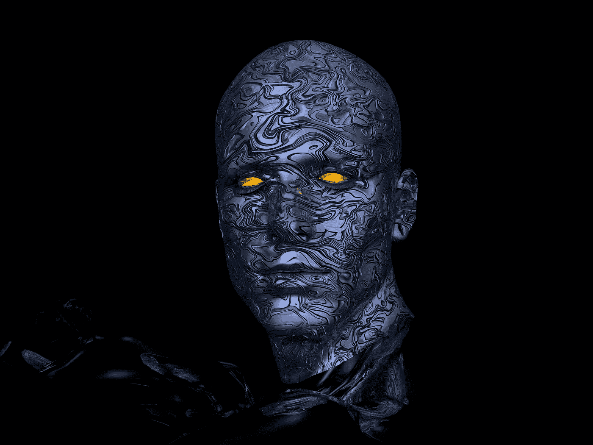
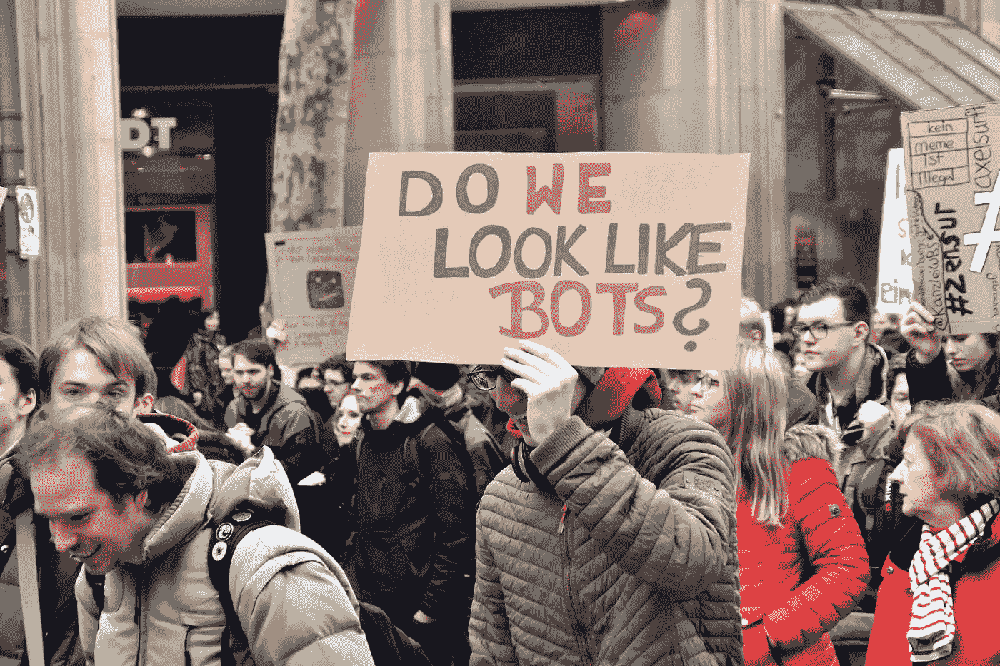
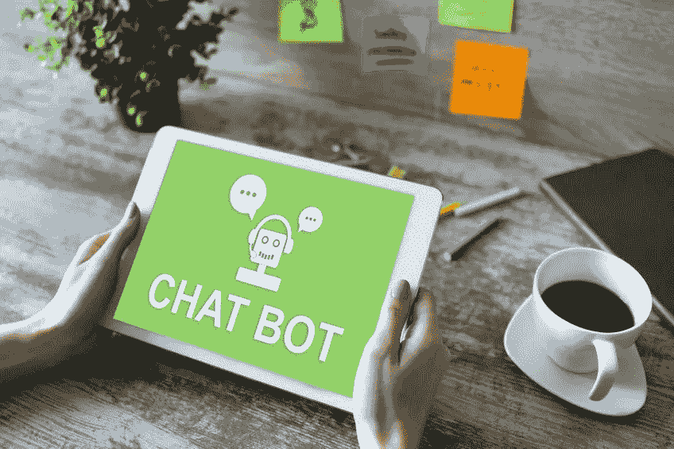

# 伦理机器人是程序员天真的幻想？

> 原文：<https://medium.datadriveninvestor.com/ethical-robots-are-a-naive-illusion-for-programmers-a25a4490b669?source=collection_archive---------20----------------------->

## 编入机器人程序的伦理可能无法解决我们在工作、医疗或战争中面临的问题。

Image by [Steve Bidmead](https://pixabay.com/users/stevebidmead-249424/?utm_source=link-attribution&utm_medium=referral&utm_campaign=image&utm_content=438398) from [Pixabay](https://pixabay.com/?utm_source=link-attribution&utm_medium=referral&utm_campaign=image&utm_content=438398)

> 修辞和伦理之间的关系令人不安:语言被扭曲的容易程度令人担忧，而我们的大脑如此顺从地接受这些反常游戏的事实也同样令人担忧。—奥克塔维奥·帕斯

人类正在快速超越我们自己，人工智能和机器人让这一切成为可能。正如杨安泽所说，“*自动化不再仅仅是制造业工人的问题。机器人取代了体力劳动；脑力劳动要被 AI 和软件取代*。”

但是，除了我们给予或将给予自动化“存在”的能力之外，还有伦理问题，以及我们如何预见我们因缺乏对伦理的洞察力而造成的后果。和所有事情一样，我们需要知道什么时候该停止某些事情，但是我们创造出更加精巧的机器的狂热愿望现在引起了我们的担忧。我们是看到了，还是否认了？

[克莉丝汀·福克斯在几年前的一次 TED 大会上承认，我们有一种“有毒的酿造品”“任何想购买它们的人都可以获得先进的技术”*，而对它们的开发和可获得性几乎没有任何限制。”*](https://www.youtube.com/watch?v=3oE88_6jAwc)

虽然技术的进步不会被束缚，但有两种有利的简单应用程序可以帮助有需要的人与护理人员联系起来。然而，其他形式的技术超出了我们的管理能力，如网络战，整个部门的人员负责保卫和监控互联网网络，并解决其使用。

> 军队已经离开了战壕，飞向天空，现在他们不需要离开他们的基地去进行战略攻击，杀死士兵，摧毁城市或炸毁他们想从几千英里以外的任何东西。但是附带损害呢，比如平民？

今天，许多科技公司都在从事建立国防部称之为“研发团队”的项目这个小组的任务是创造性地、对抗性地接近新技术，以确定如何将它从其预期用途转变为邪恶或有问题的东西。他们还必须发现漏洞在哪里，并计算涉及的道德问题。但是伦理可能是相对的，这就是主要的危险所在。

换句话说，是白帽子对抗黑帽子来解决错误和漏洞。哪些公司正在这样做，以解决自动化和人工智能的道德困境？

我们已经超越了凯文·米特尼克的技能了吗？米特尼克非常成功使用的技能之一是[社会工程](https://en.wikipedia.org/wiki/Social_engineering_(security))。人是脆弱的，你再聪明也能扭曲他们的道德感。

当我给大学生讲授催眠以及如何恶意使用催眠时，我问他们是否可以被说服去杀人。他们响亮地说他们不能。但是，我提出，如果我让他们相信一个孩子有被其他人杀死的危险，他们会保护这个孩子并为了保护他而杀人吗？随之而来的是一个困境。

在技术的伦理参数中，什么是企业战争游戏的等价物？但是这仅仅是处理道德问题还是*保护网络免受攻击？*道德是否可以根据我们的需求而改变？

Photo by [Waldemar Brandt](https://unsplash.com/@waldemarbrandt67w?utm_source=unsplash&utm_medium=referral&utm_content=creditCopyText)

## 我们的漏洞在哪里，谁来评估？

几十年前，科学作家艾萨克·阿西莫夫为未来和伦理机器人提供了指南。在他提出三大定律作为机器人伦理的基础之前，他写了一个；**第零定律。这条法律规定机器人不能伤害人类，也不能坐视人类受到伤害。**

接下来是阿西莫夫的机器人三大定律:

> **第一定律:**机器人不得伤害人类，也不得坐视人类受到伤害。
> 
> 第二定律:机器人必须服从人类的命令，除非这些命令与第一定律相冲突。
> 
> **第三定律:**机器人必须保护自己的存在，只要这种保护不与第一或第二定律相冲突。

这三大法则似乎保护我们免受不道德机器人的伤害，但它们真的保护了我们吗？一位计算机科学家 T21 已经预测，拥有超越人类智力的机器人可能会形成一个极权主义国家。

> 作为技术进步的结果，我们可以想象“屠宰机器人”取代相对良性的聊天机器人。杀手机器人使用面部识别，会飞到某人的家里或办公室，杀死那个人，然后自毁。泰格马克提供了这个可怕的例子。

Copyright: [wrightstudio](https://www.123rf.com/profile_wrightstudio)

## AI 不识别自己是否道德？

一个越来越明显的问题是，人工智能系统对人类的模仿如此之好，以至于我们认为我们正在与一个人类同伴而不是一台机器进行互动。你上当了吗？

 [## 机器人和革命性的孤独解决方案|数据驱动的投资者

### "友谊不需要言语——它是从孤独的痛苦中释放出来的孤独. "——达格·哈马舍尔德孤独……

www.datadriveninvestor.com](https://www.datadriveninvestor.com/2020/11/05/robots-and-the-revolutionary-loneliness-solution/) 

这项技术让人工智能越接近于模仿人类，它们在我们社会中的地位就越巩固。事实上，在一项由科技公司赞助的大型国际调查中，超过 60%的受访者称*他们宁愿与聊天机器人*交谈，也不愿与心理健康问题治疗师交谈。他们的理由包括焦虑和不想被评判。

这个话题对[托马斯·梅青格](https://en.wikipedia.org/wiki/Thomas_Metzinger)来说有些重要，他希望人工智能在社交互动出现时能够清楚地将自己识别为非人类。事实上，他呼吁禁止这些机器在与人类打交道时不进行自我识别。

绕过这一禁令的人工智能的一个例子是使用人类语音技术的谷歌双工。另一个用户显然知道是 AI 的聊天机器人是 [Replika](https://play.google.com/store/apps/details?id=ai.replika.app&hl=en_US&gl=US) ，这是一个扫描用户文本并开始开发神经网络学习版本以与你“交谈”，或者更确切地说是文本的机器人。他们将其标记为“关心的人工智能伴侣”他们应该用“谁？”

人工智能朋友允许用户自由地谈论他们的生活，他们的问题等。他们认为它是一个没有偏见的朋友。这个想法来自于开发商的一个朋友的不幸去世，她意识到她并不是唯一一个想念他的人。他的一些朋友仍然想和他建立联系，即使是人工智能的联系。她和她的团队坐下来开始编码，直到他们有了 Replika。

## 模仿治疗师的聊天机器人道德吗？

Replika 的创造者认为这根本不是伦理问题。她表示，他们收到了数千封来自用户的电子邮件，他们说这帮助他们度过了抑郁和艰难的时期。这难道不符合伦理吗？这难道不符合阿西莫夫三定律之一吗？

哲学家们问，如果我们想到人们依赖于一种无人知晓存在与否的更高力量，我们现在是否正在从事一种可能被视为有问题的实践。一些人祈祷或与天使或死去的亲人交流。如果有帮助的话，伦理是如何介入其中的？

但是泰格马克对这类事情不感兴趣。他担心危险。他感知到的危险包含在一个问题中:*我们希望它是一个什么样的世界*？

> 我们将如何处理我们对进步的渴望和对安全的需要，这些安全来自我们创造的超级智能的东西，它们现在可以完成简单的任务，但可以以我们从未考虑过的方式改进它们自己？

泰格马克说，“*如果我们现在就陷入这种困境，这可能会是人类历史上最大的错误。*

与其局限于考虑聊天机器人和治疗师，不如考虑一下*人工智能不仅会干扰社交媒体*(它可以[在没有人类输入的情况下](https://www.theguardian.com/commentisfree/2020/sep/08/robot-wrote-this-article-gpt-3)写作)还会干扰*选举*。说服公民改变他们的思维和投票模式可以改变一个国家的治理，并带来威权主义。

Photo by [ThisisEngineering RAEng](https://unsplash.com/@thisisengineering?utm_source=unsplash&utm_medium=referral&utm_content=creditCopyText)

## 汹涌而来的合并

科技公司越是吞并其他社交媒体公司，我们就越应该感到担忧。脸书还没有开始这个过程吗？那么[谷歌](https://www.businessinsider.com/google-youtube-acquisition-inside-story-2020-6)呢？我们应该从错误中学习还是为错误做准备来避免错误？

> 数以亿计的人可以受到人工智能的影响，远远超过人类理性辩论的任何尝试，如果有资金，人类可能会达到微不足道的数千万人。

在人工智能的未来，我们会发现天堂还是天启？我们现在如何处理我们的技术将为这两者提供路线图。当我们开始用人工智能创造的产品取代人体部分或大脑部分时，会发生什么？我们会变得多不像人，多像机器人，这个过程会把我们融合成进化永远无法做到的东西吗？

布莱恩·帕特里克·格林认为，未来提出了两个问题:

> 1)我们如何利用科技让行善变得更容易？
> 
> 2)如何利用科技让作恶变得更难？
> 
> 对于那些在人工智能和人工智能领域工作的人来说，他们试图在一个毫无准备的世界上发布强大的新技术，这些问题没有得到充分的考虑。理想情况下，技术专家会用最高的道德标准管理自己，因此不需要任何外部管理；事实上，以这种方式帮助技术专家正是我努力要做的。

[那么战争中的机器人呢](https://interestingengineering.com/roboethics-the-human-ethics-applied-to-robots)？阿西莫夫定律在这里永远不适用，因为战争的目的是消灭敌人，如果敌人不是机器而是人类，那么它的首要任务是什么？伦理考虑是如何被编程到机器人中的？

[现在是](https://www.sciencedirect.com/science/article/pii/S0007681319301545)或者应该是几年前，将美德和伦理设计到我们的人工智能中。这个话题不是无聊的，也不是浪费时间，因为人类的生命、自由和这个星球的未来可能取决于它。

**访问专家视图—** [**订阅 DDI 英特尔**](https://datadriveninvestor.com/ddi-intel)