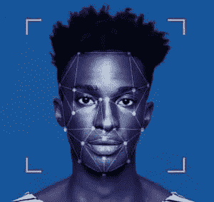
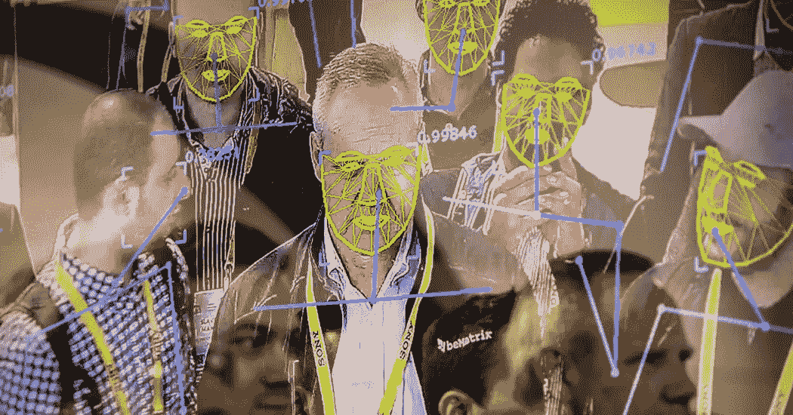

# 面部识别技术的伦理和安全问题

> 原文：<https://medium.datadriveninvestor.com/ethical-safety-concerns-of-facial-recognition-technology-cf63fe300fbd?source=collection_archive---------12----------------------->

《终结者》和类似的电影描绘了一个由人工智能和机器人控制的世界。对于主流来说，这可能看起来很奇怪，但像 Elon Musk 这样的知名人士对这种情况成为现实表示了相当大的担忧。然而，阻碍的威胁不是自我意识的机器人或人工智能，而是人类的滥用。人工智能有许多子领域，包括机器学习、深度学习、语音识别/自然语言处理、图像处理/计算机视觉、面部识别等。本文将具体讨论面部识别及其应用和意义。

一位美国幽默作家曾经说过“新技术本身并没有好坏之分。这完全取决于人们如何选择使用它”。

面部识别的一个有前景的用例是[面部认证和安全](https://medium.com/@gabnyante/imagine-this-no-more-passwords-for-anything-c73e8e430482)，用户不再需要记住密码或 pin 码，这在理论上使用户账户更加安全。确保正确使用该技术是非常重要的，尤其是最近脸书用户未经授权使用数据的新闻等。其他用例包括[帮助盲人识别与他们交流的人的面部反应](https://www.fastcompany.com/3050622/a-new-facial-recognition-mobile-app-from-listerine-helps-blind-people-see-smiles)(微笑，皱眉)，协助调查，采用更安全的金融交易，以及使航空旅行更加安全和方便。

 [## 技术是市场的领头羊|数据驱动的投资者

### 大量的首次公开募股，中国做他们自己的事，微软政府的灾难应对，以及抖音的民谣…

www.datadriveninvestor.com](https://www.datadriveninvestor.com/2020/08/28/tech-is-the-market-top-dog/) 

[谷歌的 SVP·肯特·沃克表示](https://techcrunch.com/2018/12/14/google-agrees-not-to-sell-facial-recognition-tech-citing-abuse-potential/)“面部识别技术在新的[辅助技术](https://medium.com/@gabnyante/imagine-this-no-more-passwords-for-anything-c73e8e430482)和帮助寻找失踪人员的工具等领域有好处，更多有前途的应用即将出现，”沃克写道。“然而，像许多具有多种用途的技术一样，面部识别值得仔细考虑，以确保其使用符合我们的原则和价值观，并避免滥用和有害的结果……”。关注的领域包括用户隐私、网络安全、自主武器等。人工智能是一个令人兴奋的领域，每周都有新的创新，但我们也必须意识到我们创造的技术可能带来的结果。

一些人认为这是对个人隐私权的破坏。它允许控制面部图像数据的各方访问关于个人的其他私人数据，如位置和居住地。拥有这项技术的政府可以追踪一个人的所有信息以及他们的所有活动。在中国的城市里，每个街道和角落都有极其精确的面部识别摄像头，对市民进行不间断的监视。

全国各地的警察部门已经开始将面部识别技术纳入他们的调查流程。一方面，这可以帮助他们更快地抓住罪犯，但是该技术仍然不完善，并且已经有许多情况，因为该技术提供了不正确的结果，导致警察逮捕了错误的个人。此外，它的准确性高度依赖于种族和民族。不同种族背景的女性比白人更容易被误认为男性。

美国正在经历一场民权动乱，因为警察以惊人的速度出于不正当的理由杀害美国黑人，而他们往往没有被追究责任。许多人站出来反对警察的暴行，全国各地爆发了抗议活动。有了面部识别，人们担心官员会把抗议者作为逮捕和惩罚的目标。这是一个真正的问题，因为全国有几个部门已经这样做了。由于滥用的可能性，一些城市和整个国家正在寻求禁止警察部门使用面部识别技术。当这种情况发生时，抗议者已经找到了混淆他们的脸的方法，摆脱了摄像头的检测机制。

微软已经承担起引领面部识别软件和人工智能规范的责任。2010 年，微软开发了一套很棒的机器学习和人工智能服务，允许大公司、小团队和个人开发者简单地通过访问[微软认知服务 Api 的](https://medium.com/datadriveninvestor/your-apps-can-know-read-emotions-ai-with-microsofts-cognitive-services-f6ff1f4788db)来利用这些工具。

微软确定了六个主要条款来决定面部识别软件的道德使用。它们包括公平、透明、问责、不歧视、通知和同意以及合法监督。除了这些条款，还有一个持续的审查过程，以确保符合这些准则。

谷歌开发自己的面部识别技术已经有一段时间了，但去年它宣布，在坚实的监管措施到位之前，它不会很快向公众发布新开发的面部识别技术。

谷歌道德人工智能团队的领导者蒂姆尼特·格布鲁(Timnit Gebru)解释了为什么她认为面部识别太危险，不能立即用于执法目的。这些是我们周一在[经济社会&女性论坛](http://www.womens-forum.com/)上虚拟讨论的编辑摘录。

展望未来，我们必须对面部识别和其他技术的进步和广泛采用保持谨慎，这些技术有很大的前景和适用性，但也可能由于滥用、不诚实/不称职的各方或未掌握全部影响的各方而产生有害后果。

如果你喜欢这篇文章，请一定要为它鼓掌！谢谢大家！

网址:[gabrielnyante.com](http://gabrielnyante.com/)

邮箱:[info@gabrielnyante.com](mailto:info@gabrielnyante.com)

## 参考资料:

[https://www . huffpost . com/entry/face-recognition-Google _ n _ 869583](https://www.huffpost.com/entry/facial-recognition-google_n_869583)

[https://www . CNET . com/how-to/face-recognition-apple-Amazon-Google-and-the-race-for-your-face-Facebook/](https://www.cnet.com/how-to/facial-recognition-apple-amazon-google-and-the-race-for-your-face-facebook/)

[https://www . Forbes . com/sites/Bernard marr/2019/08/19/face-recognition-technology-here-that-the-important-pros-cons/# 5e 7160 a 214d 1](https://www.forbes.com/sites/bernardmarr/2019/08/19/facial-recognition-technology-here-are-the-important-pros-and-cons/#5e7160a214d1)

 [## 我们的面部识别方法——谷歌人工智能

### 我们已经看到了面部相关技术对人们和整个社会有多么有用。它可以使…

ai.google](https://ai.google/responsibilities/facial-recognition/) 

**访问专家视图—** [**订阅 DDI 英特尔**](https://datadriveninvestor.com/ddi-intel)