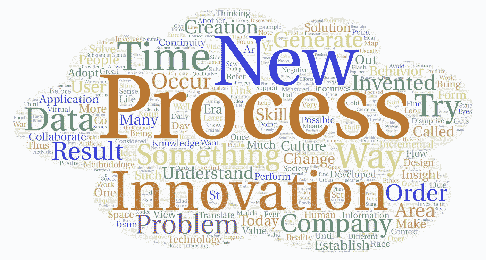

# 尤里卡效应——创新和“洞察”过程

> 原文：<https://medium.datadriveninvestor.com/eureka-effect-innovation-and-the-process-of-insight-f25b2c63ca62?source=collection_archive---------15----------------------->

# “啊哈！瞬间”

洞察力，让我们眼睛发亮的思想闪光，发现和/或发明激动人心的东西的时刻，我们可以理解为理解过程或现象的分水岭，因此，当它不再是增量时，它的表现就会发生变化，即著名的“微调”，形式和实质上都有质的飞跃，这样我们就可以清楚地区分“之前”和“之后”， 例如，当内燃机被发明出来并被应用于汽车时，如果我们当时问某人他们想要什么作为城市交通的解决方案，他们可能会回答“一匹更快的马”。

我们可以注意到，在上面提到的例子中，这种新“东西”的发明导致了不一定有明显用途的应用程序的创建，并且在它们的使用中建立了新的行为，并且创建了“规范”来管理它们。

# 科学技术的新进展

被认为是当今最前沿的技术，如 VR(虚拟现实)和 AR(增强现实)，起源于冷战时期，它们的发展很大程度上是由于对太空竞赛的投资，这为我们提供了许多我们今天拥有的技术。有趣的是，在 21 世纪第三个十年即将到来之际，一场新的太空竞赛正在非国家行为者之间展开。

人工智能是一个知识领域，也有半个多世纪的发展，由于 GPU(显卡的图形处理器)的巨大处理能力和在神经网络(深度学习)领域开发的新技术，在新闻中经常听到新的超级计算机在解决以前被认为几乎“不可能”达到的问题时创造了新的记录。 通过一系列的方法和启发，使计算机能够“理解”人类语言及其细微差别，并能够进行同步翻译，直到最近还需要经过专门训练的人来执行这些功能。

 [## 人工智能帮助你聪明理财|数据驱动的投资者

### 自动化和人工智能为创新平台提供动力，简化双方的财务流程…

www.datadriveninvestor.com](https://www.datadriveninvestor.com/2020/09/02/artificial-intelligence-helps-you-be-smart-with-money/) 

# 根本性的变化

我想尝试建立的联系是，“洞察力”不是通常从“无”中产生的东西。它通常是许多人的增量工作的结果，通常来自几个不同的领域，他们的努力有助于增加其他人的破坏性“潜力”，这些人能够收集分散在无限可能性中的信息“片段”，最终瞥见新的应用程序和做“事情”的新方法，最终产生衍生应用程序，最终产生社会的行为变化，并具有积极或消极的外部性，这取决于为使用它们而建立的意图和激励。

当我提到激励时，我试图引入一个行为经济学的概念，称为“推动”，在这个概念中，我们可以建立鼓励“积极”使用某物的激励机制，以便一种新行为不会给其用户和周围的人带来负面后果。

英国物理学家艾萨克·牛顿曾说过一句有趣的话:“如果我看得更远，那是因为我站在巨人的肩膀上。”

有时，一项技术、方法或发明只有在它的应用对用户来说是“清晰”的，并且使用户感觉到它的“价值”和好处优于在此之前为解决问题而采用的技术时，才会被大多数人考虑使用。

当我提到一个问题时，我从最广泛的意义上来说，从不再应对当前时代所带来的挑战的商业模式、产生负外部性的方法和既定流程，以及由于范式转变、看待世界的方式以及意义和背景方面的“感觉”而过期的行为和惯例中进行分组。 这可以用德语表达“时代精神”来代表，意思是“时代的精神”或“时代的精神”，在我看来，它涉及一个时代的“伦理”和“文化”，从哲学的观点来看，它甚至涉及一个社会的“实践”，即在日常生活和环境中实践“伦理”的方式。

# 创新过程

公司中对信息流进行排序的过程通常以这样一种方式排序，以产生可以定性和定量测量的“可交付成果”。企业背景下的创新一般分为“渐进式”和“颠覆式”。

渐进式创新，也称为“改善”，几乎每天都在进行，当试图在很长一段时间内持续改进流程时，累积的收益会在结果中产生很大的差异。

颠覆性创新伴随着心态的改变、商业模式和技术的改变而发生，从而改变了满足消费者需求的方式，例如，随着 2007 年 Iphone 的推出，智能手机出现了。当今组织中的持续创新可以理解为其连续性和盈利性的一个强制性条件。

因此，创新投资可以理解为研发投资，但不应仅限于工程和/或产品设计部门。

想要脱颖而出并找到自己空间的专业人士也应该一直寻找自己发展技能和潜力的计划。

我明白，在困难时期，我们最终会发现以前不知道的技能，通过如此多的尝试和实验，我们最终会形成生产和/或做“某事”的新方法。

# **横向思维**

许多“创新”和“发明”是在我们试图做某事时“无意”发生的，我们最终发现“某事”是这个过程的“副作用”，这时我们脑海中出现了一个想法的“火花”，其形式是对该想法新适用性的洞察力。

我听了无数次，必要性是发明之母，但开放的心灵是必要的，以便能够“捕捉”到“宇宙”最终传达给我们的信息，即使是无意的。

我知道，这个被称为“横向思维”的过程恰恰产生于大脑，在识别它所识别的模式的过程中，当试图翻译它时，它最终会将已知问题的解决方案适应于另一个环境中的另一个现实。

因此，我理解，从一个知识领域到另一个知识领域，存在着以某种类似方式对问题和解决方案的映射和转换。

# 创新思维

我认为创新过程也与知识管理有关，涉及数据的选择、处理、分析和综合，建立假设，测试和结果的衡量，以便描绘出问题和解决方案的宇宙。

实验是当今流行的许多方法的关键，从 Scrum 到设计思维和服务设计。在世界上最具竞争力的公司中已经成为常态的“思维模式”是对用户体验的关注和所谓的“以用户为中心的设计”。

与实验相联系，必须有指标和数据形式的测量，并在不断改进过程的迭代循环中提供反馈，以便对发现进行分析和综合，并为公司产生“知识”。

关于开放式创新、共同创造和以“小队”形式组织团队的新方法，已经说了很多，以便加强协作和信息流动，从而改进和利用成果。

# 连续创新

所有这些都是非常有效和相关的，但我也关注创造一种专注于持续创新的文化，这种“精益创业”文化的风格导致了现在加州“硅谷”的创建。

创造一种支持创新过程的文化，包括公司董事会和股东的支持，以及“授权”那些在第一线并了解运营的人，能够共同领导这一领域的倡议，这在一些公司中非常常见，创新项目的领导者往往是最初有想法的人，团队是从公司的不同领域形成的，以支持项目。

我认为，必须通过策略来刺激和加强共同创造，让它最终成为一种齿轮，随着时间的推移而永存，从而保证合作和创新的新循环。

在我看来，创造一种专注于创新的文化是数字化转型过程的支柱之一，也应该以数据为中心，这将是赋予生命和培育协作流程的“输入”。

协作流程必须采用数据治理策略，以避免在数据真实性方面形成“孤岛”和“差异”,并且必须利用验证(准确性)和认证流程，在公司内持续提供信息流，在可能的情况下使用中央存储库(数据湖),避免重复数据输入并尽可能实现自动化，从而确保充分利用员工的时间来关注具有更大附加值的活动。

人工智能将在公司中用于需要“人类”机器人执行的重复性活动。

我们生活在这样一个时代，最伟大的人类认知技能将更受重视，关注解决复杂问题的能力、运用创造力和想象力进行抽象思维的能力、协作和团队工作的能力，以及对彼此、对社会和对消费者产生共鸣的能力。

## 访问专家视图— [订阅 DDI 英特尔](https://datadriveninvestor.com/ddi-intel)