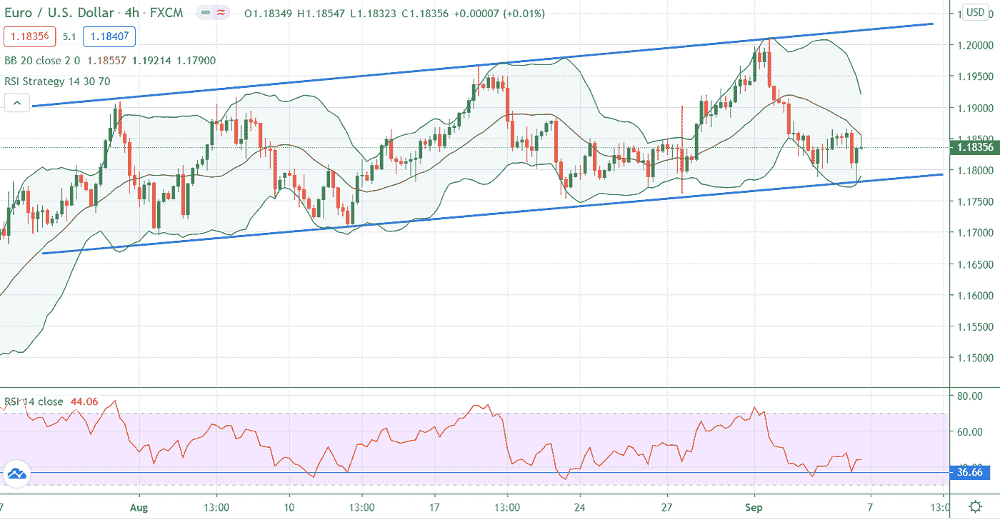

# 欧元目前上限为 1.20 欧元:关注突破

> 原文：<https://medium.datadriveninvestor.com/euro-capped-by1-20-for-now-watch-for-a-breakout-3a96bbe688a1?source=collection_archive---------26----------------------->

欧元上周以积极的基调开始。9 月 1 日，欧元兑美元自 2018 年 5 月以来首次达到 1.2010 水平，但后来该货币对从顶部回落，周五收于 1.1850 下方。在欧洲央行首席经济学家菲利普·莱恩(Philip Lane)发表评论以及欧元区零售销售和德国工厂订单等弱于预期的经济数据之后，货币对面临压力。

 [## 如何在不牺牲孩子或财务的情况下安全理智地离婚|数据驱动…

### 在美国，七月是以孩子为中心的离婚月。作为 cdfaⓡ的专业人士，我可以向你保证，从长远来看…

www.datadriveninvestor.com](https://www.datadriveninvestor.com/2020/07/28/how-to-divorce-safely-and-sanely-without-sacrificing-your-children-or-your-finances/) 

> “如果有力量左右欧元兑美元汇率，这将影响我们对全球和欧洲的预测，进而影响我们的货币政策。”欧洲央行首席经济学家菲利普·莱恩说。

在上周，美元从两年多来的低点反弹，并在积极的经济数据推动下收于积极区域，这些数据包括强劲的失业救济人数、新工厂订单和制造业数据。周五，美国 NFP 报告显示，8 月份美国经济增加了 137.1 万个就业岗位，失业率降至 8.4%，高于 9.8%的市场预测。

**基本面和技术面展望:**

本周，投资者越来越担心欧元区未来的经济健康状况。另一方面，交易员和投资者也将关注本周欧元的重要事件，欧元区 GDP 数据和周四的欧洲央行货币政策会议。市场参与者预计目前的政策立场不会有重大变化，但正在寻找更多刺激何时将通过紧急购买计划增加的线索。由于美国市场休市，周一将会是一个安静的日子。

技术上，在多头未能延续涨势后，欧元兑美元的整体势头仍然看跌。在撰写本文时，该货币对徘徊在 1.1830 附近。短期来看，如果价格跌破 1.1810，将打开通往上周低点 1.1780 的大门，下一步将跌破 1.1750/1.1710。在上方，可以在 1.1880 和 1.1915/40 找到第一个直接阻力。

长期来看，观察趋势线在 1.1770 和 1.2030 的突破，这将对长期方向给出更大的确认。

**访问专家视图—** [**订阅 DDI 英特尔**](https://datadriveninvestor.com/ddi-intel)