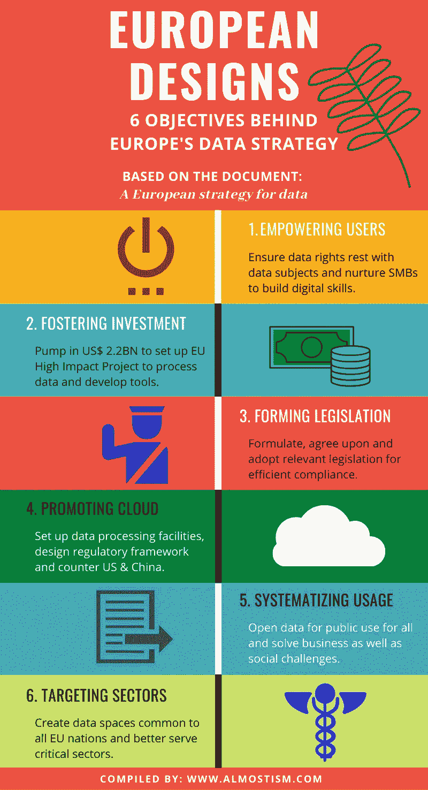

# 欧洲的数据战略

> 原文：<https://medium.datadriveninvestor.com/europes-data-strategy-22788883770?source=collection_archive---------30----------------------->

Image credit: [Guillaume Périgois](https://unsplash.com/@guillaumeperigois?utm_source=unsplash&utm_medium=referral&utm_content=creditCopyText) on [Unsplash](https://unsplash.com/s/photos/european-union?utm_source=unsplash&utm_medium=referral&utm_content=creditCopyText)

今年 2 月 19 日，欧盟委员会(EC)发布了*欧洲数据战略，*这是一份重要文件，阐述了欧盟委员会对其数据战略的想法。

本质上，它是欧盟(EU)成员国的导航图，旨在帮助他们在正在发展的数据经济中找到一个强大的立足点。

以下事实将清楚地表明欧盟的雄心壮志:

> **“(在商业和公共部门)成为一个由数据赋能以做出更好决策的社会的领先榜样”。**

以下是欧盟未来 5 年数据战略的信息图。

# 1.赋予用户权力

**确保数据权利属于数据主体，培养中小企业建立数字技能。**

这与欧盟严格的 GDPR(以及最近的 Schrems II 判决)以及它在人工智能战争中努力成为赢家是一致的，这场战争目前似乎只有美国和中国在竞争。

看到这篇文章的底部进一步阅读 Schrems II 以及人工智能战争中的欧洲。

 [## 什么是数据目录，它如何使机器学习取得成功？数据驱动的投资者

### 数据目录是机器学习和数据分析的燃料。没有它，你将不得不花费很多…

www.datadriveninvestor.com](https://www.datadriveninvestor.com/2020/08/27/what-is-a-data-catalog-and-how-does-it-enable-machine-learning-success/) 

# 2.促进投资

**投入 22 亿美元建立欧盟高影响力项目，以处理数据和开发工具。**

无需猜测——在一个数据是新石油的时代，你必须建造钻井平台并为你的油井提供资金。

# 3.形成立法

**制定、同意并采用相关法规以确保有效合规。**

如果有一件事欧盟是清楚的，那就是立法和建立标准。不要忘记，标准往往决定市场状况，还记得视频播放器时代的 PAL MESECAM 吗？

# 4.推广云

**建立数据处理设施，设计监管框架，反制美国&中国。**

一套法规和标准的有效性取决于它所带来的技术支柱。欧盟推动云计算的举措将使监管框架更具可持续性和可执行性。

# 5.系统化用法

**开放数据供所有人使用，解决商业和社会挑战。**

印度的 Krish Gopalakrishan 委员会在 2020 年 7 月提交了一份报告草案，似乎从欧盟正在考虑的事情中汲取了一些智慧:系统化数据使用。

# 6.目标部门

**创建所有欧盟国家通用的数据空间，更好地服务于关键部门。**

整体战略微妙地面向帮助形成欧盟国家可以共享和提高安全性的数据空间，改善公共服务的提供，并大力帮助创业公司。

*****

有兴趣了解更多信息吗？

你可以在这里阅读:[欧洲的数据战略和野心](http://EUROPE’S DATA STRATEGY AND AMBITIONS)

**延伸阅读:**

1.  [*《施雷姆二世判决》及其如何影响像印度这样的国家*](http://almostism.com/schrems-ii-explained-india-impact/) *。*
2.  [欧洲能打赢 AI 战争](http://almostism.com/reasons-why-europe-will-win-ai-war/)？

(编辑:纠正了链接中的一个错别字)

**访问专家视图—** [**订阅 DDI 英特尔**](https://datadriveninvestor.com/ddi-intel)