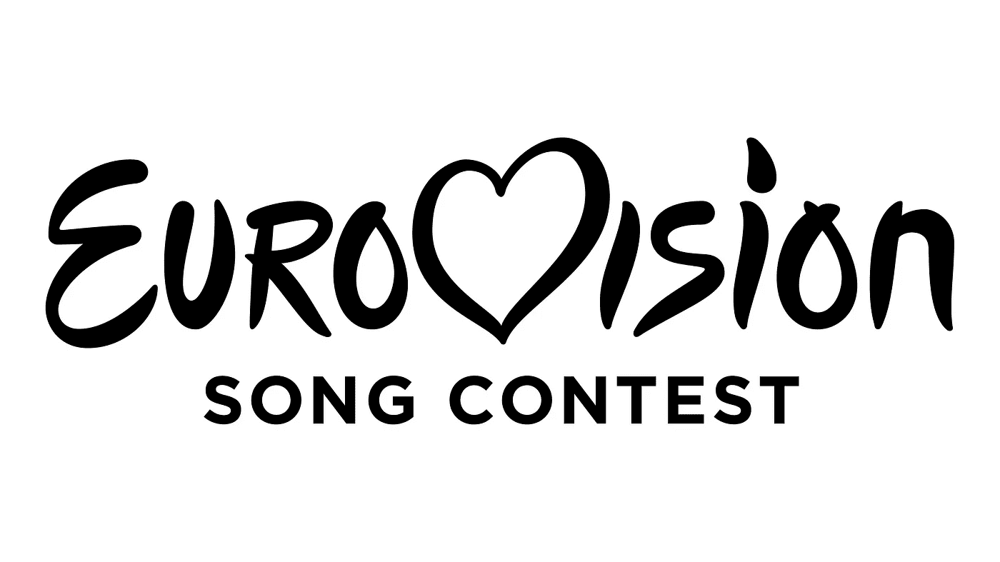
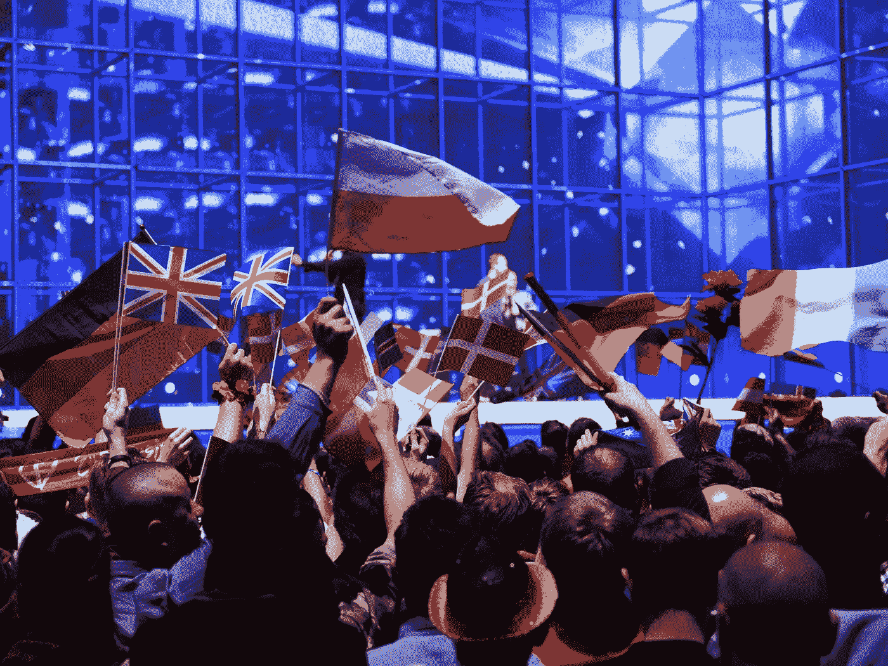

# 欧洲电视歌曲大赛:数据科学的观点。第 1 部分—简介和数据清理。

> 原文：<https://medium.datadriveninvestor.com/eurovision-song-contest-a-data-science-point-of-view-part-1-introduction-and-data-cleaning-a992c5195e1d?source=collection_archive---------9----------------------->

## 这篇文章是正在进行的欧洲电视网歌唱比赛系列的一部分。

# 引言。

首先，让我向你介绍我生活中的一个爱好:欧洲歌唱大赛(ESC)。对于所有不知道它的人，ESC 是由欧洲广播联盟(EBU)每年组织的一次竞赛。他们的使命是在第二次世界大战后联合欧洲各国。



Eurovision Song Contest logo. Source — EBU.

## 竞赛要点是:

*   自 1956 年以来，这一事件每年都会发生。除了 2020 年的新冠肺炎。
*   每个参与的广播公司应该每年指定一名艺术家或乐队代表国家。
*   投票系统分为陪审团投票和最近的电话投票:陪审团是一群通常属于音乐行业的专家。电话投票是公众通过短信、电话或欧洲电视网应用程序进行的投票。
*   一个国家(陪审团或公众)不能自己投票。
*   每个国家选出 10 名参与者。首选获得 12 分，最后一个获得 1 票。
*   只有前三名进入决赛。
*   更多信息，请查看 [eurovision.tv](http://eurovision.tv)

尽管它的主要努力是通过音乐来团结欧洲，但许多情况描绘了一幅非常微妙的政治、社会和经济全景。按照一个原因列表来研究这个音乐节中欧洲国家之间的关系。

## 政治问题:

*   德国重新统一了。
*   南斯拉夫和苏联在许多国家分裂。
*   整个欧洲发生了许多冲突(北塞浦路斯、南斯拉夫、克里米亚、科索沃、纳戈尔诺-卡拉巴赫等)。
*   希腊、西班牙和葡萄牙受到采用欧元的影响，陷入经济危机。
*   移民已经改变了。《出埃及记》居住在德国的波兰人可以像德国人一样在波兰投票，这就是所谓的侨民投票。
*   以色列与许多欧洲国家关系密切。
*   许多阿拉伯国家也是 EBU 的一部分，但由于以色列的存在，他们选择不参加。
*   贾马拉 2017 年的获奖歌曲被视为对克里米亚的抗议。
*   俄罗斯仍然对前苏联国家有很大的影响力。
*   土耳其/阿塞拜疆过去和现在都与亚美尼亚有激烈的流血冲突(亚美尼亚种族灭绝)。



Typical eurovision atmosphere

## 文化问题:

*   许多集群自然出现，因为语系:伊比利亚半岛的罗曼语。巴尔干半岛和俄罗斯的斯拉夫语。北方的日耳曼语。
*   宗教:不可知论者、穆斯林、天主教、东正教等。
*   LGBT 支持:土耳其表示，由于 2014 年版 Conchita 的胜利，他们停止参加欧洲电视网。类似的事情也发生在匈牙利。
*   有些国家总是把自己的 12 分让给自己最好的朋友(即希腊← →塞浦路斯)。

所以，记住所有这些信息…数据科学如何帮助理解 ESC，我们可以回答什么样的问题？作为一个欧洲粉丝，这是 ESC 追随者的称呼，这些问题很快涌入我的脑海，其中一些是:

*   投票有偏见吗？
*   比赛中最有影响力的国家是哪些？
*   这些国家是由共产主义组织起来的吗？
*   这些国家是按照文化相似性组织起来的吗，比如语言之类的？
*   地理距离重要吗？

在这一系列文章中，我将尝试回答所有这些问题以及更多问题。但是首先，让我们开始做数据科学。

# 数据收集。

作为一个欧洲电视网相关话题的书呆子，这一部分比一开始看起来要简单。我已经有一堆 excel 文件，里面有年复一年的 ESC 成绩记录板，我只需要把它们收集在一个文件里。我已经将这个数据集上传到 [Kaggle](https://www.kaggle.com/imanolrecioerquicia/eurovision-song-contest-voting) 上，这样每个人都可以访问它(请随意投票支持它；-) )

## 数据的结构如下:

年份:竞赛的版本。
比赛类型:有半决赛和决赛。
投票类型:陪审团投票或电话投票。
投票来源:投票的国家。
投票目的地:接收投票的国家。投票数:给出的点数。重复检查:标记检查一个国家不能投票给他们自己。

最后，我们有大约 50K 行数据。

# 数据清理。

首先，我们创建数据集的副本。这一步很重要，这样当您不得不后退时就不会丢失原始数据集。我们将只选择给出点的地方，以简化我们的任务，并删除空边。

```
df2 = df.copy().query('points > 0')
```

接下来，从数据集中删除重复项，还记得我们在数据集中引入的检查列吗？。

```
df2['duplicate'] = df2['duplicate'].apply(lambda x: True if x == 'x' or x==True else False)df2 = df2.query('duplicate == False').drop(columns=['duplicate'])
```

在 ESC 的历史中，有些国家的名称不同，所以我们将对它们进行标准化。

```
def applyRename(x):renamings ={'North Macedonia':'Macedonia','F.Y.R. Macedonia':'Macedonia','The Netherands': 'Netherlands','The Netherlands':'Netherlands','Bosnia & Herzegovina':'Bosnia',}return renamings[x] if x in renamings else xdf2['countryfrom'] = df2['countryfrom'].apply(applyRename)df2['countryto']   = df2['countryto'].apply(applyRename)
```

此外，我们必须考虑到南斯拉夫在分裂成几个国家之前也参加了竞赛。我们将把南斯拉夫在分裂前作为一个整体得到的选票归属于每个国家。塞尔维亚和黑山之间的分裂也将被考虑在内。

```
division = {'Yugoslavia':['Macedonia','Serbia','Montenegro','Slovenia','Bosnia','Croatia'],'Serbia & Montenegro':['Serbia','Montenegro'],}df2['countryfrom'] = df2['countryfrom'].apply(lambda x:division[x] if x in division else x)df2['countryto']   = df2['countryto'].apply(lambda x:division[x] if x in division else x)df2 = df2.explode('countryfrom').explode('countryto')
```

我们还将从数据集中删除不再参与的国家。到目前为止，这个限制已经在 5 个版本中设定了，所以所有过去 5 年没有参加的国家都将被删除。

```
toKeep = df2.groupby('countryfrom').apply(lambda x:pd.Series({'years':x['year'].nunique(),'last_participation':df2['year'].max() - x['year'].max(),})).query(f'years >= {minYears} and last_participation <= {last_participation}').reset_index()['countryfrom'];display(HTML("<p>ignored countries: %s</p>" %', '.join(df2[df2['countryfrom'].isin(toKeep)==False]['countryfrom'].unique())))df2 = df2[df2['countryfrom'].isin(toKeep)]
df2 = df2[df2['countryto'].isin(toKeep)]
```

我们最后的清理步骤是，当一个国家有资格进入决赛时，只考虑决赛中给出的分数。从 2004 年开始，由于参赛人数越来越多，节目中有半决赛。

```
df2['finalcode']=df2.final.map({'f':1,'sf':2,'sf1':2,'sf2':2})temp1 = df2.groupby(['countryto','year']).agg({'finalcode':'min'})df2 = pd.merge(df2,temp1, on=['countryto','year','finalcode'], how='inner')assert len(df2.groupby(['countryfrom','countryto','year']).agg({'final':'nunique'}).query('final >1')) == 0df2.drop(columns=['finalcode','edition'], inplace=True)
```

这样，数据集就为下一步做好了准备。在第二部分，我们将进行探索性数据分析(EDA ),并试图获得一些见解和一些关于欧洲歌唱大赛提出的问题的初步答案。