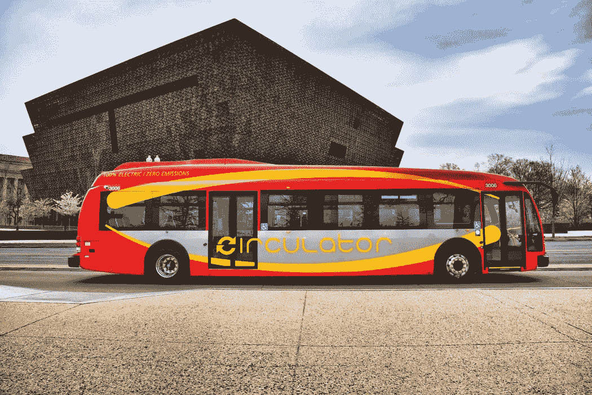

# 像微视(THCB)这样的电动汽车零部件公司希望爆发

> 原文：<https://medium.datadriveninvestor.com/ev-component-companies-like-microvast-thcb-are-hoping-to-explode-59ac06cc76d1?source=collection_archive---------6----------------------->

An electric passenger bus. (Image via [Unsplash- Mario Sessions](https://images.unsplash.com/photo-1525962898597-a4ae6402826e?ixid=MXwxMjA3fDB8MHxwaG90by1wYWdlfHx8fGVufDB8fHw%3D&ixlib=rb-1.2.1&auto=format&fit=crop&w=1050&q=80))

## 投资者可能会在提供零部件的公司中发现宝石，这些零部件将构成全球电动汽车的预期增长

过去 6 个月，电动汽车投资泡沫的规模不亚于任何行业。全球对能源效率和排放责任的推动赋予了它令人印象深刻的潜力。市场上最明显的商品是那些生产汽车的商品，因为像特斯拉、NIO 和 IDEX 这样的公司已经开发了巨大的宣传和兴奋。然而，大量资金用于制造汽车，那些生产零部件的公司也有非常令人瞩目的未来，包括电动电池制造商 Microvast，该公司正在完成与特殊目的收购公司[托斯卡纳控股公司(THCB)](https://finance.yahoo.com/quote/THCB?p=THCB&.tsrc=fin-srch)的合并。

总部位于得克萨斯州的中国公司 Microvast 成立于 2006 年，根据他们在[的网站](http://www.microvast.com/index.php/about)，他们将自己描述为“设计、开发和制造超快速充电、长寿命电池供电系统的快速增长的市场领导者，为电动汽车提供卓越的安全性。我们的电动汽车电池系统解决方案专为解决当前电动汽车发展面临的关键限制而设计，为电动汽车的大规模采用铺平了道路。”

具体来说，Microvast 为[公共交通](http://www.microvast.com/index.php/about)生产电池，包括公共汽车、出租车和大型运输设备，如港口搬运工和采矿设备。一旦股东投票确认，他们宣布与 THCB 的合并将使合并后的公司成为一个预计价值 30 亿美元的企业。

尽管电动汽车得到了巨大的推动，但市场仍像蛮荒的西部，因为时间表、法规、销售等更多问题仍在解决过程中。然而，Microvast 有一系列积极的因素和催化剂，应该会吸引投资者。其中包括:

*他们的 Gen 3 MpCO 电池可在 15 分钟内充满电,并且具有很长的生命周期，与使用它们的公交车的寿命相匹配。它在效率和成本方面大大超过了他们以前的模式，使他们处于行业的前沿。

*他们的工作赢得了许多[享有盛誉的奖项](http://www.microvast.com/index.php/about)，包括 2016 年的两个 FT/ITC 转型商业奖和 2018 年的 R & D100 奖。

*截至 2018 年底，他们在世界各地使用了[大约](http://www.microvast.com/index.php/about) 24，000 个电池，行驶了超过 20 亿公里，没有运营事故报告。在 2018 年平昌冬季奥运会期间，电动公交车[最著名的应用是](https://seekingalpha.com/amp/article/4402962-microvast-best-ev-spac-may-arrived?fbclid=IwAR3tN66GcSqqeqtkOW9ueR6x__TMBfrhF0eh-csYyxXqpiPSQH0qGJ5Lnws)。

*就在上周，Microvast 和田纳西州州长比尔·李[宣布](https://www.tn.gov/ecd/news/2021/2/10/governor-lee--commissioner-rolfe-announce-microvast-to-establish-manufacturing-facility-in-clarksville.html?fbclid=IwAR2cg__k4Bg6_JinBCxsMep6pTheDwOSz14hNeJXw9fqgMEDHtdL-65xl9Y)该公司已同意在克拉克斯维尔开设一家价值 2.2 亿美元的生产工厂。这一努力不仅将创造近 300 个新的就业机会，而且还将推动他们推出更多突破性的电池。新工厂是由一家制动工厂改造而来，一旦更新完成，[除了制造部门之外，还将包括](https://amp.theleafchronicle.com/amp/4450435001?fbclid=IwAR294i_HdSq6FLs93cYW3JiWT8n4IhRtxVTMbsMfpAO1xQeEKc4cw5qLUhA)一个研发部门。

*虽然电动汽车电池是一个竞争和创新成熟的领域，但 Microvast 已经[建立了](https://seekingalpha.com/amp/article/4402962-microvast-best-ev-spac-may-arrived?fbclid=IwAR3tN66GcSqqeqtkOW9ueR6x__TMBfrhF0eh-csYyxXqpiPSQH0qGJ5Lnws)改进技术的能力，并明确将研发作为未来的优先事项。

*公司不会仅仅局限于商用车零部件。根据 SeekingAlpha 的一篇 2021 [文章](https://seekingalpha.com/amp/article/4402962-microvast-best-ev-spac-may-arrived?fbclid=IwAR3tN66GcSqqeqtkOW9ueR6x__TMBfrhF0eh-csYyxXqpiPSQH0qGJ5Lnws)，他们的未来计划包括扩展到乘用车和相关的电池组件。

*对任何制造公司来说，保持创作的所有权都是关键，Microvast 已经拥有超过 [500 项产品和设计专利](https://seekingalpha.com/amp/article/4402962-microvast-best-ev-spac-may-arrived?fbclid=IwAR3tN66GcSqqeqtkOW9ueR6x__TMBfrhF0eh-csYyxXqpiPSQH0qGJ5Lnws)。

Microvast 推动增加设施规模和数量的一个主要原因是他们的预期增长。他们已经持有价值 15 亿美元的合同，据报道，他们正在与其他全球客户谈判额外的 30 亿美元。

*该公司预计，2020 年至 2020 年间，强劲的复合年增长率将达到 87% 5，2025 年至 2030 年间将再增长 24%。如果他们达到这些目标，或者坦率地说，甚至接近这些目标，这种激进的规划可能会迅速抬高他们的估值。

* 2 月初，Oshkosh Corporation (OSK)，一家“关键任务车辆和关键设备的创新者”，宣布[同意](https://www.businesswire.com/news/home/20210205005089/en/Microvast-Enters-Electrification-Joint-Development-Agreement-With-Oshkosh-Corporation?fbclid=IwAR3uur_P3nL798Jd0Kk4dm8SMJPO2WW0C7gZNum7B4HtKPcw-DzoYQAZVQI)投资 2500 万美元与 THCB 合并。

THCB 目前的交易价格为每股 19.59 美元。一旦合并完成，股票代码将变更为 MVST。据[估计，2020 年收入为 1.01 亿美元，与该公司预测的 2025 年 23 亿美元相比微不足道。这意味着，从现在到那时，Microvast 要描绘出他们向投资者展示的全部美好图景，还有很长的路要走。](https://www.fool.com/investing/2021/02/02/what-you-need-to-know-about-microvast-the-latest-e/#:~:text=Contracted%20revenue%20for%202020%20is,reach%20%242.3%20billion%20in%202025.)

微博客应该被视为某种彩票。他们已经在一定程度上确立了自己的地位，但目前的股价最能反映围绕他们潜力的炒作。那些相信自己的产品、基本面和雄心勃勃的增长计划的人，可以说会惊喜地从底层进入，并试图乘坐电梯到达顶层。

现在有许多令人兴奋的公司，充满潜力。微速/THCB(即将成为 MVST)当然应该被认为是其中之一。它们继续吸引着投资者，投资者不禁被它们的计划所吸引，这些计划旨在将自己打造为一个预计将在未来几年蓬勃发展的行业的领导者。

*免责声明:作者不是财务顾问或专家。本文表达的观点仅供一般娱乐之用。它们不以任何方式为任何个人或任何特定的证券或投资产品提供特定的意见或建议。个人投资者对自己的资金和投资决策负责，在投资前应始终做好自己的尽职调查。作者在文章所讨论的文章中占有很小的地位。*

**如果你正在寻找一个股票交易平台，注册 WEBULL:** 通过这个 [**推荐链接**](https://www.webull.com/activity?inviteCode=OVX44f91ZFGo&source=invite_gw&inviteSource=wb_oversea) 注册并最低存款 100 美元，你将获得免费股票。我最近加入了 Webull，非常喜欢它。如果你报名的话，我还会得到一份免费的股票