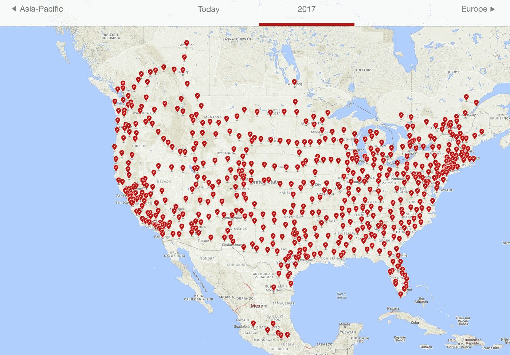
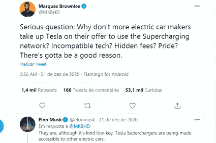

# 电动汽车初创公司将在 2024 年推出 200 英里的电池汽车:你在开玩笑吗

> 原文：<https://medium.datadriveninvestor.com/ev-startups-launching-200-mile-battery-cars-in-2024-are-you-kidding-me-9c80aea7dbec?source=collection_archive---------14----------------------->

## 为什么大多数电动汽车创业公司已经错过了

Photo by [NeONBRAND](https://unsplash.com/@neonbrand?utm_source=medium&utm_medium=referral) on [Unsplash](https://unsplash.com?utm_source=medium&utm_medium=referral)

苹果公司会在 2024 年制造一款具有“突破性”电池的电动车吗？也许吧。

有一个关于所谓的[项目泰坦](http://engt.co/3o7vJPA)的传言，这是苹果多年来秘密试图隐藏的自动驾驶汽车部门。据路透社*来自 [*的新报道，苹果最早可能在 2024 年开始生产其电动汽车。*](http://reut.rs/3n3bVLR)*

> *该公司可能会寻求外部合作伙伴来帮助制造。-路透社*

*一辆苹果车，苹果技术，苹果设计。这看起来很棒。*

*问题是:以什么代价？每年生产多少辆电动汽车？另一个问题是:在 2024 年，有多少电动汽车公司会生产出令人敬畏的汽车，漂亮的设计，高科技的小配件和酷的东西？*

*我不是说我不喜欢苹果车。我希望看到苹果生产电动汽车。问题是，为什么是现在？自 2014 年以来，该项目一直在运行。然后就停了。现在它又跑了？*

*对我来说问题太多了。但是这个世界将需要如此多的电动汽车来替代全球现有的惊人的 20 亿辆 ICE 汽车，这是每个人都欢迎的。这对人类是一个巨大的挑战。*

*所有主要的科技公司都在开发他们的项目来制造电动汽车，所以他们可以站在创新的最前沿。这是件好事。*

*[Marques Brownle](http://bit.ly/3hIdtdh) e 是最负盛名的 YouTubers 之一，拥有超过 1300 万订户，拥有超过 11 年的研究小工具和技术颠覆的经验，他在[这段视频](https://bit.ly/38YbehW)中说道:*

> *亲爱的电动汽车，如果你今天推出了一款续航里程为 200 英里的高级电动汽车，你已经落后了。所以，续航里程非常重要，对我来说，从制造的角度来看，这是衡量电动汽车项目好坏的第一基准指标。*

*如今，电动汽车充满电后的最大行驶里程为 250 至 400 英里。山丘之王是 Model S，100 千瓦时电池，402 英里。*

*因此，当有人宣布他们将在 2024 年推出一款新的电动汽车，最大里程为 200 英里时，他们已经处于一个糟糕的位置(而不是杆位)。*

# *从冰河时代到未来*

> *全球经济建立在两件事上:内燃机和微软 Excel。永远不要忘记这一点。凯文·赫克托*

*内燃机汽车的平均行驶里程为 400 英里。最好的已经达到了 700 英里的范围。*

*这就是你所期望的电动汽车在短时间内的表现。特斯拉宣布 Cybertruck 和 Model S 的续航里程为 500 英里，双门跑车的续航里程将在 2022 年达到 620 英里。*

*所有这些都来自多年来的 R&D 优先。特斯拉的终极目标是尽快超越燃气汽车续航里程。*

*对新公司的另一个限制是电动汽车的加油系统。如果车主想去佛罗里达旅行 600 英里，那么 Lucid EV 在哪里充电呢？*

*所有其他公司认为他们将来会在哪里给他们的车辆充电？因为特斯拉是唯一一家在建工厂之前就想到这一点的公司；在他们一年生产 50 万辆电动汽车之前。*

*其他电动汽车公司是否试图生产 1000 英里的电池来避免充电？然而，他们不断宣布他们的 200 到 300 英里电动车。这对新公司来说还是一种限制吗？*

*如果未来的充电站不是一个合作的努力，如果一些公司不能完成 500 到 600 英里范围的电池组，他们将如何生存？*

*[《卫报》](http://bit.ly/2KV9JJv)最近报道了一对来自英国肯特郡的夫妇的故事，描述了他们如何花了 9 个多小时开车 130 英里回家。他们努力寻找一个能够为他们的电动汽车提供足够电力的充电器。*

> *这对夫妇非常喜欢他们新的全电动保时捷泰康 4S，这款车的续航里程约为 250 英里，他们联系了《卫报》,向《卫报》描述了离家在外给汽车充电是多么困难。他们说，他们的旅程用传统的汽车需要两个半小时。卫报的迈尔斯·布里格诺尔*

*这对夫妇说，他们在*遇到了八个闪亮的特斯拉充电器，但发现它们被禁止使用，因为它们只对该品牌的所有者开放。**

**

*Image from cleantechnica.com*

*在美国，特斯拉的超级充电网络令人印象深刻。*

*除了埃隆·马斯克的公司目前拥有的所有竞争优势之外，这可能是主要的竞争优势之一。*

*虽然，这并不意味着其他汽车公司不能利用特斯拉的超级充电站网络，正如布朗利在推特上与马斯克分享的回应:*

**

*Image from the author*

*不兼容的技术？隐性费用？骄傲？*

*一定有很好的理由。*

* [## 收盘，但没有雪茄-股票市场目标在停滞的 COVID 救济中创新高|数据驱动…

### 专家聊天程序:一个协作市场，在这里人们可以和能够解决他们问题的专家聊天。是……

www.datadriveninvestor.com](https://www.datadriveninvestor.com/2020/08/18/close-but-no-cigar-stock-market-targets-record-highs-amidst-stalled-covid-relief/)* 

# *创新是反叛的最好形式*

> *创造力是人们足够关心并不断思考某件事情，直到他们找到最简单的方法去做。苹果公司首席执行官蒂姆·库克*

*为什么我相信苹果会出突破性的电池技术？因为苹果生产电池超过 15 年。这是他们的核心业务之一。这是他们的基因。如果他们不能生产出比竞争对手更好的电池，他们就完了。*

*因此，明年将是非常令人兴奋的一年，看看苹果将能够在电动汽车行业做些什么。从史蒂夫·乔布斯到蒂姆·库克，世界上最大的公司从未停止创新，用他们的新设备给全球带来惊喜。*

*电动汽车最终被视为车轮上的技术，有可能为科技公司提供按需服务。*

*就连华尔街也开始意识到这一点(一如既往，晚做总比不做好)。像凯西·伍德这样的人来到美国消费者新闻与商业频道黄金时段，一遍又一遍地解释说，从股票分析师的角度来看，电动汽车市场无法与内燃机行业相提并论。*

*从汽车行业分析师到投资者，这是一场深刻的变革，改变了这个颠覆性技术时代的发展方式。*

*在这个奇怪的时代，清晰是最重要的特征之一。*

# *最后的想法*

*当每家汽车公司都处于同一水平时(如果这种情况会发生的话)，我们将能够比较技术，比较价格竞争力、设计、质量、范围、服务等等。*

*目前，特斯拉是绝对的领导者。并且有利于整个能源部门的非物质化。然而，由于在不久的将来很难看到一些公司接近特斯拉已经取得的成就，我们不应该低估苹果、谷歌、亚马逊、微软和其他主要的科技公司。*

*他们有大量现金，能适应各种环境，拥有专业知识，同时也具有破坏性。*

*有一点我很确定。*

*2021 年将会是一场地狱之旅！*

*谢谢你，*

*努诺*

***进入专家视角—** [**订阅 DDI 英特尔**](https://datadriveninvestor.com/ddi-intel)*