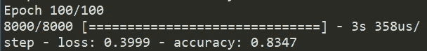
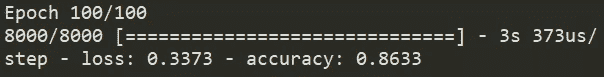
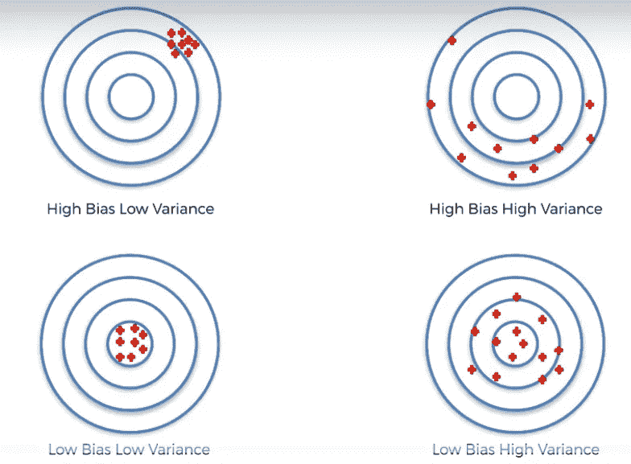
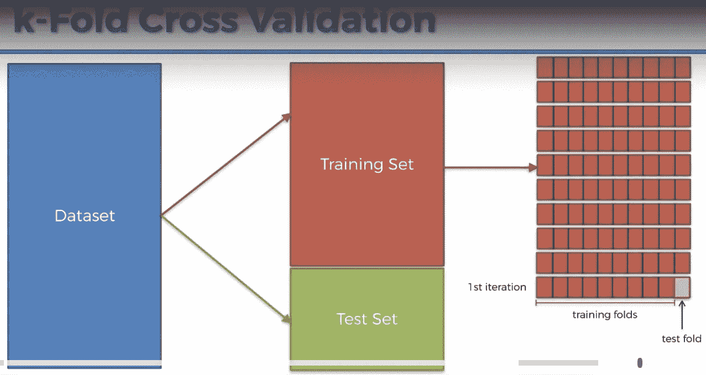
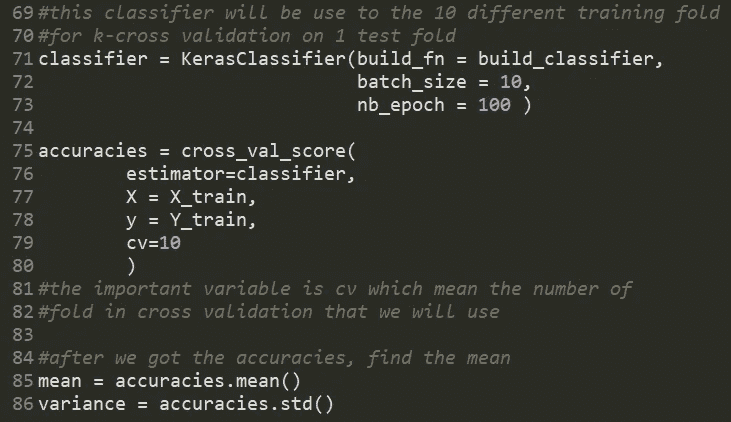
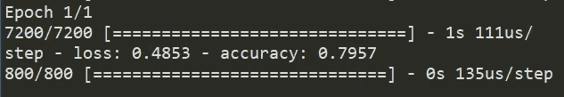
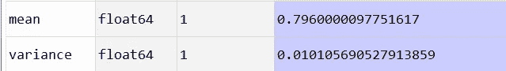
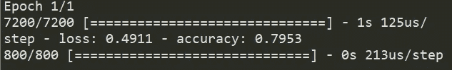
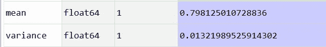
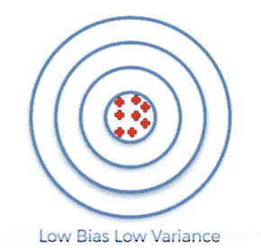

# 使用 Python 的 K-Fold 交叉验证评估 ANN 模型

> 原文：<https://medium.datadriveninvestor.com/evaluating-ann-model-using-k-fold-cross-validation-with-python-cd4844351371?source=collection_archive---------1----------------------->

## 使用人工神经网络进行预测建模，作者:基里尔·叶列缅科

大家好，又回来了:)，我已经很久没有发布由基里尔·叶列缅科创建的人工神经网络预测模型的最后一部分了。

在这篇文章中，我将指导如何评估我们的人工神经网络预测模型，但是在我们开始写代码之前，为什么我们需要评估人工神经网络模型？要查看细节，让我们先运行我们的 ANN 预测建模，你可以在这里下载代码*，或者你可以在这里阅读第 1 部分教程**。***

**让我们第一次运行代码**

****

**Accuracy 83.47%**

**但是，如果我们第二次逃跑呢？**

****

**Accuracy 86.33%**

**看看结果，第一次我们得到了 83%的准确性，但第二次是 86%，这是可能发生的，因为有所谓的方差，这将使我们的 ML 成为一个问题。如果我们得到高方差，有 4 种方差可能发生在我们的 ML 建模中:**

****

**在这种情况下，发生在我们建模中的问题在右上方*(高偏差高方差)*，我们应该使我们的建模在左下方*(低偏差低方差)*。**

** [## 深度学习用 7 个步骤解释-更新|数据驱动的投资者

### 在深度学习的帮助下，自动驾驶汽车、Alexa、医学成像-小工具正在我们周围变得超级智能…

www.datadriveninvestor.com](https://www.datadriveninvestor.com/2019/01/23/deep-learning-explained-in-7-steps/) 

有一种称为 K-Fold 交叉验证的技术，K-Fold 交叉验证是一种用于评估机器学习模型技能的统计方法，它与 K 分开工作，例如，如果我们设置 k = 10，我们有 1000 行训练集，这 1000 行将被分成 100 行 x 10，每个折叠都将是测试折叠，如下图所示

在我们训练 10 倍的训练集之后，然后我们找到平均精度，让我们使用 K 倍交叉验证训练我们的建模两次来看结果。

你可以在我的 github [*这里下载/查看代码*](https://github.com/bayysp/PredictiveModelANN/blob/master/ann_evaluation.py) *，*如果你想实现 K-Fold 交叉验证，你需要先构建 ANN，并编写下面的代码

你可以在第 79 行看到，它是你使用的的*折叠*的总和，这里我们使用 10 个折叠，写完代码后，你可以运行所有的操作，只需等待片刻。

如果你想让训练过程更快，你可以在 cross_val_score()上添加更多的参数，它是 n _ jobs =-1，-1 意味着训练过程将使用你计算机的所有 GPU，但在使用它之前，你需要安装 tensorflow GPU 与 write***pip install tensor flow-GPU***，教程你可以在我的 github 上看到。

所以，我们已经写完了代码，让我们第一次运行它。

看，我们得到的平均准确率是 79.6%，变异 1%，如果我们第二次运行这个程序会怎么样？

看，第一轮和第二轮之间的范围值很小，这使得我们的 ML 具有低偏差和低方差

所以大家:)这就是今天如何对我们的人工神经网络模型进行评估的全部教程，非常感谢你已经阅读了我的所有文章，如果我的代码或其他代码中有错误，我很抱歉，下次教程再见:D

下面是这个 URL 中的代码:

【github.com/bayysp/PredictiveModelANN **