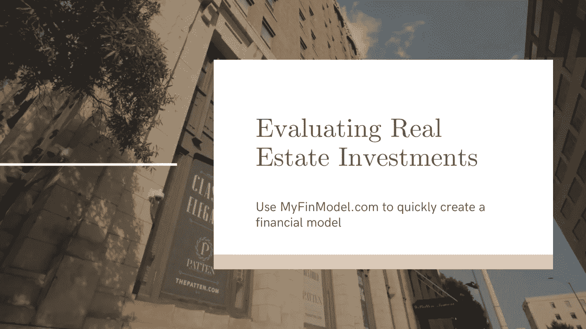

# 评估房地产投资

> 原文：<https://medium.datadriveninvestor.com/evaluating-real-estate-investments-2e112414752c?source=collection_archive---------5----------------------->

## 揭秘房地产金融模型

本文概述了房地产金融建模。这篇文章是针对投资物业(出租物业，商业房地产，如公寓楼，办公楼，购物中心等。)该文章不适合复杂的事务。

# 一.导言

房地产开发和投资是任何现代经济中最重要的金融活动之一。房地产开发创造就业机会和经济活动，同时创造我们生活和工作的建筑，以及对任何经济体系的运作至关重要的其他设施。此类活动所涉及的资金规模可能很小，也可能很大。要评估投资房地产的财务可行性，最常用的工具是基于现金流的贴现模型，通常使用电子表格来完成。

在本文中，我们使用一个示例来生成一个假设投资的财务模型，并向读者介绍一个基于 web 的建模工具，该工具可用于开发相同的模型。完全公开——我们是基于网络的工具的开发者。

# 二。建模注意事项

房地产融资模型是一种特殊的项目融资模型，基于贴现现金流原则。在研究房地产时，分析师需要注意一些特殊的考虑因素。我们将在本节中讨论这些内容。

## 2.1 一般建模方法

贴现现金流方法是一种成熟的财务建模方法。这种方法的细节可以在任何标准的金融文本中找到。关于如何使用这种方法创建电子表格模型的详细说明，我们请读者参考我们关于[项目融资建模](https://medium.com/swlh/project-finance-modeling-b34bd1333e78)【1】的文章。

要创建房地产投资模型，步骤通常如下:

1.  估计项目的收入。这可以通过获取物业的平方英尺和每平方英尺的租金，或通过获取公寓数量和平均租金，或通过任何其他与物业类型相关的适当方法来实现。
2.  估计项目的成本。人们需要估计资本成本，并确保将土地价值与建筑价值、改善成本(如果有)以及任何持续运营和维护成本分开。在美国，一些房地产行业使用一种工具 [ARGUS](https://www.altusgroup.com/argus/) 来计算 O & M 成本【2】。
3.  估计财产的折旧和摊销。参见下面关于土地折旧的注释。
4.  估计本金和利息支付。在一个典型的涉及购买后重大改进的房地产投资中，投资者使用建筑贷款为改进提供资金，并且经常购买房地产，然后一旦房地产投入运营，就使用永久融资选项。请参见下一节中的附加注释
5.  估算净营运资本和税金。
6.  创建损益表并估算自由现金流。
7.  估计出口处的销售价格。许多投资是通过假设在投资期限结束时，房产将被出售来评估的。
8.  最后，考虑投资者可获得的自由现金流和出售所得减去任何未偿债务，估算股权投资者的回报率。

## 2.2 特殊考虑

创建房地产模型时，有几个重要方面需要特别注意。其中包括:

*   **土地**:归属于土地价值的成本是不可折旧的，因此这些成本必须从成本基础中分离出来。土地不贬值的原因在[这篇文章](https://www.accountingtools.com/articles/why-do-we-not-depreciate-land.html)【3】中有很好的阐述。
*   **永久融资:**如前所述，在一个典型的改善项目中，开发商首先使用建筑贷款为项目融资，当项目开始运营时，使用永久融资选项。这是因为在改进之前，项目的长期可行性比改进之后更不确定。这为银行提供了更好的条件。此外，一旦项目投入运营，开发商可以使用净营业收入、现行“上限利率”(下文将详细介绍)和假定的贷款价值比对物业进行重新估值，并且通常能够获得贷款，不仅能够支付建筑贷款，还能够向投资者提供一些“剩余”收益。
*   **上限比率**(资本化比率):这是一处房产的净营业收入与其购买价格的比率——详见[Realtor.com](https://www.realtor.com/advice/finance/what-is-cap-rate/)【4】和[投资比率](https://www.investopedia.com/terms/c/capitalizationrate.asp)【5】。Cap Rate 是房地产社区用来衡量房产租金收入潜力的简称。它也可以用来计算财产的价值，从它的租金收入潜力。
*   **房地产税**:美国大多数社区都对房地产征税，这些税与投资者为其收入缴纳的所得税是分开的。从投资分析的角度来看，房地产税被视为经营费用。
*   **出口处的销售**:出口处销售的收益应该考虑以下因素:销售价格(可以通过出口处的 NOI 除以假设的上限费率来计算)、销售成本、未偿净债务和任何折旧收回。
*   **折旧收回**:这是一个高级会计主题，在考虑投资的税后影响时需要考虑。关于这方面的讨论超出了本文的范围，尽管感兴趣的读者可以在这里【6】和这里【7】找到更多信息[。](https://www.investopedia.com/terms/d/depreciationrecapture.asp)

# 三。电子表格模型与基于网络的工具

到目前为止，我们已经讨论了房地产金融涉及的方法问题。现在是时候通过考虑一个说明性的例子来将这些付诸实施了。在这个例子中，我们考虑投资一栋有公寓和停车位出租的大楼。投资详情如下:

*   一个投资者买下房产，花两年时间进行改善。投资成本为 1 亿美元，其中 2500 万美元用于土地，5000 万美元用于建筑，2500 万美元用于改善。
*   最初的购买和改进是通过一笔无息建设贷款来融资的，该贷款在获得永久融资后偿还。
*   有一个上升期，在此期间，公寓和停车位被完全租出。
*   我们将运营和维护费用计算为收入的百分比，尽管如前所述，有综合工具可用于估算 O&M 费用。我们还包括一些房地产税和一个意外开支。

我们已经根据上述步骤创建了一个基于电子表格的模型。我们还使用了基于网络的工具[MyFinModel.com](http://myfinmodel.com)的[房地产金融模型](http://myfinmodel.com/re)来创建相同的模型。下面的视频展示了两个选项的结果。

# 四。关闭

基于电子表格的模型显然更加通用，允许分析人员进行修改，以结合分析中必须考虑的特定条件。然而，它要求分析师对金融建模原则和所涉及的会计问题有很好的理解。

基于网络的工具为“非财务”分析师提供了快速创建模型来评估投资的方法。它还为分析师提供了一个一致的平台来评估多项投资，而不必担心模型本身的机制。这将为考虑模型的输入和输出提供更多的时间。

我们建议将 [MyFinModel 的](http://myfinmodel.com)工具用于初始评估和场景测试。到了进行实际投资的时候，我们建议与金融专业人士合作，他们可以为你的具体情况制作定制的模型。

 [## 房地产金融模式

### 该电子表格提供了一个简单的公寓房地产金融模型…

docs.google.com](https://docs.google.com/spreadsheets/d/1LrwlOp1E_VNVgS47f93pHPpC_a04BJoguVnjYJgdU-U/edit?usp=sharing) 

# 参考

1.  n .班达里(2021 年 1 月)。 [*项目融资建模。*](https://medium.com/swlh/project-finance-modeling-b34bd1333e78)在 Medium.com 出版。
2.  阿格斯。*投资管理与开发的商业地产软件*。[https://www.altusgroup.com/argus/](https://www.altusgroup.com/argus/)
3.  会计工具。2020 年 12 月*土地为什么不折旧*。[https://www . accounting tools . com/articles/why-do-we-not-deflate-land . html](https://www.accountingtools.com/articles/why-do-we-not-depreciate-land.html)
4.  Realtor.com。*房地产的最高限价是多少？*[https://www.realtor.com/advice/finance/what-is-cap-rate/](https://www.realtor.com/advice/finance/what-is-cap-rate/)。
5.  Investopedia。*资本化率*。[https://www.investopedia.com/terms/c/capitalizationrate.asp](https://www.investopedia.com/terms/c/capitalizationrate.asp)
6.  Investopedia。*折旧收回*。[https://www . investopedia . com/terms/d/depreciation recreate . ASP](https://www.investopedia.com/terms/d/depreciationrecapture.asp)
7.  Fool.com。*了解当你出售租赁物业时的折旧回收。*[https://www . fool . com/million acres/taxes/折旧/理解-折旧-收回-出售时-出租-房产/](https://www.fool.com/millionacres/taxes/depreciation/understanding-depreciation-recapture-when-you-sell-rental-property/)