# 评估指标 101

> 原文：<https://medium.datadriveninvestor.com/evaluation-metrics-101-7c8b4c3421c2?source=collection_archive---------2----------------------->

这些天来，机器学习似乎在每个人的舌尖上，从新的 Youtubers 到成熟的企业，几乎每个人都在争先恐后地获取这些甜蜜的见解。这些见解中有许多是辛苦收集的数据和完善的模型的直接结果。训练这些模型是这一过程中至关重要的一步，但弄清楚如何评估模型可能是一个挑战。这就是评估方法的用武之地。

模型**评估方法**正是它们听起来的样子。它们是根据测试数据评估模型正确性的方法。这些方法衡量你的统计或机器学习模型的质量。同样重要的是，不仅要评估你的模型，还要从多方面评估它们。这是因为在一个指标上表现良好的模型可能在另一个指标上表现不佳。

选择正确的评估方法首先取决于要解决什么类型的问题。在受监督的机器学习领域，我们将从两个方面来看模型——分类和回归。回归允许我们回答诸如“多少？”或者“有多少？”。如果你的结果是一个实数值，那么你是在试图解决一个回归问题。另一方面，分类使我们能够说出某样东西属于哪一类。让我们来看看在你的机器学习之旅的早期你可能会学到的一些方法。

# **回归度量**

回归模型输出连续变量，因此衡量回归模型的指标反映了这一点。

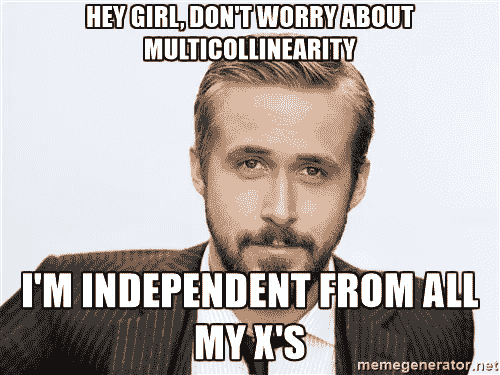

**MSE**

首先是 MSE 或均方误差。MSE 测量估计值和实际值之间的平均平方差。MSE 对异常值非常敏感，因此，即使在拟合良好的模型中出现少量异常值，也会导致非常高的误差值。

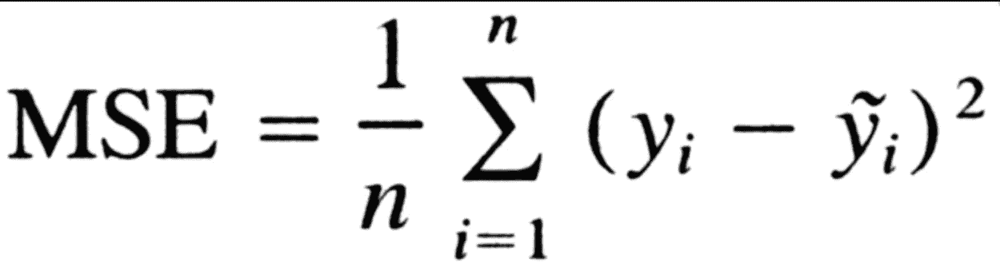

**RMSE**

RMSE 或均方根误差就是均方误差的平方根。它优于 MSE，因为它是最容易解释的统计量，因为它与垂直轴上绘制的数量具有相同的单位。取 MSE 的平方根意味着 RMSE 给大误差一个相对高的权重。这也意味着它不是随着误差的方差而移动，而是随着误差幅度的频率分布的方差而移动。

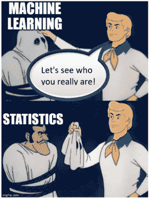

**R 平方**

r 平方(R2)是一种统计方法，表示因变量的方差中有多大比例是由自变量解释的。这是一种解释类似于相关性的关系的度量。但是，相关性解释了自变量和因变量之间的关系强度，而 R 平方解释了您的模型在多大程度上捕捉了变量之间的方差关系。例如，如果模型的 R2 是 0.84，那么大约 84%的观察到的变化可以用模型的输入来解释。

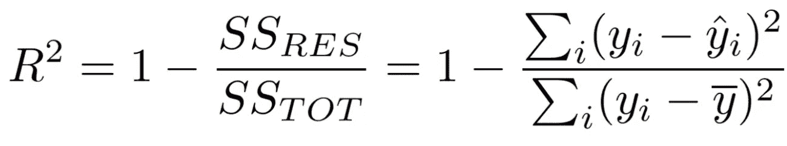

**调整后的 R 平方**

r 平方总是随着任何新特性的增加而增加。这种限制意味着很难确定模型在功能较少的情况下是否做得更好。调整后的 R-Square 通过在添加更多要素时惩罚分数来解决 R-Square 问题。因此，需要显著增加 R2，以提高模型的整体价值。

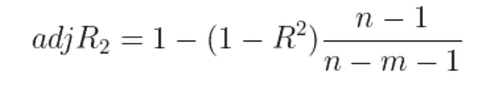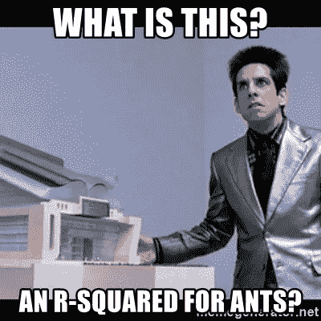

# **分类指标**

大多数分类模型评估从构建混淆矩阵开始。混淆矩阵是对分类问题预测结果的总结。正确和错误预测的数量用计数值汇总，并按每个类别细分。

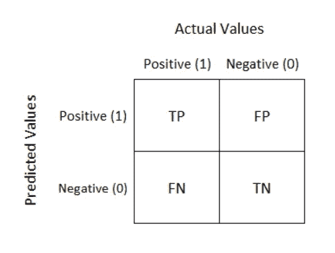

混淆矩阵告诉我们四件重要的事情:

*   真阳性(TP):模型预测的观察值是目标类的一部分的观察值的数量(1)，它们实际上是(1)。
*   真阴性(TN):模型预测的观察值不属于目标类(0)的观察值的数量，它们不是(0)。
*   假阳性(FP):模型预测的观察值是目标类的一部分的观察值的数量(1)，而它们实际上不是(0)。
*   假阴性(FN):模型预测的观察值不属于目标类的观察值的数量(0)，而它们实际上属于目标类的数量(1)。

一旦你有了这些值，你就可以继续计算各种方法来评估你的模型。

**精度**

准确性是最直观的度量，可以定义为正确分类的测试用例的数量除以测试用例的总数。它回答了“在我们的模型做出的所有预测中，有多少是正确的？”虽然准确性被认为是一个很好的整体观点，但是它有一个很大的局限性。当涉及到不平衡数据集时，你可以有很高的准确性，但仍然有一个完全无效的模型。例如，如果我们在银行数据中检测欺诈，欺诈与非欺诈案例的比例可能是 1:99。如果使用准确性，通过预测所有测试案例为非欺诈，该模型将证明是 99%准确的。然而，在这种情况下，这是没有用的。

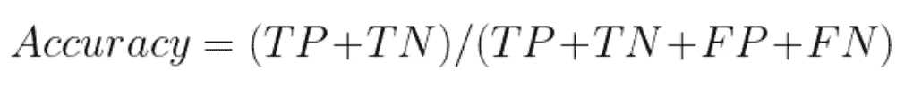

**精度**

精度是用于识别分类正确性的度量。Precision 回答这样的问题，“在所有的时间里，模型说一个观察值属于一个类，实际上有多少次？”该等式是正确肯定分类与预测肯定分类总数的比率。分数越大，精度越高，这意味着模型正确分类正类的能力越强。

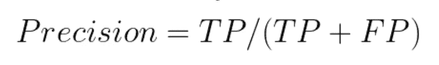

高精度分数可能会产生误导，因为它仅表示模型预测为阳性且为真阳性的次数。这意味着它没有告诉你多少次模型预测错误，但它实际上是正确的。当假阳性的成本很高时，精确度是一个很好的衡量标准。

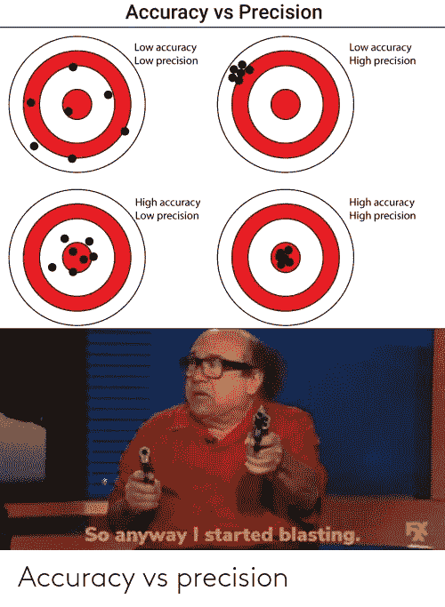

**回忆**

回忆告诉我们在阳性病例总数中正确识别的阳性病例数。回忆回答了这个问题，“在所有的观察中，目标类的一部分，我们的模型正确识别了其中的百分之多少？”高召回率可能会产生误导，因为它不能给你一个指示，表明有多少次模型预测为真，而实际上却是假的。当假阴性的成本很高时，召回是一个很好的指标。回忆也常被称为真阳性率或灵敏度。

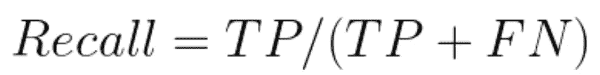

补充说明:精确度和召回率成反比。随着召回率的上升，我们的准确率会下降，反之亦然。这就是为什么考虑你的问题以及哪个错误对你的总体目标来说代价更小是很重要的。

**特异性**

特异性，有时被称为真阴性率，衡量阴性被正确识别的比例。换句话说，不属于目标类的观察值被正确识别为不属于目标类的比例。与所讨论的其他措施类似，这一措施也有不能展现全貌的局限性。例如，总是返回阴性测试结果的模型将具有 100%的特异性，因为特异性不考虑假阴性。

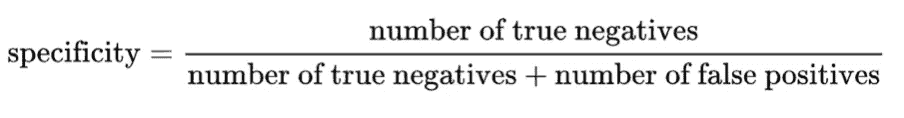

**F1 比分**

F1 分数也称为 F 分数/ F 度量，同时考虑了精确度和召回率。它是精确度和召回率的调和平均值。F 分数的最高可能值是 1，表示完美的精确度和召回率，如果精确度或召回率为零，则最低可能值是 0。在召回率和精确度都很重要的情况下，这是很有用的。然而，这表示了对 F1 分数的主要批评，即它给予了精确度和回忆同等的重要性。实际上，不同类型的错误分类会产生不同的成本，因此在评估过程中应区别对待，因为它们是模型所解决问题的一部分。

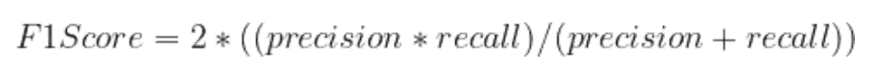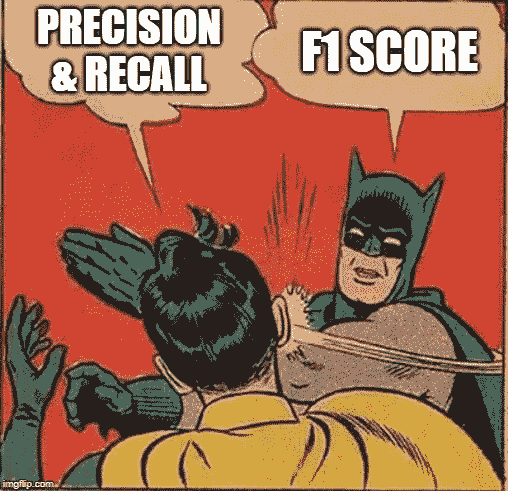

**ROC 和 AUC**

接受者操作者特征曲线(ROC 曲线)说明了我们的分类器的真阳性率对假阳性率。AUC 通过测量 ROC 曲线下的面积提供了评估分类模型的单一指标。ROC 允许我们针对您希望解决的问题确定最佳的特异性-回忆权衡平衡。当训练分类器时，表现最好的模型将具有 ROC 曲线，该曲线紧挨着图形的左上角，表示该模型可以适当地区分类别。AUC 为 1 意味着你的分类器是完美的，这是极不可能的。而 AUC 为 0.5 (50%)或更低则表明你的模型不比随机猜测好。应当指出的是，将这些措施减少到一个数字有时会遭到谴责，因为这会导致一个被视为嘈杂的结论。

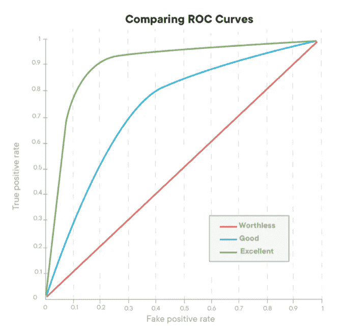

**最终想法**

在这篇博客中，我们简要地看了一下目前用于评估数据科学中不同模型的一些方法。不同的问题需要不同的处理方法，你应该使用对你的项目最有意义的方法。虽然说起来容易做起来难，但通过实践和研究，你也将很快获得可靠的见解，这无疑会导致更多的机器学习。

*跟我来* [*这里*](https://dataonatangent.medium.com/about) *上中等。*

*如果你喜欢联系，你可以在 LinkedIn 上找到我:* [*这里*](https://www.linkedin.com/in/anjcray/)

*如果你想跟随我的数据科学之旅(并享受其中的乐趣)，请在 Twitter 上与我联系:* [*这里*](https://twitter.com/DataOnATangent) *。*