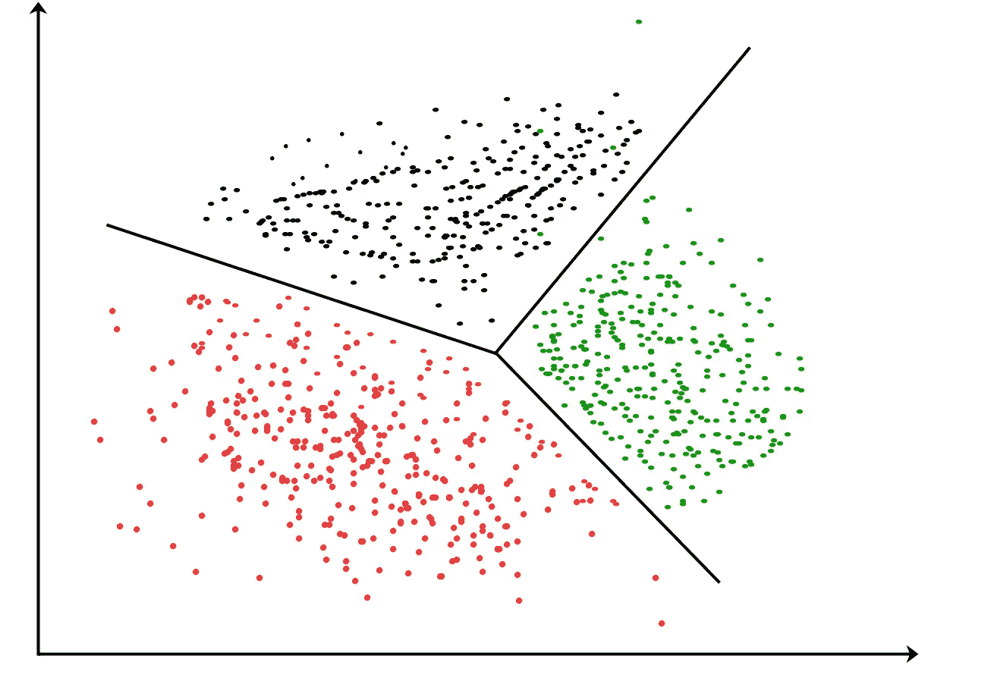
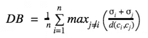
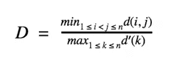

# 聚类的评估指标

> 原文：<https://medium.datadriveninvestor.com/evaluation-metrics-for-clustering-96dcdbea437d?source=collection_archive---------0----------------------->

在数据科学中，聚类是最常见的无监督学习形式。聚类是一种涉及数据点分组的机器学习技术。与回归和分类不同，我们在聚类中没有目标变量。由于聚类是无监督的，我们不能计算误差或准确性或任何这些指标。在这篇博客中，我将讨论评估聚类算法的不同指标。

聚类是基于一些相似性或不相似性度量来评估的，例如聚类点之间的距离。如果该算法能够联合相似的数据点并且很好地分离不相似的数据点，那么它已经执行得很好。

一些常见的聚类指标有:

## 剪影分数

轮廓分数是评估聚类算法的度量。侧影分数由两个分数计算得出， *a* 和 *b* 。 *a* 是样本和同一聚类中所有其他点之间的平均距离，而 *b* 是样本和下一个最近聚类中所有其他点之间的平均距离。样本的轮廓分数通过以下公式计算:

一组样本的轮廓分数是每个样本的轮廓分数的平均值。轮廓分数的范围从-1 到+1。轮廓分数-1 表示不正确的聚类，+1 表示正确且高度密集的聚类。轮廓分数为 0 表示聚类重叠。

 [## 一瞬间学会数据科学！？数据驱动的投资者

### 在我之前的职业生涯中，我是一名训练有素的古典钢琴家。还记得那些声称你可以…

www.datadriveninvestor.com](https://www.datadriveninvestor.com/2020/07/23/learn-data-science-in-a-flash/) 

# 戴维斯-波尔丁指数

DB 索引是评估聚类算法的另一个指标。DB 索引捕获簇之间的间距是否合适，以及簇中的数据点是否足够密集。DB 指数通过以下公式计算:

其中 *n* 是聚类的数量，而 *σi* 是聚类 *i* 中所有点距聚类质心 *ci* 的平均距离。

## 邓恩指数

邓恩指数是评估聚类算法的另一个指标。邓恩指数与 DB 指数抓住了相同的理念。邓恩指数等于最小簇间距离除以最大簇大小。更高的 DI 意味着更好的聚类。它假设更好的聚类意味着聚类是紧凑的，并且与其他聚类很好地分离。邓恩指数可通过以下公式计算:

其中 *i* 、 *j、*和 *k* 分别是聚类的指标， *d* 度量聚类间距离，*d’*度量聚类内差异。

## 访问专家视图— [订阅 DDI 英特尔](https://datadriveninvestor.com/ddi-intel)