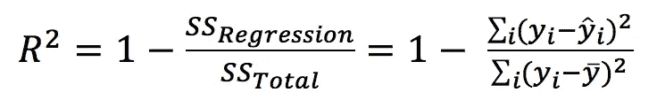
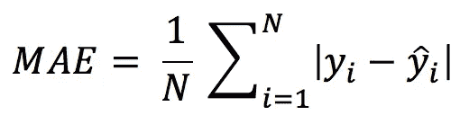
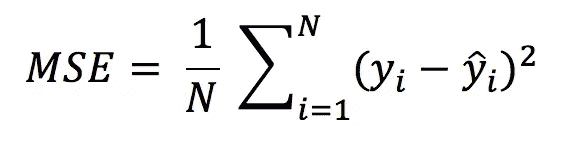
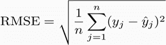

# 线性回归模型的评估

> 原文：<https://medium.datadriveninvestor.com/evaluation-of-linear-regression-models-257851e77e28?source=collection_archive---------4----------------------->


线性回归模型用于显示或预测两个变量或因素之间的关系。被预测的因素称为因变量，用于预测因变量的值的因素称为自变量。

[](https://www.datadriveninvestor.com/2020/07/23/learn-data-science-in-a-flash/) [## 一瞬间学会数据科学！？数据驱动的投资者

### 在我之前的职业生涯中，我是一名训练有素的古典钢琴家。还记得那些声称你可以…

www.datadriveninvestor.com](https://www.datadriveninvestor.com/2020/07/23/learn-data-science-in-a-flash/) 

评估机器学习模型和构建它一样重要。我们正在创建模型来处理新的和未知的数据。因此，我们需要评估我们的模型是否运行正确。评估一个线性回归模型并不容易，因为有很多评估指标。何时使用哪种度量取决于项目的数据和问题。

在这篇文章中，我将回顾一些回归模型的评估指标。

## R 的平方

r 平方是线性回归模型的拟合优度度量。这表示自变量共同解释的因变量中方差的百分比。r 平方度量模型和因变量之间的关系强度。r 的平方值在 0 到 1 之间，较大的值表示预测值和实际值之间的拟合较好。这是 R 平方的公式，使用 sci-kit Learn 计算 R 如下:



```
from sklearn.metrics import r2_score
true = [3, 4.5, 5, 6, 10]
preds = [3.1, 5, 3.5, 5.9, 8]
r2_score(true, preds)
```

## 平均绝对误差

平均绝对误差是观测值和预测值之间误差的度量。它是一组预测中误差的平均大小，不考虑它们的方向。它是实际值和预测值之间误差的绝对值。以下是用 sci-kit learn 计算的公式和方法。



```
from sklearn.metrics import mean_absolute_error
mean_absolute_error(true, preds)
```

## 均方误差

均方误差是预测误差的平方和。均方误差类似于平均绝对误差。平均绝对误差取误差的绝对值，而均方误差取误差的平方。MSE 用方块惩罚大的预测误差，而 MAE 对所有的误差一视同仁。



```
from sklearn.metrics import mean_squared_error
mean_squared_error(true, preds)
```

## 均方根误差(RMSE)

均方根误差是均方误差的平方根。RMSE 总是非负的，值为 0 表示完全符合数据。由于误差在平均之前被平方，因此 RMSE 对大误差给予相对较高的权重。下面是 RMSE 的公式以及如何用 python 计算 RMSE。



```
from sklearn.metrics import mean_squared_error
math.sqrt(mean_squared_error(true, preds))
```

## 平均绝对百分比误差(MAPE)

平均绝对百分比误差以百分比的形式测量精度，可以计算为每个时间段的平均绝对百分比误差减去实际值除以实际值。


```
import numpy as np

def mape(actual, pred): 
    actual, pred = np.array(actual), np.array(pred)
    return np.mean(np.abs((actual - pred) / actual)) * 100mape(true, preds)
```

# 结论

r 的平方表示自变量共同解释的因变量中方差的百分比。换句话说，它说明了模型有多好。但所有其他指标，如 MAE、MSE、RMSE 和 MAPE，都衡量预测值与实际值的差距。

没有适用于所有任务的最佳度量标准。在决定使用什么评估指标时，考虑您试图回答什么问题是很重要的。您必须根据您的数据和问题来决定使用哪种评估指标。

**进入专家视图—** [**订阅 DDI 英特尔**](https://datadriveninvestor.com/ddi-intel)