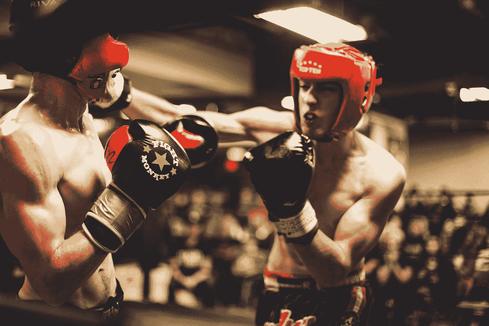
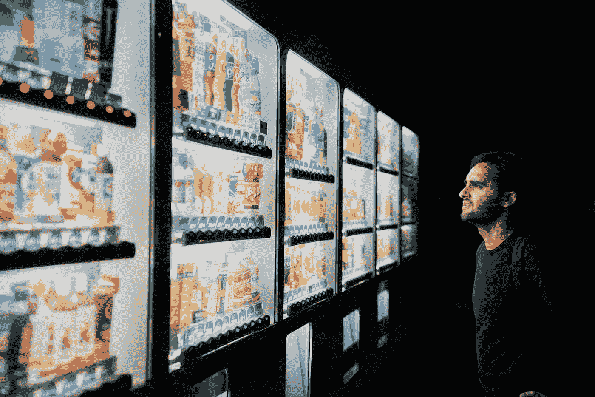
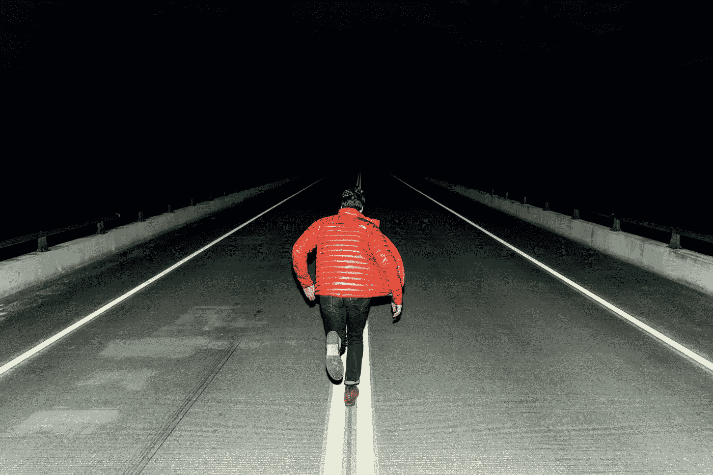
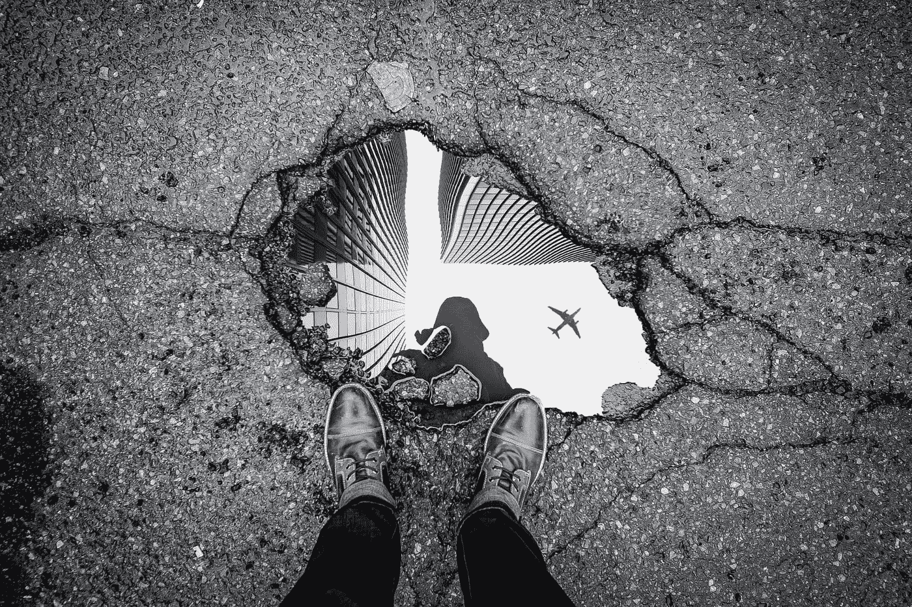

# 即使是在商业领域，重新站起来也很重要

> 原文：<https://medium.datadriveninvestor.com/even-in-business-its-all-about-getting-up-again-20e2d30f95e6?source=collection_archive---------18----------------------->

## 史蒂夫·乔布斯和穆罕默德·阿里也曾被击倒

Photo by [Hermes Rivera](https://unsplash.com/@hermez777?utm_source=medium&utm_medium=referral) on [Unsplash](https://unsplash.com/?utm_source=medium&utm_medium=referral)

有一种说法是关于焦虑的人。

虽然他们认为自己很弱，因为他们在一些最后的障碍中摔倒，但他们实际上比其他人更坚强，他们在第一个障碍中摔倒。

还有一个是关于护士的。

她已经工作了 16 个小时，从来没有出现过问题，直到一个病人告诉她“你一定累了”。

她摔倒了，再也没有爬起来。

最后，还有托马斯·爱迪生，灯泡的发明者。

众所周知，他说过:

> “我没有失败，我只是发现了 10000 种不起作用的方法！”

在他的工厂被烧毁并摧毁了他所有的发明后，他其实很感激有机会重新开始。

对我来说，这些故事的要点是，建立勇气和韧性的唯一方法之一是经历失败、挫折和挫折，这样你才能学习和适应，迎接下一个挑战。

 [## 良好的生活是习惯的形成|数据驱动的投资者

### 过度思考是过度紧张。仅仅几个简单的习惯就会在一天中产生巨大的影响。那是…

www.datadriveninvestor.com](https://www.datadriveninvestor.com/2020/01/17/a-good-life-is-habit-forming/) 

这在格斗运动和商业生涯中都是如此。我个人的大部分成长都源于乘风破浪，别人决定让位给新的舒适区挑战。

**决定:**

Photo by [Victoriano Izquierdo](https://unsplash.com/@victoriano?utm_source=medium&utm_medium=referral) on [Unsplash](https://unsplash.com/?utm_source=medium&utm_medium=referral)

每当你认为一个决定是涉及两个对立方的是或否的情况时，我希望你记住任何谈判或决策过程中的第三个因素:T2 环境。

当我们考虑搬家、新工作或类似的事情时，没有人知道一场全球性的疫情即将到来。

的确，商界很多人都在做艰难的决定(还是！)关于是让员工休假，让他们成为多余的人，还是重新开始招聘。

在做决定时，我们需要考虑一些我们无法控制的因素，这就是为什么当情况变得艰难时，强者相信自己的直觉，做出判断，而不是走开。

每一个威胁中都有机会，如果你想成功，有时需要信念的飞跃。

**战斗还是逃跑:**

Photo by [Joshua Ness](https://unsplash.com/@theexplorerdad?utm_source=medium&utm_medium=referral) on [Unsplash](https://unsplash.com/?utm_source=medium&utm_medium=referral)

杏仁核是大脑中控制习惯形成的部分。

这种习惯的形成与“战斗或逃跑”反应的触发直接相关，当身体对感知到的威胁做出反应时，肾上腺素就会激增。

在现代生活中，这些威胁通常是情绪上的，而不是身体上的，这种感觉会导致各种各样与焦虑有关的问题，如恐慌症。

当战斗或逃跑反应被触发时，有许多方法可以克服焦虑，现在我将与你分享其中的一些方法:

*   理解不舒服的感觉是暂时的
*   对自己和自己处理问题的能力有信心
*   调节你的呼吸来降低你的心率
*   明白其他人逃离这种情况并不意味着你必须逃离；你不是他们

在商业场景中，人们经常选择在他们知道困难时刻即将到来之前离开。矛盾的是，这造成了他们试图避免的灾难:人们需要团结起来，在困难的时候互相帮助，而不是听从斗争或逃跑反应的自我保护。

**回望:**

Photo by [Marc-Olivier Jodoin](https://unsplash.com/@marcojodoin?utm_source=medium&utm_medium=referral) on [Unsplash](https://unsplash.com/?utm_source=medium&utm_medium=referral)

只有当你走出低谷的时候，你才会意识到你曾经身处其中，这适用于生活的方方面面，无论是工作还是个人。

用另一句老话来说，把生活想象成一把弓，把你想象成一支箭:当它把你拉向后退时，它会给你积极的前进动力，你就要起飞了。

这并不是说没有时候你应该走开。

你绝对应该有力量走出不可能或有毒的环境，但最终当回顾你的生活和我们所有人的旅程时，你会想为你的决定和你享受的最终成就感到自豪。

就像戒烟或减肥一样，没有比现在更好的开始时间了。

我们已经走了很远，但还有一段路要走。

如果你想享受安静、平淡、美好的生活，那很好，但如果你想努力变得伟大，你需要冒一些风险，要知道每次你被击倒，你都会爬起来。

## 获得专家视图— [订阅 DDI 英特尔](https://datadriveninvestor.com/ddi-intel)